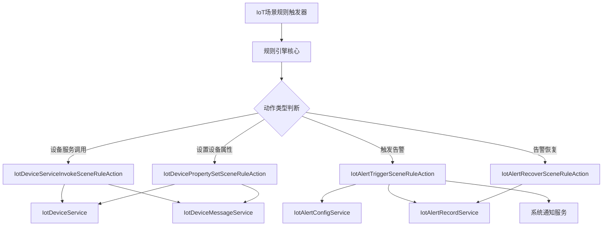

# action_2 模块文档

## 概述

action_2 模块是物联网(IoT)规则引擎中的动作执行组件，负责实现各种类型的场景规则动作。当IoT场景规则的触发条件满足时，这些动作组件会被调用来执行具体的操作。

本模块包含四个主要的动作实现类，所有这些类都实现了 `IotSceneRuleAction` 接口，为IoT规则引擎提供了可插拔的动作执行机制。每种动作类型都有其专门的实现类，详细信息请参考相应的子模块文档。

## 架构概述

action_2 模块位于IoT模块的服务层，具体在规则引擎的场景动作处理部分。它接收来自规则引擎的调用请求，并根据不同的动作类型执行相应的操作。

以下是action_2模块在IoT规则引擎中的位置和关系：

## 子模块

action_2 模块包含以下子模块，每个子模块详细描述了一种特定类型的场景规则动作实现：

1. [设备服务调用动作](action_2_device_service_invoke.md) - IotDeviceServiceInvokeSceneRuleAction
2. [告警触发动作](action_2_alert_trigger.md) - IotAlertTriggerSceneRuleAction
3. [告警恢复动作](action_2_alert_recover.md) - IotAlertRecoverSceneRuleAction
4. [设备属性设置动作](action_2_device_property_set.md) - IotDevicePropertySetSceneRuleAction

所有动作实现类都遵循统一的 `IotSceneRuleAction` 接口规范，确保了系统的一致性和可扩展性。
