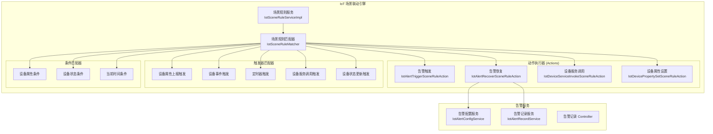
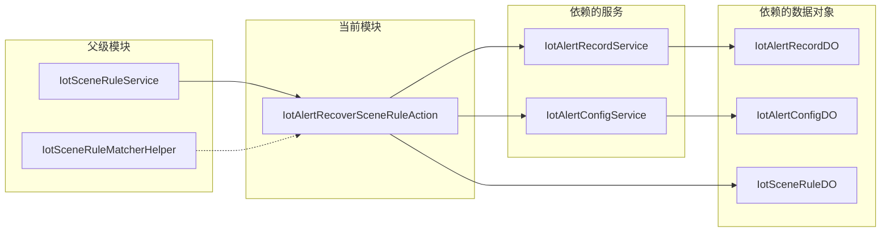
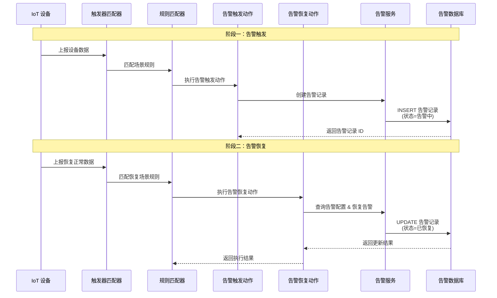
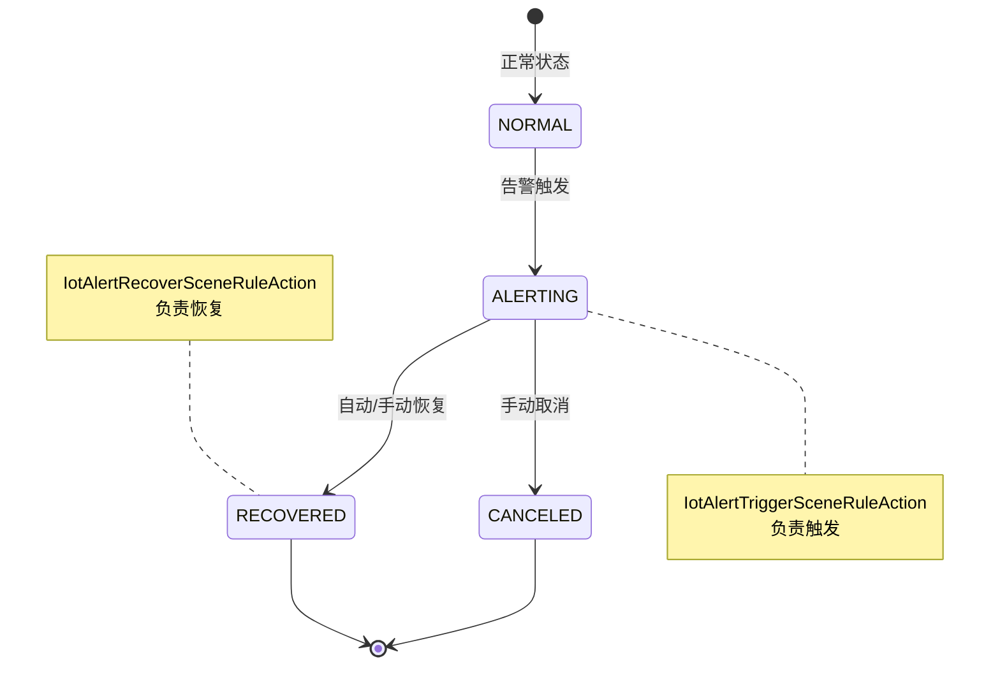
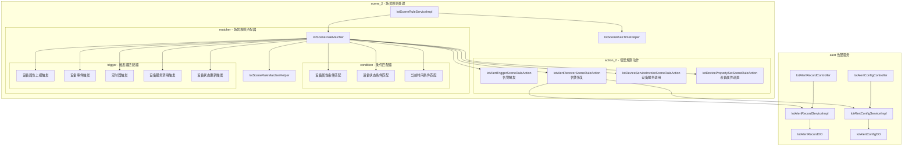

# IoT 告警恢复场景规则动作模块 (IotAlertRecoverSceneRuleAction)

## 1. 模块简介

### 1.1 概述

`IotAlertRecoverSceneRuleAction`（告警恢复场景规则动作）是 IoT 场景联动引擎中的核心动作组件之一。该模块负责在场景规则条件匹配成功后，执行**告警恢复**操作——即清除或关闭先前由 `IotAlertTriggerSceneRuleAction` 触发的告警记录。它是 IoT 平台自动化运维和智能联动的重要组成部分，实现了设备告警的完整生命周期管理（触发 → 恢复闭环）。

### 1.2 核心功能

- **告警恢复**：根据场景规则的动作配置，自动恢复（清除/关闭）指定的告警记录
- **告警状态流转**：将告警记录从"告警中"状态变更为"已恢复"状态
- **多维度恢复**：支持按告警规则 ID、设备、产品等多维度进行告警恢复操作
- **联动闭环**：与 `IotAlertTriggerSceneRuleAction` 配合，形成完整的告警触发→自动恢复的自动化闭环

---

## 2. 架构位置与依赖关系

### 2.1 模块在 IoT 架构中的位置



### 2.2 模块依赖关系



### 2.3 与兄弟模块的协作关系

| 兄弟模块 | 类名 | 协作关系 |
|---------|------|---------|
| 告警触发动作 | `IotAlertTriggerSceneRuleAction` | 告警触发与恢复形成完整闭环。触发动作创建告警记录，恢复动作清除告警记录 |
| 设备服务调用动作 | `IotDeviceServiceInvokeSceneRuleAction` | 可在同一规则中组合使用，先恢复告警再调用设备服务 |
| 设备属性设置动作 | `IotDevicePropertySetSceneRuleAction` | 可在同一规则中组合使用，恢复告警的同时调整设备参数 |

---

## 3. 场景规则动作体系

### 3.1 场景规则数据模型

场景规则 (`IotSceneRuleDO`) 包含以下核心结构：

```
IotSceneRuleDO
├── id: Long              // 规则 ID
├── name: String          // 规则名称
├── status: Integer       // 状态（启用/禁用）
├── trigger: Trigger      // 触发器配置
│   ├── type: String      // 触发类型（属性上报、事件上报、定时器等）
│   └── config: JSON      // 触发配置
├── conditions: List<TriggerCondition>  // 条件列表
│   ├── type: String      // 条件类型
│   └── config: JSON      // 条件配置
└── actions: List<Action> // 动作列表
    ├── type: String      // 动作类型（alert_trigger, alert_recover, device_service_invoke, device_property_set）
    └── config: JSON      // 动作配置（包含告警规则 ID、恢复参数等）
```

### 3.2 告警恢复动作配置结构

告警恢复动作的配置通常包含：

```json
{
  "type": "alert_recover",
  "config": {
    "alertConfigId": 1001,       // 要恢复的告警规则 ID
    "recoverReason": "自动恢复",  // 恢复原因
    "deviceFilter": {            // 设备过滤条件（可选）
      "productKey": "...",
      "deviceName": "..."
    }
  }
}
```

---

## 4. 告警恢复流程

### 4.1 完整告警生命周期



### 4.2 告警恢复执行流程

```mermaid
flowchart TD
    A[接收场景规则匹配结果] --> B{动作类型是否为 alert_recover?}
    B -->|是| C[解析动作配置]
    C --> D[查询告警规则配置<br>IotAlertConfigDO]
    D --> E{告警规则是否存在?}
    E -->|否| F[记录错误日志<br>返回失败]
    E -->|是| G[查询待恢复的告警记录<br>IotAlertRecordDO]
    G --> H{存在未恢复的告警?}
    H -->|否| I[无需恢复<br>返回成功]
    H -->|是| J[更新告警记录状态为"已恢复"]
    J --> K[设置恢复时间/原因]
    K --> L[调用 IotAlertRecordService 更新]
    L --> M{更新成功?}
    M -->|是| N[记录操作日志<br>返回执行成功]
    M -->|否| O[记录错误日志<br>返回执行失败]
```

---

## 5. 接口设计

### 5.1 核心接口

告警恢复动作模块实现的接口遵循场景规则动作的统一规范：

| 方法 | 说明 |
|------|------|
| `execute(SceneRule rule, ActionConfig config)` | 执行告警恢复动作，根据场景规则和动作配置恢复告警 |
| `getType()` | 返回动作类型标识 `alert_recover` |
| `validate(ActionConfig config)` | 验证告警恢复动作配置的合法性 |

### 5.2 依赖的服务接口

#### IotAlertRecordService（告警记录服务）

| 方法 | 说明 |
|------|------|
| `createAlertRecord(AlertRecordCreateReqVO req)` | 创建告警记录 |
| `updateAlertRecordStatus(Long id, Integer status)` | 更新告警记录状态 |
| `getAlertRecordById(Long id)` | 根据 ID 获取告警记录 |
| `getActiveAlertRecords(Long configId, String deviceKey)` | 获取活跃的告警记录列表 |
| `processAlertRecord(AlertRecordProcessReqVO req)` | 处理/恢复告警记录 |

#### IotAlertConfigService（告警配置服务）

| 方法 | 说明 |
|------|------|
| `getAlertConfigById(Long id)` | 根据 ID 获取告警规则配置 |
| `getAlertConfigByProductKey(String productKey)` | 根据产品 Key 获取告警配置 |

---

## 6. 数据模型

### 6.1 IotAlertRecordDO（告警记录表）

| 字段 | 类型 | 说明 |
|------|------|------|
| `id` | Long | 记录 ID |
| `alertConfigId` | Long | 告警规则配置 ID |
| `deviceKey` | String | 设备标识 |
| `alertLevel` | Integer | 告警级别（1-紧急 / 2-严重 / 3-一般） |
| `alertStatus` | Integer | 告警状态（0-已恢复 / 1-告警中） |
| `alertTime` | Date | 告警触发时间 |
| `recoverTime` | Date | 告警恢复时间 |
| `alertContent` | String | 告警内容 |
| `recoverReason` | String | 恢复原因 |
| `processStatus` | Integer | 处理状态 |
| `processUserId` | Long | 处理人 |
| `remark` | String | 备注 |

### 6.2 IotAlertConfigDO（告警规则配置表）

| 字段 | 类型 | 说明 |
|------|------|------|
| `id` | Long | 配置 ID |
| `name` | String | 告警规则名称 |
| `productKey` | String | 关联产品 Key |
| `alertLevel` | Integer | 告警级别 |
| `alertType` | Integer | 告警类型 |
| `enableAutoRecover` | Boolean | 是否启用自动恢复 |
| `recoverCondition` | JSON | 恢复条件配置 |
| `status` | Integer | 状态（启用/禁用） |

### 6.3 告警状态枚举



---

## 7. 与其他模块的引用关系

### 7.1 引用的外部模块

| 模块名称 | 引用关系 | 说明 |
|---------|---------|------|
| [IotAlertTriggerSceneRuleAction](action_2_alert_trigger.md) | 兄弟模块 | 告警触发动作为告警恢复动作的触发源头，两者配合实现告警全生命周期管理 |
| [IotDeviceServiceInvokeSceneRuleAction](action_2_device_service_invoke.md) | 兄弟模块 | 设备服务调用动作可与告警恢复动作在同一规则中组合使用 |
| [IotDevicePropertySetSceneRuleAction](action_2_device_property_set.md) | 兄弟模块 | 设备属性设置动作可作为告警恢复后的补充操作 |
| [IotSceneRuleServiceImpl](scene_2.md) | 父级模块 | 场景规则服务是动作执行的入口和调度器 |
| [IotAlertRecordServiceImpl](alert_3.md) | 依赖服务 | 告警记录服务提供告警记录的持久化操作 |
| [IotAlertConfigServiceImpl](alert_3.md) | 依赖服务 | 告警配置服务提供告警规则的查询与校验 |
| IotDeviceMessageSubscriber | 消息总线 | 设备消息订阅者触发场景规则匹配 |

### 7.2 子模块关系图



---

## 8. 配置与部署

### 8.1 场景规则配置示例

以下是一个完整的场景规则配置示例，包含告警触发和告警恢复的完整闭环：

```json
{
  "name": "温度过高告警与恢复联动",
  "status": 1,
  "trigger": {
    "type": "device_property_post",
    "config": {
      "productKey": "H2CqL8pX",
      "property": "temperature"
    }
  },
  "conditions": [
    {
      "type": "device_property",
      "config": {
        "property": "temperature",
        "operator": ">",
        "value": 60
      }
    }
  ],
  "actions": [
    {
      "type": "alert_trigger",
      "config": {
        "alertConfigId": 1001,
        "alertContent": "设备温度超过 60°C"
      }
    }
  ]
}
```

```json
{
  "name": "温度恢复正常告警恢复",
  "status": 1,
  "trigger": {
    "type": "device_property_post",
    "config": {
      "productKey": "H2CqL8pX",
      "property": "temperature"
    }
  },
  "conditions": [
    {
      "type": "device_property",
      "config": {
        "property": "temperature",
        "operator": "<=",
        "value": 50
      }
    }
  ],
  "actions": [
    {
      "type": "alert_recover",
      "config": {
        "alertConfigId": 1001,
        "recoverReason": "温度已降至 50°C 以下，自动恢复"
      }
    }
  ]
}
```

### 8.2 依赖配置

在 `application.yaml` 中配置 IoT 模块的相关参数：

```yaml
yudao:
  iot:
    scene-rule:
      enable: true          # 启用场景规则引擎
      max-execution: 100    # 单次规则最大执行次数
    alert:
      auto-recover: true    # 启用自动告警恢复
```

---

## 9. 扩展与定制

### 9.1 扩展点

- **自定义告警恢复策略**：通过实现场景规则动作接口，可扩展自定义的告警恢复行为
- **告警恢复前/后钩子**：可在告警恢复动作执行前后插入自定义逻辑
- **多级告警恢复**：支持根据不同条件执行差异化的告警恢复策略

### 9.2 与其他动作的联动模式

| 联动模式 | 动作组合 | 使用场景 |
|---------|---------|---------|
| 告警触发→通知 | alert_trigger + device_service_invoke | 触发告警并调用服务发送通知 |
| 告警恢复→调整 | alert_recover + device_property_set | 恢复告警后调整设备参数至正常范围 |
| 条件判断→告警→恢复 | 多规则组合 | 复杂场景的完整自动化处理流程 |

---

## 10. 相关文档

- [IoT 场景规则服务模块](scene_2.md) - 场景规则的核心调度与服务
- [IoT 告警触发动作模块](action_2_alert_trigger.md) - 告警触发动件的详细说明
- [IoT 设备服务调用动作模块](action_2_device_service_invoke.md) - 设备服务调用动作的详细说明
- [IoT 设备属性设置动作模块](action_2_device_property_set.md) - 设备属性设置动作的详细说明
- [IoT 告警服务模块](alert_3.md) - 告警配置与记录管理的详细说明
