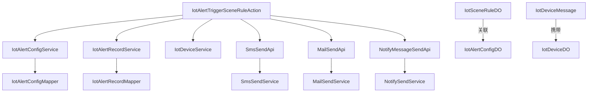
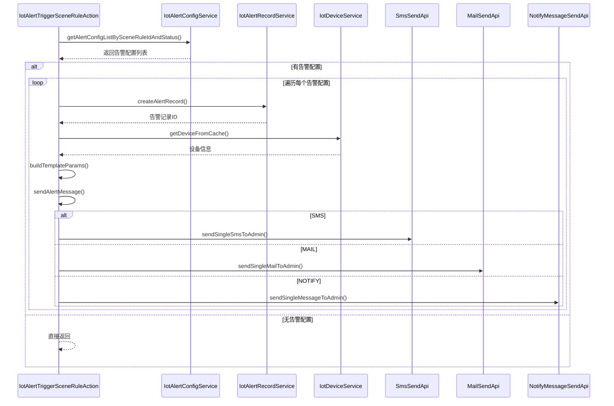
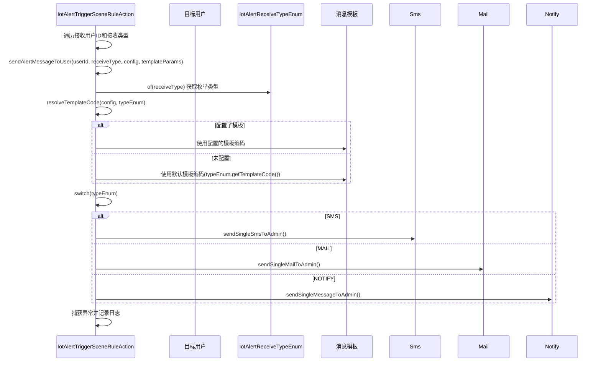
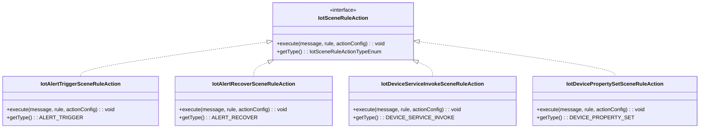

# action_2_alert_trigger 模块文档

## 1. 概述

`action_2_alert_trigger` 是 IoT（物联网）模块中场景联动规则的执行动作组件，负责在触发条件满足时**发送告警通知**。该模块实现了告警触发的核心逻辑，支持通过短信、邮件和站内信等多种方式向指定用户发送告警消息。

作为场景联动规则系统的一部分，`IotAlertTriggerSceneRuleAction` 是 `IotSceneRuleAction` 接口的具体实现之一，与设备服务调用、告警恢复、属性设置等动作共同构成完整的场景联动执行体系。

## 2. 架构关系

### 2.1 模块位置

```
yudao-module-iot/
└── yudao-module-iot-biz/
    └── src/main/java/cn/iocoder/yudao/module/iot/service/rule/scene/action/
        ├── IotSceneRuleAction.java              // 动作接口
        ├── IotAlertTriggerSceneRuleAction.java   // 告警触发动作（当前模块）
        ├── IotAlertRecoverSceneRuleAction.java   // 告警恢复动作
        ├── IotDeviceServiceInvokeSceneRuleAction.java // 设备服务调用动作
        └── IotDevicePropertySetSceneRuleAction.java   // 设备属性设置动作
```

### 2.2 依赖关系



### 2.3 与其他模块的交互

| 交互模块 | 说明 |
|---------|------|
| **infra 模块** | 通过 `SmsSendApi`、`MailSendApi`、`NotifyMessageSendApi` 统一发送通知，这些 API 定义在 `yudao-module-system` 中 |
| **system 模块** | 用户信息校验、模板消息发送等能力由系统模块提供 |
| **iot-alert 模块** | 告警配置和告警记录的管理，与告警触发紧密相关 |
| **iot-device 模块** | 获取设备信息，用于构建告警上下文 |

## 3. 核心组件

### 3.1 IotAlertTriggerSceneRuleAction

告警触发动作的核心实现类，负责：

1. **查询活跃告警配置**：根据场景规则ID查找所有启用状态的告警配置
2. **创建告警记录**：为每个告警配置生成告警记录
3. **发送告警消息**：按配置的接收方式和模板向用户发送通知

#### 主要方法

| 方法名 | 说明 |
|-------|------|
| `execute()` | 入口方法，处理告警触发的完整流程 |
| `sendAlertMessage()` | 根据告警配置发送消息 |
| `sendAlertMessageToUser()` | 向单个用户发送指定类型的告警消息 |
| `resolveTemplateCode()` | 解析告警模板编码 |
| `buildTemplateParams()` | 构建告警消息模板参数 |
| `getType()` | 返回动作类型：`ALERT_TRIGGER` |

### 3.2 IotSceneRuleAction 接口

所有场景联动动作的统一接口：

```java
public interface IotSceneRuleAction {
    /**
     * 执行场景联动
     * @param message 设备消息（定时触发时为 null）
     * @param rule 规则对象
     * @param actionConfig 动作配置
     */
    void execute(@Nullable IotDeviceMessage message, IotSceneRuleDO rule, IotSceneRuleDO.Action actionConfig) throws Exception;
    
    IotSceneRuleActionTypeEnum getType();
}
```

### 3.3 相关数据对象

| 对象名 | 说明 |
|-------|------|
| `IotAlertConfigDO` | 告警配置，包含接收人、接收方式、模板信息等 |
| `IotAlertRecordDO` | 告警记录，记录每次告警触发的状态和处理情况 |
| `IotSceneRuleDO` | 场景联动规则，包含触发条件和执行动作 |
| `IotDeviceMessage` | 设备消息，触发告警时的原始消息数据 |
| `IotDeviceDO` | 设备信息，用于获取设备名称、产品等上下文 |

## 4. 功能流程

### 4.1 告警触发主流程



### 4.2 告警消息发送流程



### 4.3 模板参数构建

告警消息模板包含以下关键参数：

| 参数名 | 说明 | 来源 |
|-------|------|------|
| `configName` | 告警配置名称 | `IotAlertConfigDO.name` |
| `configDescription` | 告警配置描述 | `IotAlertConfigDO.description` |
| `configLevel` | 告警级别（字典标签） | `DictTypeConstants.ALERT_LEVEL` |
| `deviceName` | 设备名称 | `IotDeviceDO.deviceName` |
| `reportTime` | 上报时间 | `IotDeviceMessage.reportTime` |

## 5. 告警接收类型

`IotAlertReceiveTypeEnum` 定义了三种告警接收方式：

| 枚举值 | 说明 | 默认模板编码 |
|-------|------|-------------|
| `SMS` | 短信通知 | `SMS_ALERT` |
| `MAIL` | 邮件通知 | `MAIL_ALERT` |
| `NOTIFY` | 站内信通知 | `NOTIFY_ALERT` |

每种接收方式对应不同的模板编码，可在告警配置中单独指定。

## 6. 告警记录管理

告警触发后会创建告警记录，并由告警恢复动作进行处理：

### 6.1 告警记录创建

```java
// IotAlertTriggerSceneRuleAction.createAlertRecord()
IotAlertRecordDO.builder()
    .configId(config.getId())
    .configName(config.getName())
    .configLevel(config.getLevel())
    .sceneRuleId(rule.getId())
    .processStatus(false)  // false表示未处理（告警状态）
    .deviceMessage(message)
    .productId(device.getProductId())
    .deviceId(device.getId())
    .build();
```

### 6.2 告警恢复

告警恢复动作（`IotAlertRecoverSceneRuleAction`）会查找未处理的告警记录并标记为已处理：

```java
@Override
public void execute(IotDeviceMessage message, IotSceneRuleDO rule, IotSceneRuleDO.Action actionConfig) {
    Long deviceId = message != null ? message.getDeviceId() : null;
    List<IotAlertRecordDO> alertRecords = alertRecordService.getAlertRecordListBySceneRuleId(
        rule.getId(), deviceId, false);  // false表示获取未处理的记录
    
    if (!CollUtil.isEmpty(alertRecords)) {
        alertRecordService.processAlertRecordList(
            convertList(alertRecords, IotAlertRecordDO::getId),
            StrUtil.format("告警自动回复，基于【{}】场景联动规则", rule.getName()));
    }
}
```

## 7. 与其他动作的关系

场景联动规则支持多种执行动作，`IotAlertTriggerSceneRuleAction` 是其中之一：



## 8. 配置项

### 8.1 告警配置字段

| 字段名 | 说明 |
|-------|------|
| `id` | 告警配置ID |
| `name` | 告警配置名称 |
| `description` | 告警配置描述 |
| `level` | 告警级别（如：WARNING、CRITICAL） |
| `sceneRuleIds` | 关联的场景规则ID列表 |
| `receiveUserIds` | 接收告警的用户ID列表 |
| `receiveTypes` | 接收方式集合（SMS、MAIL、NOTIFY） |
| `smsTemplateCode` | 短信模板编码 |
| `mailTemplateCode` | 邮件模板编码 |
| `notifyTemplateCode` | 站内信模板编码 |

### 8.2 模板验证

当选择某种接收方式时，必须配置对应的模板编码：

- 选择 SMS → 必须填写 `smsTemplateCode`
- 选择 MAIL → 必须填写 `mailTemplateCode`
- 选择 NOTIFY → 必须填写 `notifyTemplateCode`

## 9. 错误处理

告警触发过程中可能出现的异常情况：

| 异常场景 | 处理方式 |
|---------|---------|
| 无告警配置 | 直接返回，不执行任何操作 |
| 接收用户或接收类型为空 | 跳过该配置，继续下一个 |
| 模板未配置 | 记录警告日志，使用默认模板 |
| 发送失败 | 捕获异常并记录错误日志，不影响其他配置执行 |
| 设备不存在 | 记录错误日志，但不中断流程 |

## 10. 参考文档

- [场景联动规则模块](scene_rule.md) - 场景联动的整体架构
- [告警管理模块](alert_management.md) - 告警配置和记录的完整管理
- [设备服务调用动作](device_service_invoke.md) - 同属场景联动动作的设备服务调用实现
- [系统通知API](system_notification_api.md) - SMS、MAIL、NOTIFY等通知服务的统一API
