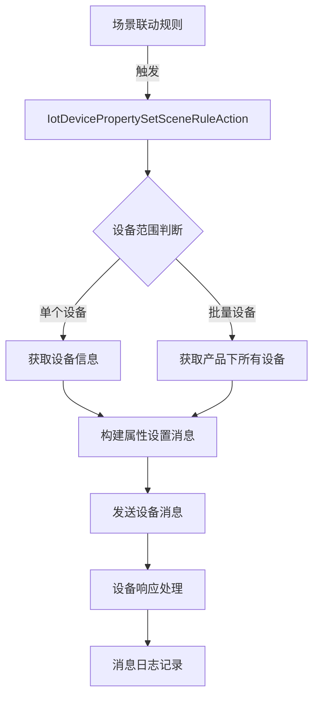
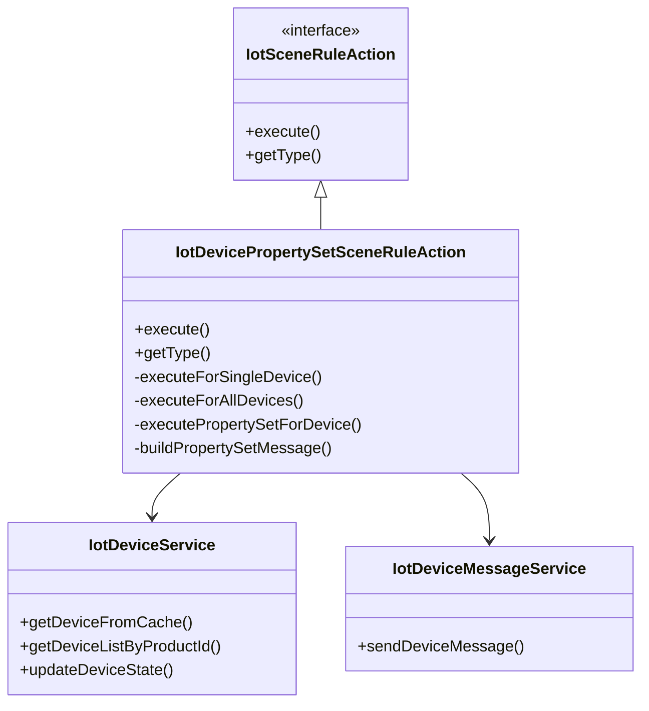
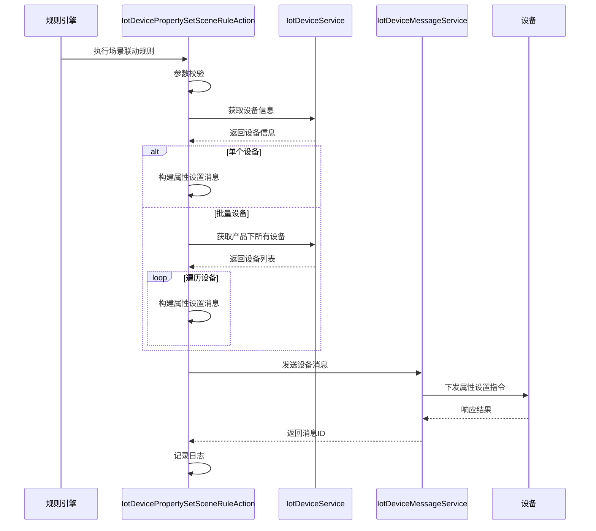

# 设备属性设置动作模块 (action_2_device_property_set)

## 模块概述

设备属性设置动作模块是物联网(IoT)平台中的一个核心功能模块，主要用于实现场景联动规则中对设备属性的设置操作。该模块通过与设备管理、消息通信等模块的协作，实现对单个设备或批量设备的属性设置操作。

### 主要功能

1. **单个设备属性设置**：根据场景联动规则，对指定设备进行属性设置
2. **批量设备属性设置**：对产品下的所有设备进行属性设置
3. **属性设置消息构建**：将属性设置请求转换为标准的设备消息格式
4. **消息发送与处理**：通过消息通信机制将属性设置指令发送到设备

### 核心组件

- **IotDevicePropertySetSceneRuleAction**：设备属性设置动作执行器
- **IotDeviceService**：设备管理服务
- **IotDeviceMessageService**：设备消息通信服务
- **IotSceneRuleDO**：场景联动规则数据对象

## 架构设计

### 模块架构图



### 核心类关系图



## 数据流转

### 数据流转图



### 消息格式

#### 设备属性设置消息格式
```json
{
  "id": "消息唯一ID",
  "deviceId": "设备ID",
  "tenantId": "租户ID",
  "method": "propertySet",
  "params": {
    "properties": {
      "属性标识符1": "属性值1",
      "属性标识符2": "属性值2"
    }
  }
}
```

## API 接口

### 核心接口

#### IotDevicePropertySetSceneRuleAction

```java
@Component
@Slf4j
public class IotDevicePropertySetSceneRuleAction implements IotSceneRuleAction {

    @Resource
    private IotDeviceService deviceService;
    @Resource
    private IotDeviceMessageService deviceMessageService;

    @Override
    public void execute(IotDeviceMessage message,
                        IotSceneRuleDO rule, IotSceneRuleDO.Action actionConfig) {
        // 执行属性设置逻辑
    }

    @Override
    public IotSceneRuleActionTypeEnum getType() {
        return IotSceneRuleActionTypeEnum.DEVICE_PROPERTY_SET;
    }
}
```

### 执行流程

1. **参数校验**：
   - 校验设备ID是否为空
   - 校验属性标识符是否为空

2. **设备范围判断**：
   - 如果设备ID为`IotDeviceDO.DEVICE_ID_ALL`，则对产品下的所有设备执行属性设置
   - 否则，对指定设备执行属性设置

3. **设备信息获取**：
   - 通过`IotDeviceService`获取设备信息
   - 如果设备不存在，记录错误日志并返回

4. **消息构建**：
   - 构建属性设置消息，格式为`{"properties": {"identifier": value}}`
   - 使用`IotDeviceMessage.requestOf()`方法创建消息对象

5. **消息发送**：
   - 通过`IotDeviceMessageService.sendDeviceMessage()`发送消息
   - 处理发送结果，记录成功或失败日志

6. **日志记录**：
   - 记录消息发送成功或失败的日志信息

## 使用示例

### 场景联动规则配置

```json
{
  "name": "温度过高自动降温",
  "description": "当温度传感器检测到温度超过30度时，自动打开空调",
  "triggers": [
    {
      "type": "DEVICE_PROPERTY_POST",
      "productId": 1001,
      "deviceId": 2001,
      "identifier": "temperature",
      "operator": ">",
      "value": "30"
    }
  ],
  "actions": [
    {
      "type": "DEVICE_PROPERTY_SET",
      "deviceId": 2002,
      "identifier": "power",
      "params": "on"
    }
  ]
}
```

### 执行过程

1. 温度传感器(设备ID: 2001)上报温度值为35度
2. 规则引擎触发场景联动规则
3. 执行器检测到触发条件满足
4. 构建属性设置消息：`{"properties": {"power": "on"}}`
5. 发送消息到空调(设备ID: 2002)
6. 空调收到指令后打开电源

## 与其他模块的关系

### 依赖模块

1. **设备管理模块**：
   - 通过`IotDeviceService`获取设备信息
   - 通过`IotDeviceService`获取产品下的所有设备

2. **消息通信模块**：
   - 通过`IotDeviceMessageService`发送设备消息
   - 通过`IotDeviceMessageService`记录消息日志

3. **场景联动规则模块**：
   - 实现`IotSceneRuleAction`接口
   - 通过`IotSceneRuleDO.Action`获取动作配置

### 被依赖模块

1. **场景联动规则执行引擎**：
   - 作为场景联动规则的一个动作类型
   - 被规则引擎调用执行

## 配置与部署

### 配置项

无特殊配置项，依赖Spring Boot自动配置机制。

### 部署要求

- 需要与设备管理服务、消息通信服务部署在同一环境
- 需要配置消息中间件(RabbitMQ/Kafka)用于设备消息通信
- 需要配置Redis用于设备信息缓存

## 最佳实践

1. **属性值格式**：
   - 确保属性值与设备物模型定义的数据类型一致
   - 对于复杂对象，使用JSON字符串格式

2. **错误处理**：
   - 完善的日志记录，便于问题排查
   - 设备离线时，消息发送失败的处理
   - 批量操作时，部分设备失败的处理

3. **性能优化**：
   - 批量操作时，考虑设备数量限制
   - 使用缓存减少设备信息查询
   - 异步处理消息发送，提高响应速度

## 常见问题

### Q: 设备属性设置失败的常见原因有哪些？

A:
1. 设备不在线
2. 设备不存在
3. 属性标识符不正确
4. 属性值类型不匹配
5. 网络连接问题

### Q: 如何处理批量设备属性设置时的部分失败？

A:
1. 记录失败的设备信息
2. 实现重试机制
3. 提供失败设备的列表供用户查看
4. 考虑设备状态检查，只对在线设备进行操作

## 扩展性

### 扩展点

1. **新的动作类型**：
   - 可以通过实现`IotSceneRuleAction`接口扩展新的动作类型
   - 通过`IotSceneRuleActionTypeEnum`注册新的动作类型

2. **消息格式扩展**：
   - 支持更复杂的属性设置格式
   - 支持批量属性设置

3. **设备范围扩展**：
   - 支持按设备分组进行批量操作
   - 支持按设备标签进行批量操作

## 监控与运维

### 关键指标

1. **消息发送成功率**：
   - 监控属性设置消息的发送成功率
   - 及时发现消息通信问题

2. **设备响应时间**：
   - 监控设备属性设置的响应时间
   - 评估系统性能

3. **错误日志统计**：
   - 统计各类错误发生的频率
   - 及时发现潜在问题

### 告警规则

1. **消息发送失败告警**：
   - 当消息发送失败率超过阈值时告警
   - 通知相关人员处理

2. **设备离线告警**：
   - 当设备长时间离线时告警
   - 提醒用户检查设备状态

## 安全考虑

1. **权限控制**：
   - 确保只有授权用户可以配置场景联动规则
   - 确保只有授权用户可以执行属性设置操作

2. **消息验证**：
   - 验证消息来源的合法性
   - 防止恶意消息攻击

3. **数据加密**：
   - 设备与平台之间的通信使用加密协议
   - 保护敏感数据的安全

## 总结

设备属性设置动作模块作为物联网平台的核心功能之一，通过与设备管理、消息通信等模块的协作，实现了对设备属性的灵活设置。该模块具有良好的扩展性和可维护性，能够满足不同场景下的设备控制需求。

通过本文档的介绍，开发者可以了解该模块的架构设计、核心实现、使用方法以及最佳实践，为在实际项目中应用该模块提供指导。