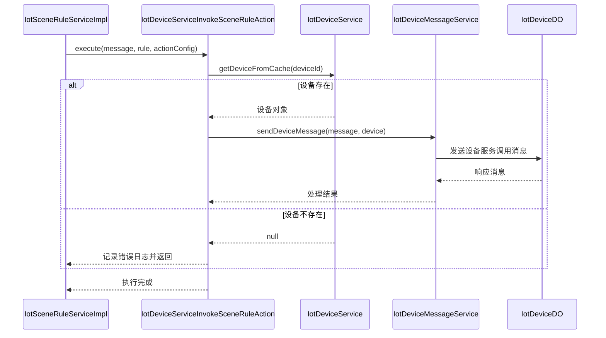

# IotDeviceServiceInvokeSceneRuleAction

## 概述

`IotDeviceServiceInvokeSceneRuleAction` 是物联网平台中场景联动规则的设备服务调用动作实现类。当场景规则触发条件满足时，此类负责向指定设备发送服务调用指令，实现设备功能的远程调用。

该类实现了 `IotSceneRuleAction` 接口，是场景联动规则引擎中的一个具体动作执行器，用于处理 `DEVICE_SERVICE_INVOKE` 类型的场景动作。

## 架构设计

### 类关系图

```mermaid
classDiagram
    class IotSceneRuleAction {
        <<interface>>
        +execute(message: IotDeviceMessage, rule: IotSceneRuleDO, actionConfig: IotSceneRuleDO.Action) void
        +getType() IotSceneRuleActionTypeEnum
    }
    
    class IotDeviceServiceInvokeSceneRuleAction {
        -deviceService: IotDeviceService
        -deviceMessageService: IotDeviceMessageService
        +execute(message: IotDeviceMessage, rule: IotSceneRuleDO, actionConfig: IotSceneRuleDO.Action) void
        +getType() IotSceneRuleActionTypeEnum
    }
    
    IotSceneRuleAction <|.. IotDeviceServiceInvokeSceneRuleAction
    
    class IotDeviceService {
        <<interface>>
        +getDeviceFromCache(deviceId: Long) IotDeviceDO
        +getDeviceListByProductId(productId: List<IotDeviceDO>)
    }
    
    class IotDeviceMessageService {
        <<interface>>
        +sendDeviceMessage(message: IotDeviceMessage, device: IotDeviceDO) IotDeviceMessage
    }
    
    IotDeviceServiceInvokeSceneRuleAction --> IotDeviceService : 依赖
    IotDeviceServiceInvokeSceneRuleAction --> IotDeviceMessageService : 依赖
    
    class IotSceneRuleDO {
        class Action {
            +type: Integer
            +deviceId: Long
            +productId: Long
            +identifier: String
            +params: String
        }
    }
    
    class IotDeviceMessage {
        +deviceId: Long
        +method: String
        +params: Object
    }
    
    class IotDeviceMessageMethodEnum {
        <<enum>>
        SERVICE_INVOKE
    }
    
    class IotSceneRuleActionTypeEnum {
        <<enum>>
        DEVICE_SERVICE_INVOKE
    }
    
    IotDeviceMessageMethodEnum --> IotDeviceMessageMethodEnum.SERVICE_INVOKE : 实现
    IotSceneRuleActionTypeEnum --> IotSceneRuleActionTypeEnum.DEVICE_SERVICE_INVOKE : 实现
```

### 组件交互流程



## 功能详解

### 核心职责

1. **设备服务调用执行**：根据场景规则配置，向指定设备或产品下的所有设备发送服务调用指令
2. **设备选择逻辑**：支持单设备、全部设备（特殊标识）和产品级别的设备批量操作
3. **消息构建与发送**：构建符合物联网平台通信协议的服务调用消息，并通过消息服务发送到设备
4. **错误处理与日志**：提供详细的错误日志记录，便于问题排查

### 关键方法

#### `execute(IotDeviceMessage message, IotSceneRuleDO rule, IotSceneRuleDO.Action actionConfig)`

执行设备服务调用动作的主要入口方法。

**参数说明：**
- `message`: 触发场景规则的设备消息（定时触发时可能为null）
- `rule`: 触发的场景规则对象
- `actionConfig`: 具体的动作配置，包含设备ID、服务标识符、参数等信息

**执行流程：**
1. 参数校验：检查设备ID和服务标识符是否为空
2. 设备选择判断：
   - 如果设备ID为特殊值 `IotDeviceDO.DEVICE_ID_ALL`，则执行产品级别的批量操作
   - 否则执行单设备操作
3. 调用相应的执行方法：
   - `executeForAllDevices()`: 为产品下的所有设备执行服务调用
   - `executeForSingleDevice()`: 为单个设备执行服务调用

#### `executeForSingleDevice(IotDeviceMessage message, IotSceneRuleDO rule, IotSceneRuleDO.Action actionConfig)`

为单个设备执行服务调用。

**实现细节：**
1. 从缓存中获取设备信息
2. 验证设备是否存在
3. 调用 `executeServiceInvokeForDevice()` 执行实际的服务调用

#### `executeForAllDevices(IotDeviceMessage message, IotSceneRuleDO rule, IotSceneRuleDO.Action actionConfig)`

为产品下的所有设备执行服务调用。

**实现细节：**
1. 参数校验：检查产品ID是否为空
2. 获取指定产品下的所有设备列表
3. 遍历设备列表，对每个设备调用 `executeServiceInvokeForDevice()`

#### `executeServiceInvokeForDevice(IotSceneRuleDO rule, IotSceneRuleDO.Action actionConfig, IotDeviceDO device)`

为指定设备执行服务调用的核心方法。

**实现细节：**
1. 构建服务调用消息：调用 `buildServiceInvokeMessage()` 创建设备消息
2. 发送设备消息：通过 `deviceMessageService.sendDeviceMessage()` 发送消息到目标设备
3. 日志记录：记录成功或失败的详细信息

#### `buildServiceInvokeMessage(IotSceneRuleDO.Action actionConfig, IotDeviceDO device)`

构建服务调用消息。

**消息格式：**
```json
{
  "identifier": "serviceId",
  "params": {...}
}
```

**实现细节：**
1. 使用 `MapUtil.builder()` 构建参数映射
2. 设置 `identifier` 为服务标识符
3. 设置 `params` 为服务输入参数（如果为空则使用空映射）
4. 调用 `IotDeviceMessage.requestOf()` 创建服务调用请求消息
5. 消息方法类型为 `IotDeviceMessageMethodEnum.SERVICE_INVOKE.getMethod()`

### 异常处理

类中包含多层异常处理机制：

1. **参数验证**：在执行前检查必要参数（设备ID、服务标识符）是否为空
2. **设备存在性检查**：通过设备服务验证目标设备是否存在
3. **消息构建异常捕获**：在构建服务调用消息时捕获可能的异常
4. **消息发送异常捕获**：在发送设备消息时捕获网络或服务异常
5. **详细日志记录**：所有异常都会记录详细的上下文信息，包括规则ID、动作配置、设备ID等

## 配置说明

### 动作配置字段

在场景规则的动作配置中，`IotDeviceServiceInvokeSceneRuleAction` 使用以下字段：

| 字段名 | 类型 | 是否必填 | 说明 |
|--------|------|----------|------|
| `type` | Integer | 是 | 动作类型，必须是 `IotSceneRuleActionTypeEnum.DEVICE_SERVICE_INVOKE.getType()` 的值（2） |
| `deviceId` | Long | 是 | 目标设备ID，特殊值 `IotDeviceDO.DEVICE_ID_ALL` 表示产品下的所有设备 |
| `productId` | Long | 当deviceId为ALL时必填 | 产品ID，用于批量操作时指定目标产品 |
| `identifier` | String | 是 | 服务标识符，对应物模型中服务的identifier |
| `params` | String | 否 | 服务输入参数，JSON格式字符串 |
| `alertConfigId` | Long | 否 | 告警配置ID，此动作类型不使用 |

### 配置示例

JSON格式的动作配置示例：
```json
{
  "type": 2,
  "deviceId": 12345,
  "identifier": "reset",
  "params": "{\"delay\": 5000}"
}
```

## 与其他组件的交互

### 与场景规则引擎的集成

`IotDeviceServiceInvokeSceneRuleAction` 通过 Spring 自动装配注入到 `IotSceneRuleServiceImpl` 中。在场景规则执行过程中：

1. 场景规则服务遍历所有匹配的规则
2. 对于每个规则，遍历其动作配置
3. 根据动作类型查找对应的动作实现类
4. 调用动作的 `execute()` 方法执行具体操作

### 与设备服务的交互

1. 通过 `IotDeviceService` 获取设备信息（支持缓存查询）
2. 使用设备服务的 `getDeviceListByProductId()` 方法获取产品下的所有设备
3. 依赖设备服务验证设备是否存在

### 与设备消息服务的交互

1. 通过 `IotDeviceMessageService` 发送设备服务调用消息
2. 消息服务负责：
   - 消息ID生成和时间戳添加
   - 设备租户信息填充
   - 通过消息中间件（如RocketMQ/Kafka）将消息路由到目标设备
   - 消息持久化和重试机制

## 使用场景

### 典型应用场景

1. **设备远程控制**：通过场景联动触发设备重启、恢复出厂设置等操作
2. **自动化业务流程**：当传感器数据达到阈值时，自动调用设备的控制服务
3. **定时维护任务**：根据时间触发器定期调用设备的校准或维护服务
4. **告警联动**：当设备告警触发时，自动调用相应的处理服务

### 配置示例

场景规则配置示例（JSON格式）：
```json
{
  "name": "设备过温保护",
  "status": 1,
  "triggers": [
    {
      "type": 2, // DEVICE_PROPERTY_POST
      "productId": 1001,
      "deviceId": 12345,
      "identifier": "temperature",
      "operator": ">",
      "value": "80"
    }
  ],
  "actions": [
    {
      "type": 2, // DEVICE_SERVICE_INVOKE
      "deviceId": 12345,
      "identifier": "coolingSystemOn",
      "params": "{\"powerLevel\": 80, \"duration\": 300}"
    }
  ]
}
```

## 性能考虑

### 优点

1. **异步处理**：设备消息发送是异步的，不会阻塞场景规则执行流程
2. **批量操作优化**：支持产品级别的批量设备操作，减少数据库查询次数
3. **缓存利用**：最大程度使用设备缓存，减少数据库访问
4. **错误隔离**：单个设备的失败不会影响其他设备的处理

### 注意事项

1. **网络延迟**：设备服务调用依赖网络通信，可能存在延迟
2. **设备离线处理**：当目标设备离线时，消息会被缓存直至设备上线
3. **幂等性**：服务调用应设计为幂等操作，以处理可能的重复消息
4. **权限控制**：确保调用方具有目标设备的操作权限

## 异常情况处理

### 常见异常场景

| 场景 | 处理方式 | 日志级别 |
|------|----------|----------|
| 设备ID为空 | 记录错误并返回 | ERROR |
| 服务标识符为空 | 记录错误并返回 | ERROR |
| 设备不存在 | 记录错误并返回 | ERROR |
| 产品ID为空（批量模式） | 记录错误并返回 | ERROR |
| 产品下无设备 | 记录警告并返回 | WARN |
| 消息构建失败 | 记录错误并返回 | ERROR |
| 消息发送失败 | 记录错误并返回 | ERROR |

### 日志格式

所有日志都遵循统一的格式：
```
[方法名][描述信息] 变量名={变量值}, ...
```

例如：
```
[executeForSingleDevice][规则场景(123) 动作配置({type=2, deviceId=12345, identifier=reset, params={}}) 设备(12345) 不存在]
```

## 最佳实践

### 配置建议

1. **合理设置设备范围**：
   - 明确需要操作的设备范围（单设备、全部设备或产品级别）
   - 避免不必要的全产品操作以减少资源消耗

2. **服务参数优化**：
   - 只传递必要的参数，减少消息大小
   - 使用合适的数据类型和格式
   - 考虑参数的安全性，避免传输敏感信息

3. **错误处理设计**：
   - 设备服务应具备良好的容错机制
   - 考虑实现重试机制或降级策略
   - 提供人工干预的接口或告警机制

### 开发指南

1. **单元测试**：
   - 测试参数验证逻辑
   - 测试单设备和批量设备两种执行路径
   - 测试异常情况的处理
   - 模拟设备服务和消息服务的行为

2. **集成测试**：
   - 验证与场景规则引擎的集成
   - 测试消息的正确生成和发送
   - 验证与实际设备通信的互操作性

3. **性能监控**：
   - 监控设备服务调用的成功率和延迟
   - 跟踪批量操作的执行时间
   - 设置适当的告警阈值

## 与其他动作类型的关系

在场景规则系统中，`IotDeviceServiceInvokeSceneRuleAction` 是几种动作类型之一：

| 动作类型 | 类名 | 功能说明 |
|----------|------|----------|
| 设备属性设置 | `IotDevicePropertySetSceneRuleAction` | 设置设备属性值 |
| 设备服务调用 | `IotDeviceServiceInvokeSceneRuleAction` | 调用设备服务方法 |
| 告警触发 | `IotAlertTriggerSceneRuleAction` | 触发告警通知 |
| 告警恢复 | `IotAlertRecoverSceneRuleAction` | 恢复告警状态 |

这些动作类型共同实现了场景规则的完整功能，可以根据业务需求组合使用。

## 结论

`IotDeviceServiceInvokeSceneRuleAction` 是物联网平台场景联动功能的重要组成部分，它提供了灵活且可靠的设备服务调用能力。通过良好的封装和错误处理机制，该类使得开发者可以轻松地在场景规则中集成各种设备控制逻辑，实现智能联动和自动化管理。

其设计遵循了单一职责原则，专注于设备服务调用这一特定功能，同时通过依赖注入和接口编程，保持了良好的可扩展性和可测试性。在实际应用中，它能够有效支持各种物联网场景，从简单的设备控制到复杂的业务流程自动化。