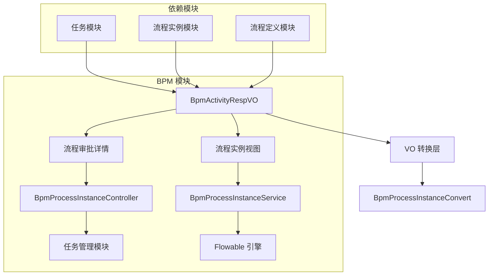
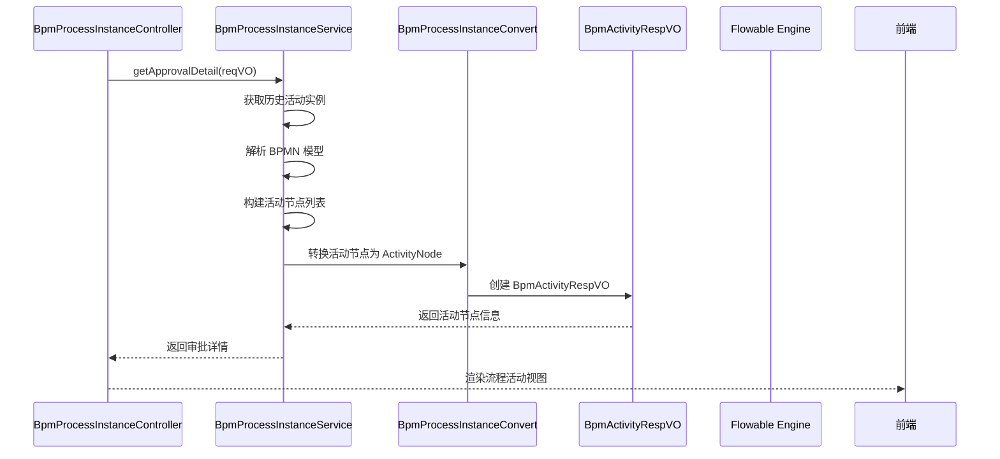

# 流程活动模块 (Activity Module) 文档

## 1. 模块概述

流程活动模块是 BPM（业务流程管理）系统中的核心组件，用于管理和展示流程执行过程中的各个活动节点（Activity）。在 Flowable 引擎中，活动是流程定义中的基本执行单元，包括用户任务（UserTask）、开始事件（StartEvent）、结束事件（EndEvent）、网关（Gateway）等。

本模块主要负责：
- 提供流程活动的响应对象（VO），用于前端展示
- 支持流程审批详情中活动节点的显示
- 与流程实例、任务等模块协同工作，实现完整的流程跟踪和审批体验

## 2. 核心组件

### 2.1 BpmActivityRespVO

**文件路径**: `yudao-module-bpm/src/main/java/cn/iocoder/yudao/module/bpm/controller/admin/task/vo/activity/BpmActivityRespVO.java`

**描述**: 管理后台 - 流程活动的 Response VO，用于在流程审批详情中展示活动节点信息。

```java
@Schema(description = "管理后台 - 流程活动的 Response VO")
@Data
public class BpmActivityRespVO {

    @Schema(description = "流程活动的标识", requiredMode = Schema.RequiredMode.REQUIRED, example = "1024")
    private String key;
    
    @Schema(description = "流程活动的类型", requiredMode = Schema.RequiredMode.REQUIRED, example = "StartEvent")
    private String type;

    @Schema(description = "流程活动的开始时间", requiredMode = Schema.RequiredMode.REQUIRED)
    private LocalDateTime startTime;
    
    @Schema(description = "流程活动的结束时间", requiredMode = Schema.RequiredMode.REQUIRED)
    private LocalDateTime endTime;

    @Schema(description = "关联的流程任务的编号", example = "2048")
    private String taskId; // 关联的流程任务，只有 UserTask 等类型才有

}
```

**字段说明**:

| 字段名 | 类型 | 必填 | 描述 |
|--------|------|------|------|
| key | String | 是 | 流程活动的唯一标识（如 UserTask 的 taskDefinitionKey） |
| type | String | 是 | 流程活动的类型（如 StartEvent、UserTask、EndEvent、ExclusiveGateway 等） |
| startTime | LocalDateTime | 是 | 活动开始执行的时间 |
| endTime | LocalDateTime | 是 | 活动结束执行的时间（未结束时为空） |
| taskId | String | 否 | 关联的流程任务编号，仅 UserTask 等任务类型有值 |

## 3. 架构设计

### 3.1 模块关系图



### 3.2 组件交互流程



## 4. 功能说明

### 4.1 活动节点状态管理

BpmActivityRespVO 用于表示流程中各个活动节点的状态，支持以下状态：

- **进行中 (RUNNING)**: 活动正在执行中，endTime 为空
- **已完成 (FINISHED)**: 活动已执行完成，startTime 和 endTime 均有值
- **未开始 (NOT_START)**: 活动尚未执行，用于预测未来节点
- **跳过 (SKIP)**: 活动因跳过表达式被跳过

### 4.2 与任务模块的关联

活动节点与任务模块紧密相关，主要体现在：

1. **UserTask 活动**: 对应具体的流程任务（Task），taskId 字段关联任务编号
2. **StartEvent/EndEvent**: 对应流程的开始和结束事件，无 taskId
3. **Gateway**: 网关节点，无 taskId，用于流程分支判断

### 4.3 审批详情中的活动展示

在流程审批详情页面中，活动节点分为三类：

| 类别 | 描述 | 数据来源 |
|------|------|----------|
| 已结束的活动 | 已完成的审批节点 | HistoricTaskInstance + HistoricActivityInstance |
| 进行中的活动 | 当前正在处理的节点 | HistoricActivityInstance (endTime=null) |
| 预测的活动 | 未来将要执行的节点 | BPMN 模型模拟预测 |

## 5. 相关模块引用

| 模块 | 说明 | 引用文档 |
|------|------|----------|
| [任务模块](task.md) | 流程任务的管理与操作 | task.md |
| [流程实例模块](process-instance.md) | 流程实例的生命周期管理 | process-instance.md |
| [流程定义模块](process-definition.md) | 流程定义的管理与部署 | process-definition.md |
| [Flowable 引擎](flowable-engine.md) | 底层流程引擎支持 | flowable-engine.md |

## 6. 使用示例

### 6.1 获取流程活动列表

```java
// 通过 BpmProcessInstanceService 获取审批详情
BpmApprovalDetailRespVO detail = processInstanceService.getApprovalDetail(loginUserId, reqVO);

// detail 中包含活动节点列表，每个节点包含 BpmActivityRespVO 信息
List<ActivityNode> activityNodes = detail.getActivityNodes();
```

### 6.2 前端展示示例

```vue
<!-- 流程活动节点展示组件 -->
<template>
  <div v-for="activity in activities" :key="activity.key">
    <span :class="['activity-node', activity.type]">
      {{ activity.name }}
      <span v-if="activity.startTime">
        {{ formatTime(activity.startTime) }} - {{ formatTime(activity.endTime) }}
      </span>
      <span v-else>{{ activity.startTime }}</span>
    </span>
  </div>
</template>

<script>
export default {
  props: {
    activities: Array // BpmActivityRespVO 数组
  },
  methods: {
    formatTime(date) {
      return date ? new Date(date).toLocaleString() : '';
    }
  }
};
</script>
```

## 7. 扩展说明

### 7.1 活动类型支持

BpmActivityRespVO 支持以下 BPMN 活动类型：

- **StartEvent**: 开始事件
- **EndEvent**: 结束事件
- **UserTask**: 用户任务（最常见）
- **ServiceTask**: 服务任务
- **ScriptTask**: 脚本任务
- **ExclusiveGateway**: 排他网关
- **InclusiveGateway**: 包容网关
- **ParallelGateway**: 并行网关
- **CallActivity**: 调用活动（子流程）

### 7.2 与 Simple 模型的关系

除了标准 BPMN 模型，本模块还支持 Simple 模型（可视化流程设计器），在 Simple 模型中活动节点包括：

- START_USER_NODE: 开始用户节点
- APPROVE_NODE: 审批节点
- TRANSACTOR_NODE: 转办节点
- END_NODE: 结束节点
- COPY_NODE: 抄送节点
- CHILD_PROCESS: 子流程节点

### 7.3 活动权限控制

通过 `parseFormFieldsPermission` 方法可以解析活动节点的表单字段权限，实现细粒度的字段级权限控制。

## 8. 总结

流程活动模块是 BPM 系统中用于展示和管理流程执行过程中各个活动节点的核心组件。BpmActivityRespVO 作为活动节点的响应对象，提供了活动的基本信息（标识、类型、时间范围、关联任务），与流程实例、任务等模块紧密协作，共同实现了完整的流程跟踪和审批体验。

该模块的设计遵循了 Flowable 引擎的活动模型，同时扩展了业务相关的功能（如表单权限、活动预测等），为上层应用提供了灵活且强大的流程活动管理能力。
