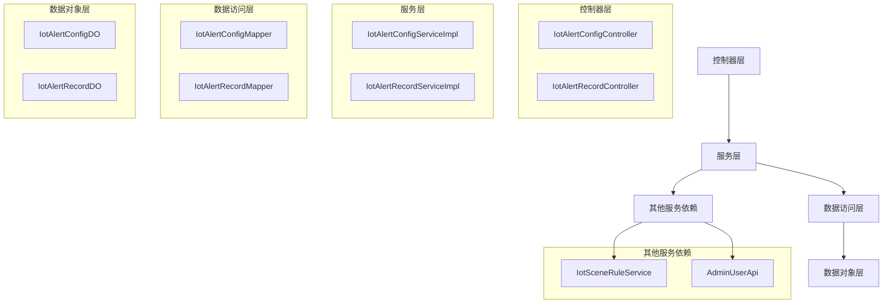

# alert_3 模块文档

## 模块概述

alert_3 模块是 IoT 模块的一部分，负责处理物联网设备的告警功能。该模块提供告警配置管理和告警记录处理两个核心功能，使得系统能够根据设备数据和预定义规则生成告警，并支持多种通知方式（短信、邮件、站内信）进行告警分发。

## 架构概述

alert_3 模块遵循典型的分层架构设计，主要包括以下几个层次：

- **控制器层 (Controller)**: 负责处理HTTP请求，提供RESTful API接口
- **服务层 (Service)**: 实现业务逻辑，协调各个组件完成具体功能
- **数据访问层 (DAO)**: 与数据库进行交互，执行CRUD操作
- **数据对象层 (DO)**: 定义数据库表对应的实体类
- **视图对象层 (VO)**: 定义API请求和响应的数据传输对象

### 组件关系图

## 子模块说明

alert_3 模块可以划分为两个主要子模块：

1. **告警配置管理 (alert_config)**: 负责告警规则的创建、修改、删除和查询
2. **告警记录管理 (alert_record)**: 负责告警触发记录的查询和处理

每个子模块都有独立的文档文件：
- [告警配置管理](alert_3_alert_config.md)
- [告警记录管理](alert_3_alert_record.md)

## 功能详情

### 告警配置管理

告警配置管理子模块提供以下功能：
- 创建新的告警配置
- 更新现有的告警配置
- 删除告警配置
- 查询单个告警配置详情
- 分页查询告警配置列表
- 根据状态查询告警配置列表
- 根据场景规则ID和状态查询告警配置列表

### 告警记录管理

告警记录管理子模块提供以下功能：
- 查询单个告警记录详情
- 分页查询告警记录列表
- 根据场景规则ID、设备ID和处理状态查询告警记录列表
- 批量处理告警记录（标记为已处理并添加处理备注）

## 技术实现要点

1. **依赖注入**: 使用Spring的@Resource注解进行依赖注入
2. **事务管理**: 服务方法默认使用Spring的事务管理
3. **参数校验**: 使用Jakarta Validation进行请求参数校验
4. **异常处理**: 通过ServiceExceptionUtil统一处理业务异常
5. **数据转换**: 使用BeanUtils进行对象之间的属性复制
6. **循环依赖解决**: 通过@Lazy注解解决服务之间的循环依赖问题
7. **缓存优化**: 在控制器层批量获取用户信息以减少数据库查询次数

## 接口说明

### 告警配置相关接口

| 接口 | 方法 | 路径 | 描述 |
|------|------|------|------|
| 创建告警配置 | POST | /iot/alert-config/create | 创建新的告警配置 |
| 更新告警配置 | PUT | /iot/alert-config/update | 更新现有的告警配置 |
| 删除告警配置 | DELETE | /iot/alert-config/delete | 删除指定ID的告警配置 |
| 获取告警配置 | GET | /iot/alert-config/get | 根据ID获取告警配置详情 |
| 分页查询 | GET | /iot/alert-config/page | 分页查询告警配置列表 |
| 简单列表 | GET | /iot/alert-config/simple-list | 获取启用状态的告警配置简单列表（用于下拉选项） |

### 告警记录相关接口

| 接口 | 方法 | 路径 | 描述 |
|------|------|------|------|
| 获取告警记录 | GET | /iot/alert-record/get | 根据ID获取告警记录详情 |
| 分页查询 | GET | /iot/alert-record/page | 分页查询告警记录列表 |
| 处理告警记录 | PUT | /iot/alert-record/process | 处理告警记录（标记为已处理并添加备注） |

## 数据模型

### IotAlertConfigDO (告警配置数据对象)

| 字段名 | 类型 | 说明 |
|--------|------|------|
| id | Long | 配置编号，主键 |
| name | String | 配置名称 |
| description | String | 配置描述 |
| level | Integer | 配置级别，关联字典ALERT_LEVEL |
| status | Integer | 配置状态，关联CommonStatusEnum |
| sceneRuleIds | List<Long> | 关联的场景联动规则编号数组 |
| receiveUserIds | List<Long> | 接收的用户编号数组 |
| receiveTypes | List<Integer> | 接收的类型数组，关联IotAlertReceiveTypeEnum |
| smsTemplateCode | String | 短信模板编号 |
| mailTemplateCode | String | 邮件模板编号 |
| notifyTemplateCode | String | 站内信模板编号 |

### IotAlertRecordDO (告警记录数据对象)

| 字段名 | 类型 | 说明 |
|--------|------|------|
| id | Long | 记录编号，主键 |
| configId | Long | 告警配置编号（冗余） |
| configName | String | 告警配置名称（冗余） |
| configLevel | Integer | 告警级别（冗余） |
| sceneRuleId | Long | 场景规则编号 |
| productId | Long | 产品编号 |
| deviceId | Long | 设备编号 |
| deviceMessage | IotDeviceMessage | 触发的设备消息 |
| processStatus | Boolean | 是否处理 |
| processRemark | String | 处理结果（备注） |

## 与其他模块的交互

alert_3 模块与以下模块存在依赖或交互：

1. **场景规则模块**: 通过IotSceneRuleService验证场景规则ID的有效性
2. **用户模块**: 通过AdminUserApi验证接收用户ID的有效性并获取用户信息
3. **消息模块**: 通过IotDeviceMessage处理设备消息
4. **通知模块**: 通过短信、邮件和站内信模板发送告警通知

## 安全考虑

1. **权限控制**: 所有接口都通过@PreAuthorize注解进行权限验证
2. **参数校验**: 所有输入参数都经过严格的校验，防止非法数据
3. **数据隔离**: 告警配置和记录通过ID进行关联，确保数据正确性
4. **防止循环依赖**: 通过@Lazy注解解决服务间的潜在循环依赖

## 性能优化

1. **批量操作**: 支持批量处理告警记录，减少数据库操作次数
2. **分页查询**: 所有列表查询都支持分页，避免一次性加载大量数据
3. **缓存用户信息**: 在控制器层批量获取用户信息，减少数据库查询
4. **冗余字段**: 告警记录中冗余了配置名称和级别等字段，提高查询性能

## 异常处理

模块定义了以下业务异常常量：
- ALERT_CONFIG_NOT_EXISTS: 告警配置不存在
- ALERT_CONFIG_MAIL_TEMPLATE_REQUIRED: 邮件告警类型需要配置邮件模板
- ALERT_CONFIG_SMS_TEMPLATE_REQUIRED: 短信告警类型需要配置短信模板
- ALERT_CONFIG_NOTIFY_TEMPLATE_REQUIRED: 站内信告警类型需要配置站内信模板

这些异常在服务层通过ServiceExceptionUtil.exception()方法抛出，在全局异常处理器中统一处理并返回标准错误响应。