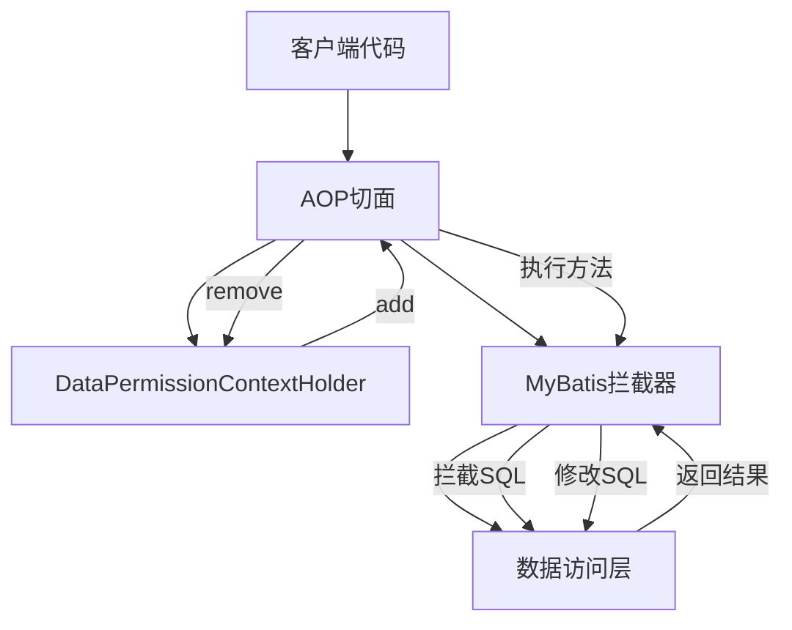
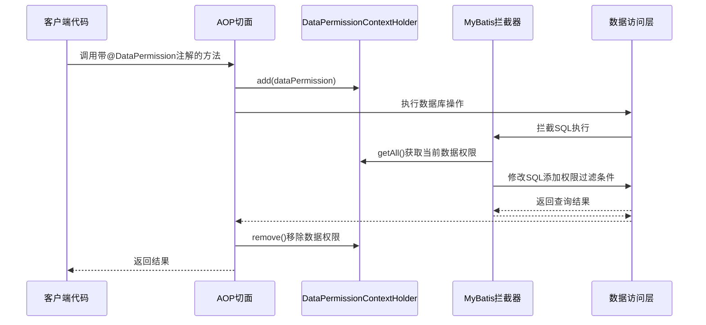
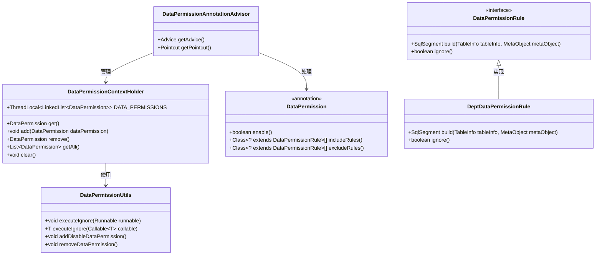
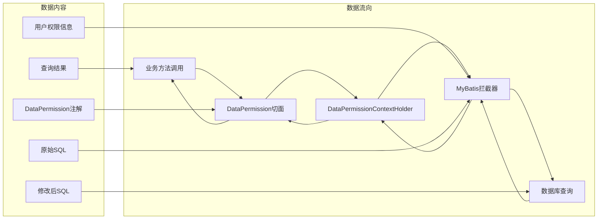

# AOP 模块文档

## 概述

AOP（Aspect-Oriented Programming，面向切面编程）模块是Yudao框架的核心组件之一，主要用于实现数据权限控制、日志记录、权限验证等横切关注点。通过AOP技术，框架能够在不修改业务代码的情况下，统一处理跨越多个模块的通用功能。

本模块主要提供数据权限控制的AOP实现，包括：
- 数据权限注解处理
- 数据权限上下文管理
- 数据权限规则应用
- 数据权限开关控制

## 核心组件

### DataPermissionContextHolder

`DataPermissionContextHolder` 是数据权限AOP实现的核心上下文管理器，负责在线程局部变量中维护数据权限注解的栈结构，以支持方法嵌套调用时的数据权限传递和恢复。

#### 主要功能

1. **线程局部存储**：使用 `TransmittableThreadLocal` 维护数据权限注解的栈，确保在异步调用和线程传播时数据权限上下文能够正确传递
2. **栈式管理**：采用链表栈结构（`LinkedList`）存储数据权限注解，支持方法嵌套调用时的权限叠加和恢复
3. **自动清理**：当栈为空时自动移除ThreadLocal变量，防止内存泄漏
4. **上下文操作**：提供入栈（add）、出栈（remove）、获取当前权限（get）、获取所有权限（getAll）和清空（clear）等操作

#### 关键实现细节

- 使用 `TransmittableThreadLocal` 而非普通 `ThreadLocal`，确保在使用线程池或异步框架时上下文能够正确传播
- 栈顶元素（`peekLast`）表示当前生效的数据权限注解
- 出栈操作会检查栈是否为空，为空时清除ThreadLocal以避免内存泄漏
- 提供 `clear()` 方法主要用于单元测试场景，手动清理上下文

#### 代码示例

```java
// 在方法开始处添加数据权限
@DataPermission(enable = true, includeRules = {DeptDataPermissionRule.class})
public void someMethod() {
    // 方法体
}

// 在AOP切面中自动处理
@Around("@annotation(dataPermission)")
public Object doAround(ProceedingJoinPoint joinPoint, DataPermission dataPermission) throws Throwable {
    try {
        // 入栈数据权限
        DataPermissionContextHolder.add(dataPermission);
        // 执行目标方法
        return joinPoint.proceed();
    } finally {
        // 出栈数据权限
        DataPermissionContextHolder.remove();
    }
}
```

### DataPermission 注解

`DataPermission` 注解用于标记需要应用数据权限控制的类或方法，是数据权限AOP实现的入口点。

#### 属性说明

| 属性 | 类型 | 默认值 | 说明 |
|------|------|--------|------|
| enable | boolean | true | 是否开启数据权限控制，即使不添加注解默认也是开启状态 |
| includeRules | Class[] | {} | 生效的数据权限规则数组，优先级高于 excludeRules |
| excludeRules | Class[] | {} | 排除的数据权限规则数组，优先级最低 |

#### 使用示例

```java
// 类级别应用数据权限
@DataPermission(includeRules = {DeptDataPermissionRule.class})
@Service
public class UserService {
    
    // 方法级别应用数据权限（可覆盖类级别配置）
    @DataPermission(enable = false) // 禁用数据权限
    public User getById(Long id) {
        // 此方法不应用数据权限控制
        return userMapper.selectById(id);
    }
    
    @DataPermission(excludeRules = {DeptDataPermissionRule.class}) // 排除部门数据权限
    public List<User> listAll() {
        // 此方法仅应用除部门数据权限以外的所有数据权限
        return userMapper.selectList(null);
    }
}
```

### DataPermissionUtils

`DataPermissionUtils` 提供了便捷的工具方法来临时禁用数据权限控制，主要用于特殊场景如系统初始化、管理员操作等需要绕过数据权限限制的情况。

#### 主要方法

1. `executeIgnore(Runnable runnable)`：在临时禁用数据权限的情况下执行Runnable
2. `executeIgnore(Callable<T> callable)`：在临时禁用数据权限的情况下执行Callable并返回结果
3. `addDisableDataPermission()`：添加禁用数据权限的标记
4. `removeDataPermission()`：移除数据权限标记

#### 使用示例

```java
// 临时禁用数据权限执行操作
DataPermissionUtils.executeIgnore(() -> {
    // 此代码块不受数据权限控制
    userMapper.deleteById(userId);
});

// 或者手动控制
try {
    DataPermissionUtils.addDisableDataPermission();
    // 此代码块不受数据权限控制
    userMapper.deleteById(userId);
} finally {
    DataPermissionUtils.removeDataPermission();
}
```

## 架构设计

### 整体架构

数据权限AOP实现遵循典型的AOP架构模式，主要由以下几部分组成：



### 核心流程



### 与MyBatis Plus的集成

数据权限AOP与MyBatis Plus紧密集成，通过以下方式实现：

1. **自动配置**：`YudaoDataPermissionAutoConfiguration` 自动创建必要的Bean
2. **拦截器注册**：`DataPermissionRuleHandler` 被注册为MyBatis Plus的拦截器，位置设置为首个（位置0），确保在分页插件之前执行
3. **SQL动态修改**：拦截器根据当前线程的数据权限上下文，动态修改SQL语句，在WHERE条件中添加数据过滤表达式

## 组件交互与数据流

### 组件交互图



### 数据流图



## 与其他模块的关系

### 依赖关系

AOP模块主要依赖以下组件：
- `DataPermission` 注解：定义数据权限控制的元数据
- `DataPermissionRule` 接口及其实现：定义具体的数据权限过滤规则
- `TransmittableThreadLocal`：用于线程上下文传递的第三方库
- MyBatis Plus：用于数据访问层的拦截和SQL修改

### 被依赖关系

AOP模块被以下模块或组件依赖：
- 业务服务层：通过 `@DataPermission` 注解应用数据权限控制
- 系统框架：提供数据权限控制的基础设施
- 其他AOP切面：如CRM权限方面、交易日志方面等，展示AOP在不同业务场景中的应用

### 与其他AOP实现的对比

在Yudao框架中，除了数据权限AOP之外，还有其他几个重要的AOP实现：

1. **CRM权限方面 (`CrmPermissionAspect`)**：
   - 用于验证CRM模块的业务权限
   - 基于角色和数据范围进行权限校验
   - 使用 `@Before` 通知在方法执行前进行权限验证

2. **交易日志方面 (`TradeOrderLogAspect`)**：
   - 用于记录交易订单的操作日志
   - 使用ThreadLocal临时存储操作上下文信息
   - 使用 `@AfterReturning` 通知在方法成功执行后记录日志

这些方面展示了AOP在不同业务场景中的应用：
- 数据权限AOP：关注数据访问层的权限控制
- CRM权限AOP：关注业务方法的权限验证
- 交易日志AOP：关注业务方法的审计日志

## 使用指南

### 在业务代码中应用数据权限

1. **在服务类或方法上添加 `@DataPermission` 注解**
   ```java
   @Service
   @DataPermission(includeRules = {DeptDataPermissionRule.class})
   public class UserService {
       
       public List<User> getUserList() {
           // 自动应用部门数据权限过滤
           return userMapper.selectList(null);
       }
   }
   ```

2. **自定义数据权限规则**
   ```java
   @Component
   public class CustomDataPermissionRule implements DataPermissionRule {
       
       @Override
       public SqlSegment build(TableInfo tableInfo, MetaObject metaObject) {
           // 返回自定义的SQL过滤条件
           return new SqlSegment("AND custom_column = #{customValue}");
       }
       
       @Override
       public boolean ignore() {
           return false;
       }
   }
   ```

3. **在配置类中注册自定义规则**
   ```java
   @Configuration
   public class DataPermissionConfig {
       
       @Bean
       public DeptDataPermissionRuleCustomizer customDataPermissionRuleCustomizer() {
           return rule -> rule.addCustomRule(CustomDataPermissionRule.class);
       }
   }
   ```

### 临时禁用数据权限

在特殊场景需要临时禁用数据权限时，可以使用 `DataPermissionUtils`：

```java
@Service
public class AdminService {
    
    public void deleteUser(Long userId) {
        // 管理员操作需要绕过数据权限
        DataPermissionUtils.executeIgnore(() -> {
            userMapper.deleteById(userId);
        });
    }
}
```

### 单元测试中的使用

在单元测试中，可能需要手动清理数据权限上下文：

```java
@Test
public void testDataPermission() {
    try {
        // 设置数据权限
        DataPermissionContextHolder.add(new DataPermission() {
            @Override
            public boolean enable() {
                return true;
            }
            
            @Override
            public Class<? extends DataPermissionRule>[] includeRules() {
                return new Class[]{DeptDataPermissionRule.class};
            }
            
            @Override
            public Class<? extends DataPermissionRule>[] excludeRules() {
                return new Class[]{};
            }
            
            @Override
            public Class<? extends Annotation> annotationType() {
                return DataPermission.class;
            }
        });
        
        // 执行测试逻辑
        // ...
        
    } finally {
        // 测试结束后清理上下文
        DataPermissionContextHolder.clear();
    }
}
```

## 最佳实践

1. **合理设置权限规则**：根据业务需求精确配置 `includeRules` 和 `excludeRules`，避免过度或不足的数据过滤
2. **注意方法嵌套**：利用栈式设计，在嵌套方法调用时可以正确继承和恢复数据权限状态
3. **谨慎禁用数据权限**：仅在真正需要（如管理员操作、系统初始化）时使用 `DataPermissionUtils` 禁用数据权限
4. **及时清理上下文**：在使用 `DataPermissionUtils.addDisableDataPermission()` 后，确保在finally块中调用 `removeDataPermission()` 方法
5. **监控性能影响**：数据权限拦截器会对每个SQL查询进行修改，注意监控其对数据库性能的影响
6. **单元测试隔离**：在单元测试中使用 `DataPermissionContextHolder.clear()` 确保测试之间不相互影响

## 常见问题

### Q: 为什么使用TransmittableThreadLocal而不是普通ThreadLocal？
A: 普通ThreadLocal在线程池场景下无法传递，而TransmittableThreadLocal能够在线程间传递上下文，这对于使用异步框架（如Spring @Async）或线程池的场景至关重要。

### Q: 数据权限AOP和MyBatis Plus的分页插件有什么关系？
A: 数据权限拦截器被注册为MyBatis Plus的首个拦截器（位置0），确保在分页插件之前执行。这样可以先应用数据权限过滤，再进行分页操作，确保分页结果是基于已过滤数据的。

### Q: 如何自定义数据权限规则？
A: 实现 `DataPermissionRule` 接口，实现 `build` 方法返回SQL过滤条件和 `ignore` 方法控制是否忽略规则。然后通过 `DeptDataPermissionRuleCustomizer` 或其他规则自定义器注册到系统中。

### Q: 数据权限上下文会不会造成内存泄漏？
A: 不会。`DataPermissionContextHolder` 在出栈操作中会检查栈是否为空，为空时会调用 `DATA_PERMISSIONS.remove()` 清除ThreadLocal变量，防止内存泄漏。

### Q: 可以在同一个方法上应用多个@DataPermission注解吗？
A: 不可以。Java注解不支持在同一个元素上多次应用相同的注解。如果需要复杂的权限组合，建议在规则实现中处理多种权限逻辑，或者使用Spring EL表达式在注解中动态配置规则。

## 总结

AOP模块（特别是数据权限AOP）是Yudao框架实现数据访问层权限控制的核心组件。通过巧妙地结合AOP技术、ThreadLocal上下文管理和MyBatis Plus拦截器机制，框架能够在不侵入业务代码的情况下，统一处理数据权限控制这一横切关注点。

该实现具有以下特点：
- **透明性**：业务代码无需感知数据权限控制的存在
- **灵活性**：通过注解配置可以精确控制数据权限的应用范围
- **可扩展性**：通过实现DataPermissionRule接口可以轻松添加自定义权限规则
- **安全性**：采用栈式设计和自动清理机制确保上下文正确传递和及时释放
- **性能**：拦截器位置优化确保在分页等其他拦截器之前执行，减少不必要的数据处理

通过本模块的设计和实现，Yudao框架为企业级应用提供了强大而灵活的数据权限控制能力，满足了多租户、角色权限、部门数据隔离等复杂业务场景的需求。