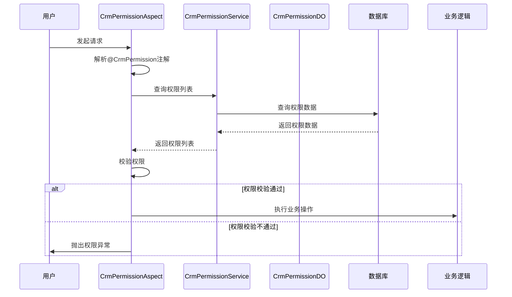

# AOP_2 模块文档

## 概述

AOP_2 模块是 Yudao CRM 系统中的一个核心模块，主要负责实现 CRM 系统的数据权限控制。通过 AOP（面向切面编程）的方式，对 CRM 系统中的业务操作进行权限校验，确保用户只能操作其有权限的数据。

### 核心功能

1. **权限注解**：提供 `@CrmPermission` 注解，用于标记需要进行权限校验的方法。
2. **权限校验**：通过 AOP 切面拦截并校验用户的操作权限。
3. **权限管理**：提供权限的创建、更新、删除、转移等操作。
4. **权限查询**：提供权限的查询功能，包括根据业务类型和业务编号查询权限列表。

### 模块结构

```
aop_2/
├── framework/
│   └── permission/
│       ├── core/
│       │   ├── aop/
│       │   │   └── CrmPermissionAspect.java          # 权限校验切面
│       │   └── annotations/
│       │       └── CrmPermission.java                # 权限注解
│       └── util/
│           └── CrmPermissionUtils.java              # 权限工具类
└── service/
    └── permission/
        ├── CrmPermissionService.java                  # 权限服务接口
        └── CrmPermissionServiceImpl.java             # 权限服务实现
```

## 架构设计

### 核心组件

#### 1. CrmPermissionAspect.java

**文件路径**: `yudao-module-crm/src/main/java/cn/iocoder/yudao/module/crm/framework/permission/core/aop/CrmPermissionAspect.java`

**功能**: 权限校验切面，负责拦截并校验用户的操作权限。

**核心逻辑**:
- 通过 `@Before` 注解在方法执行前进行权限校验。
- 解析 `@CrmPermission` 注解中的属性值，包括业务类型、业务编号和权限级别。
- 根据业务类型和业务编号查询用户的权限列表。
- 校验用户是否有足够的权限进行操作。

**代码示例**:
```java
@Before("@annotation(crmPermission)")
public void doBefore(JoinPoint joinPoint, CrmPermission crmPermission) {
    // 1.1 获取相关属性值
    Map<String, Object> expressionValues = parseExpressions(joinPoint, crmPermission);
    Integer bizType = StrUtil.isEmpty(crmPermission.bizTypeValue()) ?
            crmPermission.bizType()[0].getType() : (Integer) expressionValues.get(crmPermission.bizTypeValue()); // 模块类型
    // 1.2 处理兼容多个 bizId 的情况
    Object object = expressionValues.get(crmPermission.bizId()); // 模块数据编号
    Set<Long> bizIds = new HashSet<>();
    if (object instanceof Collection<?>) {
        bizIds.addAll(convertSet((Collection<?>) object, item -> Long.parseLong(item.toString())));
    } else {
        bizIds.add(Long.parseLong(object.toString()));
    }
    Integer permissionLevel = crmPermission.level().getLevel(); // 需要的权限级别

    // 2. 逐个校验权限
    List<CrmPermissionDO> permissionList = crmPermissionService.getPermissionListByBiz(bizType, bizIds);
    Map<Long, List<CrmPermissionDO>> multiMap = convertMultiMap(permissionList, CrmPermissionDO::getBizId);
    bizIds.forEach(bizId -> validatePermission(bizType, multiMap.get(bizId), permissionLevel));
}
```

#### 2. CrmPermission.java

**文件路径**: `yudao-module-crm/src/main/java/cn/iocoder/yudao/module/crm/framework/permission/core/annotations/CrmPermission.java`

**功能**: 权限注解，用于标记需要进行权限校验的方法。

**属性**:
- `bizType`: CRM 业务类型，枚举类型 `CrmBizTypeEnum`。
- `bizTypeValue`: CRM 业务类型的扩展字段，通过 Spring EL 表达式获取。
- `bizId`: 数据编号，通过 Spring EL 表达式获取。
- `level`: 操作所需的权限级别，枚举类型 `CrmPermissionLevelEnum`。

**代码示例**:
```java
@Target({METHOD, ANNOTATION_TYPE})
@Retention(RetentionPolicy.RUNTIME)
@Documented
public @interface CrmPermission {

    /**
     * CRM 类型
     */
    CrmBizTypeEnum[] bizType() default {};

    /**
     * CRM 类型扩展，通过 Spring EL 表达式获取到 {@link #bizType()}
     *
     * 目的：用于 CrmPermissionController 团队权限校验
     */
    String bizTypeValue() default "";

    /**
     * 数据编号，通过 Spring EL 表达式获取
     */
    String bizId();

    /**
     * 操作所需权限级别
     */
    CrmPermissionLevelEnum level();
}
```

#### 3. CrmPermissionService.java

**文件路径**: `yudao-module-crm/src/main/java/cn/iocoder/yudao/module/crm/service/permission/CrmPermissionService.java`

**功能**: 权限服务接口，定义了权限的创建、更新、删除、转移等操作。

**核心方法**:
- `createPermission`: 创建权限。
- `updatePermission`: 更新权限。
- `deletePermission`: 删除权限。
- `transferPermission`: 转移权限。
- `getPermissionListByBiz`: 根据业务类型和业务编号查询权限列表。
- `hasPermission`: 校验用户是否有指定权限。

#### 4. CrmPermissionServiceImpl.java

**文件路径**: `yudao-module-crm/src/main/java/cn/iocoder/yudao/module/crm/service/permission/CrmPermissionServiceImpl.java`

**功能**: 权限服务实现，实现了 `CrmPermissionService` 接口中的方法。

**核心逻辑**:
- 创建权限时，校验用户是否已经有权限。
- 更新权限时，校验权限是否存在。
- 删除权限时，校验操作人是否为负责人。
- 转移权限时，校验新负责人是否存在，并更新权限。

**代码示例**:
```java
@Override
@Transactional(rollbackFor = Exception.class)
@CrmPermission(bizTypeValue = "#reqVO.bizType", bizId = "#reqVO.bizId", level = CrmPermissionLevelEnum.OWNER)
public void createPermission(CrmPermissionSaveReqVO reqVO, Long userId) {
    // 1. 创建数据权限
    createPermission0(BeanUtils.toBean(reqVO, CrmPermissionCreateReqBO.class));

    // 2. 处理【同时添加至】的权限
    if (CollUtil.isEmpty(reqVO.getToBizTypes())) {
        return;
    }
    List<CrmPermissionCreateReqBO> createPermissions = new ArrayList<>();
    buildContactPermissions(reqVO, userId, createPermissions);
    buildBusinessPermissions(reqVO, userId, createPermissions);
    buildContractPermissions(reqVO, userId, createPermissions);
    if (CollUtil.isEmpty(createPermissions)) {
        return;
    }
    createPermissionBatch(createPermissions);
}
```

#### 5. CrmPermissionLevelEnum.java

**文件路径**: `yudao-module-crm/src/main/java/cn/iocoder/yudao/module/crm/enums/permission/CrmPermissionLevelEnum.java`

**功能**: 权限级别枚举，定义了 CRM 系统中的权限级别。

**枚举值**:
- `OWNER`: 负责人，级别为 1。
- `READ`: 只读，级别为 2。
- `WRITE`: 读写，级别为 3。

**代码示例**:
```java
@Getter
@AllArgsConstructor
public enum CrmPermissionLevelEnum implements ArrayValuable<Integer> {

    OWNER(1, "负责人"),
    READ(2, "只读"),
    WRITE(3, "读写");

    public static final Integer[] ARRAYS = Arrays.stream(values()).map(CrmPermissionLevelEnum::getLevel).toArray(Integer[]::new);

    /**
     * 级别
     */
    private final Integer level;
    /**
     * 级别名称
     */
    private final String name;

    @Override
    public Integer[] array() {
        return ARRAYS;
    }

    public static boolean isOwner(Integer level) {
        return ObjUtil.equal(OWNER.level, level);
    }

    public static boolean isRead(Integer level) {
        return ObjUtil.equal(READ.level, level);
    }

    public static boolean isWrite(Integer level) {
        return ObjUtil.equal(WRITE.level, level);
    }

    public static String getNameByLevel(Integer level) {
        CrmPermissionLevelEnum typeEnum = CollUtil.findOne(CollUtil.newArrayList(CrmPermissionLevelEnum.values()),
                item -> ObjUtil.equal(item.level, level));
        return typeEnum == null ? null : typeEnum.getName();
    }
}
```

#### 6. CrmPermissionDO.java

**文件路径**: `yudao-module-crm/src/main/java/cn/iocoder/yudao/module/crm/dal/dataobject/permission/CrmPermissionDO.java`

**功能**: 权限数据对象，用于存储权限信息。

**字段**:
- `id`: 编号，主键自增。
- `bizType`: 数据类型，关联 `CrmBizTypeEnum` 枚举。
- `bizId`: 数据编号，关联对应模块 DO 的 id 字段。
- `userId`: 用户编号，关联 AdminUser 的 id 字段。
- `level`: 权限级别，关联 `CrmPermissionLevelEnum` 枚举。

**代码示例**:
```java
@TableName("crm_permission")
@KeySequence("crm_permission_seq") // 用于 Oracle、PostgreSQL、Kingbase、DB2、H2 数据库的主键自增。如果是 MySQL 等数据库，可不写。
@Data
@EqualsAndHashCode(callSuper = true)
@ToString(callSuper = true)
@Builder
@NoArgsConstructor
@AllArgsConstructor
public class CrmPermissionDO extends BaseDO {

    /**
     * 编号，主键自增
     */
    @TableId
    private Long id;

    /**
     * 数据类型
     *
     * 枚举 {@link CrmBizTypeEnum}
     */
    private Integer bizType;
    /**
     * 数据编号
     *
     * 关联 {@link CrmBizTypeEnum} 对应模块 DO 的 id 字段
     */
    private Long bizId;

    /**
     * 用户编号
     *
     * 关联 AdminUser 的 id 字段
     */
    private Long userId;

    /**
     * 权限级别
     *
     * 关联 {@link CrmPermissionLevelEnum}
     */
    private Integer level;
}
```

#### 7. CrmPermissionUtils.java

**文件路径**: `yudao-module-crm/src/main/java/cn/iocoder/yudao/module/crm/util/CrmPermissionUtils.java`

**功能**: 权限工具类，提供权限相关的工具方法。

**核心方法**:
- `isCrmAdmin`: 校验用户是否是 CRM 管理员。
- `appendPermissionCondition`: 构造 CRM 数据类型数据【分页】查询条件。

**代码示例**:
```java
public class CrmPermissionUtils {

    /**
     * 校验用户是否是 CRM 管理员
     *
     * @return 是/否
     */
    public static boolean isCrmAdmin() {
        PermissionCommonApi permissionApi = SpringUtil.getBean(PermissionCommonApi.class);
        return permissionApi.hasAnyRoles(getLoginUserId(), RoleCodeEnum.CRM_ADMIN.getCode());
    }

    /**
     * 构造 CRM 数据类型数据【分页】查询条件
     *
     * @param query     连表查询对象
     * @param bizType   数据类型 {@link CrmBizTypeEnum}
     * @param bizId     数据编号
     * @param userId    用户编号
     * @param sceneType 场景类型
     */
    public static <T extends MPJLambdaWrapper<?>, S> void appendPermissionCondition(T query, Integer bizType, SFunction<S, ?> bizId,
                                                                                    Long userId, Integer sceneType) {
        MybatisPlusJoinProperties mybatisPlusJoinProperties = SpringUtil.getBean(MybatisPlusJoinProperties.class);
        final String ownerUserIdField = mybatisPlusJoinProperties.getTableAlias() + ".owner_user_id";
        // 场景一：我负责的数据
        if (CrmSceneTypeEnum.isOwner(sceneType)) {
            query.eq(ownerUserIdField, userId);
        }
        // 场景二：我参与的数据（我有读或写权限，并且不是负责人）
        if (CrmSceneTypeEnum.isInvolved(sceneType)) {
            if (CrmPermissionUtils.isCrmAdmin()) { // 特殊逻辑：如果是超管，直接查询所有，不过滤数据权限
                return;
            }
            query.innerJoin(CrmPermissionDO.class, on -> on.eq(CrmPermissionDO::getBizType, bizType)
                    .eq(CrmPermissionDO::getBizId, bizId)
                    .in(CrmPermissionDO::getLevel, CrmPermissionLevelEnum.READ.getLevel(), CrmPermissionLevelEnum.WRITE.getLevel())
                    .eq(CrmPermissionDO::getUserId,userId));
            query.ne(ownerUserIdField, userId);
        }
        // 场景三：下属负责的数据（下属是负责人）
        if (CrmSceneTypeEnum.isSubordinate(sceneType)) {
            AdminUserApi adminUserApi = SpringUtil.getBean(AdminUserApi.class);
            List<AdminUserRespDTO> subordinateUsers = adminUserApi.getUserListBySubordinate(userId);
            if (CollUtil.isEmpty(subordinateUsers)) {
                query.eq(ownerUserIdField, -1); // 不返回任何结果
            } else {
                query.in(ownerUserIdField, convertSet(subordinateUsers, AdminUserRespDTO::getId));
            }
        }
    }
}
```

## 数据流图

```mermaid
flowchart TD
    A[用户发起请求] --> B[权限切面拦截]
    B --> C{是否有@CrmPermission注解}
    C -->|是| D[解析注解参数]
    C -->|否| E[放行请求]
    D --> F[查询用户权限]
    F --> G{权限校验}
    G -->|通过| H[执行业务逻辑]
    G -->|不通过| I[抛出权限异常]
```

## 组件交互图



## API 说明

### 1. 创建权限

**接口描述**: 为指定用户创建数据权限。

**请求方法**: POST

**请求路径**: `/crm/permission`

**请求参数**:
```json
{
    "bizType": 1,
    "bizId": 1001,
    "userId": 1,
    "level": 1
}
```

**响应参数**:
```json
{
    "code": 0,
    "message": "成功",
    "data": null
}
```

### 2. 更新权限

**接口描述**: 更新指定权限的级别。

**请求方法**: PUT

**请求路径**: `/crm/permission`

**请求参数**:
```json
{
    "ids": [1, 2],
    "level": 2
}
```

**响应参数**:
```json
{
    "code": 0,
    "message": "成功",
    "data": null
}
```

### 3. 删除权限

**接口描述**: 删除指定权限。

**请求方法**: DELETE

**请求路径**: `/crm/permission`

**请求参数**:
```json
{
    "ids": [1, 2]
}
```

**响应参数**:
```json
{
    "code": 0,
    "message": "成功",
    "data": null
}
```

### 4. 转移权限

**接口描述**: 转移指定权限的负责人。

**请求方法**: POST

**请求路径**: `/crm/permission/transfer`

**请求参数**:
```json
{
    "bizType": 1,
    "bizId": 1001,
    "userId": 1,
    "newOwnerUserId": 2
}
```

**响应参数**:
```json
{
    "code": 0,
    "message": "成功",
    "data": null
}
```

### 5. 查询权限列表

**接口描述**: 根据业务类型和业务编号查询权限列表。

**请求方法**: GET

**请求路径**: `/crm/permission/list`

**请求参数**:
```
bizType=1&bizId=1001
```

**响应参数**:
```json
{
    "code": 0,
    "message": "成功",
    "data": [
        {
            "id": 1,
            "bizType": 1,
            "bizId": 1001,
            "userId": 1,
            "level": 1
        }
    ]
}
```

## 总结

AOP_2 模块通过 AOP 技术实现了 CRM 系统的数据权限控制，确保用户只能操作其有权限的数据。核心组件包括权限注解、权限切面、权限服务和权限数据对象。通过这些组件的协作，实现了权限的创建、更新、删除、转移和查询等功能。

更多详情请参考 [Yudao CRM 官方文档](https://doc.iocoder.cn/) 和 [GitHub 仓库](https://github.com/YunaiV/ruoyi-vue-pro)。