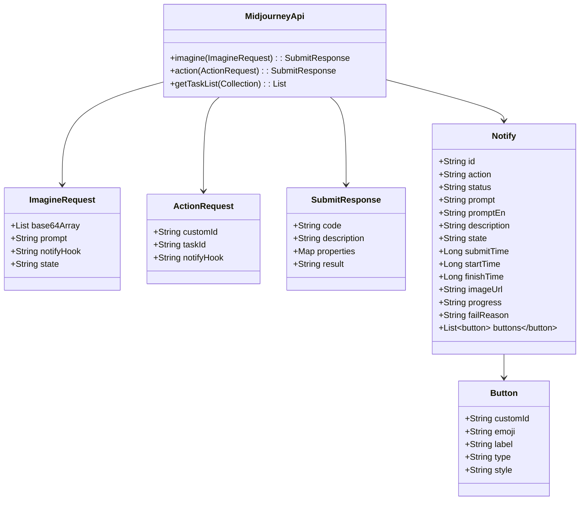

# API 模块文档

## 1. 概述

API 模块是系统的核心模块之一，主要负责与外部 AI 服务（如 Midjourney）进行交互，实现 AI 绘画、图像处理等功能。该模块通过封装第三方 API 调用，为系统提供统一的 AI 服务接口，支持图像生成、图像编辑、图像查询等操作。

### 1.1 功能特性

- **图像生成**：基于文本提示词生成图像
- **图像编辑**：支持图像放大、缩小、变体生成等操作
- **任务管理**：支持任务状态查询、任务结果获取
- **回调通知**：支持异步任务完成后的回调通知
- **多模型支持**：支持 Midjourney 和 Niji 等不同模型

### 1.2 核心组件

- **MidjourneyApi**：与 Midjourney 服务交互的核心类
- **SiliconFlowApiConstants**：SiliconFlow API 常量
- **WenDuoDuoPptApi**：文多多 PPT API
- **XingHuoChatModel**：星火聊天模型
- **XunFeiPptApi**：讯飞 PPT API
- **WebSearchResponse**：网页搜索响应

## 2. 架构设计

### 2.1 系统架构图

```
%% API 模块架构图
graph TD
    A[MidjourneyApi] --> B[SiliconFlowApiConstants]
    A --> C[WenDuoDuoPptApi]
    A --> D[XingHuoChatModel]
    A --> E[XunFeiPptApi]
    A --> F[WebSearchResponse]
    
    G[Midjourney服务] --> A
    H[SiliconFlow服务] --> B
    I[文多多服务] --> C
    J[星火服务] --> D
    K[讯飞服务] --> E
    L[搜索服务] --> F
    
    M[AI业务模块] --> A
    N[AI业务模块] --> C
    O[AI业务模块] --> D
```

### 2.2 组件关系图



## 3. API 接口说明

### 3.1 MidjourneyApi 类

#### 3.1.1 构造函数

```java
public MidjourneyApi(String baseUrl, String apiKey, String notifyUrl)
```

**参数说明：**
- `baseUrl`：Midjourney API 的基础 URL
- `apiKey`：API 访问密钥
- `notifyUrl`：任务完成后的回调通知地址

#### 3.1.2 核心方法

##### imagine(ImagineRequest request)

**功能：** 提交图像生成任务

**请求参数：**
```java
@Data
public static final class ImagineRequest {
    private List<String> base64Array;  // 垫图(参考图) base64 数组
    private String prompt;              // 提示词
    private String notifyHook;          // 通知地址
    private String state;               // 自定义参数
}
```

**返回值：**
```java
public record SubmitResponse(String code,
                             String description,
                             Map<String, Object> properties,
                             String result) {}
```

**状态码说明：**
- `1`：提交成功
- `21`：任务已存在
- `22`：任务排队中

##### action(ActionRequest request)

**功能：** 提交图像编辑任务（放大、缩小、变体等）

**请求参数：**
```java
@Data
public static final class ActionRequest {
    private String customId;   // 动作标识
    private String taskId;      // 任务ID
    private String notifyHook;  // 通知地址
}
```

**返回值：** 同 `imagine()` 方法

##### getTaskList(Collection<String> ids)

**功能：** 批量查询任务状态

**请求参数：**
- `ids`：任务编号数组

**返回值：**
```java
public record Notify(String id,
                     String action,
                     String status,
                     String prompt,
                     String promptEn,
                     String description,
                     String state,
                     Long submitTime,
                     Long startTime,
                     Long finishTime,
                     String imageUrl,
                     String progress,
                     String failReason,
                     List<Button> buttons) {}
```

### 3.2 请求参数构建

#### 3.2.1 ImagineRequest 构建

```java
public static ImagineRequest buildImagineRequest(
    List<String> base64Array,
    String prompt,
    String notifyHook,
    Integer width,
    Integer height,
    String version,
    String model) {
    
    String state = ImagineRequest.buildState(width, height, version, model);
    return new ImagineRequest(base64Array, prompt, notifyHook, state);
}
```

**参数说明：**
- `base64Array`：垫图的 base64 数组
- `prompt`：提示词
- `notifyHook`：回调通知地址
- `width`：图像宽度
- `height`：图像高度
- `version`：模型版本
- `model`：模型类型（Midjourney 或 Niji）

#### 3.2.2 ActionRequest 构建

```java
public static ActionRequest buildActionRequest(
    String taskId,
    String customId,
    String notifyHook) {
    
    return new ActionRequest(taskId, customId, notifyHook);
}
```

**参数说明：**
- `taskId`：任务ID
- `customId`：动作标识（如 U1、U2、V1、V2、V3、V4 等）
- `notifyHook`：回调通知地址

## 4. 数据流转

### 4.1 图像生成流程

```
%% 图像生成流程图
graph TD
    A[前端应用] -->|发起请求| B[API模块]
    B --> C[构建ImagineRequest]
    C --> D[调用MidjourneyApi.imagine()]
    D --> E[Midjourney服务]
    E --> F[任务处理]
    F --> G[任务完成]
    G --> H[回调通知]
    H --> I[更新任务状态]
    I --> J[返回结果给前端]
```

### 4.2 图像编辑流程

```
%% 图像编辑流程图
graph TD
    A[前端应用] -->|发起请求| B[API模块]
    B --> C[构建ActionRequest]
    C --> D[调用MidjourneyApi.action()]
    D --> E[Midjourney服务]
    E --> F[任务处理]
    F --> G[任务完成]
    G --> H[回调通知]
    H --> I[更新任务状态]
    I --> J[返回结果给前端]
```

## 5. 错误处理

### 5.1 异常处理机制

API 模块使用 WebClient 进行 HTTP 请求，通过以下机制处理异常：

1. **状态码检查**：非 2xx 状态码视为失败
2. **错误日志**：记录详细的请求和响应信息
3. **异常转换**：将 HTTP 错误转换为业务异常

### 5.2 常见错误码

| 错误码 | 描述 | 处理建议 |
|--------|------|----------|
| 1 | 提交成功 | 正常处理 |
| 21 | 任务已存在 | 检查任务是否重复提交 |
| 22 | 任务排队中 | 稍后重试或轮询查询 |
| 其他 | 失败 | 检查请求参数或联系技术支持 |

## 6. 配置说明

### 6.1 环境配置

在 `application.yml` 或 `application.properties` 中配置 API 模块的相关参数：

```yaml
# Midjourney API 配置
midjourney:
  base-url: https://api.midjourney.com
  api-key: your-api-key
  notify-url: https://your-server.com/api/mj/callback
  
# 其他 API 配置
siliconflow:
  api-key: your-siliconflow-api-key

xinghuo:
  api-key: your-xinghuo-api-key
  secret-key: your-xinghuo-secret-key
```

### 6.2 回调通知配置

API 模块支持异步任务完成后的回调通知，需要在配置中指定回调地址：

```java
@Configuration
public class AiConfig {
    
    @Value("${midjourney.notify-url}")
    private String notifyUrl;
    
    @Bean
    public MidjourneyApi midjourneyApi() {
        return new MidjourneyApi(
            "https://api.midjourney.com",
            "your-api-key",
            notifyUrl
        );
    }
}
```

## 7. 使用示例

### 7.1 图像生成示例

```java
@RestController
@RequestMapping("/api/ai/image")
@RequiredArgsConstructor
public class AiImageController {
    
    private final MidjourneyApi midjourneyApi;
    
    @PostMapping("/generate")
    public ResponseEntity<ApiResult<SubmitResponse>> generateImage(
            @RequestBody ImageGenerateRequest request) {
        
        // 构建请求参数
        ImagineRequest imagineRequest = new ImagineRequest(
            request.getBase64Array(),
            request.getPrompt(),
            request.getNotifyUrl(),
            ImagineRequest.buildState(
                request.getWidth(),
                request.getHeight(),
                request.getVersion(),
                request.getModel()
            )
        );
        
        // 提交任务
        SubmitResponse response = midjourneyApi.imagine(imagineRequest);
        
        return ResponseEntity.ok(ApiResult.success(response));
    }
}
```

### 7.2 图像编辑示例

```java
@RestController
@RequestMapping("/api/ai/image")
@RequiredArgsConstructor
public class AiImageController {
    
    private final MidjourneyApi midjourneyApi;
    
    @PostMapping("/edit")
    public ResponseEntity<ApiResult<SubmitResponse>> editImage(
            @RequestBody ImageEditRequest request) {
        
        // 构建请求参数
        ActionRequest actionRequest = new ActionRequest(
            request.getTaskId(),
            request.getCustomId(),
            request.getNotifyUrl()
        );
        
        // 提交编辑任务
        SubmitResponse response = midjourneyApi.action(actionRequest);
        
        return ResponseEntity.ok(ApiResult.success(response));
    }
}
```

### 7.3 任务状态查询示例

```java
@RestController
@RequestMapping("/api/ai/task")
@RequiredArgsConstructor
public class AiTaskController {
    
    private final MidjourneyApi midjourneyApi;
    
    @GetMapping("/status")
    public ResponseEntity<ApiResult<List<Notify>>> getTaskStatus(
            @RequestParam("ids") List<String> taskIds) {
        
        // 查询任务状态
        List<Notify> taskList = midjourneyApi.getTaskList(taskIds);
        
        return ResponseEntity.ok(ApiResult.success(taskList));
    }
}
```

## 8. 回调通知处理

API 模块支持异步任务完成后的回调通知，需要实现回调处理器：

```java
@RestController
@RequestMapping("/api/mj")
@RequiredArgsConstructor
public class MidjourneyCallbackController {
    
    private final AiTaskService aiTaskService;
    
    @PostMapping("/callback")
    public ResponseEntity<String> handleCallback(
            @RequestBody Notify notify) {
        
        // 处理回调通知
        aiTaskService.handleTaskCallback(notify);
        
        return ResponseEntity.ok("success");
    }
}
```

## 9. 扩展性设计

### 9.1 支持多模型

API 模块设计支持多种 AI 模型，通过 `ModelEnum` 枚举定义：

```java
@AllArgsConstructor
@Getter
public enum ModelEnum {
    MIDJOURNEY("midjourney", "midjourney"),
    NIJI("niji", "niji"),
    ;
    
    private final String model;
    private final String name;
}
```

### 9.2 支持多种任务类型

通过 `TaskActionEnum` 枚举定义支持的任务类型：

```java
@Getter
@AllArgsConstructor
public enum TaskActionEnum {
    IMAGINE,     // 生成图片
    UPSCALE,     // 放大
    VARIATION,   // 变体
    REROLL,      // 重新执行
    DESCRIBE,    // 图转文本
    BLEND        // 多图混合
}
```

### 9.3 支持多种任务状态

通过 `TaskStatusEnum` 枚举定义任务状态：

```java
@Getter
@AllArgsConstructor
public enum TaskStatusEnum {
    NOT_START(0),      // 未启动
    SUBMITTED(1),      // 已提交
    IN_PROGRESS(3),    // 执行中
    FAILURE(4),        // 失败
    SUCCESS(4);        // 成功
    
    private final int order;
}
```

## 10. 性能优化

### 10.1 连接池配置

API 模块使用 WebClient 作为 HTTP 客户端，可以配置连接池参数：

```java
@Bean
public WebClient webClient() {
    HttpClient httpClient = HttpClient.create()
        .option(ChannelOption.CONNECT_TIMEOUT_MILLIS, 5000)
        .responseTimeout(Duration.ofMillis(5000))
        .doOnConnected(conn -> conn
            .addHandlerLast(new ReadTimeoutHandler(5000, TimeUnit.MILLISECONDS))
            .addHandlerLast(new WriteTimeoutHandler(5000, TimeUnit.MILLISECONDS)));
    
    return WebClient.builder()
        .clientConnector(new ReactorClientHttpConnector(httpClient))
        .baseUrl(baseUrl)
        .defaultHeaders(httpHeaders -> {
            httpHeaders.setContentType(MediaType.APPLICATION_JSON);
            httpHeaders.setBearerAuth(apiKey);
        })
        .build();
}
```

### 10.2 缓存策略

对于频繁查询的任务状态，可以实现缓存机制：

```java
@Service
@RequiredArgsConstructor
public class TaskCacheService {
    
    private final CacheManager cacheManager;
    private final MidjourneyApi midjourneyApi;
    
    public Notify getTask(String taskId) {
        Cache cache = cacheManager.getCache("taskCache");
        Cache.ValueWrapper wrapper = cache.get(taskId);
        
        if (wrapper != null) {
            return (Notify) wrapper.get();
        }
        
        // 查询 API
        List<Notify> taskList = midjourneyApi.getTaskList(Lists.newArrayList(taskId));
        if (!taskList.isEmpty()) {
            Notify task = taskList.get(0);
            cache.put(taskId, task);
            return task;
        }
        
        return null;
    }
}
```

## 11. 安全考虑

### 11.1 API 密钥管理

- API 密钥应使用环境变量或配置中心管理
- 避免硬编码在代码中
- 定期轮换密钥

### 11.2 回调地址验证

- 验证回调地址的合法性
- 使用签名机制验证回调请求的真实性
- 限制回调请求的频率

### 11.3 数据加密

- 对敏感数据进行加密存储
- 使用 HTTPS 传输数据
- 对回调数据进行签名验证

## 12. 监控与日志

### 12.1 监控指标

- API 调用次数
- API 调用成功率
- API 响应时间
- 任务处理成功率
- 任务处理时间

### 12.2 日志记录

API 模块记录详细的日志信息：

```java
log.info("[midjourney-api] 调用成功！请求方式:[{}]，请求地址:[{}]，请求参数:[{}]，响应数据: [{}]",
    request.getMethod(), request.getURI(), reqParam, responseBody);
```

## 13. 测试指南

### 13.1 单元测试

```java
@ExtendWith(MockitoExtension.class)
class MidjourneyApiTest {
    
    @Mock
    private WebClient webClient;
    
    @InjectMocks
    private MidjourneyApi midjourneyApi;
    
    @Test
    void testImagine() {
        // 准备测试数据
        ImagineRequest request = new ImagineRequest(
            Lists.newArrayList("base64-data"),
            "a cat",
            "https://callback.url",
            "--ar 16:9 --v 5"
        );
        
        // 模拟 WebClient 响应
        when(webClient.post()
            .uri("/submit/imagine")
            .body(any(), eq(String.class))
            .retrieve()
            .bodyToMono(String.class))
            .thenReturn(Mono.just("{\"code\":\"1\",\"description\":\"提交成功\",\"result\":\"task-123\"}"));
        
        // 执行测试
        SubmitResponse response = midjourneyApi.imagine(request);
        
        // 断言结果
        assertEquals("1", response.code());
        assertEquals("task-123", response.result());
    }
}
```

### 13.2 集成测试

```java
@SpringBootTest
@AutoConfigureMockMvc
class MidjourneyApiIntegrationTest {
    
    @Autowired
    private MockMvc mockMvc;
    
    @Test
    void testGenerateImage() throws Exception {
        // 准备请求数据
        String requestJson = "{"
            + "\"base64Array\":[\"base64-data\"],"
            + "\"prompt\":\"a cat\","
            + "\"notifyHook\":\"https://callback.url\","
            + "\"state\":\"--ar 16:9 --v 5\""
            + "}";
        
        // 执行请求
        mockMvc.perform(post("/api/ai/image/generate")
            .contentType(MediaType.APPLICATION_JSON)
            .content(requestJson))
            .andExpect(status().isOk())
            .andExpect(jsonPath("$.code").value("1"));
    }
}
```

## 14. 部署与运维

### 14.1 部署配置

API 模块作为独立的微服务部署，需要配置：

- API 密钥
- 回调地址
- 连接池参数
- 超时时间
- 重试策略

### 14.2 运维监控

- 监控 API 调用成功率
- 监控任务处理延迟
- 监控回调通知失败率
- 设置告警规则

### 14.3 故障处理

- 任务失败重试机制
- 回调通知重试机制
- 降级策略（如 API 服务不可用时）
- 熔断机制（如 API 响应过慢时）

## 15. 参考文档

- [Midjourney API 文档](https://docs.midjourney.com/)
- [SiliconFlow API 文档](https://docs.siliconflow.com/)
- [星火大模型 API 文档](https://www.xfyun.cn/doc/)
- [讯飞大模型 API 文档](https://www.iflytek.com/)

---

**文档版本：** v1.0
**最后更新：** 2024-02-20
**维护者：** AI 团队