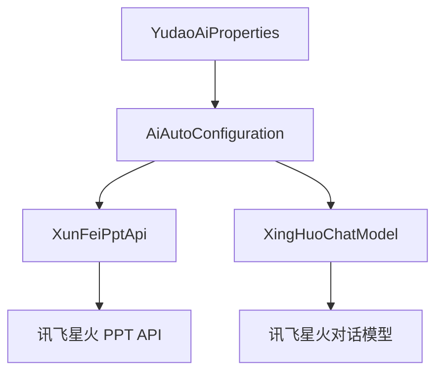

# api_3 模块文档

## 概述

`api_3` 模块是 Yudao AI 模块的核心组件之一，主要负责与讯飞星火大模型的交互。该模块提供了讯飞星火大模型的 API 封装，包括文本生成、PPT 生成等功能。

## 功能特性

- **文本生成**: 通过讯飞星火大模型实现文本生成、对话等功能
- **PPT 生成**: 提供讯飞智能 PPT 生成服务，支持通过文本或文件生成 PPT
- **模型管理**: 支持多种讯飞星火模型版本（X2、X2 Flash）
- **配置管理**: 通过配置文件灵活配置讯飞星火 API 密钥和参数

## 架构设计

### 核心组件



### 组件关系说明

1. **YudaoAiProperties**: 配置属性类，用于读取和管理讯飞星火相关的配置参数
2. **AiAutoConfiguration**: 自动配置类，负责创建和注册讯飞星火相关的 Bean
3. **XunFeiPptApi**: 讯飞智能 PPT 生成 API 客户端，封装了 PPT 生成的各种操作
4. **XingHuoChatModel**: 讯飞星火对话模型，实现了与讯飞星火大模型的交互

## API 说明

### XunFeiPptApi

讯飞智能 PPT 生成 API 客户端，提供 PPT 生成相关的功能。

#### 主要方法

- `getTemplatePage(String style, Integer pageSize)`: 获取 PPT 模板列表
- `createOutline(String query)`: 创建大纲（通过文本）
- `create(CreatePptRequest request)`: 直接创建 PPT（完整版）
- `createPptByOutline(CreatePptByOutlineRequest request)`: 通过大纲创建 PPT
- `checkProgress(String sid)`: 检查 PPT 生成进度

#### 请求参数说明

**CreatePptRequest**:
- `query`: 用户生成 PPT 要求（最多 8000 字）
- `file`: 上传文件（可选）
- `fileUrl`: 文件地址（可选）
- `fileName`: 文件名（带文件名后缀，可选）
- `templateId`: 模板 ID（可选）
- `businessId`: 业务 ID（非必传）
- `author`: PPT 作者名（可选）
- `isCardNote`: 是否生成 PPT 演讲备注（可选）
- `search`: 是否联网搜索（可选）
- `language`: 语种（可选）
- `isFigure`: 是否自动配图（可选）
- `aiImage`: AI 配图类型：normal、advanced（可选）

**CreatePptByOutlineRequest**:
- `query`: 用户生成 PPT 要求（最多 8000 字）
- `outlineSid`: 已生成大纲后，响应返回的请求大纲唯一 ID
- `outline`: 大纲内容
- `templateId`: 模板 ID（可选）
- `businessId`: 业务 ID（非必传）
- `author`: PPT 作者名（可选）
- `isCardNote`: 是否生成 PPT 演讲备注（可选）
- `search`: 是否联网搜索（可选）
- `language`: 语种（可选）
- `fileUrl`: 文件地址（可选）
- `fileName`: 文件名（带文件名后缀，可选）
- `isFigure`: 是否自动配图（可选）
- `aiImage`: AI 配图类型：normal、advanced（可选）

#### 响应数据结构

**TemplatePageResponse**:
- `flag`: 请求是否成功
- `code`: 响应码
- `desc`: 描述信息
- `count`: 总数
- `data`: 模板列表数据

**CreateResponse**:
- `flag`: 请求是否成功
- `code`: 响应码
- `desc`: 描述信息
- `count`: 总数
- `data`: 创建响应数据

**ProgressResponse**:
- `code`: 响应码
- `desc`: 描述信息
- `data`: 进度响应数据

**ProgressResponseData**:
- `process`: 进度值
- `pptId`: PPT ID
- `pptUrl`: PPT 下载地址
- `pptStatus`: PPT 生成状态
- `aiImageStatus`: AI 图像生成状态
- `cardNoteStatus`: 卡片备注生成状态
- `errMsg`: 错误信息
- `totalPages`: 总页数
- `donePages`: 已完成页数

### XingHuoChatModel

讯飞星火对话模型，实现了与讯飞星火大模型的交互。

#### 主要特性

- 支持 X2 和 X2 Flash 两种模型版本
- 兼容 OpenAI 接口，便于复用
- 支持流式和非流式对话
- 提供灵活的配置选项

#### 模型版本

- **X2**: 标准版模型
- **X2 Flash**: 快速版模型

#### 配置参数

- `apiKey`: 讯飞星火 API 密钥
- `model`: 模型版本（默认 X2 Flash）
- `temperature`: 温度参数，控制生成文本的随机性
- `maxTokens`: 最大 token 数
- `topP`: Top-p 采样参数

## 配置说明

在 `application.yml` 或 `application.properties` 中配置讯飞星火相关参数：

```yaml
# 讯飞星火配置
yudao:
  ai:
    xinghuo:
      enable: true
      api-key: your_api_key
      model: x2-flash  # 可选：x2 或 x2-flash
      temperature: 0.7
      max-tokens: 2048
      top-p: 0.9
```

## 使用示例

### 1. 创建 PPT

```java
// 通过文本创建 PPT
CreatePptRequest request = CreatePptRequest.builder()
    .query("人工智能发展历史")
    .build();
CreateResponse response = xunFeiPptApi.create(request);

// 检查进度
ProgressResponse progress = xunFeiPptApi.checkProgress(response.data().sid());
while (!progress.data().isAllDone()) {
    Thread.sleep(2000);
    progress = xunFeiPptApi.checkProgress(response.data().sid());
}
```

### 2. 文本对话

```java
// 创建对话模型
XingHuoChatModel chatModel = XingHuoChatModel.builder()
    .apiKey("your_api_key")
    .options(DeepSeekChatOptions.builder()
        .model(XingHuoChatModel.MODEL_X2_FLASH)
        .temperature(0.7)
        .build())
    .build();

// 发起对话
Prompt prompt = Prompt.builder()
    .messages(List.of(new UserMessage("你好，请介绍一下人工智能")))
    .build();
ChatResponse response = chatModel.call(prompt);
```

## 依赖关系

- **YudaoAiProperties**: 从 `yudao-module-ai` 模块引入，用于配置管理
- **WebClient**: Spring WebFlux 提供的响应式 HTTP 客户端
- **Hutool**: 工具类库，用于加密、工具方法等

## 性能优化

- 使用响应式编程模型提高并发性能
- 支持流式响应，适合大文本生成场景
- 提供进度检查机制，避免长时间等待

## 安全注意事项

- API 密钥应妥善保管，避免泄露
- 建议使用 HTTPS 传输
- 对敏感操作进行权限控制

## 错误处理

- API 调用失败时会抛出 `IllegalStateException`
- 建议捕获异常并进行相应的错误处理
- 可通过 `ProgressResponseData.isFailed()` 判断是否生成失败

## 扩展性

- 支持多种模型版本切换
- 可扩展新的 PPT 生成方式
- 支持自定义配置参数

## 相关模块

- [yudao-module-ai](yudao-module-ai.md): AI 模块的主模块，包含 AI 功能的核心实现
- [ai_2](ai_2.md): AI 模块的另一个核心组件，可能包含其他 AI 模型的实现

## 总结

`api_3` 模块提供了讯飞星火大模型的完整封装，包括文本生成和 PPT 生成功能。通过灵活的配置和 API 设计，可以方便地集成到各种应用场景中。