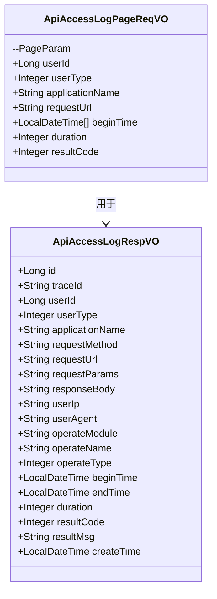

# API 访问日志模块

## 概述
API 访问日志模块负责记录和管理系统中的 API 访问日志。它捕获每个 API 请求的详细信息，包括用户上下文、请求参数、响应数据、执行时长和结果。此模块使得跨系统的 API 使用情况能够进行审计、监控和调试。

## 架构
该模块遵循标准的分层架构，包括控制器、服务和数据访问层。提供的核心组件代表了控制器中用于处理与 API 访问日志相关的 API 请求和响应的值对象（VO）层。

## 组件

### ApiAccessLogRespVO
此类定义了 API 访问日志条目的响应结构。它包含表示单个 API 访问日志记录所需的所有字段，包括：
- **标识**：日志 ID（`id`）和追踪 ID（`traceId`）用于分布式追踪
- **用户上下文**：用户 ID（`userId`）、用户类型（`userType`）、IP 地址（`userIp`）和用户代理（`userAgent`）
- **请求详情**：应用名称（`applicationName`）、HTTP 方法（`requestMethod`）、URL（`requestUrl`）和参数（`requestParams`）
- **响应详情**：响应体（`responseBody`）
- **操作信息**：模块（`operateModule`）、名称（`operateName`）和类型（`operateType`）
- **时长**：开始时间（`beginTime`）、结束时间（`endTime`）和持续时间（`duration`）
- **结果**：结果码（`resultCode`）、消息（`resultMsg`）和创建时间戳（`createTime`）

此 VO 用于向客户端返回 API 访问日志数据，例如在列表或详细视图中。

### ApiAccessLogPageReqVO
此类继承自基础分页参数（`PageParam`），并定义了用于查询 API 访问日志条目的请求结构，具有过滤功能。它包括：
- **分页**：从 `PageParam` 继承页码和页大小
- **过滤器**：
  - 用户 ID（`userId`）和用户类型（`userType`）
  - 应用名称（`applicationName`）
  - 请求 URL（`requestUrl`）用于模糊匹配
  - 时间范围（`beginTime` 数组）用于过滤特定时期内的日志
  - 最小执行时长（`duration`）用于识别慢速请求
  - 结果码（`resultCode`）用于按成功/失败过滤

此 VO 用于客户端请求带有可选过滤条件的 API 访问日志分页列表时。

## 数据流
1. **请求处理**：
   - 客户端向 API 访问日志端点发送 GET 请求，携带查询参数（例如，分页、过滤条件）
   - 控制器将这些参数映射到一个 `ApiAccessLogPageReqVO` 对象
   
2. **处理**：
   - 控制器将 `ApiAccessLogPageReqVO` 委托给服务层
   - 服务层根据提供的过滤条件构建数据库查询
   - 仓储层执行查询并返回日志实体
   - 服务层将实体转换为 `ApiAccessLogRespVO` 对象
   
3. **响应**：
   - 控制器返回一个包含 `ApiAccessLogRespVO` 对象列表的分页响应
   - 每个 `ApiAccessLogRespVO` 表示一个具有所有相关详细信息的单个 API 访问日志条目

## 集成
此模块与以下内容集成：
- **日志服务**：从数据库持久化和检索 API 访问日志条目
- **监控模块**：提供数据用于 API 使用分析和性能监控
- **安全模块**：支持安全调查的审计跟踪
- **管理界面**：为系统管理控制台中的 API 访问日志视图提供动力

该模块本身不包含业务逻辑，但为控制器和服务层之间的 API 访问日志操作提供了数据结构契约。