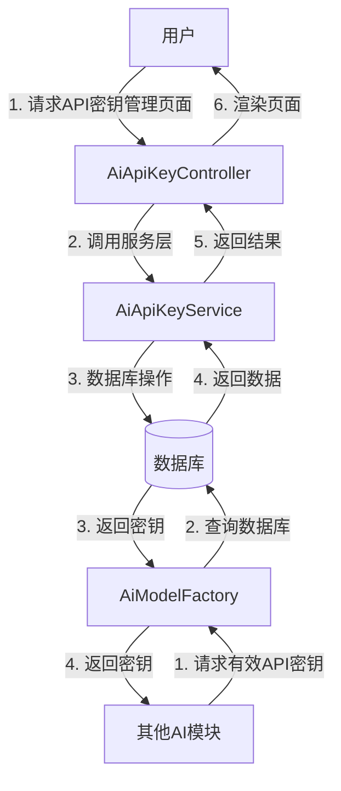
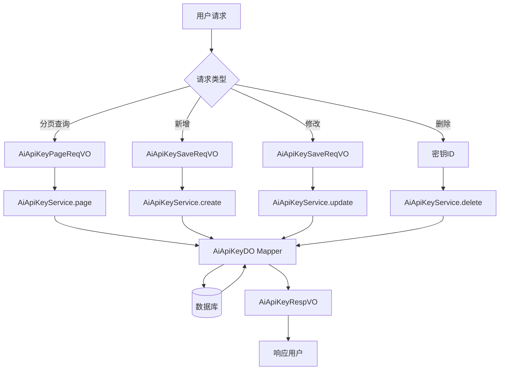

# AI API密钥管理模块 (apikey) 文档

## 模块概述

AI API密钥管理模块（apikey）是Yudao AI模块的核心组件之一，主要负责管理和维护与各大AI平台的API密钥。该模块提供了统一的密钥管理接口，支持多平台密钥的存储、查询、启用/禁用等操作，为AI模块的其他功能（如聊天、图像生成等）提供安全的API访问能力。

### 主要功能

1. **密钥管理**：支持新增、修改、删除、查询API密钥
2. **状态管理**：支持启用/禁用密钥
3. **平台支持**：支持多种AI平台（如OpenAI、文心一言等）
4. **自定义API地址**：支持配置自定义API访问地址
5. **分页查询**：提供灵活的分页查询功能

### 核心业务流程

1. 用户在管理后台配置AI平台的API密钥
2. 系统验证密钥的有效性
3. 其他AI功能模块通过该模块获取有效的API密钥进行调用
4. 系统自动管理密钥的启用/禁用状态

## 架构设计

### 模块结构

```
apikey模块
├── controller (控制层)
│   └── admin
│       └── model
│           └── vo
│               ├── apikey
│               │   ├── AiApiKeyPageReqVO.java (分页请求VO)
│               │   ├── AiApiKeySaveReqVO.java (新增/修改请求VO)
│               │   └── AiApiKeyRespVO.java (响应VO)
├── dal (数据访问层)
│   ├── dataobject
│   │   └── model
│   │       └── AiApiKeyDO.java (数据对象)
├── service (服务层)
│   ├── model
│   │   └── AiApiKeyService.java (服务接口)
│   └── model
│       └── impl
│           └── AiApiKeyServiceImpl.java (服务实现)
└── framework (框架层)
    └── ai
        └── core
            └── model
                └── AiModelFactory.java (模型工厂)
```

### 核心类说明

#### 1. 请求响应VO类

- **AiApiKeyPageReqVO**：分页查询请求参数
  - `name`：密钥名称（模糊匹配）
  - `platform`：平台名称（精确匹配）
  - `status`：状态（精确匹配）

- **AiApiKeySaveReqVO**：新增/修改请求参数
  - `id`：编号（修改时必填）
  - `name`：名称（必填）
  - `apiKey`：密钥（必填）
  - `platform`：平台（必填）
  - `url`：自定义API地址（可选）
  - `status`：状态（必填）

- **AiApiKeyRespVO**：响应参数
  - 包含与AiApiKeySaveReqVO相同的字段，用于返回查询结果

#### 2. 数据对象类

- **AiApiKeyDO**：数据库实体类
  - 对应数据库表`ai_api_key`
  - 包含所有字段的数据库映射

#### 3. 服务接口和实现

- **AiApiKeyService**：服务接口
  - 定义了密钥管理的核心业务方法

- **AiApiKeyServiceImpl**：服务实现
  - 实现了密钥管理的业务逻辑
  - 集成了数据访问层

### 数据库设计

```sql
CREATE TABLE `ai_api_key` (
  `id` bigint NOT NULL AUTO_INCREMENT COMMENT '编号',
  `name` varchar(255) NOT NULL COMMENT '名称',
  `api_key` varchar(255) NOT NULL COMMENT '密钥',
  `platform` varchar(64) NOT NULL COMMENT '平台',
  `url` varchar(255) DEFAULT NULL COMMENT '自定义 API 地址',
  `status` tinyint NOT NULL COMMENT '状态',
  `create_time` datetime NOT NULL COMMENT '创建时间',
  `update_time` datetime NOT NULL COMMENT '更新时间',
  PRIMARY KEY (`id`) USING BTREE,
  KEY `idx_platform_status` (`platform`,`status`) USING BTREE
) ENGINE=InnoDB DEFAULT CHARSET=utf8mb4 COLLATE=utf8mb4_0900_ai_ci COMMENT='AI API 密钥';
```

## API接口说明

### 1. 分页查询API密钥

**接口地址**：`GET /admin-api/ai/model/api-key/page`

**请求参数**：
```json
{
  "name": "文心一言",
  "platform": "baidu",
  "status": 1,
  "pageNo": 1,
  "pageSize": 10
}
```

**响应数据**：
```json
{
  "code": 0,
  "data": {
    "list": [
      {
        "id": 1,
        "name": "文心一言",
        "apiKey": "sk-xxx",
        "platform": "baidu",
        "url": "https://aip.baidubce.com",
        "status": 1
      }
    ],
    "total": 1
  }
}
```

### 2. 新增API密钥

**接口地址**：`POST /admin-api/ai/model/api-key`

**请求参数**：
```json
{
  "name": "文心一言",
  "apiKey": "sk-xxx",
  "platform": "baidu",
  "url": "https://aip.baidubce.com",
  "status": 1
}
```

**响应数据**：
```json
{
  "code": 0,
  "data": {
    "id": 1
  }
}
```

### 3. 修改API密钥

**接口地址**：`PUT /admin-api/ai/model/api-key`

**请求参数**：
```json
{
  "id": 1,
  "name": "文心一言",
  "apiKey": "sk-xxx",
  "platform": "baidu",
  "url": "https://aip.baidubce.com",
  "status": 1
}
```

**响应数据**：
```json
{
  "code": 0,
  "message": "修改成功"
}
```

### 4. 删除API密钥

**接口地址**：`DELETE /admin-api/ai/model/api-key/{id}`

**请求参数**：
- `id`：密钥编号

**响应数据**：
```json
{
  "code": 0,
  "message": "删除成功"
}
```

### 5. 获取API密钥详情

**接口地址**：`GET /admin-api/ai/model/api-key/{id}`

**请求参数**：
- `id`：密钥编号

**响应数据**：
```json
{
  "code": 0,
  "data": {
    "id": 1,
    "name": "文心一言",
    "apiKey": "sk-xxx",
    "platform": "baidu",
    "url": "https://aip.baidubce.com",
    "status": 1
  }
}
```

## 组件交互图



## 数据流图



## 与其他模块的关系

### 1. AI模块内部关系

- **与AI模型管理模块**：密钥管理为模型管理提供API访问能力
- **与AI聊天模块**：为聊天功能提供API密钥支持
- **与AI图像生成模块**：为图像生成功能提供API密钥支持

### 2. 外部系统关系

- **AI平台API**：通过配置的密钥与各大AI平台进行交互
- **用户管理系统**：继承用户权限体系，确保密钥管理的安全性

## 安全考虑

1. **密钥存储**：密钥在数据库中以加密形式存储
2. **权限控制**：仅授权用户可管理API密钥
3. **状态管理**：支持快速启用/禁用密钥
4. **审计日志**：记录密钥的创建、修改、删除操作

## 部署和运维

### 环境要求

- Java 17+
- MySQL 8.0+
- Redis（可选，用于缓存）

### 配置项

```yaml
# application.yml 配置示例
yudao:
  ai:
    api-key:
      # 密钥加密密钥（生产环境请使用更安全的密钥管理方式）
      encrypt-key: "your-encrypt-key"
```

### 监控指标

- 密钥使用次数统计
- 密钥有效性检查
- API调用成功率

## 常见问题

### 1. 如何添加新的AI平台支持？

1. 在`AiApiKeySaveReqVO`中添加新的平台选项
2. 更新前端下拉框选项
3. 确保新平台的API调用方式与现有平台一致

### 2. 密钥泄露了怎么办？

1. 立即在系统中禁用该密钥
2. 生成新的密钥并替换
3. 检查相关的API调用记录
4. 审查系统的访问日志

### 3. 如何批量导入密钥？

可以通过数据库直接导入，或提供CSV导入功能（需要额外开发）

## 总结

AI API密钥管理模块为Yudao AI平台提供了安全、灵活的API密钥管理能力。通过统一的接口和清晰的架构设计，确保了AI功能的稳定运行和安全访问。模块设计遵循了Yudao框架的最佳实践，具有良好的可扩展性和维护性。