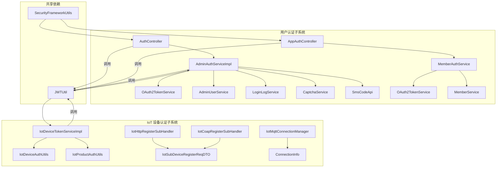
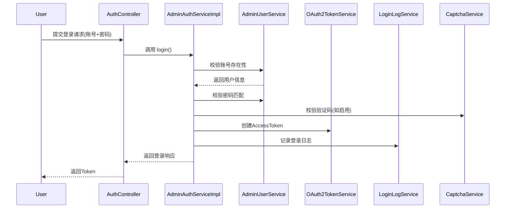
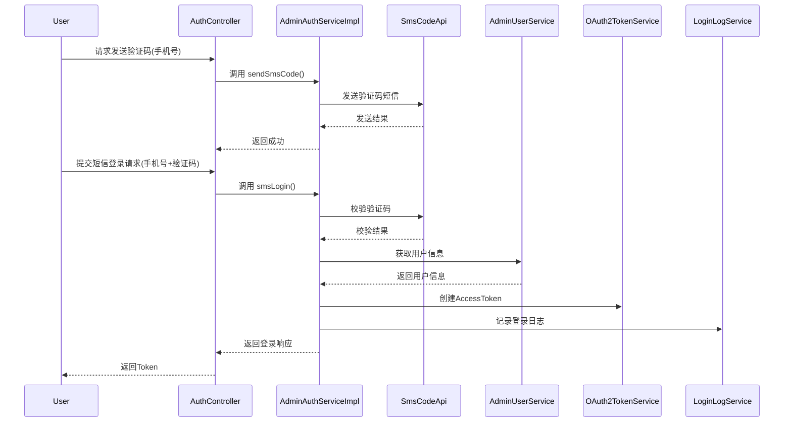
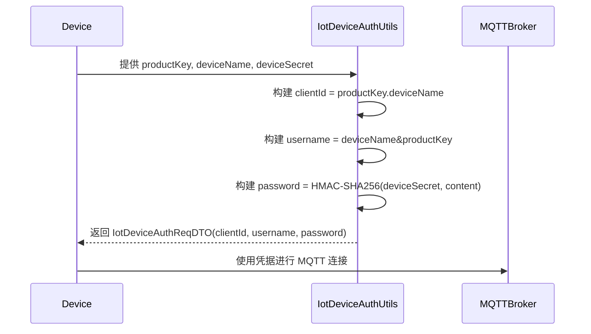
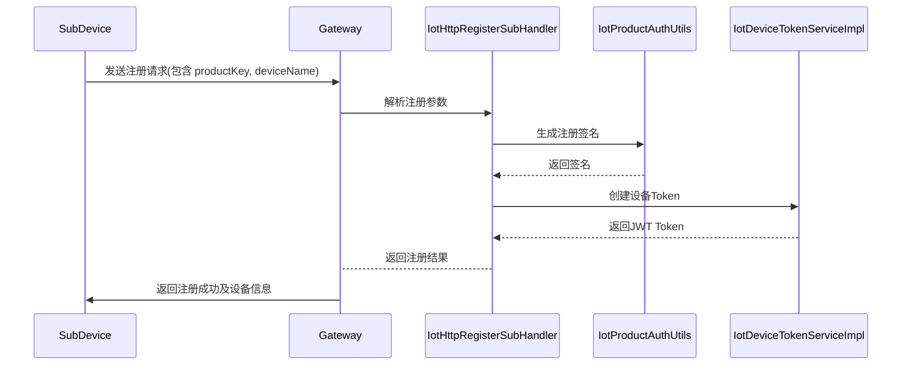
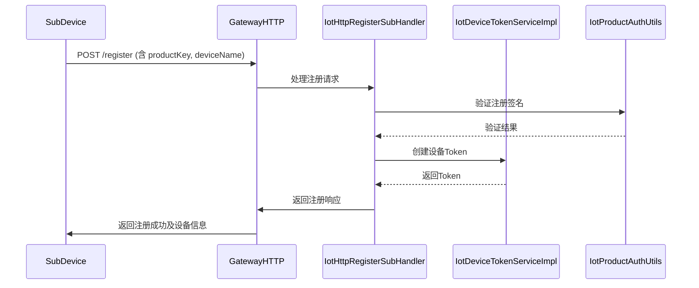

# 认证模块 (Auth Module) 文档

## 1. 模块概述

认证模块是系统的核心安全组件，负责处理所有身份验证和授权相关的功能。该模块分为两个主要部分：

- **用户认证系统**：为管理后台和用户提供基于账号密码、短信验证码、社交登录等多种认证方式，支持 JWT 令牌管理、刷新、登出等功能。
- **IoT 设备认证系统**：专为物联网设备设计，支持设备动态注册、子设备注册、设备身份验证、Token 生成与验证等机制，确保 IoT 设备接入的安全性。

认证模块与系统模块（system）、成员模块（member）、IoT 模块（iot）紧密集成，为整个平台提供统一的安全认证保障。

## 2. 架构设计

### 2.1 整体架构

```
┌─────────────────────────────────────────────────────────────────┐
│                      认证模块 (Auth Module)                     │
├─────────────────────────────────────────────────────────────────┤
│  ┌─────────────┐    ┌─────────────┐                            │
│  │ 用户认证    │    │  IoT 设备认证 │                            │
│  │ 子系统      │    │  子系统      │                            │
│  └──────┬──────┘    └──────┬──────┘                            │
│         │                   │                                    │
│  ┌──────▼──────┐    ┌──────▼──────┐                            │
│  │ 认证控制器  │    │ 设备注册处理 │                            │
│  │ (AuthCtrl)  │    │ (HTTP/COAP) │                            │
│  └──────┬──────┘    └──────┬──────┘                            │
│         │                   │                                    │
│  ┌──────▼──────┐    ┌──────▼──────┐                            │
│  │ 认证服务    │    │ 设备认证工具 │                            │
│  │ (AuthSvc)   │    │ (AuthUtils)  │                            │
│  └──────┬──────┘    └──────┬──────┘                            │
│         │                   │                                    │
│  ┌──────▼──────┐    ┌──────▼──────┐                            │
│  │ Token 管理  │    │ 设备 Token  │                            │
│  │ (JWT)       │    │ 服务        │                            │
│  └────────────┘    └────────────┘                            │
└─────────────────────────────────────────────────────────────────┘
```

### 2.2 组件关系图



## 3. 用户认证子系统

用户认证子系统负责管理后台和移动端用户的身份验证，提供多种登录方式和安全保障机制。

### 3.1 核心组件

| 组件 | 模块 | 描述 |
|------|------|------|
| `AuthController` | system | 管理后台认证入口，提供登录、登出、刷新令牌、注册等接口 |
| `AppAuthController` | member | 移动端认证入口，提供手机登录、短信验证码、社交登录等接口 |
| `AdminAuthServiceImpl` | system | 管理后台认证服务实现，处理用户认证逻辑 |
| `MemberAuthService` | member | 移动端认证服务实现，处理会员认证逻辑 |
| `OAuth2TokenService` | system | OAuth2 令牌服务，负责 JWT 令牌的创建、验证、刷新和删除 |
| `SecurityFrameworkUtils` | common | 安全框架工具类，从请求中提取认证信息 |

### 3.2 认证流程

#### 3.2.1 账号密码登录流程



#### 3.2.2 短信验证码登录流程



### 3.3 认证接口

#### 3.3.1 管理后台认证接口 (`/system/auth`)

| 请求路径 | 方法 | 描述 |
|----------|------|------|
| `/system/auth/login` | POST | 账号密码登录 |
| `/system/auth/logout` | POST | 登出系统 |
| `/system/auth/refresh-token` | POST | 刷新令牌 |
| `/system/auth/get-permission-info` | GET | 获取登录用户权限信息 |
| `/system/auth/register` | POST | 注册用户 |
| `/system/auth/sms-login` | POST | 短信验证码登录 |
| `/system/auth/send-sms-code` | POST | 发送登录短信验证码 |
| `/system/auth/reset-password` | POST | 重置密码 |
| `/system/auth/social-auth-redirect` | GET | 社交授权跳转 |
| `/system/auth/social-login` | POST | 社交快捷登录 |

#### 3.3.2 移动端认证接口 (`/member/auth`)

| 请求路径 | 方法 | 描述 |
|----------|------|------|
| `/member/auth/login` | POST | 手机+密码登录 |
| `/member/auth/logout` | POST | 登出系统 |
| `/member/auth/refresh-token` | POST | 刷新令牌 |
| `/member/auth/sms-login` | POST | 手机+验证码登录 |
| `/member/auth/send-sms-code` | POST | 发送短信验证码 |
| `/member/auth/validate-sms-code` | POST | 校验手机验证码 |
| `/member/auth/social-auth-redirect` | GET | 社交授权跳转 |
| `/member/auth/social-login` | POST | 社交快捷登录 |
| `/member/auth/weixin-mini-app-login` | POST | 微信小程序一键登录 |
| `/member/auth/create-weixin-jsapi-signature` | POST | 创建微信JS签名 |

### 3.4 安全特性

- **验证码保护**：登录和注册时可配置图形验证码，防止暴力破解
- **登录日志记录**：记录所有登录尝试，包括成功和失败
- **令牌刷新机制**：支持 refresh token 滚动刷新，提高安全性
- **社交账号绑定**：支持微信、QQ等第三方账号绑定登录
- **多用户类型支持**：区分管理员（ADMIN）和会员（MEMBER）用户类型

## 4. IoT 设备认证子系统

IoT 设备认证子系统专为物联网设备接入设计，支持设备动态注册、子设备注册、设备身份验证等机制，确保设备接入的安全性。

### 4.1 核心组件

| 组件 | 模块 | 描述 |
|------|------|------|
| `IotSubDeviceRegisterReqDTO` | iot-core | 子设备动态注册请求 DTO |
| `IotDeviceAuthUtils` | iot-core | 设备身份验证工具类，生成设备认证凭据 |
| `IotProductAuthUtils` | iot-core | 产品级动态注册签名生成与验证工具 |
| `IotDeviceTokenServiceImpl` | iot-gateway | 设备 Token 服务，生成和验证 JWT 设备令牌 |
| `IotHttpRegisterSubHandler` | iot-gateway | HTTP 协议子设备注册处理器 |
| `IotCoapRegisterSubHandler` | iot-gateway | COAP 协议子设备注册处理器 |
| `IotMqttConnectionManager` | iot-gateway | MQTT 连接管理器，维护设备连接信息 |

### 4.2 设备认证机制

#### 4.2.1 设备身份验证（ProductKey + DeviceName + DeviceSecret）

设备接入时通过 ProductKey、DeviceName 和 DeviceSecret 进行身份验证，生成认证凭据：



**认证凭据生成逻辑：**

- `clientId = productKey.deviceName`
- `username = deviceName&productKey`
- `password = HMAC-SHA256(deviceSecret, "clientId" + clientId + "deviceName" + deviceName + "deviceSecret" + deviceSecret + "productKey" + productKey)`

#### 4.2.2 子设备动态注册

子设备无需预先烧录 deviceSecret，通过网关父设备的产品密钥进行动态注册：



**子设备注册请求 DTO：**

```java
@Data
public class IotSubDeviceRegisterReqDTO {
    /** 子设备 ProductKey */
    @NotEmpty(message = "产品标识不能为空")
    private String productKey;

    /** 子设备 DeviceName */
    @NotEmpty(message = "设备名称不能为空")
    private String deviceName;
}
```

#### 4.2.3 设备 Token 管理

设备接入后生成 JWT Token，用于后续通信的身份验证：

```java
@Service
@Slf4j
public class IotDeviceTokenServiceImpl implements IotDeviceTokenService {

    @Override
    public String createToken(String productKey, String deviceName) {
        // 构建 JWT payload
        Map<String, Object> payload = new HashMap<>();
        payload.put("productKey", productKey);
        payload.put("deviceName", deviceName);
        LocalDateTime expireTime = LocalDateTimeUtils.addTime(gatewayProperties.getToken().getExpiration());
        payload.put("exp", LocalDateTimeUtils.toEpochSecond(expireTime));

        // 生成 JWT Token
        return JWTUtil.createToken(payload, gatewayProperties.getToken().getSecret().getBytes());
    }

    @Override
    public IotDeviceIdentity verifyToken(String token) {
        // 校验 JWT Token
        boolean verify = JWTUtil.verify(token, gatewayProperties.getToken().getSecret().getBytes());
        if (!verify) {
            throw exception(DEVICE_TOKEN_EXPIRED);
        }

        // 解析 Token
        JWT jwt = JWTUtil.parseToken(token);
        JSONObject payload = jwt.getPayloads();
        Long exp = payload.getLong("exp");
        if (exp == null || exp < System.currentTimeMillis() / 1000) {
            throw exception(DEVICE_TOKEN_EXPIRED);
        }
        String productKey = payload.getStr("productKey");
        String deviceName = payload.getStr("deviceName");
        return new IotDeviceIdentity(productKey, deviceName);
    }
}
```

### 4.3 消息方法枚举

系统支持多种设备消息方法，通过 `IotDeviceMessageMethodEnum` 枚举定义：

```java
@Getter
@AllArgsConstructor
public enum IotDeviceMessageMethodEnum implements ArrayValuable<String> {
    STATE_UPDATE("thing.state.update", "设备状态更新", true),      // 设备状态更新
    TOPO_ADD("thing.topo.add", "添加拓扑关系", true),              // 拓扑添加
    TOPO_DELETE("thing.topo.delete", "删除拓扑关系", true),        // 拓扑删除
    TOPO_GET("thing.topo.get", "获取拓扑关系", true),              // 拓扑查询
    DEVICE_REGISTER("thing.auth.register", "设备动态注册", true),  // 设备注册
    SUB_DEVICE_REGISTER("thing.auth.register.sub", "子设备动态注册", true), // 子设备注册
    PROPERTY_POST("thing.property.post", "属性上报", true),        // 属性上报
    PROPERTY_SET("thing.property.set", "属性设置", false),         // 属性设置
    EVENT_POST("thing.event.post", "事件上报", true),              // 事件上报
    SERVICE_INVOKE("thing.service.invoke", "服务调用", false),     // 服务调用
    CONFIG_PUSH("thing.config.push", "配置推送", false),           // 配置推送
    OTA_UPGRADE("thing.ota.upgrade", "OTA 固件信息推送", false),   // OTA升级
    OTA_PROGRESS("thing.ota.progress", "OTA 升级进度上报", true),  // OTA进度
}
```

### 4.4 设备认证工具类

#### 4.4.1 `IotDeviceAuthUtils` - 设备身份验证工具

提供设备认证凭据的生成和解析功能：

- `getAuthInfo(productKey, deviceName, deviceSecret)`: 生成设备认证请求 DTO
- `buildClientId(productKey, deviceName)`: 构建客户端 ID
- `buildUsername(productKey, deviceName)`: 构建用户名
- `buildPassword(deviceSecret, content)`: 构建密码（HMAC-SHA256 签名）
- `parseUsername(username)`: 从用户名解析设备身份

#### 4.4.2 `IotProductAuthUtils` - 产品级动态注册签名工具

提供设备动态注册签名的生成和验证功能：

- `buildSign(productKey, deviceName, productSecret)`: 生成注册签名
- `verifySign(productKey, deviceName, productSecret, sign)`: 验证注册签名
- `buildContent(productKey, deviceName)`: 构建签名内容

### 4.5 设备注册流程

#### 4.5.1 子设备注册（HTTP 协议）



#### 4.5.2 子设备注册（COAP 协议）

与 HTTP 协议类似，使用 `IotCoapRegisterSubHandler` 处理 COAP 协议的子设备注册请求。

## 5. 数据模型

### 5.1 核心 DTO

#### `IotSubDeviceRegisterReqDTO`

子设备动态注册请求对象，包含子设备的基本信息：

```java
@Data
public class IotSubDeviceRegisterReqDTO {
    /** 子设备 ProductKey */
    @NotEmpty(message = "产品标识不能为空")
    private String productKey;

    /** 子设备 DeviceName */
    @NotEmpty(message = "设备名称不能为空")
    private String deviceName;
}
```

#### `IotDeviceAuthReqDTO`

设备认证请求对象，包含 MQTT 连接所需的认证凭据：

```java
@Data
public class IotDeviceAuthReqDTO {
    private String clientId;
    private String username;
    private String password;
}
```

#### `IotDeviceIdentity`

设备身份对象，包含设备的产品标识和设备名称：

```java
@Data
public class IotDeviceIdentity {
    private String productKey;
    private String deviceName;
}
```

### 5.2 连接信息

#### `ConnectionInfo` (MQTT/TCP)

设备连接信息，用于维护设备连接状态：

```java
@Data
public static class ConnectionInfo {
    /** 设备 ID */
    private Long deviceId;
    /** 产品 Key */
    private String productKey;
    /** 设备名称 */
    private String deviceName;
    /** 连接地址 */
    private String remoteAddress;
}
```

## 6. 依赖关系

认证模块依赖于以下核心组件：

| 依赖模块 | 依赖组件 | 用途 |
|----------|----------|------|
| `system` | `OAuth2TokenService` | 用户令牌管理 |
| `system` | `AdminUserService` | 用户信息查询 |
| `member` | `MemberService` | 会员信息查询 |
| `common` | `JWTUtil` | JWT 令牌生成与验证 |
| `common` | `SecurityFrameworkUtils` | 安全上下文获取 |
| `common` | `CaptchaService` | 验证码校验 |
| `common` | `SmsCodeApi` | 短信验证码发送 |
| `iot-core` | `IotDeviceMessageMethodEnum` | 消息方法定义 |
| `iot-gateway` | `IotGatewayProperties` | 网关配置 |

## 7. 与其他模块的集成

### 7.1 与系统模块集成

- 用户认证模块与系统模块的 `AdminUserService`、`LoginLogService`、`PermissionService` 集成，实现用户管理、日志记录、权限校验等功能。
- 通过 `OAuth2TokenService` 统一管理用户访问令牌。

### 7.2 与成员模块集成

- 移动端认证与 `MemberService` 集成，支持会员用户的认证和权限管理。
- 提供会员专属的认证接口，如手机登录、微信登录等。

### 7.3 与 IoT 模块集成

- IoT 设备认证模块与 `IotDeviceTokenService` 集成，为设备提供独立的认证机制。
- 通过 `IotDeviceAuthUtils` 和 `IotProductAuthUtils` 实现设备身份验证和动态注册。
- 设备 Token 与用户 Token 分开管理，确保设备接入安全。

### 7.4 与消息模块集成

- 设备消息通过 `IotDeviceMessageUtils` 进行消息标识提取和匹配，支持设备消息的认证和路由。
- 设备连接信息通过 `ConnectionManager` 维护，支持 MQTT、TCP、WebSocket 等多种协议的设备连接管理。

## 8. 配置说明

### 8.1 用户认证配置

```yaml
yudao:
  security:
    token:
      header: Authorization
      parameter: token
      expiration: 2592000  # 令牌过期时间（秒）
    captcha:
      enable: true       # 是否启用验证码
```

### 8.2 IoT 设备认证配置

```yaml
yudao:
  iot:
    gateway:
      token:
        secret: your-secret-key  # JWT 签名密钥
        expiration: 86400        # 设备令牌过期时间（秒）
```

## 9. 常见问题

### 9.1 设备认证失败怎么办？

1. 检查 ProductKey、DeviceName、DeviceSecret 是否正确
2. 确认设备是否已在平台注册
3. 检查网络连接是否正常
4. 查看系统日志中的认证错误信息

### 9.2 如何启用短信验证码登录？

1. 配置短信通道（SmsChannel）
2. 在 `AuthController` 中启用短信登录接口
3. 前端调用 `/system/auth/send-sms-code` 发送验证码
4. 前端调用 `/system/auth/sms-login` 进行短信登录

### 9.3 如何配置设备动态注册？

1. 确保产品已启用动态注册功能
2. 配置 `IotProductAuthUtils` 中的产品密钥
3. 前端通过 HTTP/COAP 协议发送子设备注册请求
4. 系统验证签名后创建设备 Token 并返回

## 10. 参考文档

- [阿里云 - 动态注册子设备](https://help.aliyun.com/zh/iot/user-guide/register-devices)
- [阿里云 - 设备属性、事件和服务](https://help.aliyun.com/zh/iot/user-guide/device-properties-events-and-services)
- [阿里云 - OTA 固件升级](https://help.aliyun.com/zh/iot/user-guide/perform-ota-updates)
- [系统模块认证文档](system.md)
- [IoT 模块文档](iot.md)
</file>