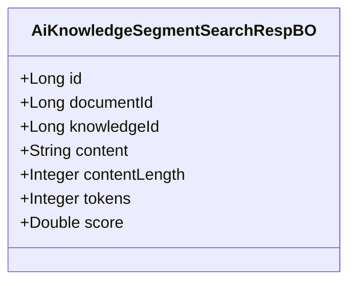
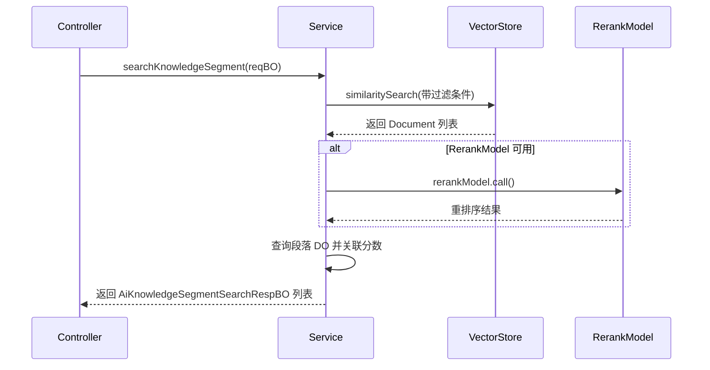
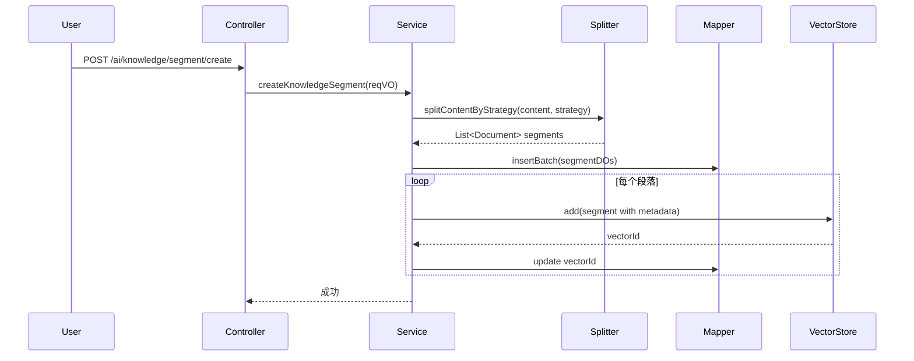
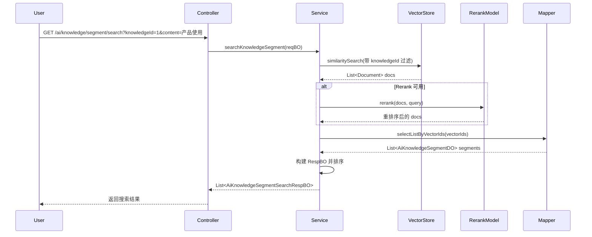

# AI 知识库段落 BO 模块文档

## 1. 模块概述

AI 知识库段落（Knowledge Segment）是 AI 模块中用于管理知识文档切分片段的核心功能模块。该模块负责将大文档按策略切分为多个小段落，并为每个段落生成向量嵌入，支持基于语义的检索和匹配。

**核心职责：**
- 文档内容的自动切分与向量化存储
- 段落的增删改查及状态管理
- 基于语义的段落搜索（支持 Rerank 重排序）
- 向量存储的同步与维护

## 2. 核心组件

### 2.1 AiKnowledgeSegmentSearchRespBO

**文件路径：** `yudao-module-ai/src/main/java/cn/iocoder/yudao/module/ai/service/knowledge/bo/AiKnowledgeSegmentSearchRespBO.java`

**描述：** AI 知识库段落搜索响应业务对象，用于封装搜索结果中的段落信息。



| 字段 | 类型 | 说明 |
|------|------|------|
| id | Long | 段落编号 |
| documentId | Long | 文档编号 |
| knowledgeId | Long | 知识库编号 |
| content | String | 段落内容 |
| contentLength | Integer | 内容长度（字符数） |
| tokens | Integer | Token 数量 |
| score | Double | 相似度分数（搜索时使用） |

### 2.2 AiKnowledgeSegmentServiceImpl

**文件路径：** `yudao-module-ai/src/main/java/cn/iocoder/yudao/module/ai/service/knowledge/AiKnowledgeSegmentServiceImpl.java`

**描述：** 知识库段落服务实现类，处理段落的 CRUD、切片、向量化、搜索等核心逻辑。

#### 主要功能方法

| 方法名 | 说明 |
|--------|------|
| `getKnowledgeSegmentPage` | 获取段落分页列表 |
| `createKnowledgeSegmentBySplitContent` | 根据内容创建并切分段落（自动检测策略） |
| `updateKnowledgeSegment` | 更新段落内容（删除旧向量，重新向量化） |
| `deleteKnowledgeSegment` | 删除段落（同时删除向量） |
| `deleteKnowledgeSegmentByDocumentId` | 按文档 ID 批量删除段落 |
| `updateKnowledgeSegmentStatus` | 更新段落启用/禁用状态 |
| `reindexKnowledgeSegmentByKnowledgeId` | 按知识库重新索引所有段落 |
| `searchKnowledgeSegment` | 搜索段落（支持 Embedding + Rerank） |
| `splitContent` | 根据 URL 读取内容并切分段落 |
| `createKnowledgeSegment` | 手动创建单个段落 |
| `getKnowledgeSegmentProcessList` | 获取文档处理进度列表 |

#### 搜索流程



### 2.3 AiKnowledgeServiceImpl

**文件路径：** `yudao-module-ai/src/main/java/cn/iocoder/yudao/module/ai/service/knowledge/AiKnowledgeServiceImpl.java`

**描述：** 知识库服务，管理知识库的生命周期，当模型变更时触发段落重新索引。

#### 关键交互

- **模型变更重索引：** 当知识库的嵌入模型更新后，异步调用 `knowledgeSegmentService.reindexByKnowledgeSegmentAsync()` 重新向量化所有段落。
- **级联删除：** 删除知识库时，先删除其下的所有文档和段落，最后删除知识库本身。

## 3. 架构关系

### 3.1 模块依赖关系

```mermaid
graph TD
    subgraph "AI 模块"
        A[AiKnowledgeSegmentController] --> B[AiKnowledgeSegmentService]
        C[AiKnowledgeController] --> D[AiKnowledgeService]
        B --> E[AiKnowledgeSegmentMapper]
        B --> F[AiKnowledgeService]
        B --> G[AiKnowledgeDocumentService]
        B --> H[AiModelService]
        B --> I[TokenCountEstimator]
        B --> J[RerankModel(可选)]
        B --> K[VectorStore]
    end
    
    L[向量存储] -->|Qdrant/Pinecone/etc.| K
    M[模型配置] --> H
```

### 3.2 与其他模块的集成

| 模块 | 集成点 | 说明 |
|------|--------|------|
| **AI 模型模块** | `AiModelService` | 获取嵌入模型和向量存储实例 |
| **AI 文档模块** | `AiKnowledgeDocumentService` | 校验文档存在性、读取 URL 内容 |
| **AI 知识库模块** | `AiKnowledgeService` | 校验知识库存在性、获取知识库配置 |
| **消息队列** | 异步重索引 | 模型变更时触发异步 reindex 任务 |

## 4. 数据流

### 4.1 文档切片与向量化流程



### 4.2 搜索流程



## 5. 关键技术点

### 5.1 文档切片策略

支持多种切片策略，通过 `AiDocumentSplitStrategyEnum` 枚举定义：

| 策略 | 适用场景 | 说明 |
|------|----------|------|
| `AUTO` | 自动检测 | 根据内容格式自动选择策略 |
| `MARKDOWN_QA` | Markdown QA 格式 | 按 ## 标题分割问答对 |
| `SEMANTIC` | 普通文本 | 语义切分，保留上下文完整性 |
| `PARAGRAPH` | 段落文本 | 按段落分割，无重叠 |
| `TOKEN` | 默认 | 按 Token 数量固定大小切分 |

### 5.2 向量存储元数据

每个段落向量存储时附带以下元数据，便于过滤和关联：

```java
private static final Map<String, Class<?>> VECTOR_STORE_METADATA_TYPES = Map.of(
    "knowledgeId", String.class,      // 知识库 ID
    "documentId", String.class,       // 文档 ID  
    "segmentId", String.class         // 段落 ID
);
```

### 5.3 Rerank 重排序优化

当配置了 Rerank 模型时，搜索流程会进行两轮优化：

1. **第一轮检索：** 检索 `topK * 4` 个结果（扩大召回范围）
2. **Rerank 重排序：** 使用 Rerank 模型对结果进行精排
3. **阈值过滤：** 筛选出相似度高于阈值的最终结果

### 5.4 异常处理

- `KNOWLEDGE_SEGMENT_NOT_EXISTS`：段落不存在
- `KNOWLEDGE_SEGMENT_CONTENT_TOO_LONG`：段落内容超过最大 Token 限制
- `KNOWLEDGE_NOT_EXISTS`：知识库不存在

## 6. API 接口参考

| 接口 | 方法 | 路径 | 权限 | 说明 |
|------|------|------|------|------|
| 获取段落详情 | GET | `/ai/knowledge/segment/get` | `ai:knowledge:query` | 根据 ID 获取段落 |
| 获取分页 | GET | `/ai/knowledge/segment/page` | `ai:knowledge:query` | 分页查询段落 |
| 创建段落 | POST | `/ai/knowledge/segment/create` | `ai:knowledge:create` | 创建单个段落 |
| 更新段落 | PUT | `/ai/knowledge/segment/update` | `ai:knowledge:update` | 更新段落内容 |
| 更新状态 | PUT | `/ai/knowledge/segment/update-status` | `ai:knowledge:update` | 启用/禁用段落 |
| 删除段落 | DELETE | `/ai/knowledge/segment/delete` | `ai:knowledge:delete` | 删除段落 |
| 内容切片 | GET | `/ai/knowledge/segment/split` | `ai:knowledge:query` | URL 内容自动切片 |
| 搜索段落 | GET | `/ai/knowledge/segment/search` | `ai:knowledge:query` | 语义搜索段落 |

## 7. 相关模块文档

- [AI 知识库模块](knowledge.md) - 知识库整体管理
- [AI 文档模块](document.md) - 文档上传与管理
- [AI 模型模块](model.md) - 模型配置与管理
- [向量存储配置](vector-store.md) - 向量数据库配置
