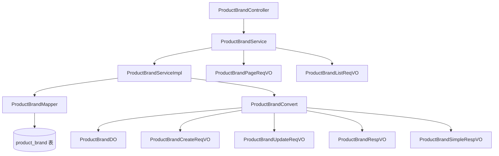

# 品牌模块文档

## 模块概述

品牌模块（Product Brand Module）是商城系统中负责商品品牌管理的核心组件。该模块提供了品牌的创建、查询、更新、删除等完整的CRUD功能，支持品牌的分页查询、状态管理以及品牌信息的完整展示。

品牌模块主要用于管理商品的品牌信息，包括品牌名称、品牌Logo、品牌排序、品牌描述以及状态等信息。通过品牌管理，可以有效组织和分类商品，提升商品的可发现性和用户购物体验。

## 核心功能

1. **品牌管理**：支持品牌的创建、编辑、删除和查询操作
2. **品牌查询**：提供分页查询、列表查询和简单列表查询（用于下拉选择）
3. **状态管理**：支持品牌的启用/禁用状态切换
4. **数据验证**：确保品牌名称的唯一性和数据完整性
5. **数据转换**：通过Mapper结构在不同层之间进行数据转换

## 架构设计

品牌模块遵循分层架构设计，主要包含以下几层：

### 1. 控制层（Controller）
- **ProductBrandController**：处理HTTP请求，提供RESTful API接口
- 负责参数验证、权限检查和响应构造

### 2. 服务层（Service）
- **ProductBrandService**：定义业务接口
- **ProductBrandServiceImpl**：实现具体业务逻辑
- 负责业务规则验证、数据处理和事务管理

### 3. 数据访问层（DAO）
- **ProductBrandMapper**：MyBatis映射器，负责数据库操作
- **ProductBrandDO**：数据对象，映射到数据库表 `product_brand`

### 4. 数据传输层（DTO/VO）
- **ProductBrandCreateReqVO**：创建品牌请求参数
- **ProductBrandUpdateReqVO**：更新品牌请求参数
- **ProductBrandRespVO**：品牌详细信息响应
- **ProductBrandSimpleRespVO**：品牌简略信息响应（用于下拉选择）
- **ProductBrandPageReqVO**：品牌分页查询请求参数
- **ProductBrandListReqVO**：品牌列表查询请求参数

### 5. 数据转换层（Convert）
- **ProductBrandConvert**：使用MapStruct实现的对象映射器，负责不同层之间的数据转换

### 6. 持久层（PO）
- **ProductBrandDO**：持久化对象，直接映射数据库表

## 组件关系



## 数据库设计

品牌信息存储在 `product_brand` 表中，表结构如下：

| 字段名 | 类型 | 说明 |
|--------|------|------|
| id | BIGINT | 品牌编号，主键，自增 |
| name | VARCHAR | 品牌名称 |
| pic_url | VARCHAR | 品牌图片URL |
| sort | INT | 品牌排序，数值越小越靠前 |
| description | VARCHAR | 品牌描述 |
| status | TINYINT | 状态，参考CommonStatusEnum（0=禁用，1=启用） |
| create_time | DATETIME | 创建时间 |
| update_time | DATETIME | 更新时间 |

## 接口详情

### 1. 创建品牌

- **路径**：POST /product/brand/create
- **描述**：创建一个新的品牌
- **权限要求**：product:brand:create
- **请求体**：ProductBrandCreateReqVO
- **响应**：CommonResult<Long>（返回新创建品牌的ID）

### 2. 更新品牌

- **路径**：PUT /product/brand/update
- **描述**：更新现有品牌的信息
- **权限要求**：product:brand:update
- **请求体**：ProductBrandUpdateReqVO
- **响应**：CommonResult<Boolean>（返回操作是否成功）

### 3. 删除品牌

- **路径**：DELETE /product/brand/delete
- **描述**：根据ID删除品牌
- **权限要求**：product:brand:delete
- **请求参数**：id（必填）
- **响应**：CommonResult<Boolean>（返回操作是否成功）

### 4. 获取品牌详情

- **路径**：GET /product/brand/get
- **描述**：根据ID获取品牌详细信息
- **权限要求**：product:brand:query
- **请求参数**：id（必填）
- **响应**：CommonResult<ProductBrandRespVO>（返回品牌详情）

### 5. 获取品牌分页列表

- **路径**：GET /product/brand/page
- **描述**：根据条件分页查询品牌列表
- **权限要求**：product:brand:query
- **请求体**：ProductBrandPageReqVO
- **响应**：CommonResult<PageResult<ProductBrandRespVO>>（返回分页结果）

### 6. 获取品牌列表

- **路径**：GET /product/brand/list
- **描述**：根据条件获取品牌列表（不分页）
- **权限要求**：product:brand:query
- **请求体**：ProductBrandListReqVO
- **响应**：CommonResult<List<ProductBrandRespVO>>（返回品牌列表，按排序字段排序）

### 7. 获取品牌简略列表

- **路径**：GET /product/brand/list-all-simple
- **描述**：获取所有启用状态的品牌简略信息（用于下拉选择）
- **权限要求**：无需特殊权限
- **响应**：CommonResult<List<ProductBrandSimpleRespVO>>（返回品牌ID和名称列表）

## 数据模型

### ProductBrandDO（数据对象）

```java
@TableName("product_brand")
@KeySequence("product_brand_seq")
@Data
@EqualsAndHashCode(callSuper = true)
@ToString(callSuper = true)
@Builder
@NoArgsConstructor
@AllArgsConstructor
public class ProductBrandDO extends BaseDO {

    /**
     * 品牌编号
     */
    @TableId
    private Long id;
    
    /**
     * 品牌名称
     */
    private String name;
    
    /**
     * 品牌图片
     */
    private String picUrl;
    
    /**
     * 品牌排序
     */
    private Integer sort;
    
    /**
     * 品牌描述
     */
    private String description;
    
    /**
     * 状态
     *
     * 枚举 {@link CommonStatusEnum}
     */
    private Integer status;
}
```

### ProductBrandCreateReqVO（创建请求）

```java
@Schema(description = "管理后台 - 商品品牌创建 Request VO")
@Data
@EqualsAndHashCode(callSuper = true)
@ToString(callSuper = true)
public class ProductBrandCreateReqVO extends ProductBrandBaseVO {
    // 继承自ProductBrandBaseVO，包含name, picUrl, sort, description, status字段
}
```

### ProductBrandUpdateReqVO（更新请求）

```java
@Schema(description = "管理后台 - 商品品牌更新 Request VO")
@Data
@EqualsAndHashCode(callSuper = true)
@ToString(callSuper = true)
public class ProductBrandUpdateReqVO extends ProductBrandBaseVO {

    @Schema(description = "品牌编号", requiredMode = Schema.RequiredMode.REQUIRED, example = "1")
    @NotNull(message = "品牌编号不能为空")
    private Long id;
}
```

### ProductBrandRespVO（响应对象）

```java
@Schema(description = "管理后台 - 品牌 Response VO")
@Data
@EqualsAndHashCode(callSuper = true)
@ToString(callSuper = true)
public class ProductBrandRespVO extends ProductBrandBaseVO {

    @Schema(description = "品牌编号", requiredMode = Schema.RequiredMode.REQUIRED, example = "1")
    private Long id;

    @Schema(description = "创建时间", requiredMode = Schema.RequiredMode.REQUIRED)
    private LocalDateTime createTime;
}
```

### ProductBrandSimpleRespVO（简略响应对象）

```java
@Schema(description = "管理后台 - 品牌精简信息 Response VO")
@Data
@NoArgsConstructor
@AllArgsConstructor
public class ProductBrandSimpleRespVO {

    @Schema(description = "品牌编号", requiredMode = Schema.RequiredMode.REQUIRED, example = "1024")
    private Long id;

    @Schema(description = "品牌名称", requiredMode = Schema.RequiredMode.REQUIRED, example = "苹果")
    private String name;
}
```

## 业务规则

1. **品牌名称唯一性**：创建或更新品牌时，需要验证品牌名称在同一状态下是否唯一
2. **状态管理**：品牌状态仅限于启用(1)和禁用(0)两种状态
3. **排序规则**：品牌列表默认按照sort字段升序排序，数值越小越靠前
4. **软删除**：实际应用中可能采用状态字段进行逻辑删除而非物理删除
5. **参数验证**：所有输入参数都需要进行非空和格式验证

## 依赖关系

品牌模块主要依赖以下基础组件：

1. **框架基础组件**：
   - cn.iocoder.yudao.framework.common.pojo.CommonResult
   - cn.iocoder.yudao.framework.common.pojo.PageResult
   - cn.iocoder.yudao.framework.common.enums.CommonStatusEnum

2. **数据验证**：
   - jakarta.validation.Valid
   - jakarta.validation.constraints.NotNull

3. **MyBatis Plus**：
   - com.baomidou.mybatisplus.annotation.TableName
   - com.baomidou.mybatisplus.annotation.TableId
   - com.baomidou.mybatisplus.annotation.KeySequence

4. **MapStruct**：
   - org.mapstruct.Mapper
   - org.mapstruct.Mappers

5. **Spring框架**：
   - org.springframework.stereotype.Service
   - org.springframework.validation.annotation.Validated
   - org.springframework.web.bind.annotation.*
   - org.springframework.security.access.prepost.PreAuthorize

6. **Swagger/OpenAPI**：
   - io.swagger.v3.oas.annotations.Operation
   - io.swagger.v3.oas.annotations.Parameter
   - io.swagger.v3.oas.annotations.tags.Tag
   - io.swagger.v3.oas.annotations.media.Schema

## 与其他模块的关系

品牌模块主要与以下模块进行交互：

1. **商品模块（Product Module）**：
   - 商品SPU和SKU可以关联到品牌
   - 品牌信息用于商品展示和搜索过滤

2. **商城促销模块（Promotion Module）**：
   - 某些促销活动可能针对特定品牌

3. **商城统计模块（Statistics Module）**：
   - 品牌销售统计和分析

4. **系统模块（System Module）**：
   - 使用系统的权限控制功能（@PreAuthorize注解）
   - 可能使用系统的字典管理功能

## 异常处理

品牌模块通过以下方式处理异常：

1. **参数验证异常**：使用Jakarta Validation框架自动处理，返回参数错误信息
2. **业务异常**：在服务层通过抛出异常来处理业务规则违反（如品牌名称重复）
3. **系统异常**：由Spring框架统一处理并返回统一的错误响应格式

## 性能考虑

1. **数据库索引**：建议对name、status字段建立组合索引以提高查询性能
2. **分页查询**：使用MyBatis Plus的分页插件进行高效分页
3. **缓存策略**：品牌信息变更不频繁，可以考虑使用缓存提高读取性能
4. **批量操作**：目前仅支持单个操作，如需批量操作需要额外实现

## 安全考虑

1. **权限控制**：所有操作都通过Spring Security的@PreAuthorize注解进行权限验证
2. **数据验证**：所有输入数据都经过验证防止注入攻击
3. **数据隔离**：在多租户环境中，需要确保品牌数据的租户隔离

## 最佳实践

1. **单一职责**：每个方法只负责一个明确的业务操作
2. **参数验证**：在Controller层进行参数验证，在Service层进行业务规则验证
3. **异常统一**：使用统一的异常处理机制返回标准错误格式
4. **日志记录**：在关键操作点添加适当的日志
5. **事务管理**：服务方法默认使用Spring的事务管理确保数据一致性

## 使用示例

### 创建品牌

```http
POST /product/brand/create
Content-Type: application/json

{
  "name": "苹果",
  "picUrl": "https://example.com/apple-logo.png",
  "sort": 1,
  "description": "苹果公司旗下品牌",
  "status": 1
}
```

### 查询品牌列表

```http
GET /product/brand/page?name=苹果&status=1&pageSize=10&pageNum=1
```

### 更新品牌

```http
PUT /product/brand/update
Content-Type: application/json

{
  "id": 1,
  "name": "苹果公司",
  "sort": 1,
  "description": "苹果公司旗下所有产品品牌",
  "status": 1
}
```

### 删除品牌

```http
DELETE /product/brand/delete?id=1
```

## 未来改进方向

1. **批量操作**：支持批量创建、更新和删除品牌
2. **品牌分类**：引入品牌分类体系，支持多级品牌分类
3. **品牌关联**：支持品牌之间的关联关系（如母子品牌）
4. **高级搜索**：支持更复杂的搜索条件，如模糊搜索、范围查询等
5. **缓存优化**：引入Redis缓存提高频繁查询的性能
6. **数据统计**：增加品牌商品数量、销售额等统计信息
7. **图片管理**：改进品牌图片管理，支持多图上传和裁剪
8. **审计日志**：添加品牌信息变更的审计日志记录