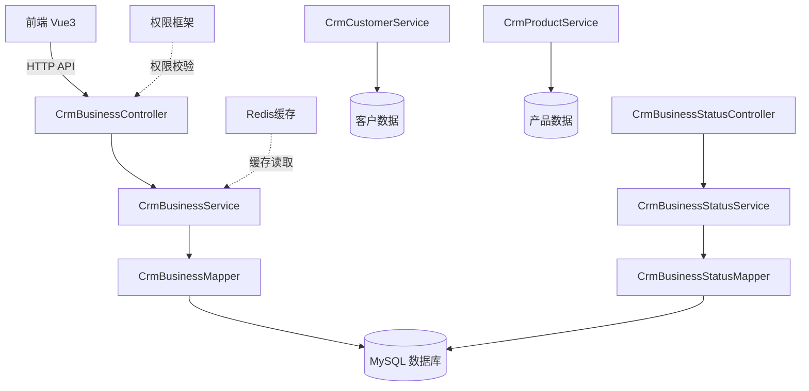
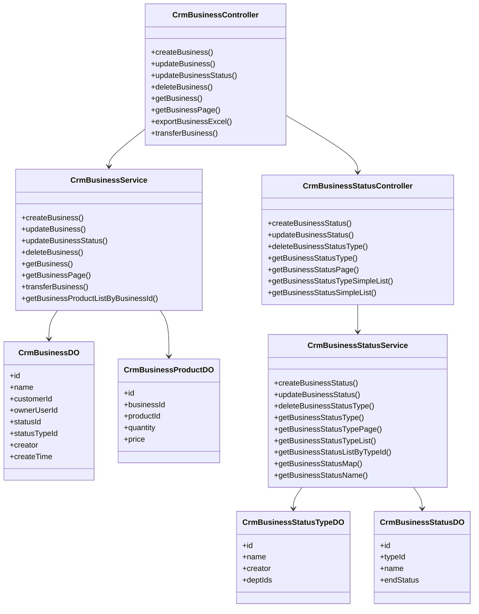
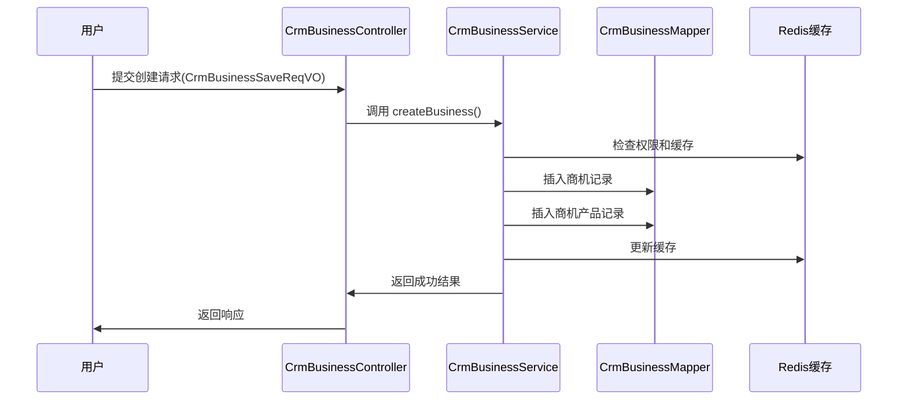
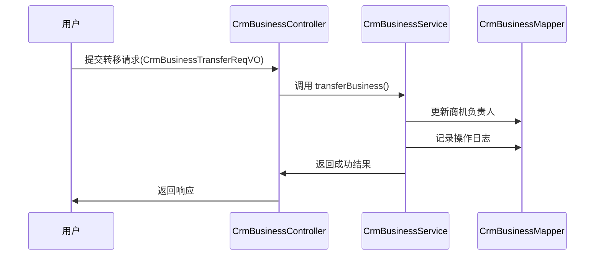
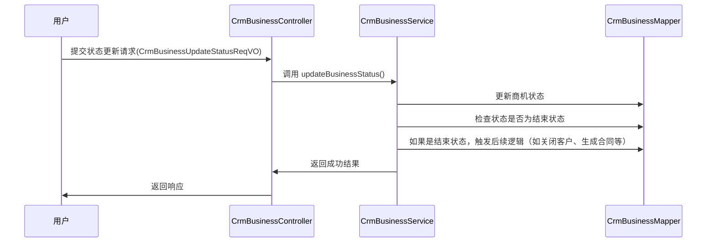

# 业务模块（CRM 商机）文档

## 1. 概述

**业务模块**是 CRM（客户关系管理）系统中的核心功能模块，主要负责企业销售过程中"商机"的全生命周期管理。商机是指潜在客户转化为实际销售机会的过程，包括从线索获取、客户跟进、方案报价到最终成交的完整流程。

本模块提供了商机的创建、查询、更新、删除、转移等操作，同时支持商机状态的管理和配置，帮助企业规范销售流程、提高转化率。

详细文档参见：[business_controller](business_controller.md)、[business_service](business_service.md)、[business_vo](business_vo.md)、[business_do](business_do.md)

## 2. 架构概览

### 2.1 系统架构图



### 2.2 组件关系图



## 3. 核心功能模块

### 3.1 商机管理（CrmBusiness）

#### 3.1.1 功能描述

商机管理模块负责对企业销售过程中的潜在交易机会进行统一管理，主要功能包括：

- **商机创建**：记录新客户或现有客户的销售机会
- **商机查询**：支持按客户、联系人、状态等多种条件筛选
- **商机更新**：修改商机基本信息、状态、负责人等
- **商机删除**：逻辑删除或物理删除商机
- **商机转移**：将商机从一个销售人员转移到另一个人员
- **商机导出**：将商机数据导出为 Excel 文件
- **详情查看**：查看商机详细信息，包括关联的产品列表

#### 3.1.2 接口说明

| 接口路径 | 请求方法 | 功能描述 | 权限要求 |
|---------|---------|---------|---------|
| `/crm/business/create` | POST | 创建商机 | `crm:business:create` |
| `/crm/business/update` | PUT | 更新商机 | `crm:business:update` |
| `/crm/business/update-status` | PUT | 更新商机状态 | `crm:business:update` |
| `/crm/business/delete` | DELETE | 删除商机 | `crm:business:delete` |
| `/crm/business/get` | GET | 获取商机详情 | `crm:business:query` |
| `/crm/business/simple-all-list` | GET | 获取商机精简列表 | `crm:business:query` |
| `/crm/business/list-by-customer` | GET | 按客户获取商机列表 | `crm:business:query` |
| `/crm/business/list-by-contact` | GET | 按联系人获取商机列表 | `crm:business:query` |
| `/crm/business/page` | GET | 获取商机分页列表 | `crm:business:query` |
| `/crm/business/page-by-customer` | GET | 按客户获取商机分页 | `crm:business:query` |
| `/crm/business/page-by-contact` | GET | 按联系人获取商机分页 | `crm:business:query` |
| `/crm/business/export-excel` | GET | 导出商机 Excel | `crm:business:export` |
| `/crm/business/transfer` | PUT | 转移商机 | `crm:business:update` |

#### 3.1.3 数据传输对象（VO）

##### 请求 VO

- **CrmBusinessSaveReqVO**：商机创建/更新请求对象
  - 包含字段：名称、客户ID、负责人ID、状态ID、状态类型ID、产品列表等
  
- **CrmBusinessUpdateStatusReqVO**：商机状态更新请求对象
  - 包含字段：商机ID、新状态ID

- **CrmBusinessTransferReqVO**：商机转移请求对象
  - 包含字段：商机ID、新负责人ID

- **CrmBusinessPageReqVO**：商机分页查询请求对象
  - 包含字段：名称、客户ID、状态ID、状态类型ID、创建时间范围等

##### 响应 VO

- **CrmBusinessRespVO**：商机响应对象
  - 基础信息：ID、名称、客户ID、负责人ID、状态ID、状态类型ID、创建人、创建时间等
  - 扩展信息：客户名称、创建人名称、负责人名称、部门名称、状态名称、状态类型名称
  - 产品列表：关联的产品信息（产品名称、产品编号、单位、数量、单价）

- **CrmBusinessProduct**：商机产品信息
  - 包含字段：产品ID、产品名称、产品编号、单位、数量、单价

### 3.2 商机状态管理（CrmBusinessStatus）

#### 3.2.1 功能描述

商机状态管理用于配置和维护商机的状态体系，支持多级状态管理：

- **状态组管理**：创建和管理商机状态组（如"销售阶段"、"成交状态"等）
- **状态项管理**：在状态组下定义具体的状态（如"初步接触"、"需求分析"、"方案报价"、"已成交"、"已失败"等）
- **状态关联**：每个状态可以关联一个结束状态标识（是否表示该阶段的结束）
- **部门权限控制**：状态组可以绑定部门，控制不同部门可见的状态选项

#### 3.2.2 接口说明

| 接口路径 | 请求方法 | 功能描述 | 权限要求 |
|---------|---------|---------|---------|
| `/crm/business-status/create` | POST | 创建商机状态组 | `crm:business-status:create` |
| `/crm/business-status/update` | PUT | 更新商机状态组 | `crm:business-status:update` |
| `/crm/business-status/delete` | DELETE | 删除商机状态组 | `crm:business-status:delete` |
| `/crm/business-status/get` | GET | 获取商机状态组详情 | `crm:business-status:query` |
| `/crm/business-status/page` | GET | 获取商机状态组分页 | `crm:business-status:query` |
| `/crm/business-status/type-simple-list` | GET | 获取可用的状态组列表 | 无特殊权限 |
| `/crm/business-status/status-simple-list` | GET | 获取指定状态组的子状态列表 | 无特殊权限 |

#### 3.2.3 数据结构

- **CrmBusinessStatusTypeDO**：商机状态组表
  - 字段：ID、名称、创建人、所属部门列表（多对多）

- **CrmBusinessStatusDO**：商机状态项表
  - 字段：ID、状态组ID、名称、是否结束状态

## 4. 数据模型

### 4.1 核心实体关系

```mermaid
erDiagram
    CRM_BUSINESS ||--o{ CRM_BUSINESS_PRODUCT : "contains"
    CRM_BUSINESS }|--|| CRM_CUSTOMER : "belongs_to"
    CRM_BUSINESS }|--|| CRM_CONTACT : "related_to"
    CRM_BUSINESS }|--|| CRM_PRODUCT : "products"
    CRM_BUSINESS }||--|| CRM_BUSINESS_STATUS : "has_status"
    CRM_BUSINESS }||--|| CRM_BUSINESS_STATUS_TYPE : "has_status_type"
    
    CRM_BUSINESS_STATUS_TYPE ||--o{ CRM_BUSINESS_STATUS : "contains"
    CRM_BUSINESS_STATUS_TYPE }|--|| DEPT : "departments"
    
    CRM_BUSINESS {
        long id PK
        string name
        long customer_id
        long owner_user_id
        long status_id
        long status_type_id
        string creator
        datetime create_time
    }
    
    CRM_BUSINESS_PRODUCT {
        long id PK
        long business_id
        long product_id
        int quantity
        double price
    }
    
    CRM_BUSINESS_STATUS_TYPE {
        long id PK
        string name
        string creator
        Set<Long> dept_ids
    }
    
    CRM_BUSINESS_STATUS {
        long id PK
        long type_id
        string name
        boolean end_status
    }
```

### 4.2 表结构说明

| 表名 | 说明 |
|------|------|
| `crm_business` | 商机主表，存储商机基本信息 |
| `crm_business_product` | 商机产品关联表，存储商机与产品的多对多关系 |
| `crm_business_status` | 商机状态表，存储各个状态的具体定义 |
| `crm_business_status_type` | 商机状态组表，存储状态的分类和分组 |

## 5. 业务流程

### 5.1 创建商机流程



### 5.2 商机转移流程



### 5.3 商机状态变更流程



## 6. 与其他模块的集成

### 6.1 与客户模块集成

- **CrmCustomerService**：获取客户信息，在商机详情中显示客户名称
- 通过 `customerId` 关联客户表，实现客户与商机的双向查询

### 6.2 与产品模块集成

- **CrmProductService**：获取产品信息，在商机产品中显示产品名称、编号、单位
- 通过 `productId` 关联产品表，实现商机与产品的多对多关系

### 6.3 与用户模块集成

- **AdminUserApi**：获取创建人和负责人的用户信息（昵称、部门等）
- 使用 Spring Cloud Feign 调用系统模块的用户服务

### 6.4 与部门模块集成

- **DeptApi**：获取部门信息，用于显示负责人所属部门
- 在状态组管理中，通过部门ID控制可见性

### 6.5 与权限系统集成

- 使用 `@PreAuthorize` 注解进行权限校验
- 权限点示例：`crm:business:create`、`crm:business:update`、`crm:business:query`、`crm:business:export`

### 6.6 与日志系统集成

- 使用 `@ApiAccessLog` 注解记录操作日志
- 导出操作会记录为 EXPORT 类型的日志

## 7. 异常处理

模块中统一使用 `ServiceExceptionUtil.exception()` 抛出业务异常，常见的错误码包括：

- `CUSTOMER_NOT_EXISTS`：客户不存在时抛出
- 其他自定义错误码在 `ErrorCodeConstants` 中定义

## 8. 性能优化

### 8.1 批量查询优化

在构建商机详情时，采用批量查询的方式减少数据库访问次数：

```java
// 批量获取客户信息
Map<Long, CrmCustomerDO> customerMap = customerService.getCustomerMap(
    convertSet(list, CrmBusinessDO::getCustomerId));

// 批量获取用户信息
Map<Long, AdminUserRespDTO> userMap = adminUserApi.getUserMap(
    convertListByFlatMap(list, contact -> Stream.of(...)));

// 批量获取状态信息
Map<Long, CrmBusinessStatusTypeDO> statusTypeMap = businessStatusTypeService.getBusinessStatusTypeMap(
    convertSet(list, CrmBusinessDO::getStatusTypeId()));
```

### 8.2 分页查询

- 使用 `PageResult` 对象返回分页数据
- 前端可配置每页大小，默认使用常量 `PAGE_SIZE_NONE` 表示不分页（用于导出或精简列表）

### 8.3 Excel 导出

- 使用 `ExcelUtils.write()` 工具类直接写入响应流
- 避免一次性加载过多数据到内存

## 9. 测试要点

### 9.1 单元测试重点

1. 商机创建：验证必填字段校验、权限校验、数据持久化
2. 商机更新：验证数据存在性检查、权限校验、版本控制
3. 状态变更：验证状态合法性检查、结束状态触发逻辑
4. 转移操作：验证新旧负责人权限、操作日志记录
5. 导出功能：验证 Excel 格式正确、数据完整性

### 9.2 集成测试重点

1. 关联数据查询：验证客户、产品、用户、部门等关联数据的正确展示
2. 权限控制：验证不同角色用户的访问限制
3. 并发场景：验证多人同时操作同一商机时的数据一致性

## 10. 扩展建议

1. **引入工作流引擎**：对于复杂的审批流程，可集成 Flowable 等 BPMN 引擎
2. **添加销售漏斗分析**：基于商机状态变化，统计各阶段转化率和销售额预测
3. **集成邮件/短信通知**：当商机状态变更时，自动通知相关人员
4. **增加智能推荐**：基于历史数据，推荐可能成交的客户和产品组合

## 11. 相关文档

- [yudao-module-crm 模块整体文档](crm.md)
- [系统权限模块文档](system-security.md)
- [客户管理模块文档](crm-customer.md)
- [产品管理模块文档](crm-product.md)
- [Excel 导出工具文档](excel-util.md)
