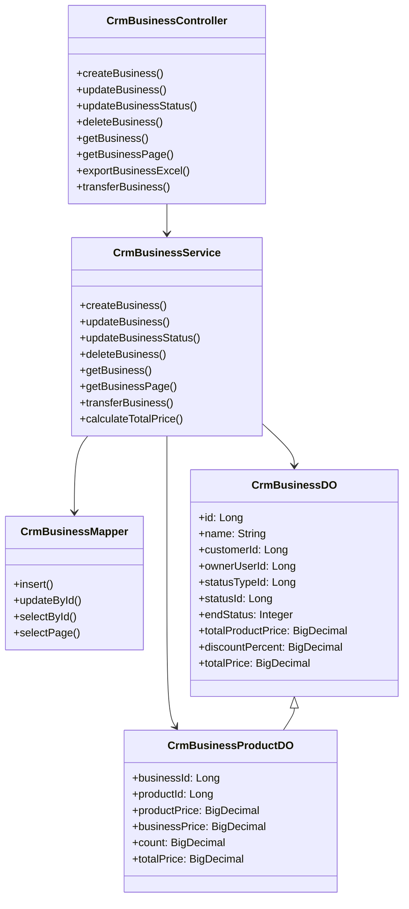
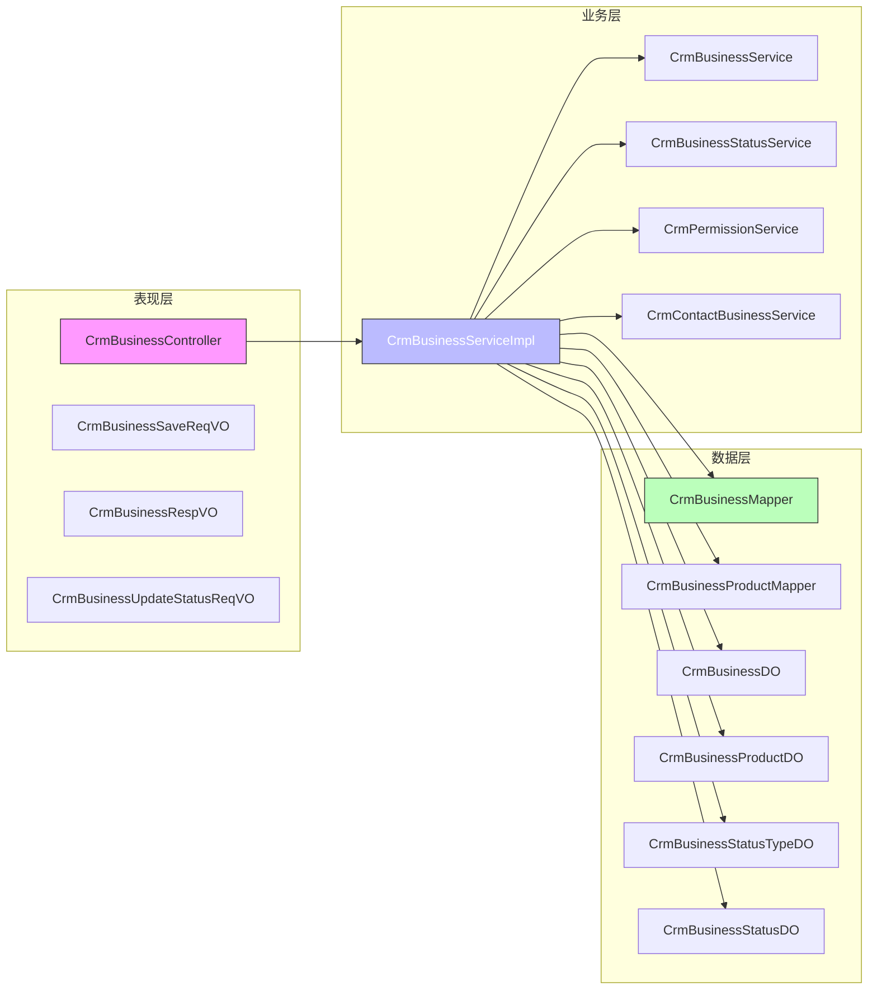
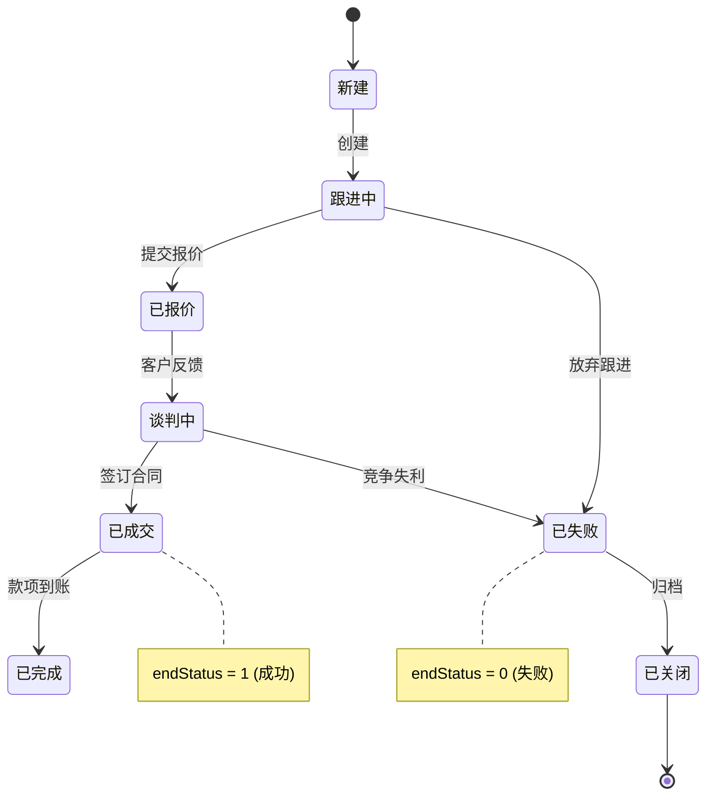

# 业务模块文档 - CRM 商机管理 (business_2)

## 1. 模块概述

**CRM 商机管理模块**是企业客户关系管理系统中的核心功能之一，用于跟踪和管理销售过程中的潜在客户机会。该模块提供了从商机创建、更新、状态跟踪到统计分析的全生命周期管理能力，帮助销售团队高效推进销售流程，提高成交转化率。

### 1.1 核心功能

- **商机创建与维护**：支持新建和编辑商机，关联客户、联系人、产品等基础信息
- **商机状态管理**：通过状态机机制跟踪商机的进展阶段（如跟进中、已关闭等）
- **产品关联管理**：一个商机可关联多个产品，自动计算总金额和折扣后的总价
- **数据权限控制**：基于负责人和数据权限规则实现细粒度的访问控制
- **统计与分析**：提供漏斗分析、业绩排行、客户画像等多维度统计报表
- **Excel导入导出**：支持批量导入和导出商机数据

### 1.2 模块定位

```mermaid
graph TD
    subgraph "CRM 系统"
        direction TB
        A[客户管理] --> B(商机管理)
        C[联系人管理] --> B
        D[合同管理] <--> B
        E[产品管理] --> B
        F[统计分析] <-- B
    end
    
    B --> G[系统基础服务]
    G[系统基础服务] --> H[用户/权限]
    G --> I[数据权限]
    G --> J[操作日志]
```

**依赖关系说明：**
- **上游依赖**：客户管理（CrmCustomer）、联系人管理（CrmContact）、产品管理（CrmProduct）、合同管理（CrmContract）
- **下游依赖**：统计分析（CrmStatistics）、数据权限（CrmPermission）、操作日志（OperateLog）
- **横向协作**：与 BPM 流程引擎集成，支持审批流；与 IM 即时通讯集成，支持消息通知

---

## 2. 架构设计

### 2.1 分层架构



### 2.2 组件关系图



---

## 3. 核心组件详解

### 3.1 控制器层 (Controller)

#### `CrmBusinessController`

**职责**：处理 HTTP 请求，调用业务层服务，返回响应结果。

**API 接口列表**：

| 方法 | 路径 | 描述 | 权限 |
|------|------|------|------|
| `createBusiness` | `/crm/business/create` | 创建商机 | `crm:business:create` |
| `updateBusiness` | `/crm/business/update` | 更新商机 | `crm:business:update` |
| `updateBusinessStatus` | `/crm/business/update-status` | 更新商机状态 | `crm:business:update` |
| `deleteBusiness` | `/crm/business/delete/{id}` | 删除商机 | `crm:business:delete` |
| `getBusiness` | `/crm/business/get?id={id}` | 获取商机详情 | `crm:business:query` |
| `getBusinessPage` | `/crm/business/page` | 分页查询商机 | `crm:business:query` |
| `exportBusinessExcel` | `/crm/business/export` | 导出商机 Excel | `crm:business:export` |
| `transferBusiness` | `/crm/business/transfer` | 商机转移（变更负责人） | `crm:business:update` |

**关键特性**：
- 使用 `@PreAuthorize` 进行权限校验
- 使用 `@Validated` 进行参数验证
- 统一返回格式 `CommonResult<T>`
- 操作日志记录（通过 `@LogRecord` 注解）

### 3.2 请求/响应对象 (VO)

#### `CrmBusinessSaveReqVO`

**用途**：商机创建/更新的请求对象，包含所有必填字段和产品列表。

**字段说明**：

| 字段 | 类型 | 必填 | 描述 |
|------|------|------|------|
| id | Long | 否 | 主键（更新时必填） |
| name | String | 是 | 商机名称 |
| customerId | Long | 是 | 客户编号 |
| contactNextTime | LocalDateTime | 否 | 下次联系时间 |
| ownerUserId | Long | 是 | 负责人用户编号 |
| statusTypeId | Long | 是 | 商机状态组编号 |
| dealTime | LocalDateTime | 否 | 预计成交日期 |
| discountPercent | BigDecimal | 是 | 整单折扣（百分比） |
| remark | String | 否 | 备注 |
| contactId | Long | 否 | 联系人编号 |
| products | List<BusinessProduct> | 否 | 产品列表 |

**嵌套类 `BusinessProduct`**：

| 字段 | 类型 | 必填 | 描述 |
|------|------|------|------|
| productId | Long | 是 | 产品编号 |
| productPrice | BigDecimal | 是 | 产品单价 |
| businessPrice | BigDecimal | 是 | 商机价格 |
| count | Integer | 是 | 产品数量 |

#### `CrmBusinessRespVO`

**用途**：商机详情响应对象，包含富化后的数据（客户名称、负责人信息等）。

**字段说明**：

| 字段 | 类型 | 描述 |
|------|------|------|
| id | Long | 编号 |
| name | String | 商机名称 |
| customerId | Long | 客户编号 |
| customerName | String | 客户名称 |
| followUpStatus | Boolean | 跟进状态 |
| contactLastTime | LocalDateTime | 最后跟进时间 |
| contactNextTime | LocalDateTime | 下次联系时间 |
| ownerUserId | Long | 负责人的用户编号 |
| ownerUserName | String | 负责人名字 |
| ownerUserDeptName | String | 负责人部门 |
| statusTypeId | Long | 商机状态组编号 |
| statusTypeName | String | 商机状态组名字 |
| statusId | Long | 商机状态编号 |
| statusName | String | 状态名称 |
| endStatus | Integer | 结束状态 |
| endRemark | String | 结束时的备注 |
| dealTime | LocalDateTime | 预计成交日期 |
| totalProductPrice | BigDecimal | 产品总金额 |
| discountPercent | BigDecimal | 整单折扣 |
| totalPrice | BigDecimal | 商机总金额 |
| remark | String | 备注 |
| creator | String | 创建人 |
| creatorName | String | 创建人名字 |
| createTime | LocalDateTime | 创建时间 |
| updateTime | LocalDateTime | 更新时间 |
| products | List<Product> | 产品列表 |

**嵌套类 `Product`**：

| 字段 | 类型 | 描述 |
|------|------|------|
| id | Long | 编号 |
| productId | Long | 产品编号 |
| productName | String | 产品名称 |
| productNo | String | 产品条码 |
| productUnit | Integer | 产品单位 |
| productPrice | BigDecimal | 产品单价 |
| businessPrice | BigDecimal | 商机价格 |
| count | BigDecimal | 产品数量 |
| totalPrice | BigDecimal | 总计价格 |

#### `CrmBusinessUpdateStatusReqVO`

**用途**：更新商机状态的请求对象。

**字段说明**：

| 字段 | 类型 | 必填 | 描述 |
|------|------|------|------|
| id | Long | 是 | 商机编号 |
| statusId | Long | 否 | 状态编号 |
| endStatus | Integer | 否 | 结束状态（枚举值） |

**校验逻辑**：
- `endStatus` 必须属于 `CrmBusinessEndStatusEnum` 枚举
- 至少需要提供一个状态或结束状态

### 3.3 业务服务层 (Service)

#### `CrmBusinessServiceImpl`

**核心方法**：

| 方法 | 描述 | 事务 | 权限校验 |
|------|------|------|----------|
| `createBusiness` | 创建商机，关联产品和数据权限 | @Transactional | 无（默认创建者拥有权限） |
| `updateBusiness` | 更新商机信息，包括产品列表 | @Transactional | WRITE |
| `updateBusinessFollowUp` | 更新跟进状态和时间 | 无 | WRITE |
| `updateBusinessStatus` | 更新商机状态（不能修改已结束商机） | 无 | WRITE |
| `deleteBusiness` | 删除商机（检查是否有关联合同） | @Transactional | OWNER |
| `transferBusiness` | 转移商机（变更负责人） | @Transactional | OWNER |

**关键业务流程**：

1. **创建流程**：
   ```mermaid
   sequenceDiagram
       participant Controller as CrmBusinessController
       participant Service as CrmBusinessServiceImpl
       participant Mapper as CrmBusinessMapper
       participant ProductMapper as CrmBusinessProductMapper
       participant Permission as CrmPermissionService
       participant ContactBusiness as CrmContactBusinessService

       Controller->>Service: createBusiness(reqVO, userId)
       Service->>Service: validateBusinessProducts(products)
       Service->>Service: validateRelationDataExists()
       Service->>Service: calculateTotalPrice()
       Service->>Mapper: insert(business)
       Service->>ProductMapper: insertBatch(businessProducts)
       Service->>Permission: createPermission()
       Service->>ContactBusiness: createContactBusinessList()
       Service-->>Controller: business.getId()
   ```

2. **更新流程**：
   - 对比新旧产品列表，执行增删改操作
   - 不允许更新 `ownerUserId` 和 `statusTypeId` 字段
   - 记录旧版本用于操作日志

3. **状态更新流程**：
   - 校验商机未结束（endStatus 为 null）
   - 校验状态变更有效（不能等于当前状态）
   - 更新 statusId 和 endStatus

4. **删除流程**：
   - 校验是否存在
   - 检查是否有关联合同（有则禁止删除）
   - 删除商机和数据权限

#### `CrmBusinessStatusServiceImpl`

**职责**：管理商机状态组和具体状态（如"进行中"、"已成交"、"已失败"等）。

**数据结构**：
- `CrmBusinessStatusTypeDO`：状态组（如"销售阶段"）
- `CrmBusinessStatusDO`：具体状态（如"跟进中"、"已报价"），属于某个状态组

**关键特性**：
- 支持批量创建/更新状态组及其下的状态
- 按排序顺序排列状态
- 防止删除正在使用的状态组

### 3.4 数据对象 (DO)

#### `CrmBusinessDO`

**表名**：`crm_business`

**字段映射**：

| DO 字段 | 数据库列 | 类型 | 说明 |
|---------|----------|------|------|
| id | id | BIGINT | 主键 |
| name | name | VARCHAR | 商机名称 |
| customerId | customer_id | BIGINT | 外键关联客户 |
| followUpStatus | follow_up_status | BOOLEAN | 跟进状态 |
| contactLastTime | contact_last_time | DATETIME | 最后跟进时间 |
| contactNextTime | contact_next_time | DATETIME | 下次联系时间 |
| ownerUserId | owner_user_id | BIGINT | 负责人用户ID |
| statusTypeId | status_type_id | BIGINT | 状态组ID |
| statusId | status_id | BIGINT | 状态ID |
| endStatus | end_status | INTEGER | 结束状态（枚举） |
| endRemark | end_remark | VARCHAR | 结束备注 |
| dealTime | deal_time | DATETIME | 预计成交日期 |
| totalProductPrice | total_product_price | DECIMAL | 产品总金额 |
| discountPercent | discount_percent | DECIMAL | 整单折扣 |
| totalPrice | total_price | DECIMAL | 商机总金额 |
| remark | remark | VARCHAR | 备注 |

#### `CrmBusinessProductDO`

**表名**：`crm_business_product`

**字段映射**：

| DO 字段 | 数据库列 | 类型 | 说明 |
|---------|----------|------|------|
| id | id | BIGINT | 主键 |
| businessId | business_id | BIGINT | 外键关联商机 |
| productId | product_id | BIGINT | 外键关联产品 |
| productPrice | product_price | DECIMAL | 产品单价（冗余） |
| businessPrice | business_price | DECIMAL | 商机价格 |
| count | count | DECIMAL | 数量 |
| totalPrice | total_price | DECIMAL | 总计价格 = businessPrice × count |

**关系**：一对多（一个商机对应多个产品项）

---

## 4. 数据模型

### 4.1 ER 关系图

```mermaid
erDiagram
    CRM_BUSINESS ||--o{ CRM_BUSINESS_PRODUCT : "包含"
    CRM_BUSINESS }|--|| CRM_CUSTOMER : "属于"
    CRM_BUSINESS }|--|| CRM_CONTACT : "关联"
    CRM_BUSINESS }|--|| ADMIN_USER : "负责人"
    CRM_BUSINESS }||--|| CRM_BUSINESS_STATUS_TYPE : "状态组"
    CRM_BUSINESS }||--|| CRM_BUSINESS_STATUS : "状态"
    CRM_BUSINESS }|--|| CRM_PERMISSION : "权限记录"
    
    CRM_BUSINESS_PRODUCT }|--|| CRM_PRODUCT : "产品"
    
    classDef entity fill:#f9f,stroke:#333;
    class CRM_BUSINESS,CRM_BUSINESS_PRODUCT,CRM_CUSTOMER,CRM_CONTACT,ADMIN_USER,CRM_BUSINESS_STATUS_TYPE,CRM_BUSINESS_STATUS,CRM_PERMISSION,CRM_PRODUCT entity
```

### 4.2 状态流转图



---

## 5. 权限与安全

### 5.1 权限控制策略

| 操作 | 权限注解 | 权限级别 | 说明 |
|------|----------|----------|------|
| 创建 | 无特殊注解 | 默认 | 创建者自动成为负责人 |
| 更新 | `@CrmPermission(level = WRITE)` | WRITE | 需有写入权限 |
| 查看详情 | `@CrmPermission(level = READ)` | READ | 需有读取权限 |
| 删除 | `@CrmPermission(level = OWNER)` | OWNER | 仅负责人可删除 |
| 转移 | `@CrmPermission(level = OWNER)` | OWNER | 原负责人可转移 |

### 5.2 数据权限实现

```mermaid
sequenceDiagram
    participant Controller
    participant Service
    participant PermissionService
    participant DB

    Controller->>Service: createBusiness(reqVO, userId)
    Service->>PermissionService: createPermission(
        userId=bizOwnerId,
        bizType=CRM_BUSINESS,
        bizId=businessId,
        level=OWNER
    )
    PermissionService->>DB: 插入权限记录
    
    Service->>Service: updateBusiness(reqVO)
    Service->>PermissionService: checkPermission(
        bizId=reqVO.id,
        level=WRITE
    )
    PermissionService-->>Service: 校验通过
```

**权限模型**：
- **OWNER**：业务负责人（默认创建者）
- **WRITE**：可编辑
- **READ**：可查看
- 支持自定义数据权限规则（通过 `CrmPermissionAspect` AOP）

---

## 6. 与其他模块的集成

### 6.1 与客户管理模块

- **关联关系**：每个商机必须关联一个客户 (`customerId`)
- **数据同步**：创建商机时校验客户存在性
- **查询支持**：按客户编号查询商机列表 (`getBusinessListByCustomerId`)

### 6.2 与联系人管理模块

- **关联关系**：商机可关联联系人 (`contactId`)
- **约束**：联系人的客户必须与商机的客户一致
- **关联表**：`crm_contact_business` (多对多关系)

### 6.3 与产品管理模块

- **关联关系**：商机可关联多个产品 (`CrmBusinessProductDO`)
- **数据冗余**：产品单价和产品名称冗余存储，避免关联查询
- **计算**：自动计算 `totalProductPrice` 和 `totalPrice`（含折扣）

### 6.4 与合同管理模块

- **关联关系**：商机可转化为合同
- **删除保护**：如果商机已关联合同，禁止删除
- **查询**：`validateContractExists()` 检查合同关联

### 6.5 与权限模块

- **数据权限**：自动创建权限记录 (`CrmPermissionDO`)
- **权限转移**：支持负责人变更时的权限转移
- **AOP 切面**：`CrmPermissionAspect` 拦截器实现权限校验

### 6.6 与操作日志模块

- **日志记录**：所有 CRUD 操作均记录操作日志
- **上下文变量**：通过 `LogRecordContext` 传递业务对象
- **差异化记录**：使用 `@DiffLogField` 注解记录字段变化

---

## 7. 使用示例

### 7.1 创建商机

**请求示例**：
```json
{
  "name": "某公司数字化转型项目",
  "customerId": 10299,
  "ownerUserId": 14334,
  "statusTypeId": 25714,
  "contactNextTime": "2024-01-15 10:00:00",
  "dealTime": "2024-03-31 00:00:00",
  "discountPercent": 95.00,
  "remark": "重要客户，需重点关注",
  "products": [
    {
      "productId": 20529,
      "productPrice": 10000.00,
      "businessPrice": 9500.00,
      "count": 2
    },
    {
      "productId": 20530,
      "productPrice": 5000.00,
      "businessPrice": 4750.00,
      "count": 1
    }
  ]
}
```

**响应示例**：
```json
{
  "code": 0,
  "message": "成功",
  "data": 12345  // 商机ID
}
```

### 7.2 更新商机状态

**请求示例**：
```json
{
  "id": 12345,
  "statusId": 101,
  "endStatus": 1  // 1表示成交
}
```

### 7.3 分页查询商机

**请求参数**：
- `pageNo`: 页码（默认1）
- `pageSize`: 页大小（默认10）
- `customerId`: 客户编号（可选）
- `statusTypeId`: 状态组编号（可选）
- `ownerUserId`: 负责人ID（可选）

**响应结构**：
```json
{
  "code": 0,
  "message": "成功",
  "data": {
    "list": [...],
    "total": 100,
    "pageNo": 1,
    "pageSize": 10,
    "pages": 10
  }
}
```

---

## 8. 性能优化

### 8.1 索引建议

| 表名 | 字段 | 索引类型 | 说明 |
|------|------|----------|------|
| crm_business | customer_id | 二级索引 | 按客户查询 |
| crm_business | owner_user_id | 二级索引 | 按负责人查询 |
| crm_business | status_type_id | 二级索引 | 按状态组查询 |
| crm_business | status_id | 二级索引 | 按状态查询 |
| crm_business_product | business_id | 二级索引 | 按商机查询产品 |
| crm_business_product | product_id | 二级索引 | 按产品查询商机 |

### 8.2 查询优化

- **详情页**：使用批量查询减少 N+1 问题（一次性获取客户、用户、部门、状态等信息）
- **列表页**：只查询必要字段，详情单独加载
- **统计查询**：使用聚合函数和预计算表

### 8.3 缓存策略

- 状态组数据缓存在 Redis（较少变动）
- 产品信息缓存（通过产品服务层）
- 用户信息缓存（通过系统模块）

---

## 9. 扩展点

### 9.1 自定义状态

通过 `CrmBusinessStatusType` 和 `CrmBusinessStatus` 表，可以自定义不同的状态机和状态流转规则。

### 9.2 数据权限扩展

通过实现 `CrmPermissionService` 接口，可以扩展更复杂的数据权限规则（如按部门、按区域等）。

### 9.3 事件监听

可以通过监听 `CrmBusinessCreateEvent`、`CrmBusinessUpdateEvent` 等事件，在商机状态变化时触发其他业务逻辑（如发送通知、更新统计等）。

### 9.4 导出扩展

Excel 导出支持自定义列配置，可通过 `@ExcelProperty` 注解控制导出字段。

---

## 10. 常见问题

### Q1: 为什么删除商机时会检查合同关联？

**A**: 因为合同是基于商机创建的，删除商机会导致合同失去业务依据。如果需要删除，应先解除合同关联或先将合同转为其他状态。

### Q2: 商机状态能否随意修改？

**A**: 不能。状态必须属于同一个状态组（statusTypeId），且一旦设置 endStatus（结束状态），就不能再修改为非结束状态。

### Q3: 如何批量更新多个商机的下次联系时间？

**A**: 使用 `updateBusinessNextTime(Collection<Long> ids, LocalDateTime contactNextTime)` 方法，支持批量更新。

### Q4: 商机转移后，原来的负责人还能看到吗？

**A**: 这取决于数据权限配置。默认情况下，只有新负责人和相关管理人员有查看权限。原始权限记录会被转移。

---

## 11. 相关文档链接

- [CRM 客户管理模块](crm_customer.md) - 客户数据管理
- [CRM 联系人管理模块](crm_contact.md) - 联系人数据管理  
- [CRM 产品管理模块](crm_product.md) - 产品数据管理
- [CRM 合同管理模块](crm_contract.md) - 合同与商机关联
- [系统权限模块](system_permission.md) - 数据权限实现原理
- [操作日志模块](system_oplog.md) - 操作日志记录机制
