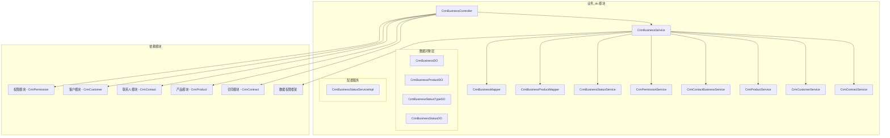
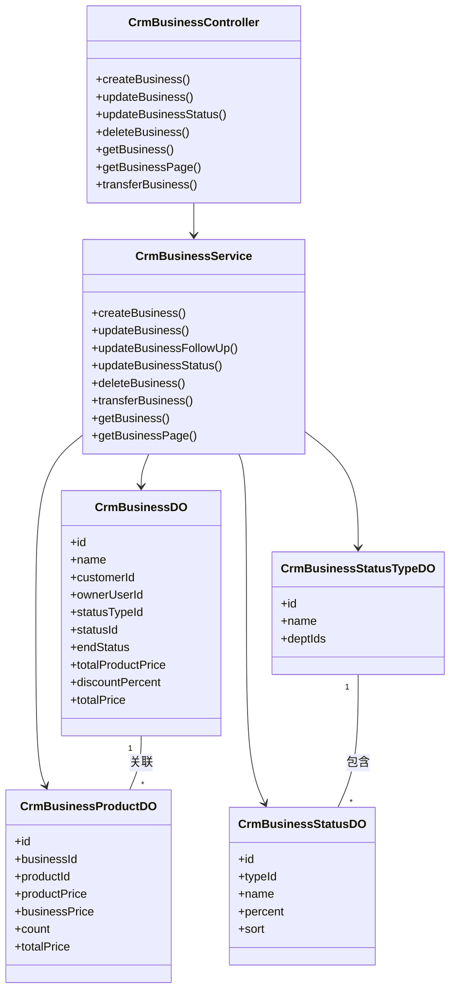
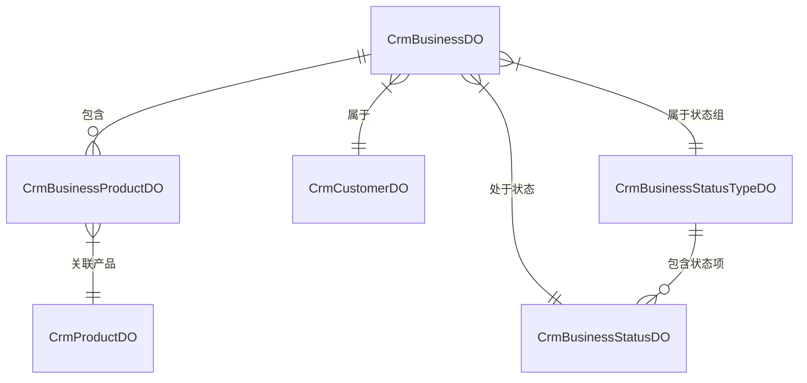
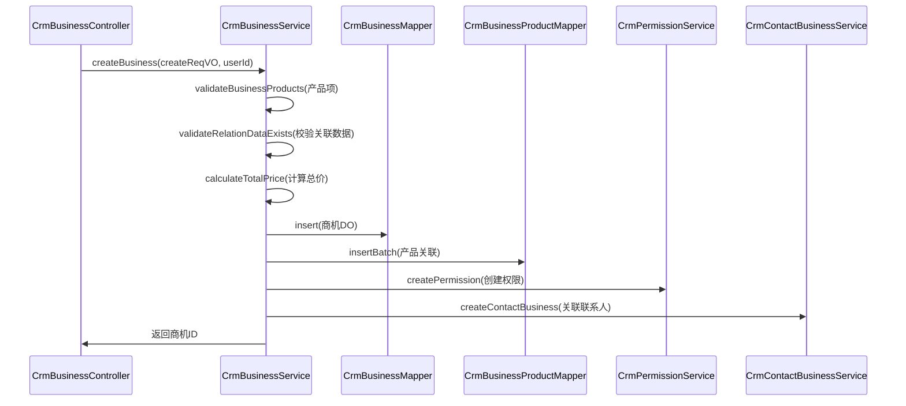
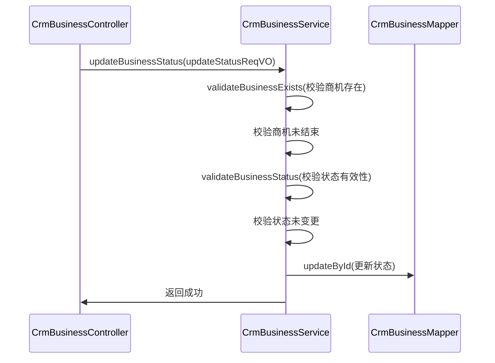
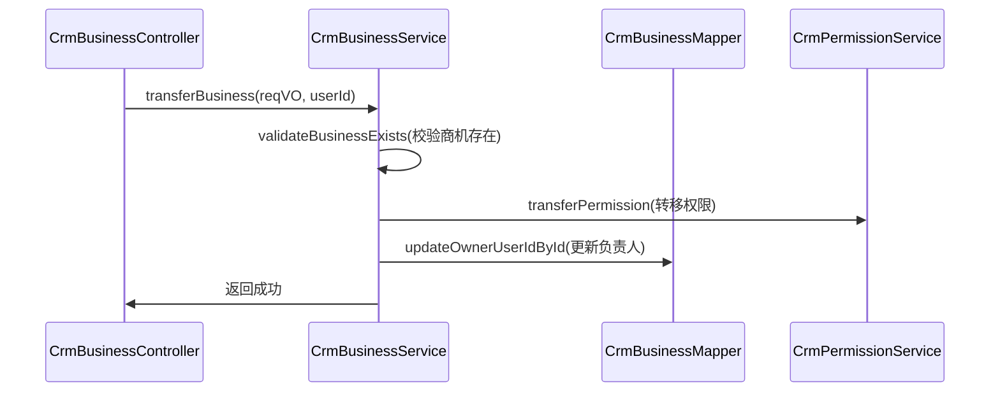

# 业务_do 模块文档

## 1. 概述

业务_do 模块是 CRM（客户关系管理）系统中的核心模块之一，主要负责**商机（Business）**的全生命周期管理。商机是指企业潜在的销售机会，从初步接触到最终成交或失败的全过程跟踪。

本模块提供了商机的创建、更新、跟进、状态转移、删除等完整功能，并与客户、联系人、产品、合同等模块紧密集成，支持精细化数据权限管理。

## 2. 核心功能

### 2.1 商机管理
- **创建商机**：关联客户、负责人、产品项，自动计算总金额
- **更新商机**：修改基本信息、产品项、跟进状态等
- **跟进记录**：记录最后跟进时间、下次联系时间
- **状态流转**：支持商机状态变更（如：初步接触 → 方案报价 → 谈判中 → 成交/失败）
- **负责人转移**：支持商机负责人变更
- **删除校验**：删除前检查是否已关联合同

### 2.2 商机状态配置
- **状态组管理**：定义商机状态组（如：销售阶段、跟进阶段），每个状态组可关联多个部门
- **状态项管理**：定义具体状态（如：初步接触、已报价、已成交），包含赢单率、排序等属性

### 2.3 商机关联产品
- **多产品支持**：一个商机可关联多个产品
- **价格计算**：自动计算产品单价、数量、小计及总金额
- **折扣支持**：支持整单折扣百分比计算

### 2.4 数据权限
- **自动权限创建**：创建商机时自动为负责人创建 OWNER 级别权限
- **权限转移**：负责人变更时自动转移权限
- **权限校验**：基于权限控制 CRUD 操作（READ/WRITE/OWNER）

### 2.5 关联关系
- **客户关联**：每个商机属于一个客户
- **联系人关联**：可关联特定联系人（需属于同一客户）
- **产品关联**：可关联多个产品
- **合同关联**：成交后可关联合同（删除时校验）

## 3. 架构设计

### 3.1 系统架构图



### 3.2 组件关系图



## 4. 数据模型

### 4.1 核心数据表

#### CrmBusinessDO - 商机主表

| 字段 | 类型 | 说明 |
|------|------|------|
| id | BIGINT | 主键 |
| name | VARCHAR | 商机名称 |
| customerId | BIGINT | 客户编号（关联 CrmCustomerDO） |
| ownerUserId | BIGINT | 负责人用户编号（关联 AdminUserDO） |
| statusTypeId | BIGINT | 商机状态组编号（关联 CrmBusinessStatusTypeDO） |
| statusId | BIGINT | 商机状态编号（关联 CrmBusinessStatusDO） |
| endStatus | INTEGER | 结束状态（枚举：CrmBusinessEndStatusEnum） |
| endRemark | VARCHAR | 结束时的备注 |
| followUpStatus | BOOLEAN | 跟进状态 |
| contactLastTime | DATETIME | 最后跟进时间 |
| contactNextTime | DATETIME | 下次联系时间 |
| dealTime | DATETIME | 预计成交日期 |
| totalProductPrice | DECIMAL | 产品总金额（单位：元） |
| discountPercent | DECIMAL | 整单折扣（百分比） |
| totalPrice | DECIMAL | 商机总金额（单位：元） |
| remark | VARCHAR | 备注 |

#### CrmBusinessProductDO - 商机关联产品表

| 字段 | 类型 | 说明 |
|------|------|------|
| id | BIGINT | 主键 |
| businessId | BIGINT | 商机编号（关联 CrmBusinessDO） |
| productId | BIGINT | 产品编号（关联 CrmProductDO） |
| productPrice | DECIMAL | 产品单价（冗余 CrmProductDO.getPrice） |
| businessPrice | DECIMAL | 商机价格（单位：元） |
| count | DECIMAL | 数量 |
| totalPrice | DECIMAL | 总计价格 = businessPrice × count |

#### CrmBusinessStatusTypeDO - 商机状态组（配置表）

| 字段 | 类型 | 说明 |
|------|------|------|
| id | BIGINT | 主键 |
| name | VARCHAR | 状态类型名（如：销售阶段） |
| deptIds | LIST | 使用的部门编号（使用 LongListTypeHandler 存储） |

#### CrmBusinessStatusDO - 商机状态项（配置表）

| 字段 | 类型 | 说明 |
|------|------|------|
| id | BIGINT | 主键 |
| typeId | BIGINT | 状态组编号（关联 CrmBusinessStatusTypeDO） |
| name | VARCHAR | 状态名（如：初步接触、已成交） |
| percent | INTEGER | 赢单率（百分比） |
| sort | INTEGER | 排序 |

### 4.2 关系图



## 5. 核心流程

### 5.1 创建商机流程



### 5.2 商机状态变更流程



### 5.3 负责人转移流程



## 6. API 说明

### 6.1 商机接口

| 接口 | 方法 | 路径 | 权限 | 说明 |
|------|------|------|------|------|
| 创建商机 | POST | `/crm/business/create` | `crm:business:create` | 创建新商机 |
| 更新商机 | PUT | `/crm/business/update` | `crm:business:update` | 更新商机信息 |
| 更新状态 | PUT | `/crm/business/update-status` | `crm:business:update` | 变更商机状态 |
| 删除商机 | DELETE | `/crm/business/delete` | `crm:business:delete` | 删除商机 |
| 获取商机 | GET | `/crm/business/get` | `crm:business:query` | 获取商机详情 |
| 分页查询 | GET | `/crm/business/page` | `crm:business:query` | 分页查询商机 |
| 按客户查询 | GET | `/crm/business/page-by-customer` | `crm:business:query` | 按客户查询商机 |
| 按联系人查询 | GET | `/crm/business/page-by-contact` | `crm:business:query` | 按联系人查询商机 |
| 导出 Excel | GET | `/crm/business/export-excel` | `crm:business:export` | 导出商机数据 |
| 转移负责人 | PUT | `/crm/business/transfer` | `crm:business:update` | 转移商机负责人 |

### 6.2 商机状态接口

| 接口 | 方法 | 路径 | 权限 | 说明 |
|------|------|------|------|------|
| 创建状态组 | POST | `/crm/business-status/create` | `crm:business-status:create` | 创建商机状态组 |
| 更新状态组 | PUT | `/crm/business-status/update` | `crm:business-status:update` | 更新状态组 |
| 删除状态组 | DELETE | `/crm/business-status/delete` | `crm:business-status:delete` | 删除状态组 |
| 获取状态组 | GET | `/crm/business-status/get` | `crm:business-status:query` | 获取状态组详情 |
| 分页查询 | GET | `/crm/business-status/page` | `crm:business-status:query` | 分页查询状态组 |
| 获取简单列表 | GET | `/crm/business-status/type-simple-list` | - | 获取可用状态组列表 |
| 获取状态项 | GET | `/crm/business-status/status-simple-list` | - | 获取状态组下的状态项 |

## 7. 权限控制

业务_do 模块使用 `@CrmPermission` 注解进行数据权限控制，支持以下级别：

| 级别 | 说明 | 操作权限 |
|------|------|----------|
| OWNER | 负责人 | 全部操作（CRUD + 转移） |
| WRITE | 编辑 | 创建、更新、删除 |
| READ | 查看 | 只读查询 |

权限校验示例：
```java
@CrmPermission(bizType = CrmBizTypeEnum.CRM_BUSINESS, bizId = "#updateReqVO.id", level = CrmPermissionLevelEnum.WRITE)
public void updateBusiness(CrmBusinessSaveReqVO updateReqVO) { ... }
```

## 8. 与其他模块的集成

### 8.1 客户模块（CrmCustomer）
- 创建商机时校验客户存在
- 按客户查询商机
- 商机归属客户

### 8.2 联系人模块（CrmContact）
- 创建商机时可关联联系人
- 校验联系人所属客户与商机客户一致
- 按联系人查询商机

### 8.3 产品模块（CrmProduct）
- 创建/更新商机时校验产品存在
- 关联产品项并计算价格
- 获取产品列表用于商机详情展示

### 8.4 合同模块（CrmContract）
- 删除商机前校验是否已关联合同
- 防止误删已成交的商机

### 8.5 权限模块（CrmPermission）
- 创建商机时自动创建权限
- 更新负责人时转移权限
- 删除商机时删除权限

## 9. 特殊设计

### 9.1 价格计算逻辑
```java
// 总价 = 产品总金额 - 折扣金额
totalProductPrice = ∑(businessPrice × count)
discountPrice = totalProductPrice × discountPercent
totalPrice = totalProductPrice - discountPrice
```

### 9.2 部门权限控制
`CrmBusinessStatusTypeDO` 中的 `deptIds` 字段使用 `LongListTypeHandler` 存储部门列表，实现状态组的部门级权限控制。

### 9.3 数据变更审计
所有创建、更新、删除操作均通过 `@LogRecord` 注解记录操作日志，支持审计追踪。

### 9.4 软删除保护
删除商机时先检查是否有关联合同，防止误删已成交的商机。

## 10. 参考文档

- [yudao-module-crm.md](yudao-module-crm.md) - CRM 模块总览
- [yudao-module-system.md](yudao-module-system.md) - 系统权限与用户管理
- [yudao-module-product.md](yudao-module-product.md) - 产品模块
- [yudao-framework-permission.md](yudao-framework-permission.md) - 数据权限框架
