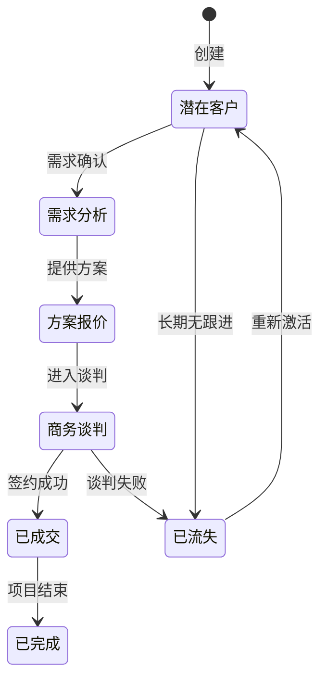
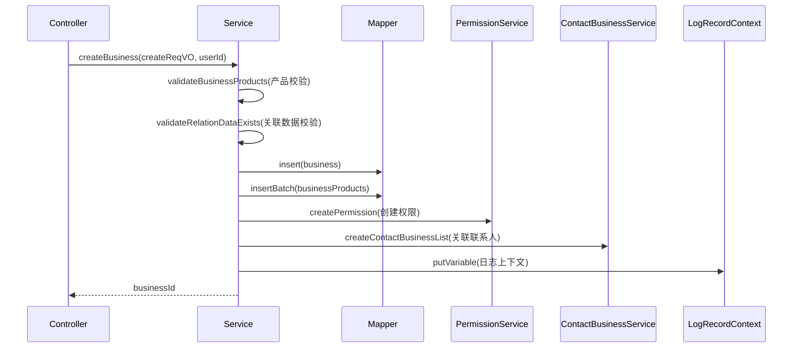
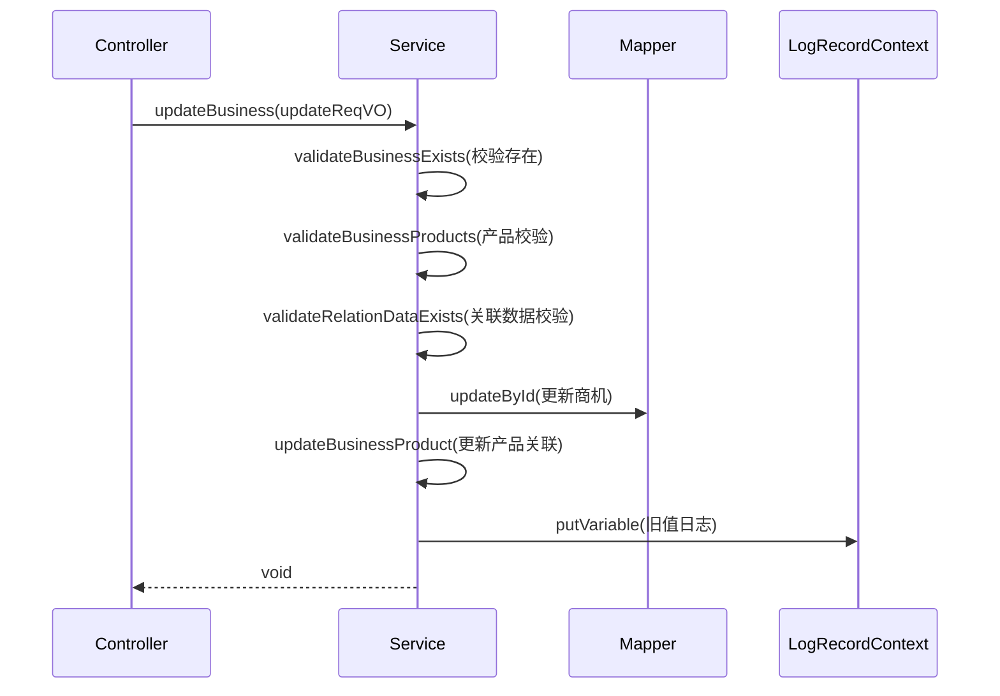
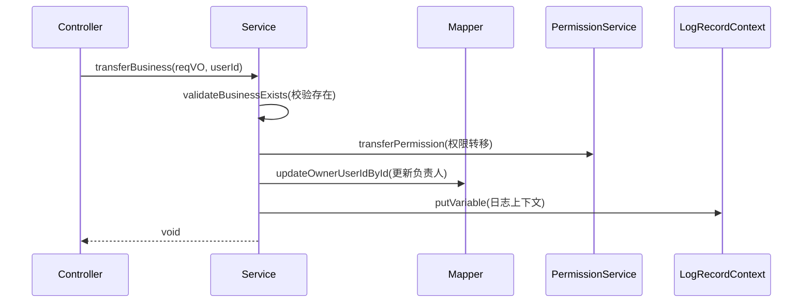
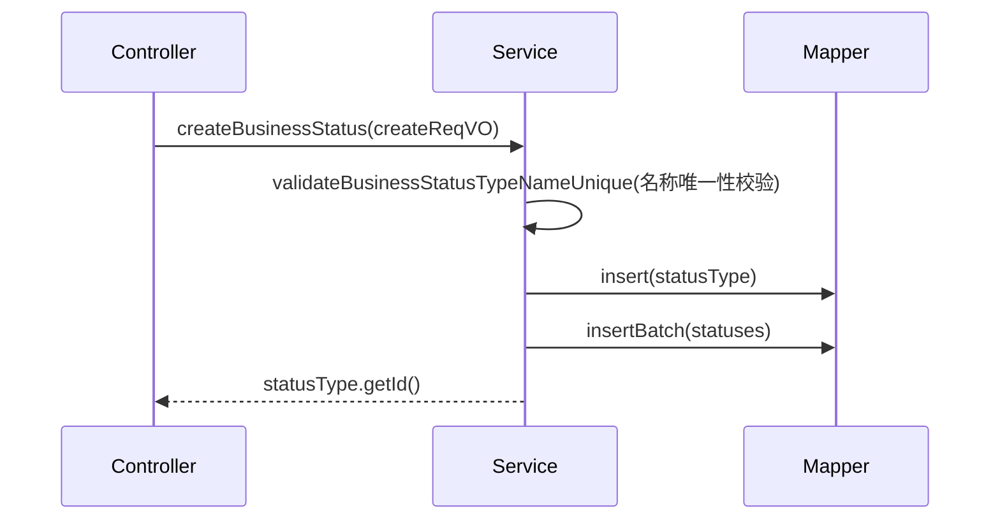
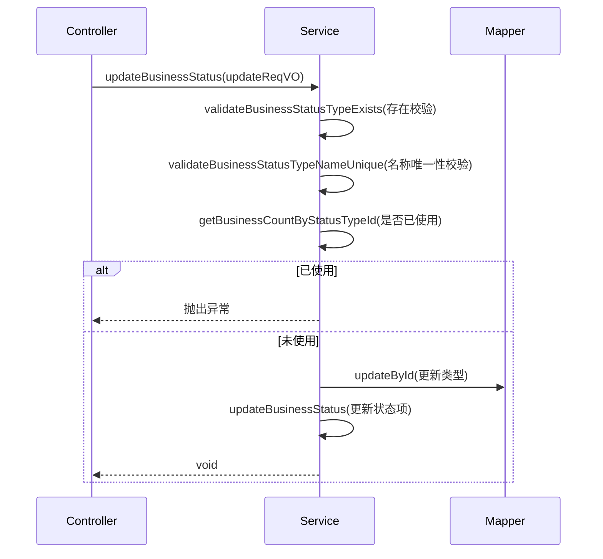
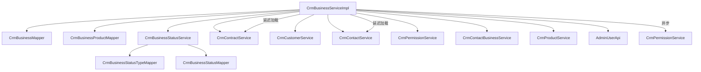

# 业务服务模块 (Business Service Module) 文档

## 1. 模块概述

业务服务模块是 CRM（客户关系管理）系统的核心模块之一，主要负责**商机（Business Opportunity）**的全生命周期管理。该模块提供了商机的创建、更新、删除、转移、状态变更等核心功能，同时管理商机状态类型的配置。

### 模块定位

```
┌─────────────────────────────────────────────────────────────────┐
│                      CRM 系统                                   │
│  ┌─────────────┐    ┌─────────────┐    ┌─────────────┐          │
│  │ 客户管理    │    │ 联系人管理  │    │ 合同管理    │          │
│  │ (Customer)  │    │ (Contact)   │    │ (Contract)  │          │
│  └──────┬────┘    └──────┬────┘    └──────┬────┘          │
│         │                │                │                │
│         └────────┬───────┼────────┬─────┘                │
│                  │       │                                  │
│           ┌──────▼───────▼──────┐                          │
│           │   业务服务模块       │                          │
│           │   (Business Service) │                          │
│           │  - 商机管理          │                          │
│           │  - 商机状态管理      │                          │
│           └────────┬───────────┘                          │
│                    │                                      │
│         ┌──────────▼──────────┐    ┌─────────────────────┐ │
│         │ 数据权限管理        │    │ 操作日志记录        │ │
│         │ (Permission)        │    │ (Log Record)        │ │
│         └─────────────────────┘    └─────────────────────┘ │
└─────────────────────────────────────────────────────────────────┘
```

### 核心功能

| 功能模块 | 描述 |
|---------|------|
| **商机管理** | 创建、查询、更新、删除、转移商机，管理商机与产品、客户、联系人的关联 |
| **商机状态管理** | 配置商机状态类型（如：潜在客户、已成交、已流失等），管理状态流转 |
| **数据权限** | 基于角色的数据权限控制，确保用户只能访问其权限范围内的商机 |
| **操作日志** | 记录所有商机相关操作，支持审计和追溯 |

## 2. 架构设计

### 2.1 模块组件关系

```mermaid
classDiagram
    class CrmBusinessServiceImpl {
        +createBusiness()
        +updateBusiness()
        +updateBusinessFollowUp()
        +updateBusinessStatus()
        +deleteBusiness()
        +transferBusiness()
        +getBusiness()
        +getBusinessPage()
    }

    class CrmBusinessStatusServiceImpl {
        +createBusinessStatus()
        +updateBusinessStatus()
        +deleteBusinessStatusType()
        +getBusinessStatusType()
        +getBusinessStatusListByTypeId()
    }

    class CrmBusinessMapper {
        +insert()
        +updateById()
        +deleteById()
        +selectPage()
    }

    class CrmBusinessProductMapper {
        +insertBatch()
        +updateBatch()
        +deleteByIds()
        +selectListByBusinessId()
    }

    class CrmBusinessStatusTypeMapper {
        +insert()
        +updateById()
        +selectPage()
        +selectByName()
    }

    class CrmBusinessStatusMapper {
        +insertBatch()
        +updateBatch()
        +deleteByTypeId()
        +selectListByTypeId()
    }

    class CrmPermissionService {
        +createPermission()
        +deletePermission()
        +transferPermission()
    }

    class CrmContactBusinessService {
        +createContactBusinessList()
        +getContactBusinessListByContactId()
    }

    CrmBusinessServiceImpl -- CrmBusinessMapper : 依赖
    CrmBusinessServiceImpl -- CrmBusinessProductMapper : 依赖
    CrmBusinessServiceImpl -- CrmBusinessStatusService : 依赖
    CrmBusinessServiceImpl -- CrmContractService : 依赖
    CrmBusinessServiceImpl -- CrmCustomerService : 依赖
    CrmBusinessServiceImpl -- CrmContactService : 依赖
    CrmBusinessServiceImpl -- CrmPermissionService : 依赖
    CrmBusinessServiceImpl -- CrmContactBusinessService : 依赖
    CrmBusinessServiceImpl -- CrmProductService : 依赖
    CrmBusinessServiceImpl -- AdminUserApi : 依赖

    CrmBusinessStatusServiceImpl -- CrmBusinessStatusTypeMapper : 依赖
    CrmBusinessStatusServiceImpl -- CrmBusinessStatusMapper : 依赖
    CrmBusinessStatusServiceImpl -- CrmBusinessService : 依赖
```



### 2.2 数据模型

#### 2.2.1 核心实体关系

```mermaid
erDiagram
    CRM_BUSINESS ||--o{ CRM_BUSINESS_PRODUCT : "包含"
    CRM_BUSINESS ||--o{ CRM_CONTACT_BUSINESS : "关联"
    CRM_BUSINESS }|--|| CRM_CUSTOMER : "所属客户"
    CRM_BUSINESS }|--|| CRM_CONTACT : "关联联系人"
    CRM_BUSINESS }|--|| CRM_BUSINESS_STATUS : "当前状态"
    CRM_BUSINESS_TYPE ||--o{ CRM_BUSINESS_STATUS : "包含"
    
    CRM_BUSINESS_PRODUCT {
        long id 主键
        long businessId 商机ID
        long productId 产品ID
        BigDecimal businessPrice 单价
        int count 数量
        BigDecimal totalPrice 总价
    }
    
    CRM_BUSINESS {
        long id 主键
        String name 名称
        long customerId 客户ID
        long contactId 联系人ID
        long ownerUserId 负责人ID
        long statusTypeId 状态类型ID
        long statusId 当前状态ID
        BigDecimal totalProductPrice 产品总价
        BigDecimal discountPrice 折扣价
        BigDecimal totalPrice 总价
        boolean followUpStatus 是否跟进
        LocalDateTime contactNextTime 下次联系时间
        LocalDateTime contactLastTime 上次联系时间
        LocalDateTime createTime 创建时间
        LocalDateTime updateTime 更新时间
    }
    
    CRM_BUSINESS_STATUS_TYPE {
        long id 主键
        String name 名称
        int sort 排序
    }
    
    CRM_BUSINESS_STATUS {
        long id 主键
        long typeId 状态类型ID
        String name 状态名称
        int sort 排序
    }
    
    CRM_CONTACT_BUSINESS {
        long id 主键
        long contactId 联系人ID
        long businessId 商机ID
    }
```

#### 2.2.2 状态流转模型



## 3. 核心服务详解

### 3.1 CrmBusinessServiceImpl

#### 3.1.1 主要职责

- 商机全生命周期管理（创建、查询、更新、删除、转移）
- 商机与产品、客户、联系人的关联管理
- 商机状态变更管理
- 数据权限控制
- 操作日志记录

#### 3.1.2 核心方法

| 方法名 | 描述 | 事务 | 权限校验 |
|-------|------|------|---------|
| `createBusiness` | 创建新商机 | ✅ | 无 |
| `updateBusiness` | 更新商机信息 | ✅ | WRITE |
| `updateBusinessFollowUp` | 更新跟进信息 | ❌ | WRITE |
| `updateBusinessContactNextTime` | 批量更新下次联系时间 | ❌ | WRITE |
| `updateBusinessStatus` | 更新商机状态 | ✅ | WRITE |
| `deleteBusiness` | 删除商机 | ✅ | OWNER |
| `transferBusiness` | 转移商机负责人 | ✅ | OWNER |
| `getBusiness` | 获取商机详情 | ❌ | READ |
| `getBusinessPage` | 分页查询商机 | ❌ | 根据条件动态校验 |

#### 3.1.3 创建商机流程



**关键校验逻辑：**

1. **产品校验**：验证产品是否存在，计算总价和折扣价
2. **关联数据校验**：
   - 状态类型是否存在
   - 客户是否存在
   - 联系人是否存在且属于同一客户
   - 负责人是否存在
3. **权限创建**：自动为负责人创建 OWNER 级别的数据权限
4. **联系人关联**：如果指定了联系人，自动建立关联关系

#### 3.1.4 更新商机流程



**更新注意事项：**
- `ownerUserId` 和 `statusTypeId` 不允许更新（设为 null）
- 使用 diffList 算法对比新旧产品列表，仅处理变更部分
- 记录旧值用于操作日志对比

#### 3.1.5 转移商机流程



**权限转移逻辑：**
1. 调用 `permissionService.transferPermission()` 转移数据权限
2. 更新 `ownerUserId` 字段
3. 保留原有的权限级别（OWNER、MEMBER 等）

### 3.2 CrmBusinessStatusServiceImpl

#### 3.2.1 主要职责

- 商机状态类型管理（增删改查）
- 商机状态项管理（每个类型包含多个状态）
- 状态排序维护
- 状态唯一性校验

#### 3.2.2 核心方法

| 方法名 | 描述 | 事务 |
|-------|------|------|
| `createBusinessStatus` | 创建新的状态类型及状态项 | ✅ |
| `updateBusinessStatus` | 更新状态类型及状态项 | ✅ |
| `deleteBusinessStatusType` | 删除状态类型（禁止删除已使用的） | ✅ |
| `getBusinessStatusType` | 获取状态类型详情 | ❌ |
| `getBusinessStatusTypeList` | 获取所有状态类型列表 | ❌ |
| `getBusinessStatusListByTypeId` | 获取指定类型的状态列表（已排序） | ❌ |

#### 3.2.3 状态类型创建流程



**状态项排序：** 每个状态项自动分配排序值（从 0 开始递增），用于 UI 展示顺序。

#### 3.2.4 状态类型更新流程



**使用限制：** 如果状态类型已被商机使用，则禁止更新，确保数据一致性。

## 4. 权限控制

### 4.1 权限模型

业务服务模块采用基于角色的数据权限控制（RBAC），通过 `@CrmPermission` 注解实现方法级别的权限校验。

```java
// 权限注解示例
@CrmPermission(bizType = CrmBizTypeEnum.CRM_BUSINESS, bizId = "#updateReqVO.id", level = CrmPermissionLevelEnum.WRITE)
public void updateBusiness(CrmBusinessSaveReqVO updateReqVO) { ... }

@CrmPermission(bizType = CrmBizTypeEnum.CRM_BUSINESS, bizId = "#id", level = CrmPermissionLevelEnum.OWNER)
public void deleteBusiness(Long id) { ... }
```

### 4.2 权限级别

| 级别 | 描述 | 可执行操作 |
|------|------|-----------|
| **OWNER** | 负责人 | 读、写、删除、转移 |
| **MEMBER** | 成员 | 读、写（部分字段） |
| **DEPT_LEADER** | 部门领导 | 读、写（本部门） |
| **ALL** | 所有人 | 只读 |

### 4.3 权限操作

```java
// 创建权限
permissionService.createPermission(new CrmPermissionCreateReqBO()
    .setUserId(business.getOwnerUserId())
    .setBizType(CrmBizTypeEnum.CRM_BUSINESS.getType())
    .setBizId(business.getId())
    .setLevel(CrmPermissionLevelEnum.OWNER.getLevel()));

// 删除权限
permissionService.deletePermission(CrmBizTypeEnum.CRM_BUSINESS.getType(), id);

// 转移权限
permissionService.transferPermission(new CrmPermissionTransferReqBO(
    userId, CrmBizTypeEnum.CRM_BUSINESS.getType(),
    reqVO.getId(), reqVO.getNewOwnerUserId(), reqVO.getOldOwnerPermissionLevel()));
```

## 5. 操作日志

业务服务模块集成了操作日志记录功能，使用 `@LogRecord` 注解自动记录关键操作。

### 5.1 日志记录示例

```java
@LogRecord(type = CRM_BUSINESS_TYPE, subType = CRM_BUSINESS_CREATE_SUB_TYPE, 
         bizNo = "{{#business.id}}", success = CRM_BUSINESS_CREATE_SUCCESS)
public Long createBusiness(CrmBusinessSaveReqVO createReqVO, Long userId) { ... }

@LogRecord(type = CRM_BUSINESS_TYPE, subType = CRM_BUSINESS_UPDATE_SUB_TYPE, 
         bizNo = "{{#updateReqVO.id}}", success = CRM_BUSINESS_UPDATE_SUCCESS)
public void updateBusiness(CrmBusinessSaveReqVO updateReqVO) { ... }
```

### 5.2 日志上下文

通过 `LogRecordContext` 设置日志上下文变量，用于日志展示和对比：

```java
// 创建时
LogRecordContext.putVariable("business", business);

// 更新时
LogRecordContext.putVariable(DiffParseFunction.OLD_OBJECT, BeanUtils.toBean(oldBusiness, CrmBusinessSaveReqVO.class));
LogRecordContext.putVariable("businessName", oldBusiness.getName());

// 状态变更时
LogRecordContext.putVariable("businessName", business.getName());
LogRecordContext.putVariable("oldStatusName", getBusinessStatusName(...));
LogRecordContext.putVariable("newStatusName", getBusinessStatusName(...));
```

## 6. 数据交互

### 6.1 请求/响应对象

#### 6.1.1 商机创建请求

```java
// CrmBusinessSaveReqVO
{
    "name": "项目名称",
    "customerId": 1001,
    "contactId": 2001,
    "ownerUserId": 100,
    "statusTypeId": 1,
    "products": [
        {
            "productId": 101,
            "businessPrice": 10000.00,
            "count": 2
        }
    ]
}
```

#### 6.1.2 商机响应

```java
// CrmBusinessRespVO
{
    "id": 1,
    "name": "项目名称",
    "customerId": 1001,
    "customerName": "客户名称",
    "contactId": 2001,
    "contactName": "联系人名称",
    "ownerUserId": 100,
    "ownerName": "张三",
    "statusTypeId": 1,
    "statusName": "潜在客户",
    "totalProductPrice": 20000.00,
    "discountPercent": 10,
    "totalPrice": 18000.00,
    "followUpStatus": true,
    "contactNextTime": "2024-01-15T10:00:00",
    "products": [
        {
            "productId": 101,
            "productName": "产品A",
            "businessPrice": 10000.00,
            "count": 2,
            "totalPrice": 20000.00
        }
    ]
}
```

### 6.2 状态类型配置

```java
// CrmBusinessStatusSaveReqVO
{
    "id": null,
    "name": "销售阶段",
    "statuses": [
        {
            "name": "潜在客户",
            "sort": 0
        },
        {
            "name": "需求分析",
            "sort": 1
        },
        {
            "name": "方案报价",
            "sort": 2
        },
        {
            "name": "商务谈判",
            "sort": 3
        },
        {
            "name": "已成交",
            "sort": 4
        },
        {
            "name": "已流失",
            "sort": 5
        }
    ]
}
```

## 7. 异常处理

业务服务模块定义了多种异常场景，通过 `ErrorCodeConstants` 枚举统一管理：

| 异常码 | 描述 |
|--------|------|
| `BUSINESS_NOT_EXISTS` | 商机不存在 |
| `BUSINESS_CONTACT_CUSTOMER_NOT_MATCH` | 联系人与客户不匹配 |
| `BUSINESS_UPDATE_STATUS_FAIL_END_STATUS` | 已结束状态的商机不能变更状态 |
| `BUSINESS_UPDATE_STATUS_FAIL_STATUS_EQUALS` | 状态未发生变更 |
| `BUSINESS_DELETE_FAIL_CONTRACT_EXISTS` | 商机关联了合同，不能删除 |
| `BUSINESS_STATUS_UPDATE_FAIL_USED` | 状态类型已被使用，不能更新 |
| `BUSINESS_STATUS_DELETE_FAIL_USED` | 状态类型已被使用，不能删除 |

## 8. 依赖关系

### 8.1 模块依赖

```
业务服务模块 (business_service)
├── 依赖：系统模块 (system) - 用户权限、字典等基础服务
├── 依赖：CRM 模块 - 客户、联系人、合同、产品等子模块
├── 依赖：权限框架 - 数据权限注解和校验
├── 依赖：日志框架 - 操作日志记录
└── 依赖：基础工具 - BeanUtils、CollectionUtils、MoneyUtils 等
```

### 8.2 服务依赖关系图



## 9. 使用示例

### 9.1 创建商机

```java
// 前端请求
CrmBusinessSaveReqVO reqVO = new CrmBusinessSaveReqVO();
reqVO.setName("XX项目");
reqVO.setCustomerId(1001);
reqVO.setContactId(2001);
reqVO.setOwnerUserId(100);
reqVO.setStatusTypeId(1);
reqVO.setProducts(Arrays.asList(
    new CrmBusinessSaveReqVO.BusinessProduct(101, 10000.00, 2),
    new CrmBusinessSaveReqVO.BusinessProduct(102, 5000.00, 1)
));

// 调用服务
Long businessId = businessService.createBusiness(reqVO, 100);
```

### 9.2 更新商机状态

```java
// 更新状态为"已成交"
CrmBusinessUpdateStatusReqVO statusReqVO = new CrmBusinessUpdateStatusReqVO();
statusReqVO.setId(businessId);
statusReqVO.setStatusId(4); // 已成交状态ID

businessService.updateBusinessStatus(statusReqVO);
```

### 9.3 转移商机

```java
// 将商机转移给新的负责人
CrmBusinessTransferTransferVO transferReqVO = new CrmBusinessTransferReqVO();
transferReqVO.setId(businessId);
transferReqVO.setNewOwnerUserId(200); // 新负责人ID
transferReqVO.setOldOwnerPermissionLevel(CrmPermissionLevelEnum.OWNER.getLevel());

businessService.transferBusiness(transferReqVO, 100);
```

### 9.4 分页查询商机

```java
// 查询指定客户的商机
CrmBusinessPageReqVO pageReqVO = new CrmBusinessPageReqVO();
pageReqVO.setCustomerId(1001);
pageReqVO.setPageNum(1);
pageReqVO.setPageSize(20);

PageResult<CrmBusinessDO> pageResult = businessService.getBusinessPage(pageReqVO, 100);
```

## 10. 扩展点

### 10.1 自定义状态类型

业务服务模块支持自定义商机状态类型，通过 `CrmBusinessStatusTypeDO` 配置不同的状态流程，适应不同企业的业务需求。

### 10.2 权限扩展

通过 `CrmPermission` 注解和 `CrmPermissionService` 接口，可以扩展更细粒度的权限控制策略，如：

- 数据范围控制（仅本部门、仅本人）
- 字段级权限控制
- 动态权限校验

### 10.3 日志扩展

通过 `LogRecordContext` 可以自定义日志上下文变量，在操作日志中展示更多业务信息。

## 11. 参考文档

- [系统模块文档](system.md) - 用户、权限、字典等基础服务
- [CRM 模块文档](crm.md) - 客户、联系人、合同等子模块
- [权限框架文档](permission-framework.md) - 数据权限注解和校验机制
- [日志框架文档](log-framework.md) - 操作日志记录机制
