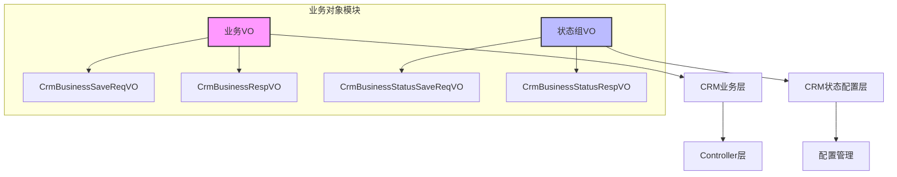
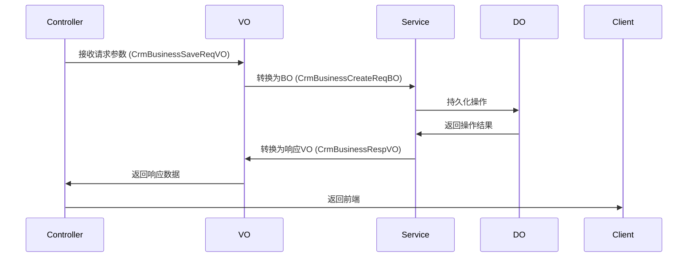
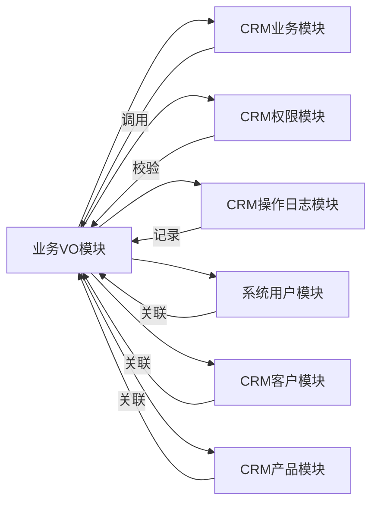

# 业务对象（VO）模块文档

## 1. 模块概述

业务对象（VO，Value Object）模块是CRM（客户关系管理）系统中的核心数据传输层，负责封装业务数据的请求和响应对象。该模块主要包含两类VO：

- **业务VO**：用于商机（Business）相关的数据传输
- **状态组VO**：用于商机状态组（Business Status Type）的配置管理

VO层作为Controller与Service之间的数据桥梁，实现了前后端数据交互的标准化，同时集成了数据校验、日志记录等功能。

## 2. 模块架构



## 3. 核心组件说明

### 3.1 业务VO（CrmBusiness系列）

#### 3.1.1 CrmBusinessSaveReqVO - 商机创建/更新请求VO

**功能描述**：用于管理后台创建或更新商机时的请求数据封装。

**字段说明**：

| 字段名 | 类型 | 描述 | 必填 | 备注 |
|--------|------|------|------|------|
| id | Long | 主键 | 否 | 更新时必填 |
| name | String | 商机名称 | 是 | 最大长度255 |
| customerId | Long | 客户编号 | 是 | 关联客户表 |
| contactNextTime | LocalDateTime | 下次联系时间 | 否 | 格式：yyyy-MM-dd HH:mm:ss |
| ownerUserId | Long | 负责人用户编号 | 是 | 关联用户表 |
| statusTypeId | Long | 商机状态组编号 | 是 | 关联状态组表 |
| dealTime | LocalDateTime | 预计成交日期 | 否 | 格式：yyyy-MM-dd HH:mm:ss |
| discountPercent | BigDecimal | 整单折扣 | 是 | 百分比格式 |
| remark | String | 备注 | 否 | 最大长度500 |
| contactId | Long | 联系人编号 | 否 | 关联联系人表 |
| products | List<BusinessProduct> | 产品列表 | 否 | 至少包含1个产品 |

**嵌套类 BusinessProduct**：

| 字段名 | 类型 | 描述 | 必填 |
|--------|------|------|------|
| productId | Long | 产品编号 | 是 |
| productPrice | BigDecimal | 产品单价 | 是 |
| businessPrice | BigDecimal | 商机价格 | 是 |
| count | Integer | 产品数量 | 是 |

**使用场景**：
- 创建新商机
- 更新现有商机
- 批量导入商机数据

#### 3.1.2 CrmBusinessRespVO - 商机响应VO

**功能描述**：用于查询商机列表或获取商机详情时的响应数据封装，包含关联查询的扩展字段。

**字段说明**：

| 字段名 | 类型 | 描述 | 备注 |
|--------|------|------|------|
| id | Long | 编号 | - |
| name | String | 商机名称 | - |
| customerId | Long | 客户编号 | - |
| customerName | String | 客户名称 | 关联查询字段 |
| followUpStatus | Boolean | 跟进状态 | - |
| contactLastTime | LocalDateTime | 最后跟进时间 | - |
| contactNextTime | LocalDateTime | 下次联系时间 | - |
| ownerUserId | Long | 负责人的用户编号 | - |
| ownerUserName | String | 负责人名字 | 关联查询字段 |
| ownerUserDeptName | String | 负责人部门 | 关联查询字段 |
| statusTypeId | Long | 商机状态组编号 | - |
| statusTypeName | String | 商机状态组名字 | 关联查询字段 |
| statusId | Long | 商机状态编号 | - |
| statusName | String | 状态名称 | 关联查询字段 |
| endStatus | Integer | 结束状态 | 0-未结束，1-已关闭，2-已丢失 |
| endRemark | String | 结束时的备注 | - |
| dealTime | LocalDateTime | 预计成交日期 | - |
| totalProductPrice | BigDecimal | 产品总金额 | - |
| discountPercent | BigDecimal | 整单折扣 | - |
| totalPrice | BigDecimal | 商机总金额 | - |
| remark | String | 备注 | - |
| creator | String | 创建人 | - |
| creatorName | String | 创建人名字 | 关联查询字段 |
| createTime | LocalDateTime | 创建时间 | - |
| updateTime | LocalDateTime | 更新时间 | - |
| products | List<Product> | 产品列表 | - |

**嵌套类 Product**：

| 字段名 | 类型 | 描述 | 备注 |
|--------|------|------|------|
| id | Long | 编号 | - |
| productId | Long | 产品编号 | - |
| productName | String | 产品名称 | 关联查询字段 |
| productNo | String | 产品条码 | - |
| productUnit | Integer | 产品单位 | - |
| productPrice | BigDecimal | 产品单价 | - |
| businessPrice | BigDecimal | 商机价格 | - |
| count | BigDecimal | 产品数量 | - |
| totalPrice | BigDecimal | 总计价格 | - |

**使用场景**：
- 查询商机列表
- 查看商机详情
- 导出商机数据（支持Excel导出）

### 3.2 状态组VO（CrmBusinessStatus系列）

#### 3.2.1 CrmBusinessStatusSaveReqVO - 商机状态组保存请求VO

**功能描述**：用于创建或修改商机状态组时的请求数据封装。

**字段说明**：

| 字段名 | 类型 | 描述 | 必填 | 备注 |
|--------|------|------|------|------|
| id | Long | 主键 | 否 | 更新时必填 |
| name | String | 状态类型名 | 是 | 最大长度255 |
| deptIds | List<Long> | 使用的部门编号 | 否 | 多部门关联 |
| statuses | List<Status> | 商机状态集合 | 是 | 至少包含1个状态 |

**嵌套类 Status**：

| 字段名 | 类型 | 描述 | 必填 | 备注 |
|--------|------|------|------|------|
| id | Long | 状态编号 | 否 | 更新时必填 |
| name | String | 状态名 | 是 | 最大长度255 |
| percent | BigDecimal | 赢单率 | 是 | 0-100之间的数值 |
| sort | Integer | 排序 | 否 | 正整数，越小越靠前 |

**使用场景**：
- 创建新的商机状态组
- 修改现有状态组配置
- 配置不同部门的商机状态流程

#### 3.2.2 CrmBusinessStatusRespVO - 商机状态组响应VO

**功能描述**：用于查询商机状态组列表或获取状态组详情时的响应数据封装。

**字段说明**：

| 字段名 | 类型 | 描述 | 备注 |
|--------|------|------|------|
| id | Long | 状态组编号 | - |
| name | String | 状态组名字 | - |
| deptIds | List<Long> | 使用的部门编号 | - |
| deptNames | List<String> | 使用的部门名称 | 关联查询字段 |
| creator | String | 创建人 | - |
| createTime | LocalDateTime | 创建时间 | - |
| statuses | List<Status> | 状态集合 | - |

**嵌套类 Status**：

| 字段名 | 类型 | 描述 | 备注 |
|--------|------|------|------|
| id | Long | 状态编号 | - |
| name | String | 状态名 | - |
| percent | BigDecimal | 赢单率 | - |
| sort | Integer | 排序 | - |

**使用场景**：
- 查询状态组列表
- 查看状态组详情
- 配置状态组关联的部门

## 4. 模块交互关系

### 4.1 与CRM业务模块的交互



### 4.2 与其他模块的依赖关系



## 5. 功能特性

### 5.1 数据校验

- 使用 `@NotNull`、`@NotEmpty` 等JSR-303校验注解
- 自定义错误消息提示
- 嵌套对象支持级联校验（如 `@Valid`）

### 5.2 操作日志

- 集成 `@DiffLogField` 注解，自动记录字段变更
- 支持自定义解析函数（如 `CrmCustomerParseFunction`、`SysAdminUserParseFunction`）
- 自动记录创建人、创建时间、更新时间等审计信息

### 5.3 Excel导出

- 集成 `@ExcelProperty` 注解，支持Excel列名自定义
- 支持 `@ExcelIgnoreUnannotated` 忽略未标注的字段
- 响应VO可直接用于Excel导出

### 5.4 API文档

- 集成 `@Schema` 注解，自动生成OpenAPI文档
- 字段描述清晰，便于前端对接
- 示例值（example）提供直观参考

## 6. 使用示例

### 6.1 创建商机

```java
// 前端请求示例
{
    "name": "某公司ERP系统",
    "customerId": 10299,
    "ownerUserId": 14334,
    "statusTypeId": 25714,
    "contactNextTime": "2024-01-15 10:00:00",
    "dealTime": "2024-03-31 00:00:00",
    "discountPercent": 95.00,
    "remark": "需要定制化开发",
    "products": [
        {
            "productId": 20529,
            "productPrice": 10000.00,
            "businessPrice": 9500.00,
            "count": 1
        }
    ]
}
```

### 6.2 查询商机列表

```json
// 响应示例
{
    "id": 1,
    "name": "某公司ERP系统",
    "customerId": 10299,
    "customerName": "张三",
    "followUpStatus": true,
    "contactLastTime": "2024-01-10 14:30:00",
    "contactNextTime": "2024-01-15 10:00:00",
    "ownerUserId": 14334,
    "ownerUserName": "李四",
    "ownerUserDeptName": "技术部",
    "statusTypeId": 25714,
    "statusTypeName": "进行中",
    "statusId": 1,
    "statusName": "跟进中",
    "endStatus": 0,
    "dealTime": "2024-03-31 00:00:00",
    "totalProductPrice": 10000.00,
    "discountPercent": 95.00,
    "totalPrice": 9500.00,
    "remark": "需要定制化开发",
    "creator": "admin",
    "creatorName": "系统管理员",
    "createTime": "2024-01-01 09:00:00",
    "updateTime": "2024-01-10 14:30:00",
    "products": [
        {
            "id": 1,
            "productId": 20529,
            "productName": "ERP系统",
            "productNo": "ERP2024001",
            "productUnit": 1,
            "productPrice": 10000.00,
            "businessPrice": 9500.00,
            "count": 1,
            "totalPrice": 9500.00
        }
    ]
}
```

### 6.3 配置商机状态组

```java
// 前端请求示例
{
    "name": "销售流程",
    "deptIds": [1, 2, 3],
    "statuses": [
        {
            "name": "潜在客户",
            "percent": 10.00,
            "sort": 1
        },
        {
            "name": "需求分析",
            "percent": 30.00,
            "sort": 2
        },
        {
            "name": "方案报价",
            "percent": 50.00,
            "sort": 3
        },
        {
            "name": "谈判成交",
            "percent": 80.00,
            "sort": 4
        }
    ]
}
```

## 7. 相关模块参考

- [CRM业务模块](business.md) - 业务逻辑实现
- [系统权限模块](system_permission.md) - 权限校验
- [系统用户模块](system_user.md) - 用户信息关联
- [客户管理模块](crm_customer.md) - 客户数据关联
- [产品管理模块](crm_product.md) - 产品数据关联
- [操作日志模块](operatelog.md) - 日志记录

## 8. 版本信息

| 版本 | 日期 | 作者 | 说明 |
|------|------|------|------|
| 1.0.0 | 2024-01-01 | 开发团队 | 初始版本 |
