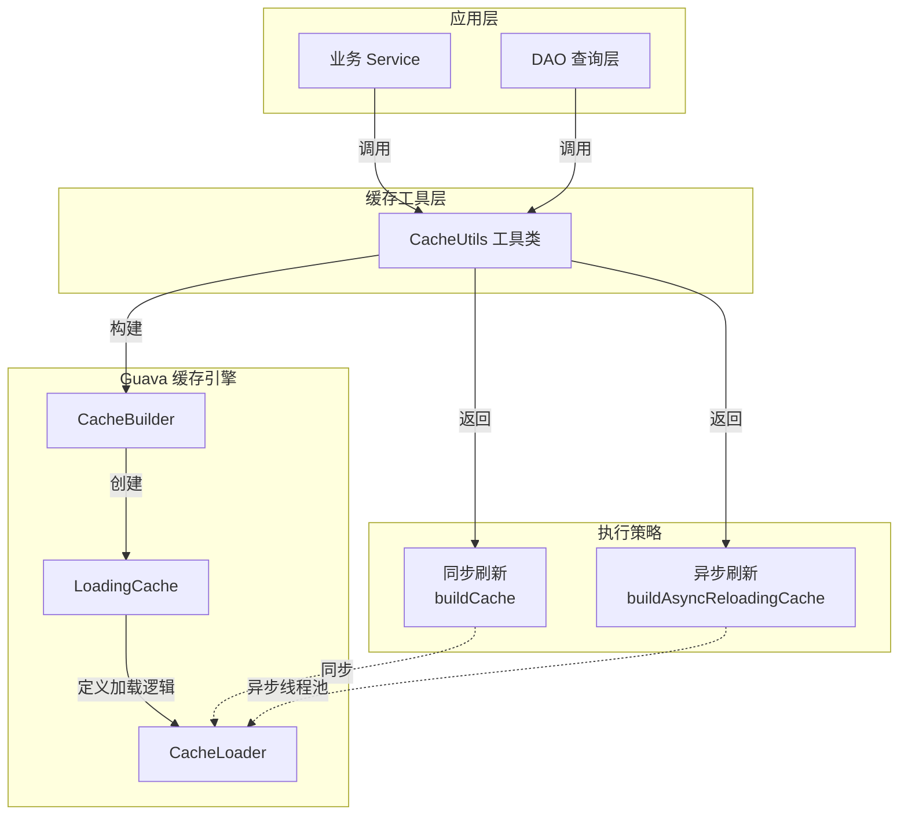
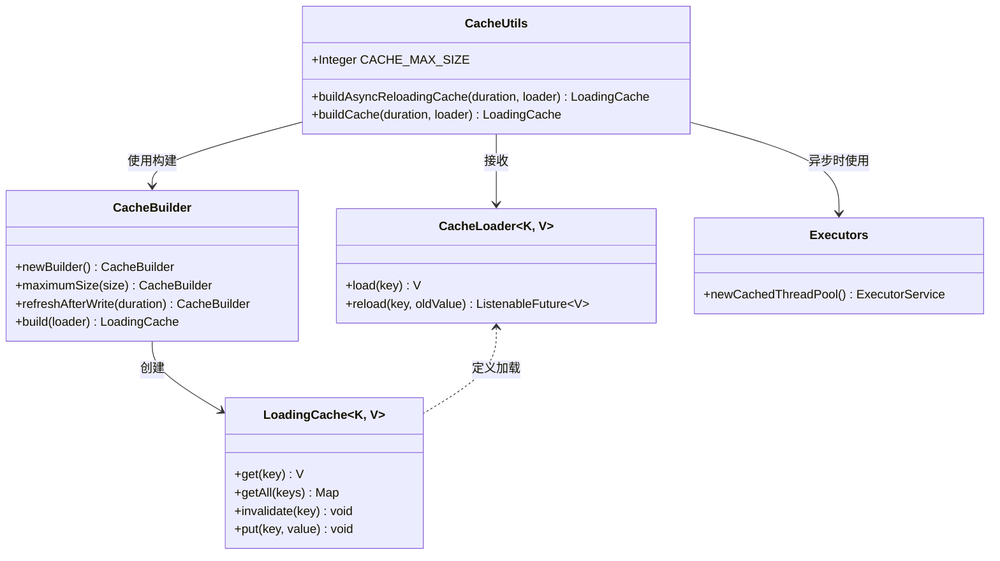
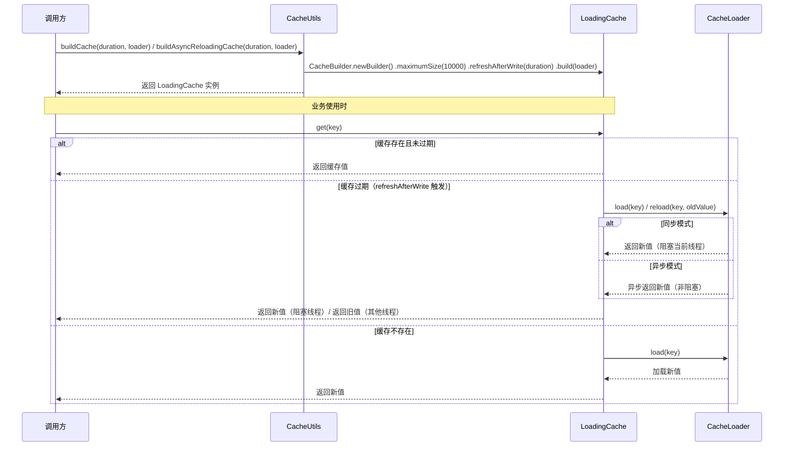
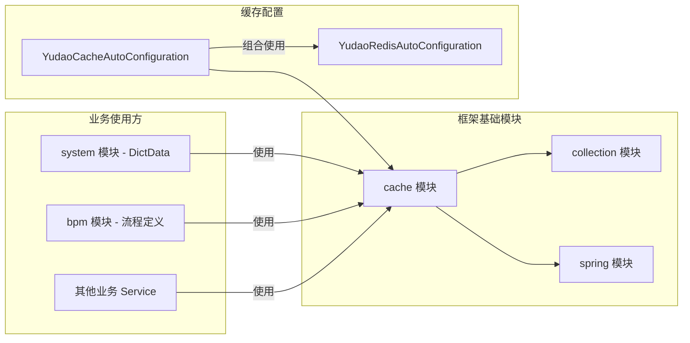

# 缓存工具模块 (Cache Utils)

## 1. 模块简介

### 1.1 模块概述

`CacheUtils` 是基于 Google Guava 库提供的本地缓存工具类，位于 `yudao-framework/yudao-common` 模块中。该模块为系统提供了高性能的本地缓存构建能力，支持同步刷新和异步刷新两种模式，适用于高频访问、变更不频繁的数据缓存场景。

通过 Guava 的 `LoadingCache` + `refreshAfterWrite` 策略，实现了「只阻塞当前数据加载线程，其他线程返回旧值」的缓存击穿防护机制，有效提升了系统在高并发场景下的稳定性。

### 1.2 设计目标

- 提供统一的本地缓存构建入口
- 利用 Guava 缓存机制防缓存击穿
- 支持同步/异步两种刷新策略
- 简化开发人员缓存使用成本

### 1.3 模块定位

本模块是框架层的基础工具模块，被 `yudao-spring-boot-starter-redis`、业务模块中的 Service 层等广泛使用。它不依赖于 Redis 等外部中间件，仅使用进程内内存作为缓存存储介质。

---

## 2. 核心架构

### 2.1 架构图



### 2.2 组件依赖关系



### 2.3 数据流图



---

## 3. 核心 API 说明

### 3.1 `buildAsyncReloadingCache`

```java
public static <K, V> LoadingCache<K, V> buildAsyncReloadingCache(Duration duration, CacheLoader<K, V> loader)
```

**功能描述**：构建异步刷新的 `LoadingCache` 实例。当缓存过期时，刷新操作在独立的线程池中异步执行，调用线程不会阻塞，而是返回旧值（如果有）。

**参数说明**：

| 参数 | 类型 | 说明 |
|------|------|------|
| `duration` | `Duration` | 缓存刷新间隔时间，从写入/刷新成功后开始计时 |
| `loader` | `CacheLoader<K, V>` | 缓存加载器，定义缓存不存在或过期时的数据加载逻辑 |

**返回值**：`LoadingCache<K, V>` - Guava 加载缓存实例

**使用建议**：
> 如果缓存数据与 `ThreadLocal`（如当前用户、租户等信息）相关，需要注意异步线程无法继承父线程的 `ThreadLocal` 变量。此时应使用 `buildCache(Duration, CacheLoader)` 同步刷新方法，或自行处理 `ThreadLocal` 的传递。

**适用场景简化为**：
- 与「全局」、「系统」配置相关的数据 → 使用 `buildAsyncReloadingCache`
- 与「人」（用户、租户等）相关的数据 → 使用 `buildCache`

### 3.2 `buildCache`

```java
public static <K, V> LoadingCache<K, V> buildCache(Duration duration, CacheLoader<K, V> loader)
```

**功能描述**：构建同步刷新的 `LoadingCache` 实例。当缓存过期时，首次访问的线程会同步执行加载逻辑并阻塞等待结果，其他并发访问线程则返回旧值（如果有）。

**参数说明**：

| 参数 | 类型 | 说明 |
|------|------|------|
| `duration` | `Duration` | 缓存刷新间隔时间 |
| `loader` | `CacheLoader<K, V>` | 缓存加载器 |

**返回值**：`LoadingCache<K, V>` - Guava 加载缓存实例

### 3.3 核心配置说明

两个方法均使用了以下 Guava `CacheBuilder` 配置：

| 配置项 | 值 | 说明 |
|--------|-----|------|
| `maximumSize` | `10000` | 最大缓存条目数，防止内存溢出 |
| `refreshAfterWrite` | 由 `duration` 参数指定 | 写入后刷新策略：仅阻塞当前数据加载线程，其他线程返回旧值 |

> **提示**：与 `expireAfterWrite`（写入后过期）不同，`refreshAfterWrite` 的核心优势是：在缓存过期时，只有第一个请求线程被阻塞去加载数据，其他并发请求线程直接返回旧值，从而避免缓存击穿。

---

## 4. 使用示例

### 4.1 异步刷新缓存（适用于全局数据）

```java
public class DictDataServiceImpl {
    
    private final LoadingCache<String, List<DictDataDO>> dictDataCache = 
        CacheUtils.buildAsyncReloadingCache(Duration.ofMinutes(30), new CacheLoader<String, List<DictDataDO>>() {
            @Override
            public List<DictDataDO> load(String dictType) {
                // 从数据库加载字典数据
                return dictDataMapper.selectListByDictType(dictType);
            }
        });
    
    public List<DictDataDO> getDictDataByType(String dictType) {
        return dictDataCache.getUnchecked(dictType);
    }
}
```

### 4.2 同步刷新缓存（适用于用户相关数据）

```java
public class UserPermissionServiceImpl {
    
    private final LoadingCache<Long, Set<String>> userPermissionCache = 
        CacheUtils.buildCache(Duration.ofMinutes(10), new CacheLoader<Long, Set<String>>() {
            @Override
            public Set<String> load(Long userId) {
                // 从数据库加载用户权限标识集合
                return permissionMapper.selectPermissionsByUserId(userId);
            }
        });
    
    public boolean hasPermission(Long userId, String permission) {
        Set<String> permissions = userPermissionCache.getUnchecked(userId);
        return permissions.contains(permission);
    }
}
```

---

## 5. 与相关模块的集成

### 5.1 模块依赖关系



### 5.2 与 Redis 缓存的关系

- **`CacheUtils`（本地缓存）**：进程内内存缓存，适用于高频访问、数据量少、变更不频繁的场景。无网络开销，性能极高。
- **Redis 缓存（如 `YudaoCacheAutoConfiguration`）**：分布式缓存，适用于多实例共享数据、跨进程缓存场景。有网络开销。

在实际项目中，两者常组合使用形成**多级缓存**策略：
1. L1：`CacheUtils` 本地缓存（毫秒级响应）
2. L2：Redis 分布式缓存（毫秒级网络响应）
3. L3：数据库（可能数十毫秒）

详细配置请参考 [redis 模块文档](ref_config_15.md)。

---

## 6. 最佳实践与注意事项

### 6.1 适用场景

| 场景 | 推荐模式 | 原因 |
|------|---------|------|
| 数据字典、系统配置 | 异步刷新 | 全局共享，无 ThreadLocal 依赖 |
| 用户角色/权限 | 同步刷新 | 与当前用户 ThreadLocal 相关 |
| 租户信息 | 同步刷新 | 与租户 ThreadLocal 相关 |
| 省市区/行政区划 | 异步刷新 | 全局数据，几乎不变 |

### 6.2 注意事项

1. **最大缓存数量**：默认限制为 10000 条。如果业务数据量可能超过此限制，建议评估后自行构建缓存或调整配置。
2. **内存占用**：本地缓存存储在 JVM 堆内存中，注意评估缓存数据大小，避免 OOM。
3. **线程安全性**：`LoadingCache` 本身是线程安全的，无需额外同步。
4. **异步线程池**：`buildAsyncReloadingCache` 使用 `Executors.newCachedThreadPool()` 作为异步加载线程池，可根据实际场景替换为自定义线程池。
5. **缓存淘汰**：当缓存条目达到 `maximumSize` 时，Guava 会基于 LRU 算法自动淘汰最近最少使用的条目。
6. **不适用于**：大数据量、高频更新、需要分布式一致性的数据，此类场景应使用 Redis 等分布式缓存方案。

### 6.3 性能特征

- 读性能：纳秒级（内存访问）
- 写/刷新性能：取决于 `CacheLoader` 中定义的加载逻辑
- 过期策略：基于时间戳的惰性淘汰（访问时检查）

---

## 7. 常见问题 FAQ

**Q：为什么使用 `refreshAfterWrite` 而不是 `expireAfterWrite`？**

A：`expireAfterWrite` 过期后所有线程都会被阻塞去加载数据，容易导致缓存击穿。而 `refreshAfterWrite` 仅阻塞当前加载线程，其他线程返回旧值，在高并发场景下更友好。

**Q：`buildAsyncReloadingCache` 异步刷新时，如果加载失败怎么办？**

A：异步刷新失败时，会抛出异常并记录。其他线程继续使用旧值，直到下次刷新成功。建议在 `CacheLoader.load()` 中做好异常处理，避免加载失败影响业务。

**Q：本地缓存和 Redis 缓存如何配合使用？**

A：常见模式是「本地缓存失效后，从 Redis 加载；Redis 失效后，从数据库加载」。`CacheLoader` 中可以先查询 Redis，Redis 未命中再查询数据库，并回填 Redis。
