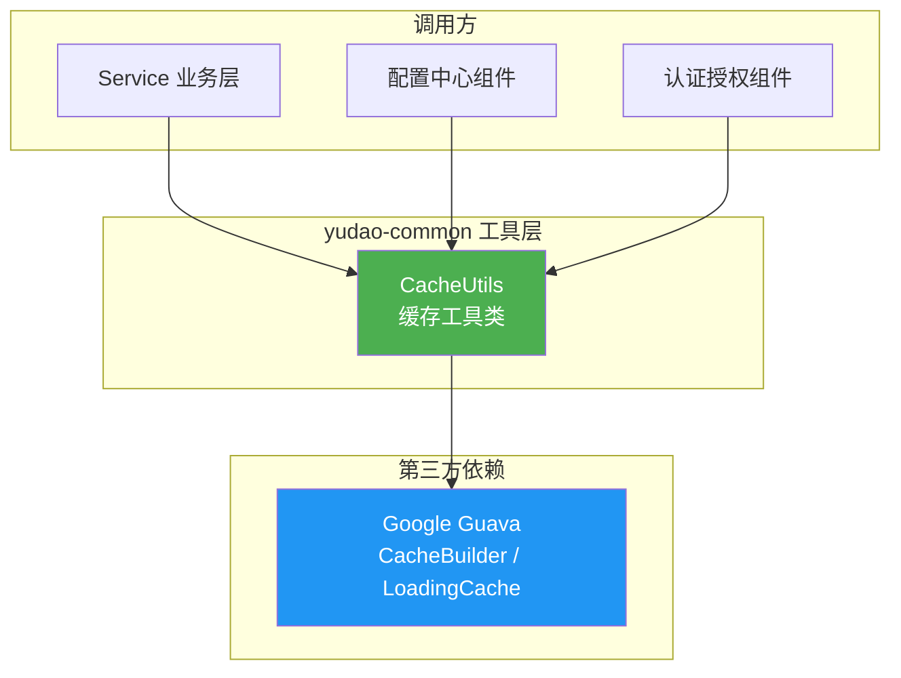
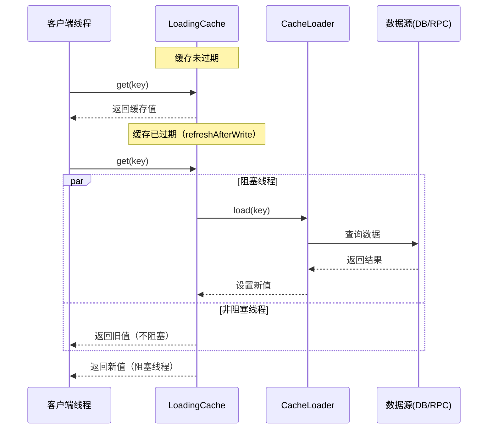
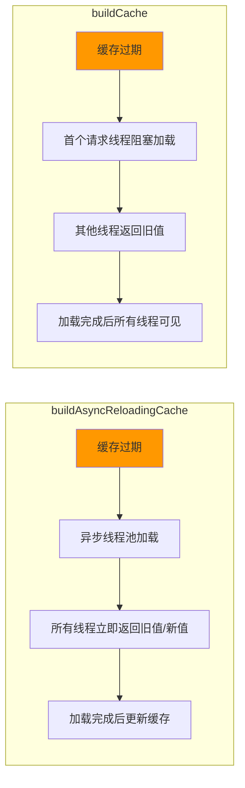

# Cache 工具模块 (cache-utils)

## 1. 模块简介

`CacheUtils` 是基于 Google Guava 库封装的本地缓存工具类，位于 `yudao-framework/yudao-common` 模块中。它提供了便捷的静态方法，用于构建支持**定时刷新**的 `LoadingCache` 实例，帮助开发者在应用层快速搭建高性能的本地缓存。

> 相关模块：[spring_expression_utils](spring_expression_utils.md) | [spring_utils](spring_utils.md)

### 1.1 核心功能

- 构建**异步刷新**的 LoadingCache（适用于全局/系统级缓存）
- 构建**同步刷新**的 LoadingCache（适用于与人相关的上下文缓存）
- 统一的缓存最大容量限制（10000 条）
- 基于 Guava `refreshAfterWrite` 实现刷新机制，避免缓存雪崩

### 1.2 设计要点

| 特性 | 说明 |
|------|------|
| 刷新策略 | `refreshAfterWrite` —— 只阻塞当前加载线程，其他线程返回旧值 |
| 最大容量 | 10000 条，防止内存溢出 |
| 异步支持 | 支持全异步加载（包括被阻塞的加载线程） |
| 线程安全 | 基于 Guava Cache 实现，天然线程安全 |

---

## 2. API 说明

### 2.1 `buildAsyncReloadingCache`

```java
public static <K, V> LoadingCache<K, V> buildAsyncReloadingCache(Duration duration, CacheLoader<K, V> loader)
```

**说明**：构建一个**异步刷新**的 LoadingCache 对象。缓存过期后，通过异步线程池刷新数据，所有线程均不会阻塞等待。

**适用场景**：
- 与**全局**、**系统**相关的配置数据
- 不依赖 `ThreadLocal` 上下文的只读数据
- 对性能要求极高、希望完全避免阻塞的业务场景

**参数**：

| 参数 | 类型 | 说明 |
|------|------|------|
| `duration` | `Duration` | 缓存刷新间隔，例如 `Duration.ofMinutes(1)` 表示每 1 分钟刷新一次 |
| `loader` | `CacheLoader<K, V>` | 缓存加载逻辑，定义如何从数据源加载缓存 |

**示例**：

```java
LoadingCache<String, ConfigDO> cache = CacheUtils.buildAsyncReloadingCache(
    Duration.ofMinutes(5),
    new CacheLoader<String, ConfigDO>() {
        @Override
        public ConfigDO load(String key) {
            return configMapper.selectById(key);
        }
    }
);
```

### 2.2 `buildCache`

```java
public static <K, V> LoadingCache<K, V> buildCache(Duration duration, CacheLoader<K, V> loader)
```

**说明**：构建一个**同步刷新**的 LoadingCache 对象。缓存过期后，首个请求线程会阻塞加载数据，其他线程返回旧值。

**适用场景**：
- 与**人**相关的上下文数据（如用户信息、权限数据）
- 依赖 `ThreadLocal` 或请求上下文的数据
- 数据加载时间较短、可以容忍少量阻塞的场景

**参数**：

| 参数 | 类型 | 说明 |
|------|------|------|
| `duration` | `Duration` | 缓存刷新间隔 |
| `loader` | `CacheLoader<K, V>` | 缓存加载逻辑 |

**示例**：

```java
LoadingCache<Long, AdminUserRespDTO> userCache = CacheUtils.buildCache(
    Duration.ofSeconds(30),
    new CacheLoader<Long, AdminUserRespDTO>() {
        @Override
        public AdminUserRespDTO load(Long userId) {
            return adminUserApi.getUser(userId);
        }
    }
);
```

---

## 3. 架构图

### 3.1 模块依赖关系



### 3.2 缓存刷新流程



### 3.3 异步 vs 同步对比



---

## 4. 使用指南

### 4.1 选择建议

| 缓存类型 | 推荐场景 | 原因 |
|----------|----------|------|
| `buildAsyncReloadingCache` | 系统配置、字典数据、全局参数 | 数据与请求上下文无关，完全异步避免任何阻塞 |
| `buildCache` | 用户信息、角色权限、部门数据 | 数据依赖请求上下文（如 ThreadLocal），需同步加载确保上下文传递 |

### 4.2 最佳实践

1. **合理设置过期时间**：根据数据变更频率设置 `Duration`，避免过短导致频繁刷新，过长导致数据不一致。
2. **注意最大容量**：默认最大 10000 条，如果缓存键数量可能超过此值，需考虑使用 Redis 等分布式缓存。
3. **异常处理**：`CacheLoader.load()` 抛出异常时，Guava Cache 会向上传播异常，建议在 load 方法内部捕获并处理。
4. **不要与 ThreadLocal 混用异步缓存**：`buildAsyncReloadingCache` 使用独立线程池加载，无法传递请求上下文的 ThreadLocal 数据。

### 4.3 完整示例

```java
@Service
public class ConfigServiceImpl implements ConfigService {

    private final LoadingCache<String, String> configCache;

    public ConfigServiceImpl(ConfigMapper configMapper) {
        // 系统配置 —— 全局、不依赖上下文，使用异步刷新
        this.configCache = CacheUtils.buildAsyncReloadingCache(
                Duration.ofMinutes(5),
                new CacheLoader<String, String>() {
                    @Override
                    public String load(String key) {
                        return configMapper.selectValueByKey(key);
                    }
                }
        );
    }

    @Override
    public String getConfig(String key) {
        try {
            return configCache.get(key);
        } catch (ExecutionException e) {
            throw new RuntimeException("缓存加载失败", e);
        }
    }
}
```

---

## 5. 注意事项

### 5.1 与 Redis 缓存的区别

| 维度 | CacheUtils (Guava 本地缓存) | Redis 分布式缓存 |
|------|---------------------------|-----------------|
| 存储位置 | JVM 堆内存 | 独立 Redis 服务 |
| 共享性 | 单机独享 | 多实例共享 |
| 性能 | 纳秒级（无网络开销） | 毫秒级（有网络开销） |
| 容量 | 受限（默认 10000 条） | 可扩展 |
| 持久化 | 无（重启丢失） | 支持 RDB/AOF |

### 5.2 已知限制

- 最大缓存数量硬编码为 10000，未来版本可能改为可配置
- 异步刷新使用 `Executors.newCachedThreadPool()`，在高并发场景下可能创建大量线程，需关注线程池资源

---

## 6. 参考链接

- [Guava Cache 官方文档](https://github.com/google/guava/wiki/CachesExplained)
- [本地缓存 CacheUtils 工具类建议](https://github.com/YunaiV/yudao/issues) — 内部讨论贴
- 相关工具模块：[spring_utils](spring_utils.md) | [collection_utils](collection_utils.md) | [bean_utils](bean_utils.md)
