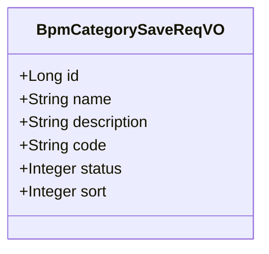
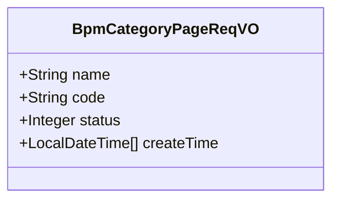
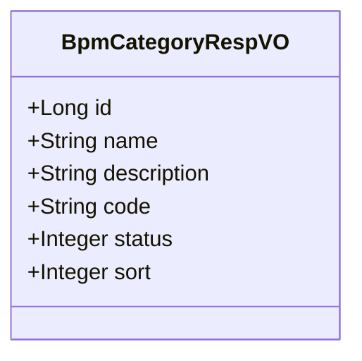
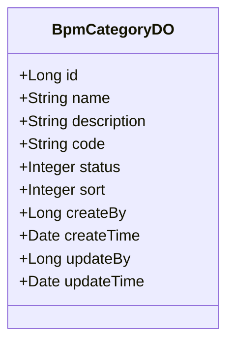
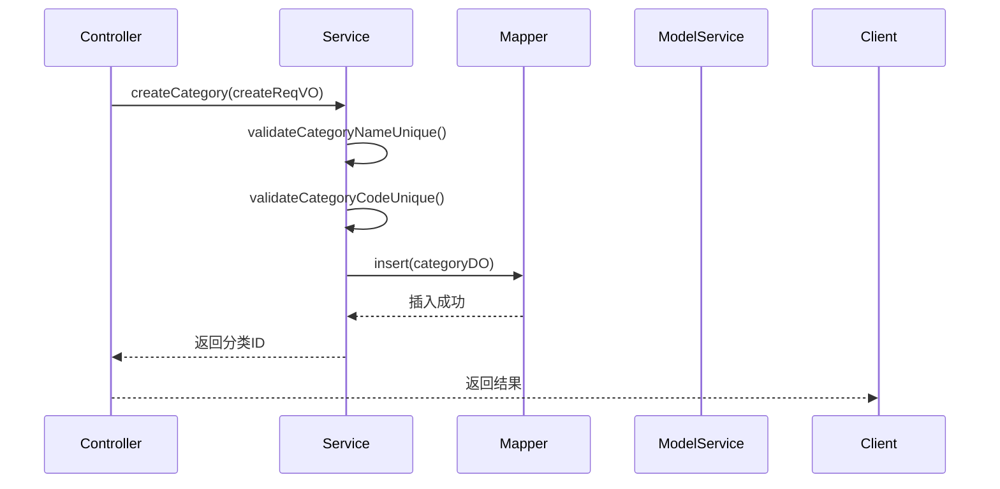
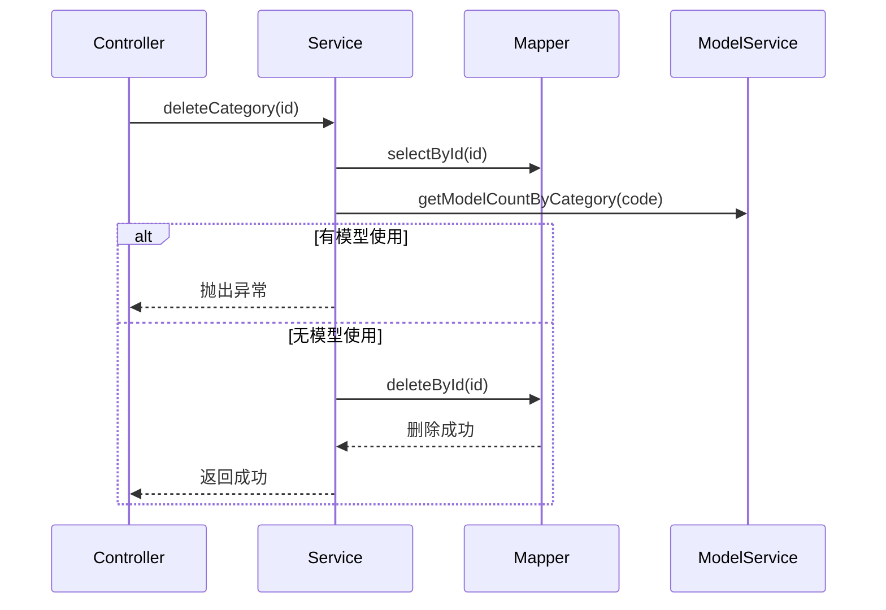
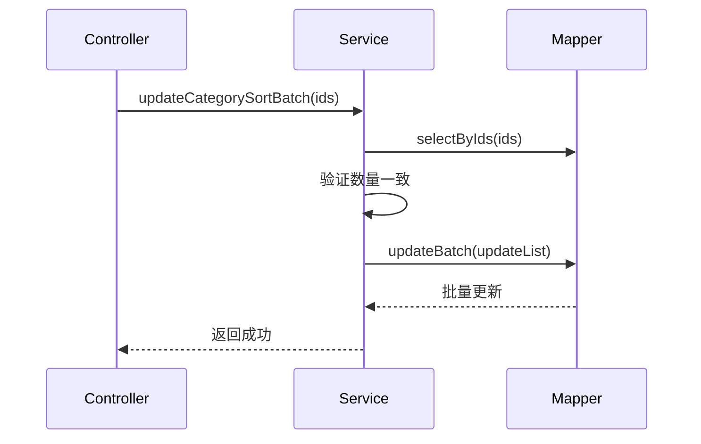

# BPM 流程分类模块文档

## 1. 模块概述

BPM 流程分类模块是工作流管理系统（BPM）中的基础配置模块，主要用于对业务流程进行分类管理。通过流程分类，企业可以对不同业务类型的流程进行组织和管理，提高流程的可维护性和可发现性。

该模块提供了流程分类的 CRUD（创建、更新、删除、查询）功能，支持分类名称、代码、状态、排序等属性的管理，并提供了精简列表接口供前端下拉选择使用。

## 2. 架构概览

```mermaid
graph TD
    subgraph "BPM 流程分类模块"
        A[BpmCategoryController] -->|调用| B[BpmCategoryServiceImpl]
        B -->|数据操作| C[BpmCategoryMapper]
        B -->|依赖校验| D[BpmModelService]
        A -->|返回| E[BpmCategoryRespVO]
        F[BpmCategorySaveReqVO] -->|请求体| A
        G[BpmCategoryPageReqVO] -->|分页请求| A
    end
    
    subgraph "依赖模块"
        C -->|数据库| MySQL
        D -->|流程模型| BPM 流程模型模块
    end
```

### 组件关系说明

- **BpmCategoryController**: 控制器层，负责接收 HTTP 请求，调用服务层处理业务逻辑，并返回响应结果
- **BpmCategoryServiceImpl**: 服务层，实现核心业务逻辑，包括数据校验、事务控制、依赖关系检查等
- **BpmCategoryMapper**: 数据访问层，负责与数据库进行交互，执行 CRUD 操作
- **BpmModelService**: 依赖服务，用于在删除分类时检查是否有流程模型正在使用该分类

## 3. 核心功能

### 3.1 流程分类管理

| 功能 | 接口路径 | 请求方法 | 权限标识 | 描述 |
|------|----------|----------|----------|------|
| 创建分类 | `/bpm/category/create` | POST | `bpm:category:create` | 新增流程分类 |
| 更新分类 | `/bpm/category/update` | PUT | `bpm:category:update` | 修改现有分类 |
| 批量更新排序 | `/bpm/category/update-sort-batch` | PUT | `bpm:category:update` | 批量调整分类排序顺序 |
| 删除分类 | `/bpm/category/delete` | DELETE | `bpm:category:delete` | 删除流程分类 |
| 获取分类详情 | `/bpm/category/get` | GET | `bpm:category:query` | 根据 ID 获取分类信息 |
| 分页查询分类 | `/bpm/category/page` | GET | `bpm:category:query` | 分页查询流程分类列表 |
| 获取精简列表 | `/bpm/category/simple-list` | GET | - | 获取启用状态的分类精简列表（用于前端下拉选择） |

### 3.2 数据校验规则

1. **唯一性校验**：
   - 分类名称（name）必须唯一
   - 分类代码（code）必须唯一

2. **存在性校验**：
   - 更新和删除操作前需验证分类 ID 是否存在
   - 批量更新排序时需验证所有 ID 都存在

3. **依赖校验**：
   - 删除分类时，检查是否有流程模型正在使用该分类，如有则禁止删除

4. **参数校验**：
   - 必填字段验证（名称、代码、状态、排序）
   - 状态值必须在 `CommonStatusEnum` 枚举范围内

## 4. 数据对象

### 4.1 请求对象（VO）

#### BpmCategorySaveReqVO - 分类保存请求对象

用于创建和更新流程分类的请求参数。



**字段说明**：

| 字段 | 类型 | 必填 | 描述 | 示例 |
|------|------|------|------|------|
| id | Long | 否 | 分类编号 | 3167 |
| name | String | 是 | 分类名 | 王五 |
| description | String | 否 | 分类描述 | 你猜 |
| code | String | 是 | 分类标志 | OA |
| status | Integer | 是 | 分类状态 | 1 |
| sort | Integer | 是 | 分类排序 | 10 |

**状态枚举**：`CommonStatusEnum`（启用/禁用）

#### BpmCategoryPageReqVO - 分类分页请求对象

用于分页查询流程分类的请求参数，继承自 `PageParam`。



**字段说明**：

| 字段 | 类型 | 描述 | 示例 |
|------|------|------|------|
| name | String | 分类名 | 王五 |
| code | String | 分类标志 | OA |
| status | Integer | 分类状态 | 1 |
| createTime | LocalDateTime[] | 创建时间范围 | [2024-01-01 00:00:00, 2024-12-31 23:59:59] |

### 4.2 响应对象（VO）

#### BpmCategoryRespVO - 分类响应对象



### 4.3 数据对象（DO）

#### BpmCategoryDO - 分类数据对象

与数据库表 `bpm_category` 对应的数据对象。



## 5. 服务层逻辑分析

### 5.1 创建流程分类



### 5.2 删除流程分类（含依赖检查）



### 5.3 批量更新排序



## 6. 权限控制

所有接口均通过 Spring Security 的 `@PreAuthorize` 注解进行权限控制，使用自定义的权限表达式 `@ss.hasPermission('权限标识')`。权限标识遵循 `模块:资源:操作` 的命名规范，例如：

- `bpm:category:create` - 创建权限
- `bpm:category:update` - 更新权限
- `bpm:category:delete` - 删除权限
- `bpm:category:query` - 查询权限

## 7. 错误处理

模块中使用了统一的异常处理机制，通过 `exception()` 方法抛出业务异常，常见的错误包括：

- `CATEGORY_NAME_DUPLICATE` - 分类名称重复
- `CATEGORY_CODE_DUPLICATE` - 分类代码重复
- `CATEGORY_NOT_EXISTS` - 分类不存在
- `CATEGORY_DELETE_FAIL_MODEL_USED` - 分类被流程模型使用，无法删除

## 8. 与其他模块的关联

### 8.1 BPM 流程模型模块

流程分类与流程模型存在一对多关系，一个分类可以包含多个流程模型。在删除分类时，会调用 `BpmModelService` 检查是否有模型正在使用该分类，以防止数据不一致。

### 8.2 系统权限模块

分类管理功能依赖于系统的权限体系，通过权限标识控制不同用户对分类的访问和操作权限。

### 8.3 前端 UI 模块

前端通过 `/bpm/category/simple-list` 接口获取启用的分类列表，用于流程创建时的分类选择下拉框。

## 9. 使用示例

### 9.1 创建分类

**请求**：
```http
POST /bpm/category/create
Content-Type: application/json

{
  "name": "请假审批",
  "code": "OA",
  "description": "办公自动化类流程",
  "status": 1,
  "sort": 10
}
```

**响应**：
```json
{
  "code": 200,
  "message": "操作成功",
  "data": 123L
}
```

### 9.2 分页查询分类

**请求**：
```http
GET /bpm/category/page?name=请假&status=1&page=1&size=10
```

**响应**：
```json
{
  "code": 200,
  "message": "操作成功",
  "data": {
    "list": [...],
    "total": 10,
    "page": 1,
    "size": 10
  }
}
```

### 9.3 获取精简列表

**请求**：
```http
GET /bpm/category/simple-list
```

**响应**：
```json
{
  "code": 200,
  "message": "操作成功",
  "data": [
    {"id": 1, "name": "请假审批", "code": "OA"},
    {"id": 2, "name": "报销审批", "code": "FINANCE"}
  ]
}
```

## 10. 总结

BPM 流程分类模块是一个典型的基础配置模块，提供了完整的 CRUD 功能和依赖校验机制。模块设计遵循分层架构原则，职责清晰，通过严格的权限控制和数据校验保证了系统的稳定性和数据的一致性。同时，模块与 BPM 流程模型模块紧密关联，为整个工作流系统提供了基础的数据支撑。