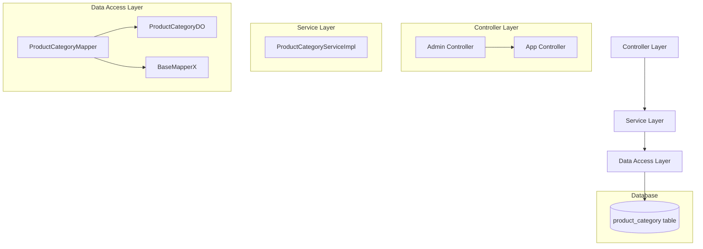

# Product Category Module Documentation

## Module Overview

The Product Category module is a core component of the Yudao Mall system responsible for managing product categorization. It provides functionality for creating, updating, deleting, and querying product categories in a hierarchical structure (supporting up to 2 levels). The module serves both admin and app interfaces, providing different data representations based on the client type.

## Core Components

### 1. API Interface (`ProductCategoryApiImpl`)
**Location**: `yudao-module-mall/yudao-module-product/src/main/java/cn/iocoder/yudao/module/product/api/category/ProductCategoryApiImpl.java`

This component implements the `ProductCategoryApi` interface and provides internal API methods for other modules to validate product categories.

**Key Methods**:
- `validateCategoryList(Collection<Long> ids)`: Validates that a list of category IDs exist, are enabled, and are at the correct level (level 2 or deeper)

### 2. Service Layer (`ProductCategoryServiceImpl`)
**Location**: `yudao-module-mall/yudao-module-product/src/main/java/cn/iocoder/yudao/module/product/service/category/ProductCategoryServiceImpl.java`

Implements the business logic for product category management.

**Key Responsibilities**:
- Category CRUD operations (create, update, delete)
- Validation of category relationships and constraints
- Retrieval of category lists with filtering capabilities
- Level validation to ensure proper hierarchy

**Key Methods**:
- `createCategory(ProductCategorySaveReqVO createReqVO)`: Creates a new category
- `updateCategory(ProductCategorySaveReqVO updateReqVO)`: Updates an existing category
- `deleteCategory(Long id)`: Deletes a category (with validation)
- `validateCategoryList(Collection<Long> ids)`: Validates category list for SPU association
- `getCategory(Long id)`: Retrieves a category by ID
- `getCategoryList(ProductCategoryListReqVO listReqVO)`: Gets filtered category list
- `getEnableCategoryList()`: Gets all enabled categories
- `getEnableCategoryList(List<Long> ids)`: Gets enabled categories by ID list

### 3. Controller Layer

#### Admin Controller (`ProductCategoryController`)
**Location**: `yudao-module-mall/yudao-module-product/src/main/java/cn/iocoder/yudao/module/product/controller/admin/category/ProductCategoryController.java`

Handles HTTP requests from the admin interface for category management.

**Endpoints**:
- `POST /product/category/create` - Create a new category
- `PUT /product/category/update` - Update an existing category
- `DELETE /product/category/delete` - Delete a category
- `GET /product/category/get` - Get a category by ID
- `GET /product/category/list` - Get category list with filtering

#### App Controller (`AppCategoryController`)
**Location**: `yudao-module-mall/yudao-module-product/src/main/java/cn/iocoder/yudao/module/product/controller/app/category/AppCategoryController.java`

Handles HTTP requests from the mobile/app interface for category browsing.

**Endpoints**:
- `GET /product/category/list` - Get enabled category list
- `GET /product/category/list-by-ids` - Get enabled category list by specific IDs

### 4. Data Access Layer

#### Mapper (`ProductCategoryMapper`)
**Location**: `yudao-module-mall/yudao-module-product/src/main/java/cn/iocoder/yudao/module/product/dal/mysql/category/ProductCategoryMapper.java`

MyBatis-Plus mapper for database operations on product categories.

**Methods**:
- `selectList(ProductCategoryListReqVO listReqVO)`: Select categories with filtering
- `selectCountByParentId(Long parentId)`: Count children of a parent category
- `selectListByStatus(Integer status)`: Select categories by status
- `selectListByIdAndStatus(Collection<Long> ids, Integer status)`: Select categories by IDs and status

#### Data Object (`ProductCategoryDO`)
**Location**: `yudao-module-mall/yudao-module-product/src/main/java/cn/iocoder/yudao/module/product/dal/dataobject/category/ProductCategoryDO.java`

Represents the product_category table in the database.

**Fields**:
- `id`: Category ID (primary key)
- `parentId`: Parent category ID (0 for root level)
- `name`: Category name
- `picUrl`: Mobile category image URL
- `sort`: Sort order
- `status`: Status (0=disabled, 1=enabled)

### 5. Value Objects (VO)

#### Request Objects
- `ProductCategorySaveReqVO`: Used for creating/updating categories
- `ProductCategoryListReqVO`: Used for filtering category lists
- `AppCategoryRespVO`: Simplified response for app clients

#### Response Objects
- `ProductCategoryRespVO`: Detailed response for admin clients
- `AppCategoryRespVO`: Simplified response for app clients

## Architecture Overview

The module follows a layered architecture typical of Spring Boot applications:



### Key Features

1. **Hierarchical Category Structure**: Supports up to 2 levels of categories (root level and child level)
2. **Validation Logic**: 
   - Prevents circular references in category hierarchy
   - Ensures parent categories are root-level (level 0)
   - Validates that categories exist and are enabled before use
   - Prevents deletion of categories with subcategories or associated products
3. **Dual Interface Support**:
   - Admin interface: Full CRUD operations with detailed data
   - App interface: Read-only access to enabled categories with minimal data
4. **Soft Deletes Not Used**: Categories are physically removed from the database when deleted
5. **Sorting Support**: Categories can be ordered using the sort field

```
Controller Layer
     ↓
Service Layer
     ↓
Data Access Layer (Mapper + DO)
     ↓
Database
```

## Business Rules

1. **Category Hierarchy**: 
   - Root categories have `parentId = 0`
   - Child categories must have a root category as their parent
   - Maximum depth is 2 levels (root → child)

2. **Validation Rules**:
   - A category cannot be deleted if it has subcategories
   - A category cannot be deleted if it has associated SPUs (Standard Product Units)
   - When creating/updating a category, the parent category must exist
   - When associating categories with SPUs, only level 2 or deeper categories are allowed

3. **Status Management**:
   - Categories can be enabled (status=1) or disabled (status=0)
   - Disabled categories cannot be used for new associations but existing associations remain valid

## Database Table Structure

The module maps to the `product_category` table with the following structure:

| Column Name | Data Type | Description |
|-------------|-----------|-------------|
| id | BIGINT | Primary key, auto-increment |
| parent_id | BIGINT | Parent category ID (0 for root) |
| name | VARCHAR | Category name |
| pic_url | VARCHAR | Mobile category image URL |
| sort | INT | Display order |
| status | TINYINT | Status (0=disabled, 1=enabled) |
| create_time | DATETIME | Creation timestamp |
| update_time | DATETIME | Last update timestamp |

## Integration Points

### Used By Other Modules
- **SPU Module**: Validates category associations when creating/updating SPUs
- **Product Module**: Uses categories for product classification and filtering

### Dependencies
- **MyBatis-Plus**: For ORM and database operations
- **Spring Framework**: For dependency injection and transaction management
- **Validation API**: For input validation using annotations

## Configuration

The module relies on standard Spring Boot MyBatis configuration. Key configuration classes include:
- `ProductWebConfiguration`: Web layer configuration
- Category-specific mappers are auto-configured via MyBatis-Plus

## Error Codes

The module defines specific error codes in the `ErrorCodeConstants` interface:
- `CATEGORY_NOT_EXISTS` (1_008_001_000): Category not found
- `CATEGORY_PARENT_NOT_EXISTS` (1_008_001_001): Parent category not found
- `CATEGORY_PARENT_NOT_FIRST_LEVEL` (1_008_001_002): Parent category is not a root category
- `CATEGORY_EXISTS_CHILDREN` (1_008_001_003): Cannot delete category with children
- `CATEGORY_DISABLED` (1_008_001_004): Category is disabled
- `CATEGORY_HAVE_BIND_SPU` (1_008_001_005): Category has associated products

## Data Flow Examples

### Creating a Category
1. Client sends POST to `/product/category/create` with `ProductCategorySaveReqVO`
2. Controller validates input and calls `ProductCategoryService.createCategory()`
3. Service validates parent category exists
4. Service converts VO to DO and saves via mapper
5. Service returns the new category ID

### Validating Category List (for SPU Association)
1. SPU service calls `ProductCategoryApi.validateCategoryList(categoryIds)`
2. API implementation delegates to `ProductCategoryService.validateCategoryList()`
3. Service checks each category:
   - Exists in database
   - Is enabled (status=1)
   - Is at level 2 or deeper (valid for SPU association)
4. Throws appropriate exceptions if validation fails

### Getting Category List for App
1. Client calls GET `/product/category/list`
2. Controller calls `ProductCategoryService.getEnableCategoryList()`
3. Service retrieves all enabled categories from database
4. Controller converts DO list to `AppCategoryRespVO` list
5. Returns simplified category data for mobile display

## Performance Considerations

1. **Indexing**: The `product_category` table should have indexes on:
   - `parent_id` (for hierarchical queries)
   - `status` (for filtering enabled/disabled categories)
   - `sort` (for ordering results)

2. **Caching Considerations**: 
   - Category hierarchies are relatively static and could benefit from caching
   - Frequently accessed category lists (especially for app) could be cached
   - Current implementation reads directly from database on each request

3. **Query Optimization**:
   - The `getEnableCategoryList()` method is frequently called and should be optimized
   - Hierarchical queries use simple parent_id lookups rather than complex recursive queries
   - List queries support filtering by name, parentId, status, and ID lists

## Security Considerations

1. **Authorization**: All admin endpoints require proper permissions:
   - `product:category:create` for creation
   - `product:category:update` for updates
   - `product:category:delete` for deletion
   - `product:category:query` for reading

2. **Input Validation**: 
   - All input objects use validation annotations (`@NotNull`, `@NotBlank`)
   - Service layer performs additional business logic validation
   - Controller layer handles parameter binding and basic validation

3. **Data Protection**:
   - No sensitive data is stored in category entities
   - Access control is enforced at the service layer
   - Direct database access is restricted to the data access layer

## Extension Points

1. **Additional Category Attributes**: 
   - To add new fields, modify `ProductCategoryDO`, update mappers, and adjust VO mappings
   - Consider backward compatibility when adding new fields

2. **Alternative Storage Strategies**:
   - For very deep hierarchies, consider materialized path or nested set models
   - Current implementation is optimized for shallow hierarchies (2 levels max)

3. **Caching Layer**:
   - Could add Redis caching for frequently accessed category lists
   - Particularly beneficial for the app-facing endpoints

4. **Internationalization**:
   - Currently stores category names in a single language
   - For multi-language support, would need to add translation tables or fields

## Related Modules

For understanding how this module integrates with the broader system, refer to:
- **SPU Module**: Uses category validation for product creation
- **Product Module**: Displays products by category
- **Category Module in Other Contexts**: Similar patterns exist in other modules (ERP, IM, etc.) but with domain-specific variations

## Conclusion

The Product Category module provides a robust, well-structured implementation for managing product hierarchies in the Yudao Mall system. It balances simplicity with functionality, providing essential category management features while maintaining data integrity through comprehensive validation rules. The modular design allows for easy extension and maintenance, with clear separation of concerns between layers.