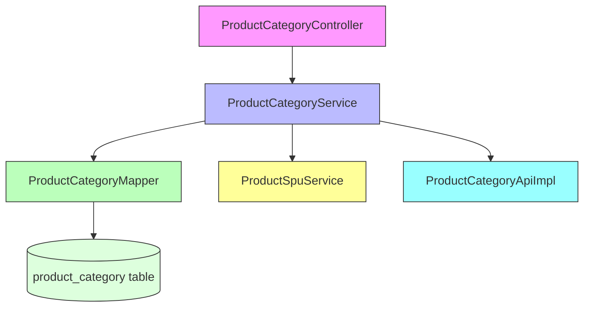
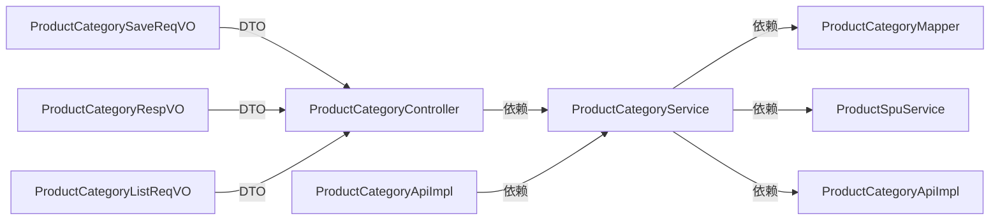
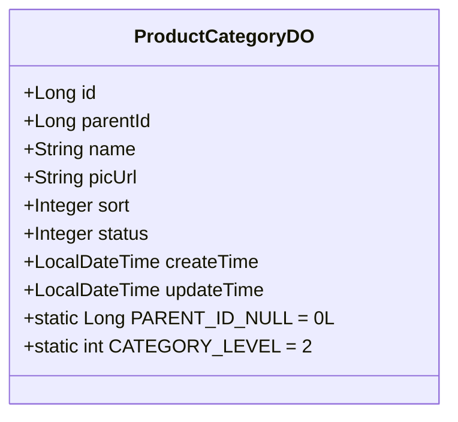
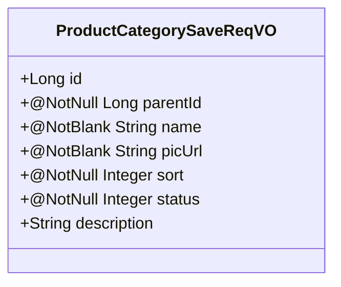
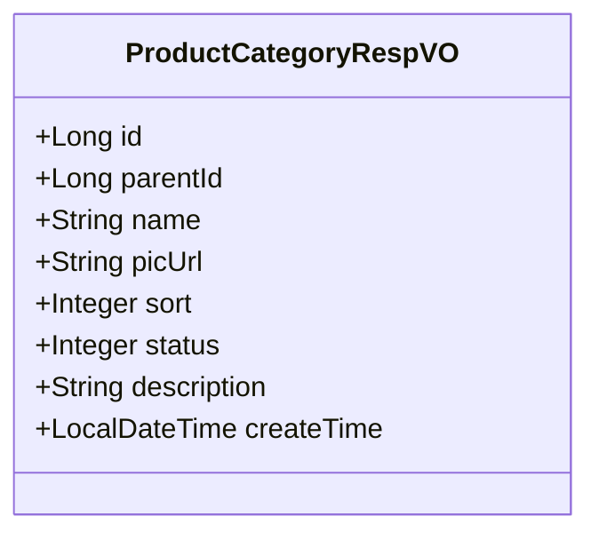
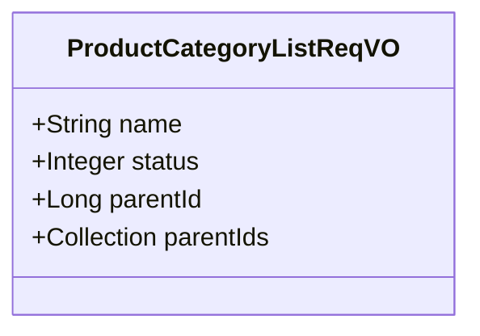

# 商品分类管理模块 (Product Category Management Module)

## 模块概述

商品分类管理模块是Yudao Mall商城系统中的核心组件，负责商品分类的创建、更新、删除和查询等功能。该模块提供了RESTful API接口，支持商品分类的层级管理，确保商品能够按照业务需求进行有效分类和组织。

该模块遵循典型的分层架构设计，包括控制器层（Controller）、服务层（Service）、数据访问层（DAO）和实体层（DO），通过MyBatis框架进行数据持久化。

## 核心功能

1. **商品分类创建**：支持创建新的商品分类，包括父分类关联、分类名称、图标、排序等信息
2. **商品分类更新**：支持对现有商品分类的属性进行修改
3. **商品分类删除**：支持删除商品分类，包含业务规则校验（如是否有子分类、是否绑定了SPU等）
4. **商品分类查询**：支持根据ID查询单个分类，以及根据条件查询分类列表
5. **业务规则校验**：包含父分类存在性验证、分类层级限制、状态有效性检查等

## 架构设计

### 模块结构



### 分层说明

1. **控制器层 (Controller)**：`ProductCategoryController`
   - 负责接收HTTP请求，参数校验和结果返回
   - 使用Spring MVC注解定义RESTful接口
   - 集成Swagger/OpenAPI进行API文档生成
   - 使用Spring Security进行权限控制

2. **服务层 (Service)**：`ProductCategoryServiceImpl`
   - 实现业务逻辑，包括创建、更新、删除和查询操作
   - 包含业务规则校验方法（如父分类验证、分类存在性验证等）
   - 处理与其他服务的交互（如ProductSpuService）

3. **数据访问层 (Mapper)**：`ProductCategoryMapper`
   - 使用MyBatis框架进行数据库操作
   - 定义CRUD操作和自定义查询方法

4. **实体层 (DO)**：`ProductCategoryDO`
   - 映射数据库表 `product_category`
   - 包含分类的所有属性字段

5. **API层**：`ProductCategoryApiImpl`
   - 提供内部服务间调用的API接口
   - 将请求委托给服务层处理

### 依赖关系



## 数据模型

### ProductCategoryDO (数据对象)



### ProductCategorySaveReqVO (创建/更新请求)



### ProductCategoryRespVO (响应对象)



### ProductCategoryListReqVO (列表查询请求)



## API接口

### RESTful端点

| 方法 | 路径 | 操作 | 权限要求 | 描述 |
|------|------|------|----------|------|
| POST | `/product/category/create` | 创建商品分类 | `product:category:create` | 创建新的商品分类 |
| PUT | `/product/category/update` | 更新商品分类 | `product:category:update` | 更新现有商品分类 |
| DELETE | `/product/category/delete` | 删除商品分类 | `product:category:delete` | 根据ID删除商品分类 |
| GET | `/product/category/get` | 查询商品分类 | `product:category:query` | 根据ID获取单个商品分类 |
| GET | `/product/category/list` | 查询商品分类列表 | `product:category:query` | 根据条件获取商品分类列表 |

### 请求/响应示例

#### 创建商品分类
**请求:**
```json
{
  "parentId": 1,
  "name": "办公文具",
  "picUrl": "https://example.com/category.png",
  "sort": 1,
  "status": 0,
  "description": "办公文具类商品"
}
```

**响应:**
```json
{
  "code": 0,
  "message": "成功",
  "data": 1024
}
```

#### 查询商品分类列表
**请求:**
```
GET /product/category/list?name=办公&status=0
```

**响应:**
```json
{
  "code": 0,
  "message": "成功",
  "data": [
    {
      "id": 1024,
      "parentId": 1,
      "name": "办公文具",
      "picUrl": "https://example.com/category.png",
      "sort": 1,
      "status": 0,
      "description": "办公文具类商品",
      "createTime": "2023-01-01 10:00:00"
    }
  ]
}
```

## 业务规则

### 分类层级限制
- 系统限制商品分类最多为2级（根分类 + 一级分类）
- 根分类的parentId为0
- 一级分类的parentId必须是根分类（0）
- 不允许创建超过2级的分类结构

### 删除限制
- 不能删除存在子分类的分类
- 不能删除已绑定SPU（标准产品单元）的分类

### 数据验证
- 必填字段：parentId、name、picUrl、sort、status
- name不能为空白字符
- picUrl不能为空白字符
- 状态必须为有效值（0-禁用, 1-启用）

## 与其他模块的交互

### 依赖的模块
1. **ProductSpuService**：用于检查分类是否已绑定SPU
2. **ProductCategoryMapper**：数据访问层接口
3. **ProductCategoryApiImpl**：内部API实现，用于服务间调用

### 被依赖的模块
1. **ProductCategoryApi**：其他模块可以通过此API验证商品分类列表的有效性
2. **前端UI**：通过RESTful API进行商品分类管理

## 配置说明

### 数据库表结构
```sql
CREATE TABLE product_category (
    id BIGINT PRIMARY KEY AUTO_INCREMENT COMMENT '分类编号',
    parent_id BIGINT NOT NULL COMMENT '父分类编号',
    name VARCHAR(50) NOT NULL COMMENT '分类名称',
    pic_url VARCHAR(255) NOT NULL COMMENT '移动端分类图',
    sort INT NOT NULL COMMENT '分类排序',
    status TINYINT NOT NULL COMMENT '开启状态',
    create_time DATETIME DEFAULT CURRENT_TIMESTAMP COMMENT '创建时间',
    update_time DATETIME DEFAULT CURRENT_TIMESTAMP ON UPDATE CURRENT_TIMESTAMP COMMENT '更新时间'
) COMMENT='商品分类表';
```

### 主键生成策略
- 使用序列生成器（对于Oracle、PostgreSQL等数据库）
- 对于MySQL使用自增主键

## 异常处理

模块定义了以下业务异常：
- `CATEGORY_NOT_EXISTS`: 分类不存在
- `CATEGORY_DISABLED`: 分类已禁用
- `CATEGORY_PARENT_NOT_EXISTS`: 父分类不存在
- `CATEGORY_PARENT_NOT_FIRST_LEVEL`: 父分类不能是二级分类
- `CATEGORY_EXISTS_CHILDREN`: 分类存在子分类，无法删除
- `CATEGORY_HAVE_BIND_SPU`: 分类已绑定SPU，无法删除

## 性能考虑

1. **查询优化**：
   - 列表查询支持根据名称、状态、父分类等条件过滤
   - 结果按照sort字段排序，利用数据库索引提升性能

2. **缓存策略**：
   - 建议在服务层添加缓存，特别是对于频繁查询的分类列表
   - 可以使用Redis缓存启用的分类列表

3. **索引建议**：
   - 在parent_id、status、name字段上建立索引
   - 考虑复合索引(parent_id, status)用于常见查询场景

## 安全考虑

1. **权限控制**：
   - 所有操作都通过Spring Security的`@PreAuthorize`注解进行权限校验
   - 权限标识符遵循`product:category:{action}`格式

2. **输入验证**：
   - 使用Bean Validation（JSR-380）进行参数校验
   - 关键字段使用@NotNull、@NotBlank等注解确保数据完整性

3. **防止SQL注入**：
   - 使用MyBatis的参数绑定机制，所有SQL参数都经过预编译处理

## 最佳实践

1. **分层清晰**：每一层职责单一，便于维护和测试
2. **业务规则集中**：所有业务规则都集中在服务层实现
3. **异常统一**：通过统一的异常处理机制返回标准错误响应
4. **DTO分离**：使用VO对象进行数据传输，避免直接暴露实体对象
5. **幂等性设计**：创建和更新操作考虑了幂等性需求

## 未来改进方向

1. **引入缓存**：为频繁查询的分类数据添加缓存层
2. **支持无限级分类**：通过修改业务规则支持更深层次的分类结构
3. **批量操作**：添加批量创建、更新和删除功能
4. **导入导出**：支持Excel格式的分类数据导入导出
5. **排序优化**：提供拖拽排序功能，后台自动更新sort字段