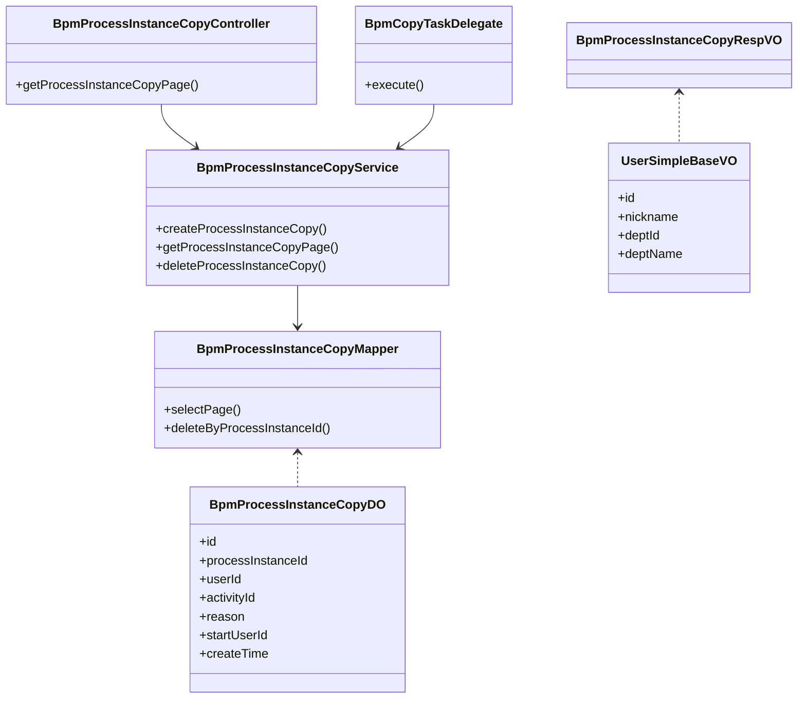
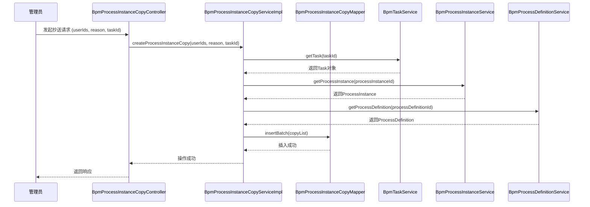
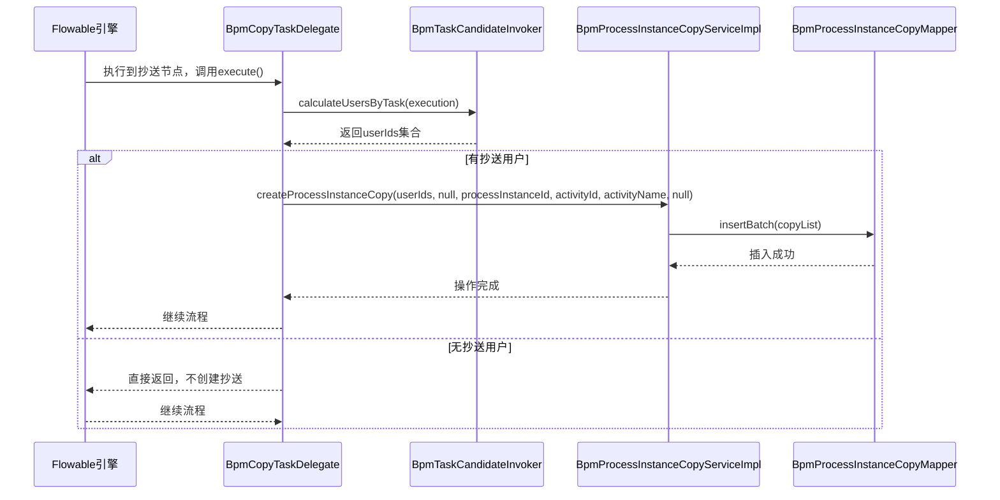
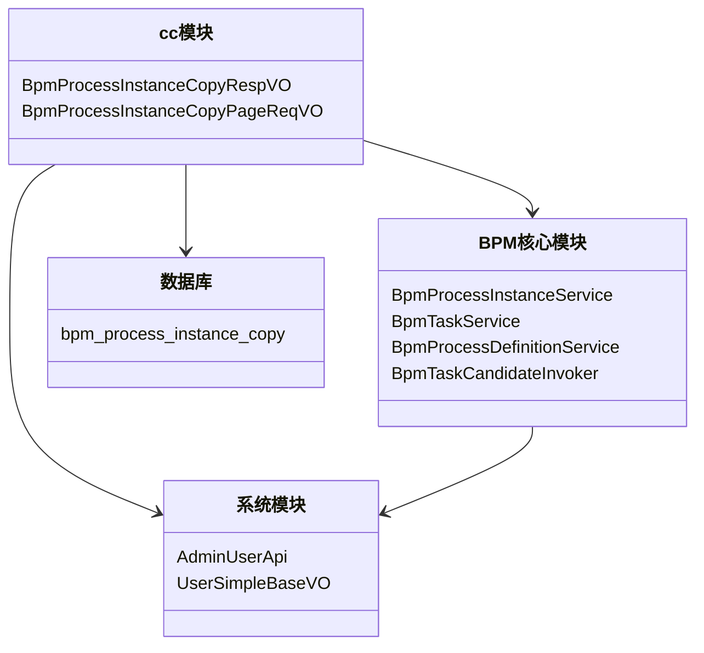

# cc 模块 - 流程实例抄送功能文档

## 1. 模块概述

**cc 模块**（Process Instance Copy）是 BPM（业务流程管理）模块中的核心功能组件，负责处理流程实例的抄送（CC）功能。该模块实现了在审批流程中，将当前任务抄送给其他指定用户的功能，支持管理员手动抄送和系统自动抄送两种模式。

### 核心功能
- **流程实例抄送记录管理**：记录所有抄送操作的详细信息
- **抄送分页查询**：支持按流程名称、创建时间等条件查询抄送记录
- **自动抄送触发**：在特定流程节点（如抄送节点）自动触发抄送
- **抄送数据清理**：流程结束后清理相关抄送记录

### 模块定位
```
┌─────────────────────────────────────────────────────────────┐
│                    BPM 模块                                  │
│  ┌───────────────────────────────────────────────────────┐  │
│  │              cc 模块（流程抄送）                      │  │
│  │  ┌───────────────────────────────────────────────┐    │  │
│  │  │  Controller: BpmProcessInstanceCopyController │    │  │
│  │  │  Service: BpmProcessInstanceCopyService       │    │  │
│  │  │  DO: BpmProcessInstanceCopyDO                 │    │  │
│  │  │  Mapper: BpmProcessInstanceCopyMapper         │    │  │
│  │  │  Listener: BpmCopyTaskDelegate                │    │  │
│  │  └───────────────────────────────────────────────┘    │  │
│  └───────────────────────────────────────────────────────┘  │
└─────────────────────────────────────────────────────────────┘
```

## 2. 架构设计

### 2.1 系统架构图

```
┌─────────────────┐       ┌──────────────────┐       ┌──────────────────┐
│   前端 Admin    │──────▶│  BpmProcessInstanceCopyController │       │   Flowable 引擎  │
│   (Vue3)        │       │   (REST API)     │       │   (BPMN)       │
└─────────────────┘       └──────────────────┘       └──────────────────┘
                                    │
                                    ▼
┌──────────────────────────────────────────────────────────────────────┐
│                        BpmProcessInstanceCopyService               │
│  ┌───────────────────────────────────────────────────────────────┐  │
│  │  createProcessInstanceCopy()  - 创建抄送记录                 │  │
│  │  getProcessInstanceCopyPage() - 分页查询抄送记录             │  │
│  │  deleteProcessInstanceCopy()  - 删除抄送记录                 │  │
│  └───────────────────────────────────────────────────────────────┘  │
└──────────────────────────────────────────────────────────────────────┘
                                    │
                                    ▼
┌──────────────────────────────────────────────────────────────────────┐
│                        BpmProcessInstanceCopyMapper                │
│  ┌───────────────────────────────────────────────────────────────┐  │
│  │  selectPage() - 分页查询                                    │  │
│  │  deleteByProcessInstanceId() - 按流程ID删除                  │  │
│  └───────────────────────────────────────────────────────────────┘  │
└──────────────────────────────────────────────────────────────────────┘
                                    │
                                    ▼
┌──────────────────────────────────────────────────────────────────────┐
│                        数据库 bpm_process_instance_copy 表        │
│  ┌───────────────────────────────────────────────────────────────┐  │
│  │  id │ processInstanceId │ userId │ activityId │ reason ...    │  │
│  └───────────────────────────────────────────────────────────────┘  │
└──────────────────────────────────────────────────────────────────────┘
```

### 2.2 组件关系图



## 3. 核心组件详解

### 3.1 BpmProcessInstanceCopyRespVO（响应对象）

**文件路径**: `yudao-module-bpm/src/main/java/cn/iocoder/yudao/module/bpm/controller/admin/task/vo/cc/BpmProcessInstanceCopyRespVO.java`

**描述**: 管理后台 - 流程实例抄送的分页 Item Response VO，用于前端展示抄送记录详情。

```java
@Schema(description = "管理后台 - 流程实例抄送的分页 Item Response VO")
@Data
public class BpmProcessInstanceCopyRespVO {
    @Schema(description = "抄送主键")
    private Long id;
    
    @Schema(description = "发起人")
    private UserSimpleBaseVO startUser;
    
    @Schema(description = "流程实例编号")
    private String processInstanceId;
    
    @Schema(description = "流程实例的名称")
    private String processInstanceName;
    
    @Schema(description = "流程实例的发起时间")
    private LocalDateTime processInstanceStartTime;
    
    @Schema(description = "流程活动的编号")
    private String activityId;
    
    @Schema(description = "流程活动的名字")
    private String activityName;
    
    @Schema(description = "流程活动的编号")
    private String taskId;
    
    @Schema(description = "抄送人意见")
    private String reason;
    
    @Schema(description = "创建人")
    private UserSimpleBaseVO createUser;
    
    @Schema(description = "抄送时间")
    private LocalDateTime createTime;
    
    @Schema(description = "流程摘要")
    private List<KeyValue<String, String>> summary;
}
```

**字段说明**:
| 字段 | 类型 | 必填 | 描述 |
|------|------|------|------|
| id | Long | 是 | 抄送记录主键 |
| startUser | UserSimpleBaseVO | 是 | 发起人信息 |
| processInstanceId | String | 是 | 流程实例唯一标识 |
| processInstanceName | String | 是 | 流程实例名称 |
| processInstanceStartTime | LocalDateTime | 是 | 流程发起时间 |
| activityId | String | 是 | BPMN 节点编号 |
| activityName | String | 是 | 节点名称 |
| taskId | String | 否 | 任务ID（抄送节点可能为空） |
| reason | String | 否 | 抄送意见 |
| createUser | UserSimpleBaseVO | 是 | 创建人信息 |
| createTime | LocalDateTime | 是 | 创建时间 |
| summary | List<KeyValue> | 否 | 流程变量摘要 |

### 3.2 BpmProcessInstanceCopyPageReqVO（请求对象）

**文件路径**: `yudao-module-bpm/src/main/java/cn/iocoder/yudao/module/bpm/controller/admin/task/vo/instance/BpmProcessInstanceCopyPageReqVO.java`

**描述**: 分页查询请求参数，继承自 PageParam。

```java
@Schema(description = "管理后台 - 流程实例抄送的分页 Request VO")
@Data
public class BpmProcessInstanceCopyPageReqVO extends PageParam {
    @Schema(description = "流程名称", example = "芋道")
    private String processInstanceName;
    
    @Schema(description = "创建时间")
    @DateTimeFormat(pattern = FORMAT_YEAR_MONTH_DAY_HOUR_MINUTE_SECOND)
    private LocalDateTime[] createTime;
}
```

### 3.3 BpmProcessInstanceCopyDO（数据对象）

**文件路径**: `yudao-module-bpm/src/main/java/cn/iocoder/yudao/module/bpm/dal/dataobject/task/BpmProcessInstanceCopyDO.java`

**描述**: 数据库实体类，对应表 `bpm_process_instance_copy`。

```java
@TableName(value = "bpm_process_instance_copy", autoResultMap = true)
@KeySequence("bpm_process_instance_copy_seq")
@Data
@Builder
@NoArgsConstructor
@AllArgsConstructor
public class BpmProcessInstanceCopyDO extends BaseDO {
    private Long id;
    private Long startUserId;          // 发起人ID
    private String processInstanceName; // 流程名称
    private String processInstanceId;   // 流程实例ID
    private String processDefinitionId; // 流程定义ID
    private String category;           // 流程分类
    private String activityId;         // 活动节点ID
    private String activityName;       // 活动节点名称
    private String taskId;             // 任务ID
    private Long userId;               // 被抄送用户ID
    private String reason;             // 抄送意见
}
```

**表结构说明**:
| 字段 | 类型 | 说明 |
|------|------|------|
| id | BIGINT | 主键 |
| startUserId | BIGINT | 发起人用户ID |
| processInstanceName | VARCHAR | 流程实例名称（冗余） |
| processInstanceId | VARCHAR | 流程实例ID（外键） |
| processDefinitionId | VARCHAR | 流程定义ID |
| category | VARCHAR | 流程分类 |
| activityId | VARCHAR | BPMN节点ID |
| activityName | VARCHAR | 节点名称 |
| taskId | VARCHAR | 任务ID |
| userId | BIGINT | 被抄送用户ID |
| reason | VARCHAR | 抄送意见 |
| create_time | DATETIME | 创建时间 |
| update_time | DATETIME | 更新时间 |

### 3.4 BpmProcessInstanceCopyMapper（数据访问层）

**文件路径**: `yudao-module-bpm/src/main/java/cn/iocoder/yudao/module/bpm/dal/mysql/task/BpmProcessInstanceCopyMapper.java`

**描述**: MyBatis Mapper 接口，提供数据查询和删除操作。

```java
public interface BpmProcessInstanceCopyMapper extends BaseMapperX<BpmProcessInstanceCopyDO> {
    
    default PageResult<BpmProcessInstanceCopyDO> selectPage(Long loginUserId, BpmProcessInstanceCopyPageReqVO reqVO) {
        return selectPage(reqVO, new LambdaQueryWrapperX<BpmProcessInstanceCopyDO>()
                .eqIfPresent(BpmProcessInstanceCopyDO::getUserId, loginUserId)
                .likeIfPresent(BpmProcessInstanceCopyDO::getProcessInstanceName, reqVO.getProcessInstanceName())
                .betweenIfPresent(BpmProcessInstanceCopyDO::getCreateTime, reqVO.getCreateTime())
                .orderByDesc(BpmProcessInstanceCopyDO::getId));
    }

    default void deleteByProcessInstanceId(String processInstanceId) {
        delete(BpmProcessInstanceCopyDO::getProcessInstanceId, processInstanceId);
    }
}
```

### 3.5 BpmProcessInstanceCopyService（业务服务层）

**文件路径**: `yudao-module-bpm/src/main/java/cn/iocoder/yudao/module/bpm/service/task/BpmProcessInstanceCopyService.java`

**描述**: 业务逻辑接口，提供抄送操作的核心方法。

```java
public interface BpmProcessInstanceCopyService {
    
    /**
     * 【管理员】流程实例的抄送
     * @param userIds 抄送的用户编号
     * @param reason 抄送意见
     * @param taskId 流程任务编号
     */
    void createProcessInstanceCopy(Collection<Long> userIds, String reason, String taskId);

    /**
     * 【自动抄送】流程实例的抄送
     * @param userIds 抄送的用户编号
     * @param reason 抄送意见
     * @param processInstanceId 流程编号
     * @param activityId 流程活动编号
     * @param activityName 活动名称
     * @param taskId 任务编号（允许空）
     */
    void createProcessInstanceCopy(Collection<Long> userIds, String reason,
                                   @NotEmpty(message = "流程实例编号不能为空") String processInstanceId,
                                   @NotEmpty(message = "流程活动编号不能为空") String activityId,
                                   @NotEmpty(message = "流程活动名字不能为空") String activityName,
                                   String taskId);

    /**
     * 获得抄送的分页
     */
    PageResult<BpmProcessInstanceCopyDO> getProcessInstanceCopyPage(Long userId, BpmProcessInstanceCopyPageReqVO pageReqVO);

    /**
     * 删除抄送流程
     */
    void deleteProcessInstanceCopy(String processInstanceId);
}
```

### 3.6 BpmProcessInstanceCopyServiceImpl（服务实现）

**文件路径**: `yudao-module-bpm/src/main/java/cn/iocoder/yudao/module/bpm/service/task/BpmProcessInstanceCopyServiceImpl.java`

**描述**: 服务实现类，包含具体的业务逻辑。

```java
@Service
@Validated
@Slf4j
public class BpmProcessInstanceCopyServiceImpl implements BpmProcessInstanceCopyService {

    @Resource
    private BpmProcessInstanceCopyMapper processInstanceCopyMapper;

    @Resource
    private BpmTaskService taskService;

    @Resource
    private BpmProcessInstanceService processInstanceService;

    @Resource
    private BpmProcessDefinitionService processDefinitionService;

    @Override
    public void createProcessInstanceCopy(Collection<Long> userIds, String reason, String taskId) {
        Task task = taskService.getTask(taskId);
        if (ObjectUtil.isNull(task)) {
            throw exception(ErrorCodeConstants.TASK_NOT_EXISTS);
        }
        createProcessInstanceCopy(userIds, reason, task.getProcessInstanceId(),
                task.getTaskDefinitionKey(), task.getName(), task.getId());
    }

    @Override
    public void createProcessInstanceCopy(Collection<Long> userIds, String reason, String processInstanceId,
                                          String activityId, String activityName, String taskId) {
        // 校验流程实例存在
        ProcessInstance processInstance = processInstanceService.getProcessInstance(processInstanceId);
        if (processInstance == null) {
            throw exception(ErrorCodeConstants.PROCESS_INSTANCE_NOT_EXISTS);
        }
        // 校验流程定义存在
        ProcessDefinition processDefinition = processDefinitionService.getProcessDefinition(
                processInstance.getProcessDefinitionId());
        if (processDefinition == null) {
            throw exception(ErrorCodeConstants.PROCESS_DEFINITION_NOT_EXISTS);
        }

        // 创建抄送记录
        List<BpmProcessInstanceCopyDO> copyList = convertList(userIds, userId -> new BpmProcessInstanceCopyDO()
                .setUserId(userId).setReason(reason).setStartUserId(Long.valueOf(processInstance.getStartUserId()))
                .setProcessInstanceId(processInstanceId).setProcessInstanceName(processInstance.getName())
                .setCategory(processDefinition.getCategory()).setTaskId(taskId)
                .setActivityId(activityId).setActivityName(activityName)
                .setProcessDefinitionId(processInstance.getProcessDefinitionId()));
        processInstanceCopyMapper.insertBatch(copyList);
    }

    @Override
    public PageResult<BpmProcessInstanceCopyDO> getProcessInstanceCopyPage(Long userId, BpmProcessInstanceCopyPageReqVO pageReqVO) {
        return processInstanceCopyMapper.selectPage(userId, pageReqVO);
    }

    @Override
    public void deleteProcessInstanceCopy(String processInstanceId) {
        processInstanceCopyMapper.deleteByProcessInstanceId(processInstanceId);
    }
}
```

### 3.7 BpmCopyTaskDelegate（抄送触发器）

**文件路径**: `yudao-module-bpm/src/main/java/cn/iocoder/yudao/module/bpm/framework/flowable/core/listener/BpmCopyTaskDelegate.java`

**描述**: Flowable 引擎监听器，在特定任务节点自动触发抄送逻辑。

```java
@Component(BpmCopyTaskDelegate.BEAN_NAME)
public class BpmCopyTaskDelegate implements JavaDelegate {

    public static final String BEAN_NAME = "bpmCopyTaskDelegate";

    @Resource
    private BpmTaskCandidateInvoker taskCandidateInvoker;

    @Resource
    private BpmProcessInstanceCopyService processInstanceCopyService;

    @Override
    public void execute(DelegateExecution execution) {
        // 1. 获取抄送人（通过表达式或规则计算）
        Set<Long> userIds = taskCandidateInvoker.calculateUsersByTask(execution);
        if (CollUtil.isEmpty(userIds)) {
            return;
        }
        // 2. 执行自动抄送
        FlowElement currentFlowElement = execution.getCurrentFlowElement();
        FlowableUtils.execute(execution.getTenantId(), () ->
                processInstanceCopyService.createProcessInstanceCopy(userIds, null, execution.getProcessInstanceId(),
                        currentFlowElement.getId(), currentFlowElement.getName(), null));
    }
}
```

**工作流程**:
1. Flowable 引擎执行到抄送节点时触发 `BpmCopyTaskDelegate`
2. 通过 `taskCandidateInvoker` 计算需要抄送的用户列表
3. 调用 `createProcessInstanceCopy()` 创建抄送记录
4. 记录到 `bpm_process_instance_copy` 表

### 3.8 UserSimpleBaseVO（用户精简信息）

**文件路径**: `yudao-module-bpm/src/main/java/cn/iocoder/yudao/module/bpm/controller/admin/base/user/UserSimpleBaseVO.java`

**描述**: 用户信息精简VO，用于在抄送记录中展示发起人和创建人信息。

```java
@Schema(description = "用户精简信息 VO")
@Data
public class UserSimpleBaseVO {
    @Schema(description = "用户编号")
    private Long id;
    @Schema(description = "用户昵称")
    private String nickname;
    @Schema(description = "用户头像")
    private String avatar;
    @Schema(description = "部门编号")
    private Long deptId;
    @Schema(description = "部门名称")
    private String deptName;
}
```

## 4. API 接口说明

### 4.1 获取抄送流程分页列表

**接口**: `GET /bpm/process-instance/copy/page`

**权限**: `bpm:process-instance-cc:query`

**请求参数**:
| 参数 | 类型 | 必填 | 描述 |
|------|------|------|------|
| processInstanceName | String | 否 | 流程名称 |
| createTime | LocalDateTime[] | 否 | 创建时间范围 |

**响应示例**:
```json
{
  "code": 0,
  "message": "成功",
  "data": {
    "total": 100,
    "list": [
      {
        "id": 1,
        "startUser": {
          "id": 101,
          "nickname": "张三",
          "deptId": 1,
          "deptName": "研发部"
        },
        "processInstanceId": "A233",
        "processInstanceName": "测试流程",
        "processInstanceStartTime": "2024-01-01T10:00:00",
        "activityId": "copyTask1",
        "activityName": "抄送节点",
        "taskId": null,
        "reason": "需要知悉",
        "createUser": {
          "id": 102,
          "nickname": "李四",
          "deptId": 1,
          "deptName": "研发部"
        },
        "createTime": "2024-01-01T10:05:00",
        "summary": [
          {"key": "amount", "value": "10000"}
        ]
      }
    ]
  }
}
```

## 5. 数据流程图

### 5.1 管理员手动抄送流程



### 5.2 自动抄送流程（Flowable引擎触发）



## 6. 与其他模块的依赖关系

### 6.1 依赖关系



### 6.2 依赖说明

| 依赖模块 | 依赖组件 | 用途 |
|----------|----------|------|
| BPM核心模块 | BpmProcessInstanceService | 获取流程实例信息 |
| BPM核心模块 | BpmTaskService | 获取任务信息 |
| BPM核心模块 | BpmProcessDefinitionService | 获取流程定义信息 |
| BPM核心模块 | BpmTaskCandidateInvoker | 计算抄送用户 |
| 系统模块 | AdminUserApi | 获取用户信息 |
| 系统模块 | UserSimpleBaseVO | 用户精简信息展示 |
| 数据库 | bpm_process_instance_copy | 存储抄送记录 |

## 7. 配置说明

### 7.1 Flowable 节点配置

在 BPMN 流程图中，抄送节点（Service Task）需要配置 `delegateExpression` 指向 `bpmCopyTaskDelegate`：

```xml
<serviceTask id="copyTask1" name="抄送节点" 
            delegateExpression="${bpmCopyTaskDelegate}">
    <extensionElements>
        <activiti:variable variableName="copyReason" value="'需要知悉'" />
    </extensionElements>
</serviceTask>
```

### 7.2 权限配置

抄送功能需要以下权限控制：
- **查询权限**: `bpm:process-instance-cc:query`
- **抄送权限**: 通常与任务操作权限关联（如 `bpm:task:approve`）

## 8. 异常处理

| 异常代码 | 异常信息 | 触发场景 |
|----------|----------|----------|
| TASK_NOT_EXISTS | 任务不存在 | 管理员手动抄送时任务已删除 |
| PROCESS_INSTANCE_NOT_EXISTS | 流程实例不存在 | 流程实例已删除或不存在 |
| PROCESS_DEFINITION_NOT_EXISTS | 流程定义不存在 | 流程定义已删除 |

## 9. 扩展点

### 9.1 抄送用户计算策略

通过 `BpmTaskCandidateInvoker` 接口，可以扩展不同的抄送用户计算策略，如：
- 基于角色的抄送
- 基于部门的抄送
- 基于表达式的抄送

### 9.2 抄送触发时机

`BpmCopyTaskDelegate` 实现了 `JavaDelegate` 接口，可以在 Flowable 的不同生命周期中扩展抄送逻辑。

## 10. 参考文档

- [BPM模块文档](bpm.md) - 业务流程管理模块整体说明
- [系统模块文档](system.md) - 用户、权限等基础功能
- [Flowable引擎集成](flowable-integration.md) - Flowable引擎在Yudao中的集成说明
