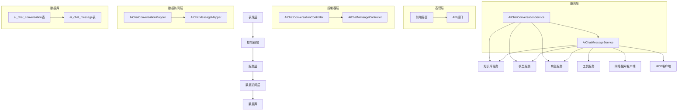
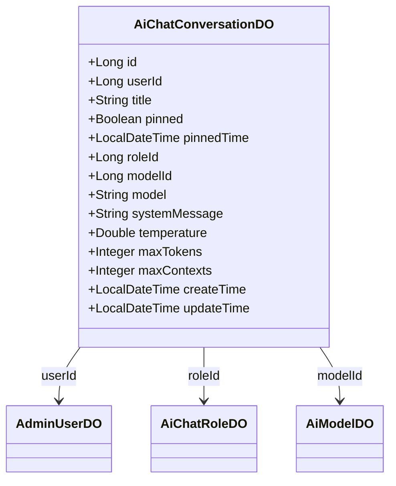
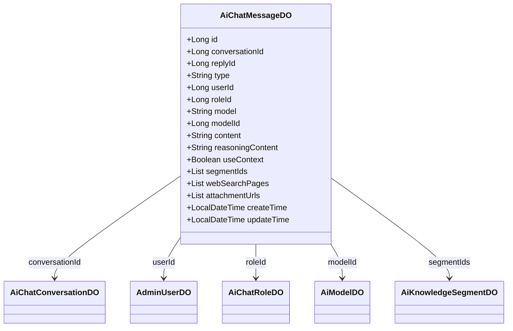
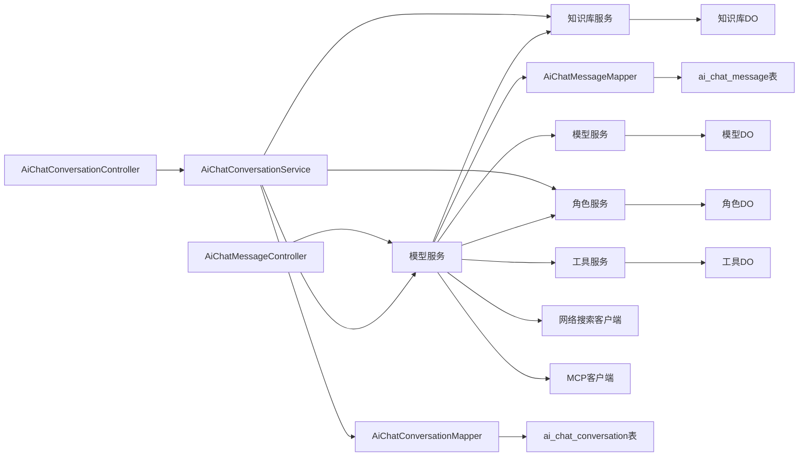
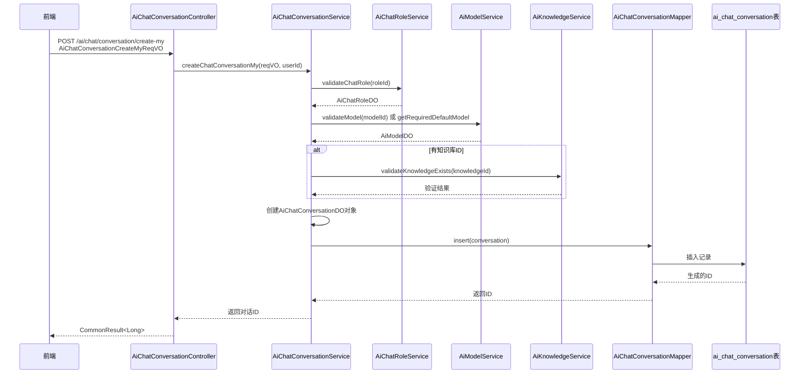
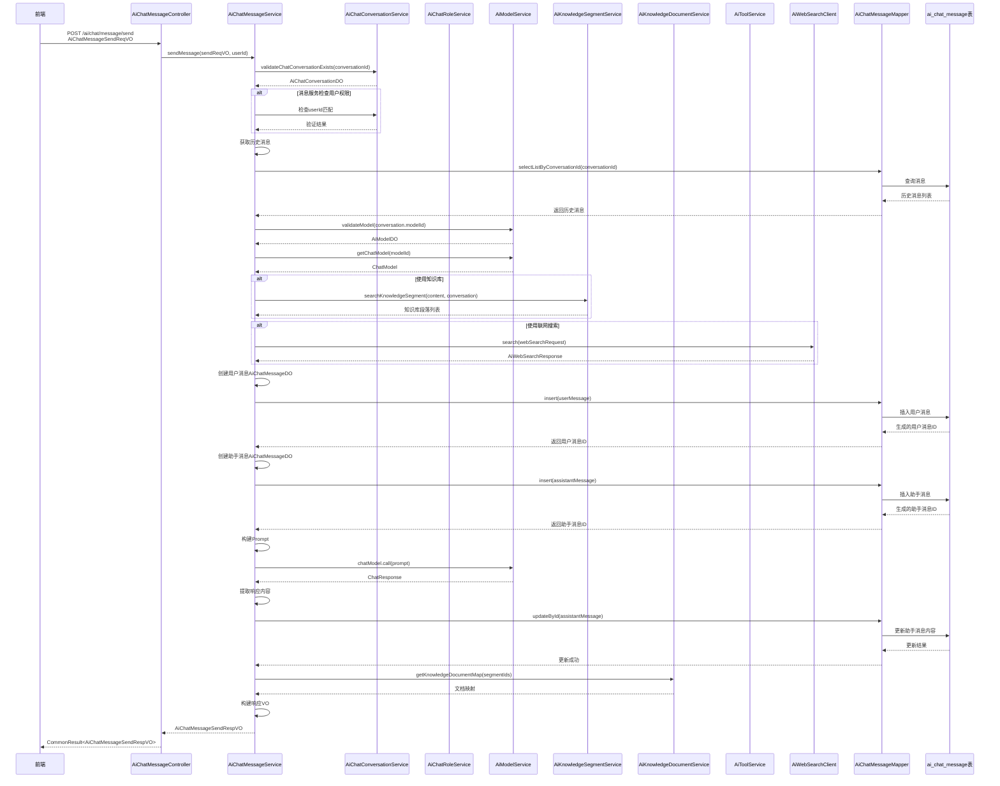
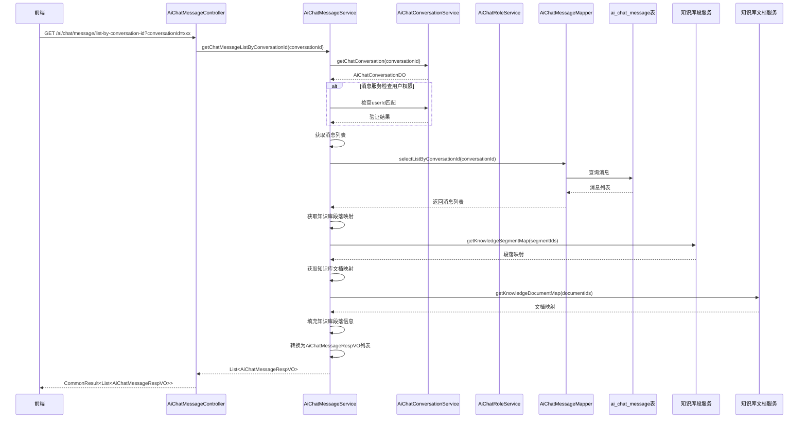

# 聊天模块文档

## 模块概述

聊天模块（Chat Module）是Yudao框架中AI功能的核心组件，提供AI聊天对话和消息管理功能。该模块支持多轮对话、角色设定、模型选择、知识库引用、联网搜索以及文件附件等高级功能。

### 核心功能

1. **对话管理**：创建、更新、删除AI聊天对话，支持置顶功能
2. **消息管理**：发送和获取聊天消息，支持流式和非流式响应
3. **角色系统**：支持自定义AI角色，包含角色设定、头像等属性配置：支持温度参数、最大Token数、上下文长度等模型参数配置
5. **知识库集成**：支持从知识库中检索相关内容作为对话上下文
6. **联网搜索**：支持实时联网搜索获取最新信息
7. **文件附件**：支持上传和引用文件附件作为对话内容
8. **权限控制**：基于Spring Security的细粒度权限管理

### 模块位置

- 模块路径：`yudao-module-ai`
- 主要包结构：
  - `cn.iocoder.yudao.module.ai.controller.admin.chat` - 控制器层
  - `cn.iocoder.yudao.module.ai.service.chat` - 服务层
  - `cn.iocoder.yudao.module.ai.dal.dataobject.chat` - 数据访问层（DO）
  - `cn.iocoder.yudao.module.ai.dal.mysql.chat` - MySQL映射层（Mapper）
  - `cn.iocoder.yudao.module.ai.controller.admin.chat.vo` - 视图对象层（VO）

## 详细设计

### 系统架构

聊天模块遵循分层架构设计，主要包括以下几层：



### 数据模型

#### 聊天对话实体 (AiChatConversationDO)



#### 聊天消息实体 (AiChatMessageDO)



### 组件关系



### 数据流程

#### 创建对话流程



#### 发送消息流程（非流式）



#### 获取消息列表流程



### 接口详情

#### 对话管理接口

| 接口 | 方法 | URL | 描述 |
|------|------|-----|------|
| 创建我的对话 | POST | `/ai/chat/conversation/create-my` | 创建属于当前用户的AI聊天对话 |
| 更新我的对话 | PUT | `/ai/chat/conversation/update-my` | 更新属于当前用户的AI聊天对话 |
| 获取我的对话列表 | GET | `/ai/chat/conversation/my-list` | 获取当前用户的所有AI聊天对话 |
| 获取我的对话详情 | GET | `/ai/chat/conversation/get-my?id={id}` | 获取指定ID的AI聊天对话（仅限当前用户） |
| 删除我的对话 | DELETE | `/ai/chat/conversation/delete-my?id={id}` | 删除属于当前用户的AI聊天对话 |
| 删除未置顶的对话 | DELETE | `/ai/chat/conversation/delete-by-unpinned` | 删除当前用户所有未置顶的AI聊天对话 |
| 分页查询对话（管理员） | GET | `/ai/chat/conversation/page` | 分页查询所有AI聊天对话（需要管理员权限） |
| 管理员删除对话 | DELETE | `/ai/chat/conversation/delete-by-admin?id={id}` | 管理员删除指定ID的AI聊天对话 |

#### 消息管理接口

| 接口 | 方法 | URL | 描述 |
|------|------|-----|------|
| 发送消息（非流式） | POST | `/ai/chat/message/send` | 发送AI聊天消息，返回完整响应 |
| 发送消息（流式） | POST | `/ai/chat/message/send-stream` | 发送AI聊天消息，返回流式响应 |
| 获取对话消息列表 | GET | `/ai/chat/message/list-by-conversation-id?conversationId={id}` | 获取指定对话的所有消息 |
| 删除消息 | DELETE | `/ai/chat/message/delete?id={id}` | 删除指定ID的消息（仅限当前用户） |
| 按对话删除消息 | DELETE | `/ai/chat/message/delete-by-conversation-id?conversationId={id}` | 删除指定对话的所有消息（仅限当前用户） |
| 分页查询消息（管理员） | GET | `/ai/chat/message/page` | 分页查询所有AI聊天消息（需要管理员权限） |
| 管理员删除消息 | DELETE | `/ai/chat/message/delete-by-admin?id={id}` | 管理员删除指定ID的消息 |

### 数据库表结构

#### ai_chat_conversation表

| 字段名 | 类型 | 说明 | 备注 |
|--------|------|------|------|
| id | BIGINT | 主键ID | 自增 |
| user_id | BIGINT | 用户ID | 关联AdminUserDO.userId |
| title | VARCHAR(255) | 对话标题 | 默认值："新对话" |
| pinned | TINYINT(1) | 是否置顶 | 0=否, 1=是 |
| pinned_time | DATETIME | 置顶时间 |  |
| role_id | BIGINT | 角色ID | 关联AiChatRoleDO.id |
| model_id | BIGINT | 模型ID | 关联AiModelDO.id |
| model | VARCHAR(100) | 模型标志 | 冗余AiModelDO.model |
| system_message | TEXT | 角色设定 |  |
| temperature | DOUBLE | 温度参数 |  |
| max_tokens | INT | 单条回复最大Token数 |  |
| max_contexts | INT | 上下文最大Message数 |  |
| create_time | DATETIME | 创建时间 |  |
| update_time | DATETIME | 更新时间 |  |

#### ai_chat_message表

| 字段名 | 类型 | 说明 | 备注 |
|--------|------|------|------|
| id | BIGINT | 主键ID | 自增 |
| conversation_id | BIGINT | 对话ID | 关联AiChatConversationDO.id |
| reply_id | BIGINT | 回复消息ID | 关联ai_chat_message.id |
| type | VARCHAR(20) | 消息类型 | 参考MessageType枚举 |
| user_id | BIGINT | 用户ID | 关联AdminUserDO.userId |
| role_id | BIGINT | 角色ID | 关联AiChatRoleDO.id |
| model | VARCHAR(100) | 模型标志 | 冗余AiModelDO.model |
| model_id | BIGINT | 模型ID | 关联AiModelDO.id |
| content | TEXT | 聊天内容 |  |
| reasoning_content | TEXT | 推理内容 |  |
| use_context | TINYINT(1) | 是否携带上下文 | 0=否, 1=是 |
| segment_ids | JSON | 知识库段落ID数组 | 使用LongListTypeHandler处理 |
| web_search_pages | JSON | 联网搜索网页内容数组 | 使用Jackson3TypeHandler处理 |
| attachment_urls | JSON | 附件URL数组 | 使用StringListTypeHandler处理 |
| create_time | DATETIME | 创建时间 |  |
| update_time | DATETIME | 更新时间 |  |

### 依赖的其他模块

聊天模块依赖以下其他模块的服务：

1. **知识库模块**：提供知识库文档和段落的检索服务
   - `AiKnowledgeSegmentService`：知识库段落服务
   - `AiKnowledgeDocumentService`：知识库文档服务

2. **模型服务**：提供AI模型管理和调用服务
   - `AiModelService`：AI模型服务
   - `AiChatRoleService`：AI聊天角色服务

3. **工具服务**：提供AI工具调用服务
   - `AiToolService`：AI工具服务

4. **基础设施服务**：提供基础功能支持
   - `AiWebSearchClient`：网络搜索客户端
   - `McpSyncClient`：MCP客户端
   - `ToolCallbackResolver`：工具回调解析器

### 配置说明

聊天模块的主要配置项位于 `yudao-module-ai/src/main/java/cn/iocoder/yudao/module/ai/framework/ai/config/YudaoAiProperties.java` 中：

- `yudao.ai.web-search.enable`：是否启用联网搜索功能
- `yudao.ai.mcp.client.enable`：是否启用MCP客户端功能
- `yudao.ai.mcp.client.name`：MCP客户端名称前缀

### 安全性考虑

1. **权限控制**：所有接口都通过Spring Security的`@PreAuthorize`注解进行权限验证
2. **数据隔离**：用户只能访问自己的对话和消息，除非具有管理员权限
3. **参数验证**：所有输入参数都通过JSR-303注解进行验证
4. **防注入**：使用MyBatis-Plus的参数绑定机制防止SQL注入

### 性能优化

1. **分页查询**：对话和消息列表均支持分页查询，避免一次性加载大量数据
2. **缓存机制**：角色、模型等基本信息采用缓存机制减少数据库查询
3. **异步处理**：流式响应采用异步处理方式，提高响应速度
4. **批量操作**：支持批量删除操作，减少数据库交互次数

### 异常处理

模块定义了以下业务异常码：
- `CHAT_CONVERSATION_NOT_EXISTS`：聊天对话不存在
- `CHAT_MESSAGE_NOT_EXIST`：聊天消息不存在
- `CHAT_CONVERSATION_MODEL_ERROR`：聊天对话模型错误

所有异常统一通过全局异常处理器处理，返回标准的错误响应格式。

### 使用示例

#### 创建对话

```http
POST /ai/chat/conversation/create-my
Content-Type: application/json

{
  "roleId": 1,
  "knowledgeId": 1001
}
```

#### 发送消息

```http
POST /ai/chat/message/send
Content-Type: application/json

{
  "conversationId": 1001,
  "content": "你好，请介绍一下自己",
  "useContext": true,
  "useSearch": false,
  "attachmentUrls": []
}
```

#### 获取对话列表

```http
GET /ai/chat/conversation/my-list
```

#### 获取消息历史

```http
GET /ai/chat/message/list-by-conversation-id?conversationId=1001
```