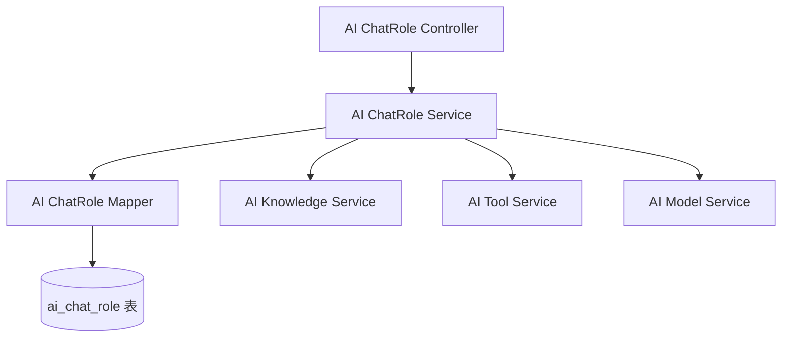
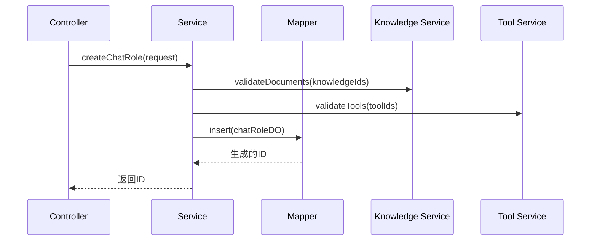
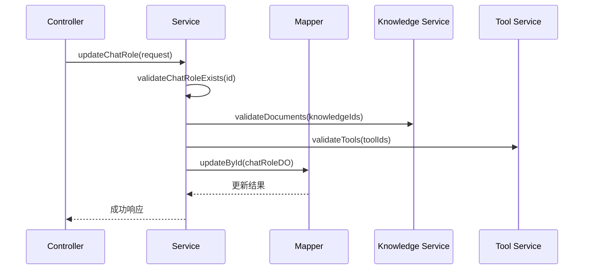
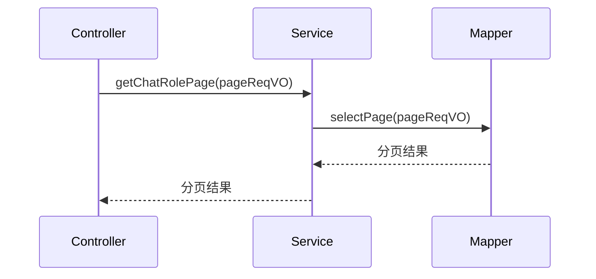

# chatRole 模块文档

## 模块概述

chatRole 模块是 Yudao AI 模块中的核心组件，负责管理 AI 聊天角色（AI Persona）。该模块允许用户创建、管理和使用自定义的 AI 角色，每个角色可以关联特定的 AI 模型、知识库、工具和 MCP 客户端，从而实现个性化的 AI 对话体验。

## 核心功能

1. **角色管理**：创建、编辑、删除 AI 聊天角色
2. **角色分类**：支持角色分类管理，便于组织和查找
3. **公开/私有角色**：区分管理员创建的公开角色和用户个人的私有角色
4. **角色关联**：支持将角色与 AI 模型、知识库、工具和 MCP 客户端关联
5. **角色状态管理**：支持启用/禁用角色状态
6. **角色排序**：支持自定义角色排序
7. **分页查询**：提供角色列表的分页查询功能
8. **我的角色**：支持用户查看和管理自己创建的私有角色

## 架构设计

### 模块结构

```
chatRole 模块
├── controller
│   └── admin/model/AiChatRoleController.java          # REST API 控制器
├── service
│   ├── model/AiChatRoleService.java                   # 服务接口
│   └── model/impl/AiChatRoleServiceImpl.java          # 服务实现
├── dal
│   ├── dataobject/model/AiChatRoleDO.java             # 数据对象 (DO)
│   └── mysql/model/AiChatRoleMapper.java              # 数据访问层 (Mapper)
└── vo/chatRole
    ├── AiChatRoleRespVO.java                          # 响应视图对象
    ├── AiChatRoleSaveReqVO.java                       # 创建/更新请求视图对象
    ├── AiChatRolePageReqVO.java                       # 分页查询请求视图对象
    └── AiChatRoleSaveMyReqVO.java                     # 个人角色创建/更新请求视图对象
```

### 组件关系



### 数据模型

AI 聊天角色数据对象 (AiChatRoleDO) 包含以下字段：

| 字段名 | 类型 | 说明 | 关联关系 |
|--------|------|------|----------|
| id | Long | 角色编号 (主键) |  |
| name | String | 角色名称 |  |
| avatar | String | 角色头像URL |  |
| category | String | 角色分类 |  |
| description | String | 角色描述 |  |
| systemMessage | String | 角色设定 (System Prompt) |  |
| userId | Long | 用户编号 | 关联 AdminUserDO |
| modelId | Long | 模型编号 | 关联 AiModelDO |
| knowledgeIds | List<Long> | 引用的知识库编号列表 | 关联 AiKnowledgeDO |
| toolIds | List<Long> | 引用的工具编号列表 | 关联 AiToolDO |
| mcpClientNames | List<String> | 引用的 MCP Client 名字列表 | 关联 spring.ai.mcp.client |
| publicStatus | Boolean | 是否公开 (true=公开, false=私有) |  |
| sort | Integer | 排序值 |  |
| status | Integer | 状态 (参考 CommonStatusEnum) |  |

### 数据库表结构

```sql
CREATE TABLE ai_chat_role (
    id BIGINT NOT NULL AUTO_INCREMENT COMMENT '编号',
    name VARCHAR(255) NOT NULL COMMENT '角色名称',
    avatar VARCHAR(255) NOT NULL COMMENT '角色头像',
    category VARCHAR(255) NOT NULL COMMENT '角色分类',
    description VARCHAR(2000) NOT NULL COMMENT '角色描述',
    systemMessage TEXT NOT NULL COMMENT '角色设定',
    userId BIGINT COMMENT '用户编号',
    modelId BIGINT COMMENT '模型编号',
    knowledgeIds JSON COMMENT '引用的知识库编号列表',
    toolIds JSON COMMENT '引用的工具编号列表',
    mcpClientNames JSON COMMENT '引用的 MCP Client 名字列表',
    publicStatus TINYINT NOT NULL COMMENT '是否公开',
    sort INT NOT NULL COMMENT '排序值',
    status TINYINT NOT NULL COMMENT '状态',
    PRIMARY KEY (id)
) COMMENT = 'AI 聊天角色表';
```

## API 接口

### 管理员接口 (Admin)

| 方法 | 路径 | 说明 |
|------|------|------|
| POST | /ai/model/chat-role/create | 创建 AI 聊天角色 |
| PUT  | /ai/model/chat-role/update | 更新 AI 聊天角色 |
| DELETE | /ai/model/chat-role/delete?id=xxx | 删除 AI 聊天角色 |
| GET  | /ai/model/chat-role/page | 分页获取 AI 聊天角色列表 |
| GET  | /ai/model/chat-role/get?id=xxx | 获取指定 AI 聊天角色详情 |
| GET  | /ai/model/chat-role/get-all-category | 获取所有角色分类列表 |

### 个人接口 (My)

| 方法 | 路径 | 说明 |
|------|------|------|
| POST | /ai/model/chat-role/create-my | 创建个人 AI 聊天角色 |
| PUT  | /ai/model/chat-role/update-my | 更新个人 AI 聊天角色 |
| DELETE | /ai/model/chat-role/delete-my?id=xxx | 删除个人 AI 聊天角色 |
| GET  | /ai/model/chat-role/page-my | 分页获取个人 AI 聊天角色列表 |

### 请求/响应示例

#### 创建角色请求 (AiChatRoleSaveReqVO)
```json
{
  "modelId": 17640,
  "name": "李四",
  "avatar": "https://www.iocoder.cn/1.png",
  "category": "创作",
  "sort": 1,
  "description": "你说的对",
  "systemMessage": "现在开始你扮演一位程序员，你是一名优秀的程序员，具有很强的逻辑思维能力，总能高效的解决问题",
  "knowledgeIds": [1, 2, 3],
  "toolIds": [1, 2, 3],
  "mcpClientNames": ["filesystem"],
  "publicStatus": true,
  "status": 1
}
```

#### 角色响应 (AiChatRoleRespVO)
```json
{
  "id": 32746,
  "userId": 9442,
  "modelId": 17640,
  "modelName": "张三",
  "model": "gpt-3.5-turbo-0125",
  "name": "李四",
  "avatar": "https://www.iocoder.cn/1.png",
  "category": "创作",
  "sort": 1,
  "description": "你说的对",
  "systemMessage": "现在开始你扮演一位程序员，你是一名优秀的优秀的程序员，具有很强的逻辑思维程序员，具有很强的逻辑思维能力，总能高效的解决问题",
  "knowledgeIds": [1, 2, 3],
  "toolIds": [1, 2, 3],
  "mcpClientNames": ["filesystem"],
  "publicStatus": true,
  "status": 1,
  "createTime": "2023-08-15T10:30:00"
}
```

#### 分页查询请求 (AiChatRolePageReqVO)
```json
{
  "pageNo": 1,
  "pageSize": 10,
  "name": "李四",
  "category": "创作",
  "publicStatus": true
}
```

## 服务层接口

### AiChatRoleService 接口方法

| 方法 | 说明 |
|------|------|
| Long createChatRole(AiChatRoleSaveReqVO createReqVO) | 创建 AI 聊天角色 |
| Long createChatRoleMy(AiChatRoleSaveMyReqVO createReqVO, Long userId) | 创建个人 AI 聊天角色 |
| void updateChatRole(AiChatRoleSaveReqVO updateReqVO) | 更新 AI 聊天角色 |
| void updateChatRoleMy(AiChatRoleSaveMyReqVO updateReqVO, Long userId) | 更新个人 AI 聊天角色 |
| void deleteChatRoleMy(Long id, Long userId) | 删除个人 AI 聊天角色 |
| AiChatRoleDO getChatRole(Long id) | 获取 AI 聊天角色 |
| List<AiChatRoleDO> getChatRoleList(Collection<Long> ids) | 根据 ID 列表获取 AI 聊天角色 |
| AiChatRoleDO validateChatRole(Long id) | 校验 AI 聊天角色是否存在且有效 |
| PageResult<AiChatRoleDO> getChatRolePage(AiChatRolePageReqVO pageReqVO) | 分页查询 AI 聊天角色 |
| PageResult<AiChatRoleDO> getChatRoleMyPage(AiChatRolePageReqVO pageReqVO, Long userId) | 分页查询个人 AI 聊天角色 |
| List<String> getChatRoleCategoryList() | 获取所有角色分类列表 |
| List<AiChatRoleDO> getChatRoleListByName(String name) | 根据名称获取 AI 聊天角色列表 |

## 数据访问层

### AiChatRoleMapper 接口方法

| 方法 | 说明 |
|------|------|
| PageResult<AiChatRoleDO> selectPage(AiChatRolePageReqVO reqVO) | 分页查询 AI 聊天角色 |
| PageResult<AiChatRoleDO> selectPageByMy(AiChatRolePageReqVO reqVO, Long userId) | 分页查询个人 AI 聊天角色 |
| List<AiChatRoleDO> selectListGroupByCategory(Integer status) | 按分类分组查询 AI 聊天角色 |
| List<AiChatRoleDO> selectListByName(String name) | 根据名称查询 AI 聊天角色列表 |

## 业务流程

### 创建角色流程



### 更新角色流程



### 分页查询流程



## 与其他模块的关系

### 依赖的模块

1. **AI Model 模块**：通过 modelId 关联 AI 模型 (AiModelDO)
2. **AI Knowledge 模块**：通过 knowledgeIds 关联知识库 (AiKnowledgeDO)
3. **AI Tool 模块**：通过 toolIds 关联工具 (AiToolDO)
4. **系统用户模块**：通过 userId 关联用户 (AdminUserDO)

### 被依赖的模块

1. **AI Chat 模块**：在 AI 聊天对话时使用聊天角色
2. **AI 消息模块**：在生成 AI 回复时应用角色设定

## 特殊说明

### 公开角色 vs 私有角色

- **公开角色**：由管理员在后台创建，所有用户都可以看到和使用
- **私有角色**：由普通用户在"我的角色"中创建，仅创建者可见和可用

### 字段说明

1. **systemMessage**：这是角色的核心设定，相当于 AI 的系统提示词，定义了 AI 的行为方式、角色扮演等
2. **knowledgeIds**：关联的知识库 ID 列表，AI 在回答问题时会参考这些知识库的内容
3. **toolIds**：关联的工具 ID 列表，AI 可以使用这些工具来执行特定任务（如查询天气、执行代码等）
4. **mcpClientNames**：关联的 MCP (Model Context Protocol) 客户端名称列表，用于扩展 AI 的能力

### 验证逻辑

在创建或更新角色时，系统会验证：
1. 关联的知识库是否存在
2. 关联的工具是否存在
3. 角色是否存在（更新操作）
4. 私有角色只能由创建者修改或删除

## 配置说明

该模块不需要特殊的配置项，所有配置通过数据库持久化。相关的依赖服务（如 AI Model、AI Knowledge、AI Tool）需要通过 Spring 的依赖注入机制自动注入。

## 异常处理

服务层可能抛出的异常包括：
- 聊天角色不存在异常
- 关联的知识库不存在异常
- 关联的工具不存在异常
- 权限不足异常（尝试操作他人的私有角色）

## 性能考虑

1. 使用了 MyBatis-Plus 的分页插件进行高效分页查询
2. 关联查询（如模型名称）使用了传输注解（@Trans）进行关联查询
3. 列表类字段（knowledgeIds, toolIds, mcpClientNames）使用了专门的类型处理器（LongListTypeHandler, StringListTypeHandler）进行 JSON 序列化/反序列化
4. 建议为经常查询的字段（如 name, category, publicStatus, status）添加数据库索引

## 使用示例

### 通过 API 创建角色

```bash
curl -X POST 'http://localhost:8080/ai/model/chat-role/create' \
-H 'Content-Type: application/json' \
-d '{
  "modelId": 17640,
  "name": "编程助手",
  "avatar": "https://example.com/avatar.png",
  "category": "编程",
  "sort": 1,
  "description": "专业的编程助手",
  "systemMessage": "你是一个专业的编程助手，精通多种编程语言",
  "knowledgeIds": [1, 2],
  "toolIds": [3],
  "mcpClientNames": ["filesystem"],
  "publicStatus": true,
  "status": 1
}'
```

### 查询我的角色列表

```bash
curl -X GET 'http://localhost:8080/ai/model/chat-role/page-my?pageNo=1&pageSize=10' \
-H 'Authorization: Bearer <token>'
```

## 未来改进方向

1. 支持角色版本控制，允许用户回滚到历史版本
2. 添加角色使用统计和分析功能
3. 支持角色导入/导出功能
4. 添加角色评分和评论系统
5. 支持角色共享和协作编辑
6. 提供角色模板库，方便用户快速创建常用角色