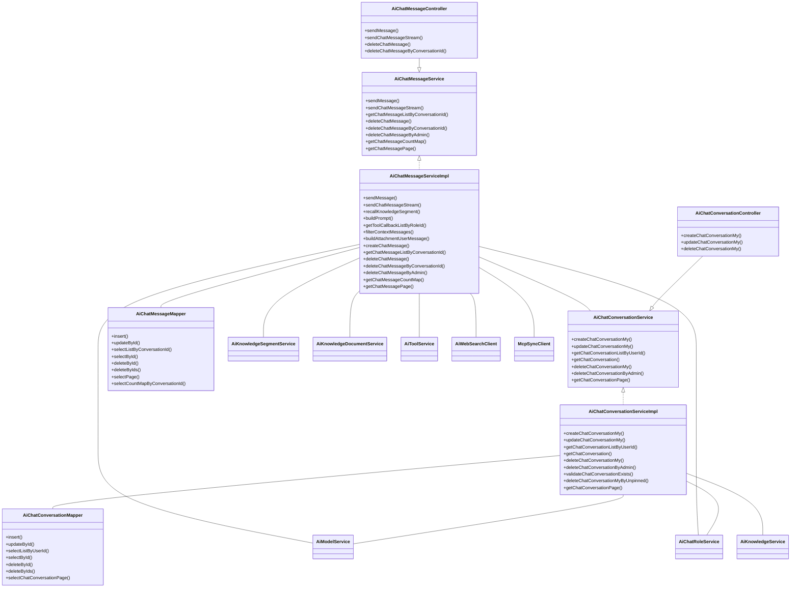
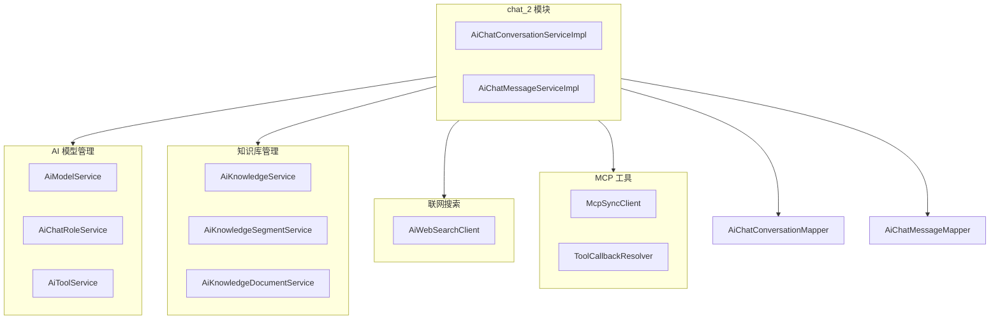

# chat_2 模块文档

## 1. 模块概述

chat_2 模块是 AI 模块（yudao-module-ai）中的核心对话管理模块，主要负责 AI 聊天对话的生命周期管理和消息交互处理。该模块提供了完整的对话创建、更新、删除以及消息发送、查询、删除等功能，支持知识库召回、联网搜索、附件处理、流式响应等高级特性。

## 2. 架构设计

### 2.1 模块定位

chat_2 模块位于 AI 模块的服务层，向上对接控制器层（Controller），向下依赖数据访问层（Mapper）和其他业务服务（如知识库服务、模型服务、角色服务等）。



### 2.2 核心组件关系

chat_2 模块与系统中其他模块的依赖关系如下：



## 3. 核心功能说明

### 3.1 对话管理（AiChatConversationServiceImpl）

#### 3.1.1 创建对话

**功能描述**：用户创建新的 AI 聊天对话，支持指定聊天角色、模型和知识库。

**流程**：
1. 获取聊天角色（可选）
2. 获取聊天模型（从角色获取或默认模型）
3. 校验知识库（如果指定）
4. 创建对话记录并保存

**关键代码**：
```java
public Long createChatConversationMy(AiChatConversationCreateMyReqVO createReqVO, Long userId) {
    // 1.1 获得 AiChatRoleDO 聊天角色
    AiChatRoleDO role = createReqVO.getRoleId() != null ? chatRoleService.validateChatRole(createReqVO.getRoleId()) : null;
    // 1.2 获得 AiModelDO 聊天模型
    AiModelDO model = role != null && role.getModelId() != null ? modalService.validateModel(role.getModelId())
            : modalService.getRequiredDefaultModel(AiModelTypeEnum.CHAT.getType());
    Assert.notNull(model, "必须找到默认模型");
    validateChatModel(model);

    // 1.3 校验知识库
    if (Objects.nonNull(createReqVO.getKnowledgeId())) {
        knowledgeService.validateKnowledgeExists(createReqVO.getKnowledgeId());
    }

    // 2. 创建 AiChatConversationDO 聊天对话
    AiChatConversationDO conversation = new AiChatConversationDO().setUserId(userId).setPinned(false)
            .setModelId(model.getId()).setModel(model.getModel())
            .setTemperature(model.getTemperature()).setMaxTokens(model.getMaxTokens()).setMaxContexts(model.getMaxContexts());
    if (role != null) {
        conversation.setTitle(role.getName()).setRoleId(role.getId()).setSystemMessage(role.getSystemMessage());
    } else {
        conversation.setTitle(AiChatConversationDO.TITLE_DEFAULT);
    }
    chatConversationMapper.insert(conversation);
    return conversation.getId();
}
```

#### 3.1.2 更新对话

**功能描述**：更新现有对话的信息，包括标题、模型、置顶状态等。

**流程**：
1. 校验对话存在且属于当前用户
2. 如果修改模型，校验模型存在
3. 如果修改知识库，校验知识库存在
4. 更新对话记录

#### 3.1.3 删除对话

**功能描述**：删除对话，支持用户自主删除和管理员删除。

**流程**：
1. 校验对话存在
2. 验证用户权限（用户只能删除自己的对话）
3. 删除对话记录

#### 3.1.4 获取对话列表

**功能描述**：根据用户 ID 获取对话列表，支持分页查询。

### 3.2 消息管理（AiChatMessageServiceImpl）

#### 3.2.1 发送消息（同步）

**功能描述**：用户发送消息，AI 助手回复，支持知识库召回、联网搜索、附件处理。

**流程**：
1. 校验对话存在且属于当前用户
2. 获取对话历史消息
3. 校验模型
4. 知识库召回（根据角色关联的知识库）
5. 联网搜索（如果启用）
6. 插入用户消息记录
7. 插入助手消息记录（占位）
8. 构建 Prompt 并调用模型
9. 更新助手消息内容
10. 返回响应结果

**关键代码**：
```java
public AiChatMessageSendRespVO sendMessage(AiChatMessageSendReqVO sendReqVO, Long userId) {
    // 1.1 校验对话存在
    AiChatConversationDO conversation = chatConversationService
            .validateChatConversationExists(sendReqVO.getConversationId());
    if (ObjUtil.notEqual(conversation.getUserId(), userId)) {
        throw exception(CHAT_CONVERSATION_NOT_EXISTS);
    }
    List<AiChatMessageDO> historyMessages = chatMessageMapper.selectListByConversationId(conversation.getId());
    // 1.2 校验模型
    AiModelDO model = modalService.validateModel(conversation.getModelId());
    ChatModel chatModel = modalService.getChatModel(model.getId());

    // 2.1 知识库召回
    List<AiKnowledgeSegmentSearchRespBO> knowledgeSegments = recallKnowledgeSegment(
            sendReqVO.getContent(), conversation);

    // 2.2 联网搜索
    AiWebSearchResponse webSearchResponse = Boolean.TRUE.equals(sendReqVO.getUseSearch()) && webSearchClient != null ?
            webSearchClient.search(new AiWebSearchRequest().setQuery(sendReqVO.getContent())
                    .setSummary(true).setCount(WEB_SEARCH_COUNT)) : null;

    // 3. 插入 user 发送消息
    AiChatMessageDO userMessage = createChatMessage(conversation.getId(), null, model,
            userId, conversation.getRoleId(), MessageType.USER, sendReqVO.getContent(), sendReqVO.getUseContext(),
            null, sendReqVO.getAttachmentUrls(), null);

    // 4.1 插入 assistant 接收消息
    AiChatMessageDO assistantMessage = createChatMessage(conversation.getId(), userMessage.getId(), model,
            userId, conversation.getRoleId(), MessageType.ASSISTANT, "", sendReqVO.getUseContext(),
            knowledgeSegments, null, webSearchResponse);

    // 4.2 创建 chat 需要的 Prompt
    Prompt prompt = buildPrompt(conversation, historyMessages, knowledgeSegments, webSearchResponse, model, sendReqVO);
    ChatResponse chatResponse = chatModel.call(prompt);

    // 4.3 更新响应内容
    String newContent = AiUtils.getChatResponseContent(chatResponse);
    String newReasoningContent = AiUtils.getChatResponseReasoningContent(chatResponse);
    chatMessageMapper.updateById(new AiChatMessageDO().setId(assistantMessage.getId())
            .setContent(newContent).setReasoningContent(newReasoningContent));
    // 4.4 响应结果
    Map<Long, AiKnowledgeDocumentDO> documentMap = knowledgeDocumentService.getKnowledgeDocumentMap(
            convertSet(knowledgeSegments, AiKnowledgeSegmentSearchRespBO::getDocumentId));
    List<AiChatMessageRespVO.KnowledgeSegment> segments = BeanUtils.toBean(knowledgeSegments,
            AiChatMessageRespVO.KnowledgeSegment.class, segment -> {
                AiKnowledgeDocumentDO document = documentMap.get(segment.getDocumentId());
                segment.setDocumentName(document != null ? document.getName() : null);
            });
    return new AiChatMessageSendRespVO()
            .setSend(BeanUtils.toBean(userMessage, AiChatMessageSendRespVO.Message.class))
            .setReceive(BeanUtils.toBean(assistantMessage, AiChatMessageSendRespVO.Message.class)
                    .setContent(newContent).setSegments(segments)
                    .setWebSearchPages(webSearchResponse != null ? webSearchResponse.getLists() : null));
}
```

#### 3.2.2 发送消息（流式）

**功能描述**：支持流式返回 AI 助手回复内容，实现实时打字效果。

**流程**：
1. 初始化对话和模型校验
2. 知识库召回和联网搜索
3. 插入用户和助手消息记录
4. 构建 Prompt 并调用流式模型
5. 流式处理响应内容，逐步更新助手消息
6. 完成时更新最终内容
7. 错误处理：清理不完整的消息

**关键特性**：
- 使用 `Flux<ChatResponse>` 实现流式处理
- 使用 `AtomicBoolean` 确保知识库和搜索仅执行一次
- 错误时清理不完整的助手消息
- 取消请求时清理资源

#### 3.2.3 知识库召回

**功能描述**：根据用户输入内容，从关联的知识库中检索相关片段。

**流程**：
1. 检查对话是否有角色关联
2. 获取角色的知识库 ID 列表
3. 对每个知识库调用搜索服务
4. 合并搜索结果

#### 3.2.4 Prompt 构建

**功能描述**：构建 AI 模型需要的完整 Prompt，包含系统消息、历史对话、知识库、联网搜索、附件等。

**Prompt 组成**：
- System Message：对话的系统提示（来自角色设定）
- History Messages：历史对话上下文（倒序，最多 maxContexts 组）
- User Message：当前用户输入
- Knowledge Segments：知识库片段（用 <Reference> 标记）
- Web Search：联网搜索结果（用 <WebSearch> 标记）
- Attachments：附件内容（用 <Attachment> 标记）

#### 3.2.5 附件处理

**功能描述**：支持用户上传附件（图片、文档等），将附件内容嵌入到 Prompt 中。

**处理逻辑**：
1. 下载附件内容
2. 图片转为 Base64 编码
3. 文档通过知识服务读取内容
4. 拼接成 <Attachment> 格式

#### 3.2.6 工具调用

**功能描述**：支持为对话角色绑定工具（Tool）和 MCP 客户端，AI 可以调用外部工具。

**工具来源**：
- 角色绑定的工具列表（通过工具名称解析 ToolCallback）
- MCP 客户端提供的工具（通过 SyncMcpToolCallbackProvider）

### 3.3 消息查询与删除

**功能描述**：提供消息的查询、分页、批量删除功能。

**支持操作**：
- 按对话 ID 获取消息列表
- 按 ID 获取单条消息
- 分页查询消息
- 用户删除自己的消息
- 管理员删除消息
- 按对话批量删除消息
- 统计各对话的消息数量

## 4. 数据模型

### 4.1 对话实体（AiChatConversationDO）

| 字段名 | 类型 | 说明 |
|--------|------|------|
| id | Long | 主键 |
| userId | Long | 用户 ID |
| pinned | Boolean | 是否置顶 |
| pinnedTime | LocalDateTime | 置顶时间 |
| modelId | Long | 模型 ID |
| model | String | 模型名称 |
| temperature | Double | 温度参数 |
| maxTokens | Integer | 最大 token 数 |
| maxContexts | Integer | 最大上下文数 |
| roleId | Long | 角色 ID |
| title | String | 对话标题 |
| systemMessage | String | 系统消息 |
| createTime | LocalDateTime | 创建时间 |

### 4.2 消息实体（AiChatMessageDO）

| 字段名 | 类型 | 说明 |
|--------|------|------|
| id | Long | 主键 |
| conversationId | Long | 对话 ID |
| replyId | Long | 回复消息 ID |
| modelId | Long | 模型 ID |
| model | String | 模型名称 |
| userId | Long | 用户 ID |
| roleId | Long | 角色 ID |
| type | Integer | 消息类型（USER/ASSISTANT） |
| content | String | 消息内容 |
| reasoningContent | String | 思考过程内容 |
| useContext | Boolean | 是否使用上下文 |
| segmentIds | List<Long> | 知识库片段 ID 列表 |
| attachmentUrls | List<String> | 附件 URL 列表 |
| webSearchPages | List<WebPage> | 网页搜索页面列表 |
| createTime | LocalDateTime | 创建时间 |

## 5. 依赖模块

chat_2 模块依赖以下核心模块：

| 模块 | 依赖说明 |
|------|----------|
| model | 获取模型、角色、工具信息 |
| knowledge | 知识库召回和文档读取 |
| web-search | 联网搜索功能 |
| mcp | MCP 工具客户端集成 |
| tenant | 租户上下文支持 |
| common | 基础工具类、分页结果等 |

## 6. 异常处理

chat_2 模块使用统一的异常处理机制，主要异常包括：

- `CHAT_CONVERSATION_NOT_EXISTS`：对话不存在
- `CHAT_MESSAGE_NOT_EXIST`：消息不存在
- `CHAT_CONVERSATION_MODEL_ERROR`：模型配置错误（缺少必要参数）
- `CHAT_STREAM_ERROR`：流式调用错误

## 7. 扩展点

### 7.1 搜索扩展

通过 `AiWebSearchClient` 接口支持不同的搜索引擎实现，当前默认使用百度搜索。

### 7.2 工具扩展

通过 `ToolCallbackResolver` 和 MCP 客户端支持动态工具注册和调用。

### 7.3 Prompt 模板

知识库、联网搜索、附件的 Prompt 模板可通过常量修改，便于调整 AI 的引用方式。

### 7.4 附件类型扩展

`FileTypeUtils` 支持检测附件类型，可通过扩展支持更多文件类型。

## 8. 使用示例

### 8.1 创建对话

```java
// 创建对话请求
AiChatConversationCreateMyReqVO createReqVO = new AiChatConversationCreateMyReqVO();
createReqVO.setRoleId(1L); // 可选：指定角色
createReqVO.setKnowledgeId(100L); // 可选：指定知识库

// 创建对话
Long conversationId = chatConversationService.createChatConversationMy(createReqVO, userId);
```

### 8.2 发送消息

```java
// 发送消息请求
AiChatMessageSendReqVO sendReqVO = new AiChatMessageSendReqVO();
sendReqVO.setConversationId(conversationId);
sendReqVO.setContent("你好，请介绍一下你自己？");
sendReqVO.setUseSearch(true); // 启用联网搜索
sendReqVO.setUseContext(true); // 使用历史上下文
sendReqVO.setAttachmentUrls(Arrays.asList("https://example.com/file.pdf")); // 附件

// 发送消息
AiChatMessageSendRespVO response = chatMessageService.sendMessage(sendReqVO, userId);
```

### 8.3 流式发送消息

```java
// 流式发送消息
Flux<CommonResult<AiChatMessageSendRespVO>> stream = chatMessageService.sendChatMessageStream(sendReqVO, userId);

// 逐步接收响应
stream.subscribe(result -> {
    if (result.isSuccess()) {
        AiChatMessageSendRespVO message = result.getData();
        // 逐步显示助手回复内容
        System.out.println(message.getReceive().getContent());
    }
});
```

## 9. 性能优化建议

1. **知识库召回缓存**：对常用的知识库查询结果进行缓存，减少重复检索
2. **附件异步处理**：大附件的下载和处理可异步进行，避免阻塞主线程
3. **消息分页查询**：历史消息查询应支持分页，避免一次性加载过多消息
4. **流式连接池**：对 MCP 客户端和搜索服务连接池进行合理配置
5. **Prompt 压缩**：对过长的历史消息进行摘要压缩，减少 Token 消耗

## 10. 安全考虑

1. **权限校验**：所有对话和消息操作都进行用户权限校验，防止越权访问
2. **输入过滤**：对用户输入进行适当过滤，防止注入攻击
3. **附件安全**：附件下载需验证来源和类型，防止恶意文件
4. **速率限制**：对高频调用进行速率限制，防止滥用
5. **敏感信息**：对话内容中可能包含敏感信息，需注意存储和传输安全
