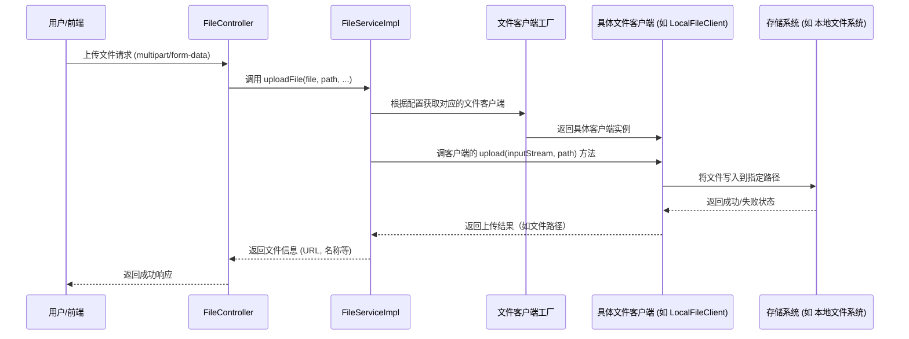

# 客户端模块文档

## 模块概述

客户端模块（`client`）是 Yudao 框架中基础设施（Infra）模块的一部分，位于 `yudao-module-infra` 中。该模块提供了一个抽象的文件客户端框架，用于统一管理不同存储介质（如本地文件系统、FTP、SFTP、Amazon S3、数据库等）上的文件操作。通过抽象文件客户端，上层业务（如文件服务）可以无需关心具体的存储实现，从而实现存储介质的灵活切换和解耦。

## 架构概览

客户端模块遵循策略模式和模板方法模式的设计思想，核心组件包括：

- **抽象文件客户端（`AbstractFileClient`）**：定义了文件客户端的通用行为和模板方法，如初始化、刷新配置和生成文件访问 URL。
- **文件客户端接口（`FileClient`）**：定义了文件客户端必须实现的核心操作（如上传、下载、删除等）。
- **具体文件客户端实现**：针对不同存储介质的具体实现，如 `LocalFileClient`（本地文件）、`FtpFileClient`（FTP）、`SftpFileClient`（SFTP）、`S3FileClient`（Amazon S3）、`DbFileClient`（数据库）。
- **配置类**：每种客户端都有对应的配置类（如 `LocalFileClientConfig`），用于封装该客户端所需的连接参数。
- **工具类**：提供文件类型判断、路径处理等辅助功能。

## 组件详解

### 抽象文件客户端（AbstractFileClient）

`AbstractFileClient` 是所有文件客户端的基类，实现了 `FileClient` 接口。它提供了以下功能：

- **配置管理**：通过泛型 `Config extends FileClientConfig` 管理客户端特定的配置，并保存原始配置用于检测配置变更。
- **生命周期管理**：提供 `init()` 方法进行初始化（调用抽象方法 `doInit()`），以及 `refresh(Config config)` 方法在配置变更时重新初始化。
- **通用工具方法**：提供 `formatFileUrl(String domain, String path)` 方法，用于生成通过文件控制器访问文件的 URL（适用于本地、FTP、数据库等存储方式）。

关键代码片段：
```java
public abstract class AbstractFileClient<Config extends FileClientConfig> implements FileClient {
    private final Long id;
    protected Config config;
    private Config originalConfig;

    public AbstractFileClient(Long id, Config config) {
        this.id = id;
        this.config = config;
        this.originalConfig = config;
    }

    public final void init() {
        doInit();
        log.debug("[init][配置({}) 初始化完成]", config);
    }

    protected abstract void doInit();

    public final void refresh(Config config) {
        if (config.equals(this.originalConfig)) {
            return;
        }
        log.info("[refresh][配置({})发生变化，重新初始化]", config);
        this.config = config;
        this.originalConfig = config;
        this.init();
    }

    @Override
    public Long getId() {
        return id;
    }

    protected String formatFileUrl(String domain, String path) {
        return StrUtil.format("{}/admin-api/infra/file/{}/get/{}", domain, getId(), HttpUtils.encodeUrlPath(path));
    }
}
```

### 文件客户端接口（FileClient）

虽然未在提供的核心组件中直接给出，但可以推断 `FileClient` 接口定义了文件操作的标准方法，例如：
- `upload(InputStream inputStream, String path)`：上传文件
- `download(String path)`：下载文件
- `delete(String path)`：删除文件
- `getUrl(String path)`：获取文件访问 URL
- `exist(String path)`：检查文件是否存在

具体实现请参考各个具体客户端类。

### 具体文件客户端实现

客户端模块提供了多种存储介质的实现，每个实现都继承自 `AbstractFileClient` 并实现了其抽象方法：

1. **本地文件客户端（`LocalFileClient`）**：
   - 存储位置：本地文件系统
   - 配置类：`LocalFileClientConfig`（包含 `basePath` 和 `domain`）
   - 核心实现：将文件写入到配置的基础路径下，通过 `formatFileUrl` 生成可通过文件控制器访问的 URL。

2. **FTP 客户端（`FtpFileClient`）**：
   - 存储位置：FTP 服务器
   - 配置类：`FtpFileClientConfig`（包含主机、端口、用户名、密码等）

3. **SFTP 客户端（`SftpFileClient`）**：
   - 存储位置：SFTP 服务器
   - 配置类：`SftpFileClientConfig`（类似 FTP 但增加了私钥等安全选项）

4. **Amazon S3 客户端（`S3FileClient`）**：
   - 存储位置：Amazon S3 存储桶
   - 配置类：`S3FileClientConfig`（包含访问密钥、秘密密钥、区域、存储桶名等）

5. **数据库客户端（`DbFileClient`）**：
   - 存储位置：关系型数据库（通过 BLOB 字段）
   - 配置类：`DbFileClientConfig`（包含数据源信息、表名等）

每个具体客户端都需要实现 `doInit()` 方法以完成初始化工作（如建立连接、验证配置等）。

### 工具类

客户端模块还提供了两个关键的工具类：

1. **文件类型工具（`FileTypeUtils`）**：
   - 基于 Apache Tika 实现文件 MIME 类型检测
   - 提供根据文件内容、文件名或两者组合获取 MIME 类型的方法
   - 提供根据 MIME 类型获取文件扩展名的方法
   - 提供判断是否为图片类型的方法
   - 提供将文件内容写入 HTTP 响应作为附件的方法（用于文件下载）

2. **文件路径工具（`FilePathUtils`）**：
   - 提供路径规范化、去除重复斜杠、确保路径以斜杠开头或结尾等功能
   - 防止路径遍历攻击（如检查 `..` 和 `.`）

## 在系统中的定位

客户端模块是 Infra 模块中文件存储子系统的核心部分。它为上层的文件服务（`FileService`）提供了统一的文件操作抽象。在 Infra 模块中：

- `FileServiceImpl` 通过文件客户端工厂（或直接注入具体客户端）获取对应的文件客户端实例
- 当用户通过文件控制器（`FileController`）上传或下载文件时，实际的存储操作由具体的文件客户端执行
- 文件控制器负责处理 HTTP 请求和响应，而文件客户端负责与底层存储系统交互

这种设计使得系统可以轻松切换存储后端（例如从本地存储切换到云存储）而无需修改业务逻辑。

## 依赖关系

客户端模块主要依赖以下内部组件和外部库：

- **内部依赖**：
  - `cn.iocoder.yudao.framework.common.util.http.HttpUtils`：用于 URL 编码
  - `cn.iocoder.yudao.framework.common.util.collection.CollectionUtils`：在某些实现中可能用到
  - 项目自身的配置类和工具类

- **外部依赖**：
  - Apache Tika：用于文件类型检测（在 `FileTypeUtils` 中）
  - Lombok：用于简化代码（如 `@Data`, `@Slf4j`）
  - 各种存储介质的客户端库（如 Apache Commons Net 用于 FTP/SFTP，AWS SDK 用于 S3，JDBC 用于数据库等）

## 时序图：文件上传流程

以下是通过文件客户端上传文件的典型流程时序图：



## 配置示例

以本地文件客户端为例，其配置在数据库中的 `file_client_config` 表（或通过 `FileConfigService` 管理）可能如下：

| id | client_type | config                                                                 |
|----|-------------|------------------------------------------------------------------------|
| 1  | local       | {"basePath":"/var/upload/files","domain":"http://files.example.com"}   |

当文件服务需要上传文件时，它会根据客户端类型（local）获取对应的配置，创建 `LocalFileClient` 实例，并调用其 `upload` 方法。

## 扩展指南

如果需要添加新的存储介质支持（例如阿里云 OSS、Azure Blob Storage），只需：

1. 创建对应的配置类（继承 `FileClientConfig`）
2. 实现具体的客户端类（继承 `AbstractFileClient<YourConfig>` 并实现 `doInit()` 和 `FileClient` 接口方法）
3. 在客户端工厂或配置管理中注册新的客户端类型
4. 确保添加必要的第三方依赖（如 OSS SDK）

这种设计遵循开闭原则（Open/Closed Principle），对扩展开放，对修改关闭。

## 与其他模块的关系

客户端模块主要被 Infra 模块中的文件服务（`FileService`）所使用。有关文件服务的详细说明，请参考 [文件服务模块文档](file.md)。

在更广泛的系统中，文件服务又被各种业务模块（如用户头像、文章附件、商品图片等）所依赖，实现了文件存储的统一管理和配置。