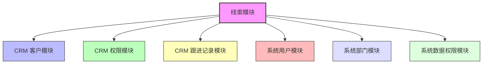
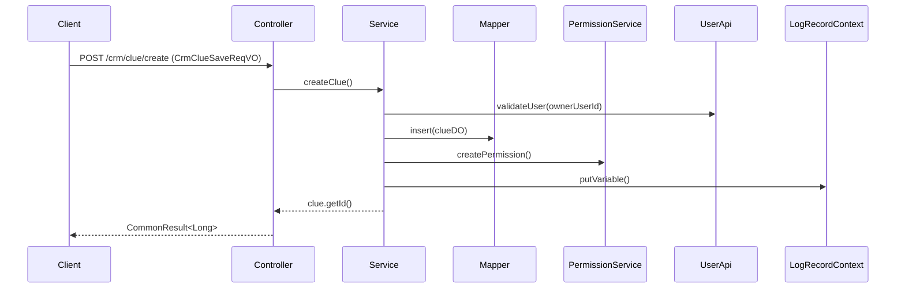
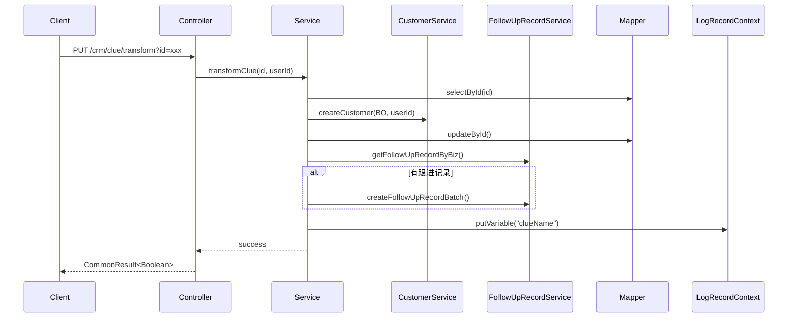
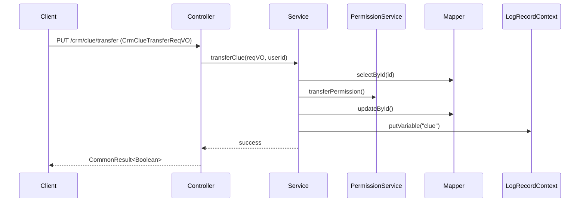

# 线索模块 (Clue Module) 文档

## 1. 概述

线索模块是 CRM（客户关系管理）系统中的核心功能之一，用于管理潜在客户信息。线索代表了企业可能获得的客户机会，通过线索的跟进、转化和管理，帮助企业将潜在客户转化为实际客户。

本模块提供了完整的线索生命周期管理功能，包括：
- 线索的创建、查询、更新、删除
- 线索的分页搜索与导出
- 线索的转移（负责人变更）
- 线索的转化为客户（将线索正式转化为客户记录）
- 待跟进线索数量统计

## 2. 架构设计

### 2.1 模块组成

线索模块采用标准的分层架构，包含以下主要组件：

```
┌─────────────────────────────────────────────────────────┐
│                    CrmClueController                    │  ← API 层（RESTful 接口）
└─────────────────────────────────────────────────────────┘
                          ↓
┌─────────────────────────────────────────────────────────┐
│                   CrmClueServiceImpl                    │  ← Service 层（业务逻辑）
└─────────────────────────────────────────────────────────┘
                          ↓
┌─────────────────────────────────────────────────────────┐
│                 CrmClueMapper / DO                      │  ← DAO 层（数据访问）
└─────────────────────────────────────────────────────────┘
```

### 2.2 依赖关系

线索模块与其他模块的依赖关系如下：



**依赖说明：**
- **CRM 客户模块**：线索转化为客户时，需要调用客户服务创建客户记录
- **CRM 权限模块**：线索创建时需要初始化数据权限，删除时需要清理权限
- **CRM 跟进记录模块**：线索转化时需要复制跟进记录到客户
- **系统用户模块**：校验负责人是否存在、获取用户信息
- **系统部门模块**：获取部门负责人信息用于显示
- **系统数据权限模块**：实现线索的数据权限控制

## 3. 核心组件

### 3.1 控制器层 (CrmClueController)

负责接收 HTTP 请求，调用 Service 层处理业务，返回响应结果。

| 接口路径 | 方法 | 描述 | 权限要求 |
|---------|------|------|---------|
| `/crm/clue/create` | POST | 创建新线索 | `crm:clue:create` |
| `/crm/clue/update` | PUT | 更新线索信息 | `crm:clue:update` |
| `/crm/clue/delete` | DELETE | 删除线索 | `crm:clue:delete` |
| `/crm/clue/get` | GET | 获取线索详情 | `crm:clue:query` |
| `/crm/clue/page` | GET | 分页查询线索 | `crm:clue:query` |
| `/crm/clue/export-excel` | GET | 导出线索 Excel | `crm:clue:export` |
| `/crm/clue/transfer` | PUT | 转移线索（变更负责人） | `crm:clue:update` |
| `/crm/clue/transform` | PUT | 线索转化为客户 | `crm:clue:update` |
| `/crm/clue/follow-count` | GET | 获取待跟进线索数量 | `crm:clue:query` |

### 3.2 服务层 (CrmClueServiceImpl)

实现核心业务逻辑，包括：

- **创建线索**：校验关联数据 → 插入线索记录 → 创建数据权限 → 记录日志
- **更新线索**：校验存在性 → 校验关联数据 → 更新记录 → 记录日志
- **删除线索**：校验存在性 → 删除记录 → 清理权限 → 删除跟进记录 → 记录日志
- **转移线索**：校验存在性 → 权限转移 → 更新负责人 → 记录日志
- **转化线索**：校验未转化状态 → 创建客户 → 更新线索状态 → 复制跟进记录 → 记录日志
- **获取线索列表**：支持多条件分页查询
- **获取待跟进数量**：统计当前用户负责的线索数量

### 3.3 数据对象 (CrmClueDO)

数据库表对应的实体类，存储线索的持久化数据。主要字段包括：

- `id`：主键编号
- `name`：线索名称
- `mobile`：手机号
- `telephone`：电话
- `qq`：QQ 号
- `wechat`：微信
- `email`：邮箱
- `areaId`：地区编号
- `detailAddress`：详细地址
- `industryId`：所属行业
- `level`：客户等级
- `source`：客户来源
- `description`：客户描述
- `remark`：备注
- `ownerUserId`：负责人编号
- `creator`：创建人
- `followUpStatus`：跟进状态
- `contactLastTime`：最后跟进时间
- `contactNextTime`：下次联系时间
- `contactLastContent`：最后跟进内容
- `transformStatus`：转化状态
- `customerId`：关联的客户编号（转化后）
- `createTime`：创建时间
- `updateTime`：更新时间

### 3.4 视图对象 (VO)

#### 3.4.1 CrmClueSaveReqVO - 创建/更新请求

用于前端提交线索创建或更新的数据，包含所有可编辑字段，并带有验证注解：

```java
@Data
public class CrmClueSaveReqVO {
    
    @Schema(description = "线索名称", requiredMode = Schema.RequiredMode.REQUIRED)
    @NotEmpty(message = "线索名称不能为空")
    private String name;
    
    @Schema(description = "手机号")
    @Mobile
    private String mobile;
    
    @Schema(description = "电话")
    @Telephone
    private String telephone;
    
    @Schema(description = "QQ")
    @Size(max = 20)
    private String qq;
    
    @Schema(description = "微信")
    @Size(max = 255)
    private String wechat;
    
    @Schema(description = "邮箱")
    @Email(message = "邮箱格式不正确")
    @Size(max = 255)
    private String email;
    
    @Schema(description = "地区编号")
    private Integer areaId;
    
    @Schema(description = "详细地址")
    private String detailAddress;
    
    @Schema(description = "所属行业")
    @DictFormat(CRM_CUSTOMER_INDUSTRY)
    private Integer industryId;
    
    @Schema(description = "客户等级")
    @InEnum(CrmCustomerLevelEnum.class)
    private Integer level;
    
    @Schema(description = "客户来源")
    private Integer source;
    
    @Schema(description = "客户描述")
    @Size(max = 4096)
    private String description;
    
    @Schema(description = "备注")
    private String remark;
    
    @Schema(description = "负责人编号")
    @NotNull(message = "负责人编号不能为空")
    private Long ownerUserId;
}
```

#### 3.4.2 CrmCluePageReqVO - 分页查询请求

支持多条件组合查询：

```java
@Data
public class CrmCluePageReqVO extends PageParam {
    
    private String name;              // 线索名称
    private Boolean transformStatus;  // 转化状态
    private String telephone;         // 电话
    private String mobile;            // 手机号
    private Integer sceneType;        // 场景类型
    private Integer industryId;       // 所属行业
    private Integer level;            // 客户等级
    private Integer source;           // 客户来源
    private Boolean followUpStatus;   // 跟进状态
    private LocalDateTime[] createTime; // 创建时间范围
}
```

#### 3.4.3 CrmClueRespVO - 响应视图

包含线索的所有详细信息，用于前端展示和 Excel 导出：

```java
@Data
@ExcelIgnoreUnannotated
public class CrmClueRespVO {
    
    private Long id;                  // 编号
    private String name;              // 线索名称
    private Boolean followUpStatus;   // 跟进状态
    private LocalDateTime contactLastTime; // 最后跟进时间
    private String contactLastContent;    // 最后跟进内容
    private LocalDateTime contactNextTime; // 下次联系时间
    
    private Long ownerUserId;         // 负责人编号
    private String ownerUserName;     // 负责人名字
    private String ownerUserDeptName; // 负责人部门
    
    private Boolean transformStatus;  // 转化状态
    private Long customerId;          // 客户编号
    private String customerName;      // 客户名称
    
    private String mobile;            // 手机号
    private String telephone;         // 电话
    private String qq;                // QQ
    private String wechat;            // 微信
    private String email;             // 邮箱
    
    private Integer areaId;           // 地区编号
    private String areaName;          // 地区名称
    private String detailAddress;     // 详细地址
    
    private Integer industryId;       // 所属行业
    private Integer level;            // 客户等级
    private Integer source;           // 客户来源
    private String remark;            // 备注
    
    private String creator;           // 创建人
    private String creatorName;       // 创建人名字
    private LocalDateTime createTime; // 创建时间
    private LocalDateTime updateTime; // 更新时间
}
```

#### 3.4.4 CrmClueTransferReqVO - 转移请求

```java
@Data
public class CrmClueTransferReqVO {
    
    @Schema(description = "线索编号", requiredMode = Schema.RequiredMode.REQUIRED)
    @NotNull(message = "线索编号不能为空")
    private Long id;
    
    @Schema(description = "新负责人的用户编号", requiredMode = Schema.RequiredMode.REQUIRED)
    @NotNull(message = "新负责人的用户编号不能为空")
    private Long newOwnerUserId;
    
    @Schema(description = "老负责人加入团队后的权限级别")
    @InEnum(value = CrmPermissionLevelEnum.class)
    private Integer oldOwnerPermissionLevel;
}
```

## 4. 业务流程

### 4.1 创建线索流程



### 4.2 线索转化为客户流程



### 4.3 线索转移流程



## 5. 权限控制

线索模块集成了系统的权限控制机制：

### 5.1 操作权限

使用 Spring Security 的 `@PreAuthorize` 注解进行权限校验：

```java
@PreAuthorize("@ss.hasPermission('crm:clue:create')")  // 创建
@PreAuthorize("@ss.hasPermission('crm:clue:update')")  // 更新、转移、转化
@PreAuthorize("@ss.hasPermission('crm:clue:delete')")  // 删除
@PreAuthorize("@ss.hasPermission('crm:clue:query')")   // 查询、导出
@PreAuthorize("@ss.hasPermission('crm:clue:export')")  // 导出
```

### 5.2 数据权限

使用 `@CrmPermission` 注解实现行级数据权限控制：

```java
// 更新操作 - 需要拥有线索的 OWNER 权限
@CrmPermission(bizType = CrmBizTypeEnum.CRM_CLUE, bizId = "#updateReqVO.id", 
               level = CrmPermissionLevelEnum.OWNER)
public void updateClue(CrmClueSaveReqVO updateReqVO) { ... }

// 删除操作 - 需要拥有线索的 OWNER 权限
@CrmPermission(bizType = CrmBizTypeEnum.CRM_CLUE, bizId = "#id", 
               level = CrmPermissionLevelEnum.OWNER)
public void deleteClue(Long id) { ... }

// 转移操作 - 需要拥有线索的 OWNER 权限
@CrmPermission(bizType = CrmBizTypeEnum.CRM_CLUE, bizId = "#reqVO.id", 
               level = CrmPermissionLevelEnum.OWNER)
public void transferClue(CrmClueTransferReqVO reqVO, Long userId) { ... }

// 转化操作 - 需要拥有线索的 OWNER 权限
@CrmPermission(bizType = CrmBizTypeEnum.CRM_CLUE, bizId = "#id", 
               level = CrmPermissionLevelEnum.OWNER)
public void transformClue(Long id, Long userId) { ... }

// 跟进操作 - 需要拥有线索的 WRITE 权限
@CrmPermission(bizType = CrmBizTypeEnum.CRM_CLUE, bizId = "#id", 
               level = CrmPermissionLevelEnum.WRITE)
public void updateClueFollowUp(Long id, LocalDateTime contactNextTime, 
                               String contactLastContent) { ... }
```

**权限级别说明：**
- `OWNER`：线索的负责人，拥有完全控制权
- `WRITE`：可以修改线索内容但不能删除或转移
- `READ`：只能查看线索信息

## 6. 操作日志

线索模块的所有关键操作都记录了操作日志，便于审计和追溯：

| 操作类型 | LogRecord.type | LogRecord.subType | success 常量 |
|---------|---------------|-------------------|-------------|
| 创建 | `CRM_CLUE_TYPE` | `CRM_CLUE_CREATE_SUB_TYPE` | `CRM_CLUE_CREATE_SUCCESS` |
| 更新 | `CRM_CLUE_TYPE` | `CRM_CLUE_UPDATE_SUB_TYPE` | `CRM_CLUE_UPDATE_SUCCESS` |
| 删除 | `CRM_CLUE_TYPE` | `CRM_CLUE_DELETE_SUB_TYPE` | `CRM_CLUE_DELETE_SUCCESS` |
| 转移 | `CRM_CLUE_TYPE` | `CRM_CLUE_TRANSFER_SUB_TYPE` | `CRM_CLUE_TRANSFER_SUCCESS` |
| 转化 | `CRM_CLUE_TYPE` | `CRM_CLUE_TRANSLATE_SUB_TYPE` | `CRM_CLUE_TRANSLATE_SUCCESS` |
| 跟进 | `CRM_CLUE_TYPE` | `CRM_CLUE_FOLLOW_UP_SUB_TYPE` | `CRM_CLUE_FOLLOW_UP_SUCCESS` |

日志中会包含以下上下文变量：
- `clue`：线索对象（用于删除、转移操作）
- `clueName`：线索名称（用于显示）
- `oldObject`：更新前的旧值（用于对比差异）

## 7. Excel 导出

线索模块支持将查询结果导出为 Excel 文件：

- **接口**：`GET /crm/clue/export-excel`
- **参数**：`CrmCluePageReqVO`（与分页查询相同的过滤条件）
- **实现方式**：
  1. 将页面请求的 pageSize 设置为 `PAGE_SIZE_NONE`（表示不分页，导出全部数据）
  2. 调用服务层获取完整数据列表
  3. 使用 `ExcelUtils.write()` 方法写入响应流
  4. 自动添加操作日志（导出类型）

导出的 Excel 文件包含所有在 `CrmClueRespVO` 中定义的字段，并使用 `@ExcelProperty` 注解设置列名。

## 8. 待跟进线索数量统计

提供接口获取当前登录用户需要跟进的线索数量：

- **接口**：`GET /crm/clue/follow-count`
- **用途**：用于首页仪表盘显示待办事项数量
- **实现**：调用 `clueMapper.selectCountByFollow(userId)` 统计

## 9. 相关模块参考

- [CRM 客户模块](customer.md) - 线索转化为客户的目标模块
- [CRM 权限模块](permission.md) - 数据权限控制实现
- [系统用户模块](user.md) - 用户信息查询和校验
- [系统数据权限模块](data-permission.md) - 数据权限框架
- [系统操作日志模块](operatelog.md) - 操作日志记录
