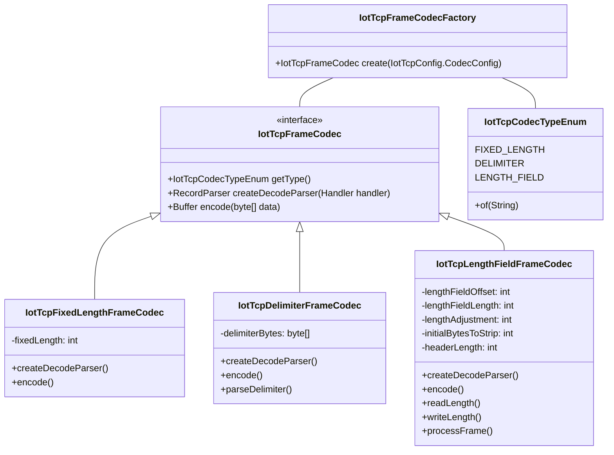
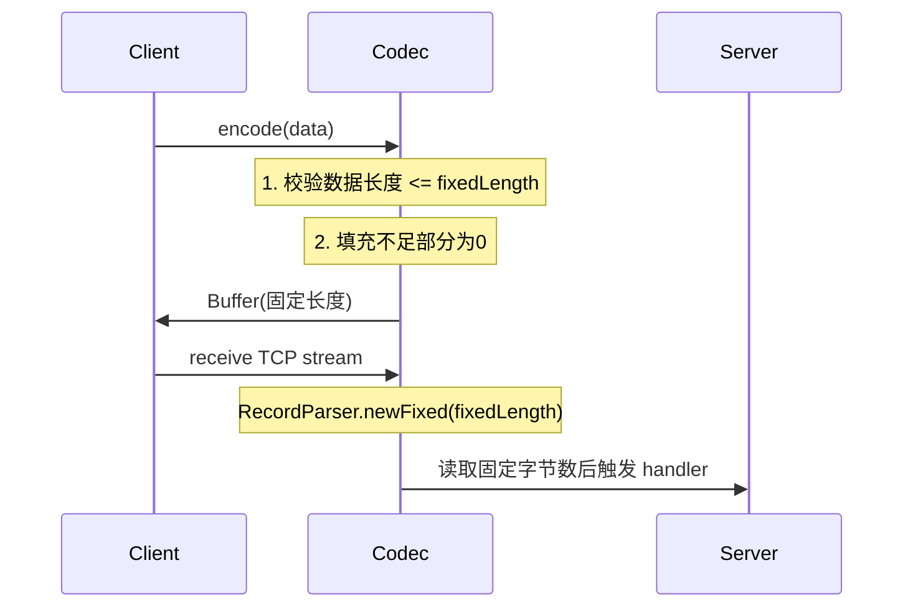
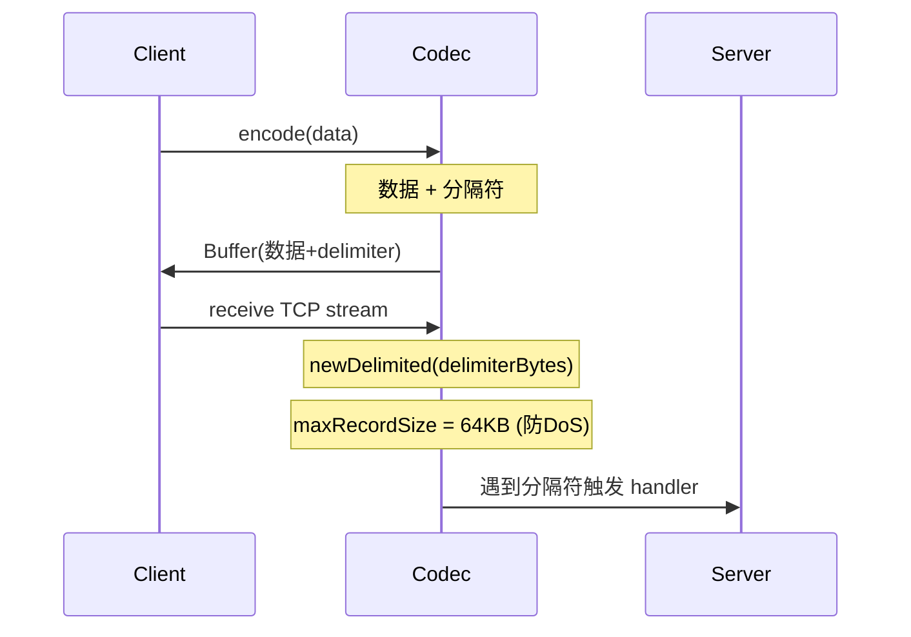
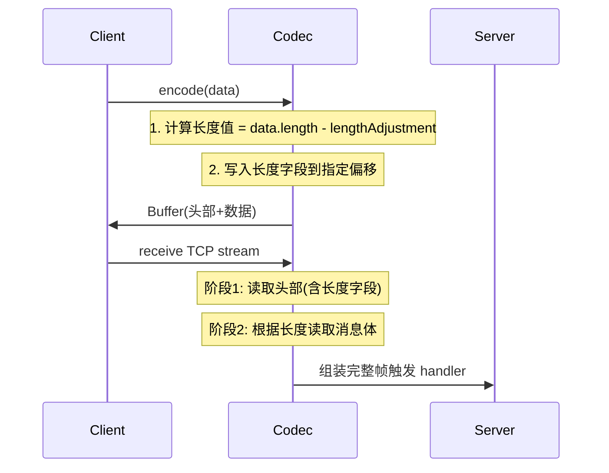
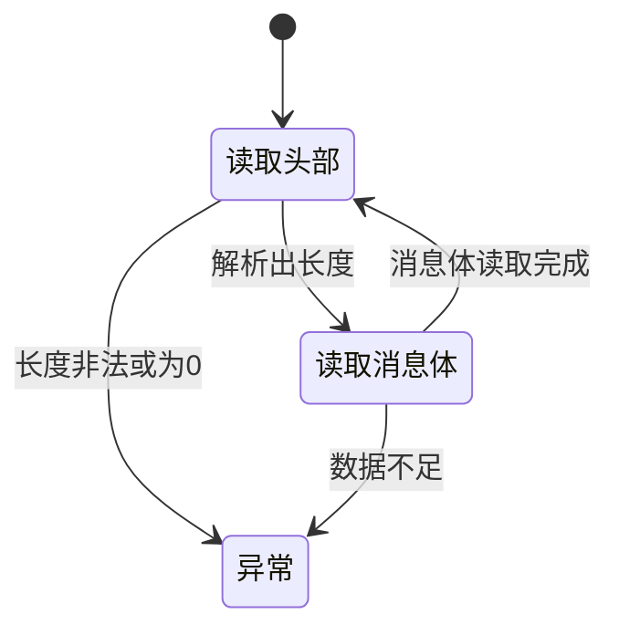
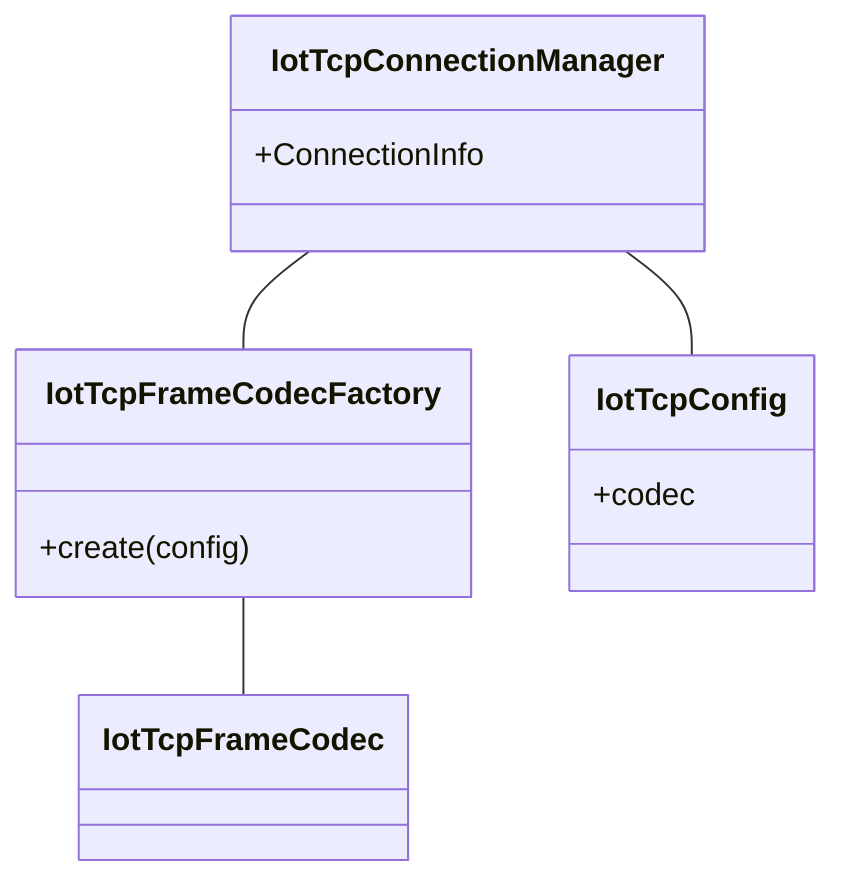
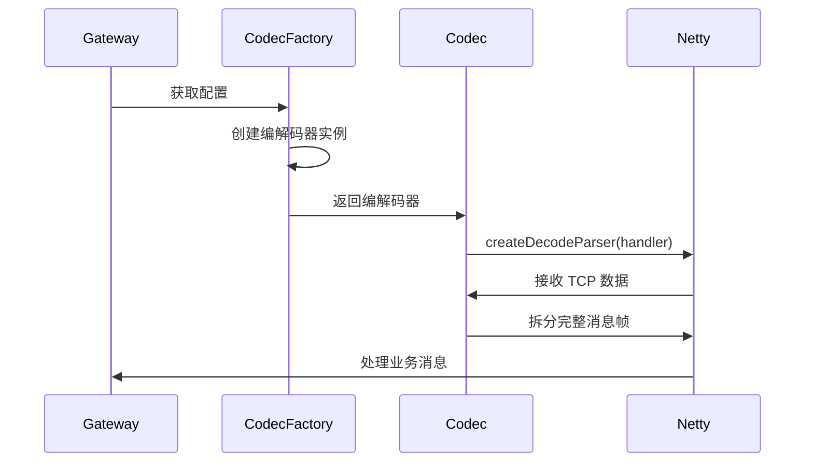

# IoT TCP 编解码模块 (Codec Module)

## 1. 模块概述

IoT TCP 编解码模块负责处理物联网设备通过 TCP 协议通信时的数据帧组装与拆分。由于 TCP 是流式协议，不保留消息边界，该模块实现了多种帧编解码策略，确保应用层能够正确处理完整的数据消息。

模块核心功能包括：
- **帧组装（Encode）**：将原始数据添加帧头/分隔符，形成完整的 TCP 帧
- **帧拆分（Decode）**：从 TCP 流中识别并拆分出完整的数据帧
- **多策略支持**：提供固定长度、分隔符、长度字段三种主流拆包方案

## 2. 架构设计

### 2.1 组件关系图



### 2.2 核心组件说明

| 组件 | 职责 | 关键特性 |
|------|------|----------|
| `IotTcpFrameCodec` | 编解码器接口 | 定义统一的编解码契约 |
| `IotTcpFrameCodecFactory` | 工厂类 | 根据配置动态创建编解码器实例 |
| `IotTcpCodecTypeEnum` | 枚举类型 | 注册三种编解码策略 |
| `IotTcpFixedLengthFrameCodec` | 固定长度编解码器 | 适用于定长消息协议 |
| `IotTcpDelimiterFrameCodec` | 分隔符编解码器 | 支持转义字符，防 DoS 攻击 |
| `IotTcpLengthFieldFrameCodec` | 长度字段编解码器 | 复杂帧解析，支持头部处理 |

## 3. 核心功能详解

### 3.1 编解码器接口 `IotTcpFrameCodec`

```java
public interface IotTcpFrameCodec {
    IotTcpCodecTypeEnum getType();
    RecordParser createDecodeParser(Handler<Buffer> handler);
    Buffer encode(byte[] data);
}
```

- **getType()**：返回编解码器类型枚举
- **createDecodeParser()**：创建 Netty 的 RecordParser，用于从 TCP 流中拆分完整消息帧
- **encode()**：将原始数据编码为带帧头/分隔符的 Buffer

### 3.2 编解码器工厂 `IotTcpFrameCodecFactory`

通过反射动态创建编解码器实例，支持配置化扩展：

```java
public class IotTcpFrameCodecFactory {
    public static IotTcpFrameCodec create(IotTcpConfig.CodecConfig config) {
        Assert.notNull(config, "CodecConfig 不能为空");
        IotTcpCodecTypeEnum type = IotTcpCodecTypeEnum.of(config.getType());
        Assert.notNull(type, "不支持的 CodecType 类型：" + config.getType());
        return ReflectUtil.newInstance(type.getCodecClass(), config);
    }
}
```

### 3.3 编解码类型枚举 `IotTcpCodecTypeEnum`

```java
public enum IotTcpCodecTypeEnum {
    FIXED_LENGTH("fixed_length", IotTcpFixedLengthFrameCodec.class),
    DELIMITER("delimiter", IotTcpDelimiterFrameCodec.class),
    LENGTH_FIELD("length_field", IotTcpLengthFieldFrameCodec.class);
    
    private final String type;
    private final Class<? extends IotTcpFrameCodec> codecClass;
    
    public static IotTcpCodecTypeEnum of(String type) {
        return ArrayUtil.firstMatch(e -> e.getType().equalsIgnoreCase(type), values());
    }
}
```

## 4. 编解码策略详解

### 4.1 固定长度编解码 `IotTcpFixedLengthFrameCodec`

**适用场景**：所有消息长度固定的协议（如某些工业控制协议）

**配置参数**：
- `fixedLength`：固定消息长度（字节）

**工作流程**：


**编码示例**：
```java
Buffer encode(byte[] data) {
    // 数据不足时填充0
    if (data.length < fixedLength) {
        byte[] padding = new byte[fixedLength - data.length];
        buffer.appendBytes(padding);
    }
    return buffer;
}
```

### 4.2 分隔符编解码 `IotTcpDelimiterFrameCodec`

**适用场景**：基于文本的协议（如 HTTP、MQTT over TCP、自定义文本协议）

**配置参数**：
- `delimiter`：分隔符字符串（支持 `\n`, `\r`, `\r\n`, `\t` 转义）

**工作流程**：


**编码示例**：
```java
Buffer encode(byte[] data) {
    Buffer buffer = Buffer.buffer();
    buffer.appendBytes(data);
    buffer.appendBytes(delimiterBytes); // 追加分隔符
    return buffer;
}
```

**分隔符解析**：
```java
byte[] parseDelimiter(String delimiter) {
    String parsed = delimiter
        .replace("\\r\\n", "\r\n")
        .replace("\\r", "\r")
        .replace("\\n", "\n")
        .replace("\\t", "\t");
    return StrUtil.utf8Bytes(parsed);
}
```

### 4.3 长度字段编解码 `IotTcpLengthFieldFrameCodec`

**适用场景**：最通用的二进制协议（如 Dubbo、Protobuf、自定义二进制协议）

**配置参数**：
| 参数 | 说明 | 示例值 |
|------|------|--------|
| `lengthFieldOffset` | 长度字段起始位置 | 0 |
| `lengthFieldLength` | 长度字段长度（字节） | 2 |
| `lengthAdjustment` | 长度调整值 | -2（扣除头部） |
| `initialBytesToStrip` | 解码后跳过字节数 | 2 |

**工作流程**：


**编码示例**：
```java
Buffer encode(byte[] data) {
    int lengthValue = data.length - lengthAdjustment;
    // 写入填充字节
    for (int i = 0; i < lengthFieldOffset; i++) {
        buffer.appendByte((byte) 0);
    }
    // 写入长度字段
    writeLength(buffer, lengthValue, lengthFieldLength);
    // 写入消息体
    buffer.appendBytes(data);
    return buffer;
}
```

**解码状态机**：


## 5. 配置说明

### 5.1 TCP 配置类 `IotTcpConfig`

```java
@Data
public class IotTcpConfig {
    private Integer maxConnections = 1000;           // 最大连接数
    private Long keepAliveTimeoutMs = 30000L;        // 心跳超时时间
    private CodecConfig codec;                     // 拆包配置
    
    @Data
    public static class CodecConfig {
        private String type;                       // fixed_length / delimiter / length_field
        
        // length_field 专用
        private Integer lengthFieldOffset;
        private Integer lengthFieldLength;
        private Integer lengthAdjustment = 0;
        private Integer initialBytesToStrip = 0;
        
        // delimiter 专用
        private String delimiter;
        
        // fixed_length 专用
        private Integer fixedLength;
    }
}
```

### 5.2 配置示例

**长度字段编解码配置**：
```yaml
iot:
  tcp:
    codec:
      type: length_field
      lengthFieldOffset: 0
      lengthFieldLength: 2
      lengthAdjustment: -2
      initialBytesToStrip: 2
```

**分隔符编解码配置**：
```yaml
iot:
  tcp:
    codec:
      type: delimiter
      delimiter: "\r\n"
```

**固定长度编解码配置**：
```yaml
iot:
  tcp:
    codec:
      type: fixed_length
      fixedLength: 1024
```

## 6. 安全特性

| 威胁 | 防护措施 | 实现位置 |
|------|----------|----------|
| DoS 攻击（超大消息） | 最大记录大小限制 64KB | `IotTcpDelimiterFrameCodec` |
| DoS 攻击（超长帧） | 最大帧长度限制 64KB | `IotTcpLengthFieldFrameCodec` |
| 空长度字段 | 校验长度不能为0 | `IotTcpLengthFieldFrameCodec` |
| 负长度 | 校验长度不能为负 | `IotTcpLengthFieldFrameCodec` |

## 7. 与其他模块的集成

### 7.1 与 IoT 网关集成



### 7.2 编解码流程



## 8. 扩展指南

### 8.1 添加新的编解码策略

1. 实现 `IotTcpFrameCodec` 接口
2. 在 `IotTcpCodecTypeEnum` 中添加新枚举值
3. 在 `IotTcpFrameCodecFactory.create()` 中处理新类型（枚举自动支持）

### 8.2 自定义配置验证

通过 `@Valid` 注解和 JSR-303 校验注解（如 `@NotNull`, `@Min`）确保配置合法性。

## 9. 参考文档

- [IoT 网关模块](iot_gateway.md) - 网关整体架构
- [Netty 框架](https://netty.io/wiki/user-guide-for-4.x.html) - RecordParser 使用
- [TCP 协议编程](tcp_protocol.md) - 流式协议处理最佳实践
