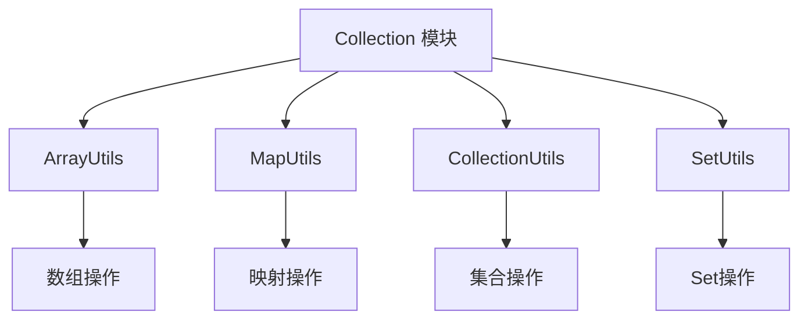

# Collection 工具模块

## 概述

Collection 模块是 Yudao 框架的一部分，提供了一套用于处理各种集合类型（数组、映射、集合、Set）的工具类。这些工具类简化了常见的集合操作，提高了代码的可读性和可维护性。

## 架构概览

Collection 模块由四个主要的工具类组成，每个工具类专注于特定的集合类型：

### 组件说明

1. **ArrayUtils** ([array_utils.md](array_utils.md)): 提供数组操作的工具方法，如追加元素、将集合转换为数组、获取数组元素等。
2. **MapUtils** ([map_utils.md](map_utils.md)): 提供映射操作的工具方法，如从Multimap获取值列表、查找并处理值、转换键值对列表为映射、从映射获取BigDecimal值等。
3. **CollectionUtils** ([collection_utils.md](collection_utils.md)): 提供集合操作的工具方法，如检查是否包含任意元素、过滤列表、去重、转换列表/集合/映射、分页转换、查找差异等。
4. **SetUtils** ([set_utils.md](set_utils.md)): 提供Set操作的工具方法，如将数组转换为Set。

## 与其他模块的关系

Collection 模块是一个基础工具模块，为框架中的其他模块提供集合操作支持。它不依赖于其他业务模块，但被广泛用于各种业务逻辑中处理集合数据。

## 使用场景

- 数据转换：在不同集合类型之间进行转换
- 数据过滤：根据条件过滤集合元素
- 数据聚合：合并多个集合或提取特定数据
- 常用操作：获取最大/最小值、求和、去重等

## 设计特点

- 静态方法：所有工具方法都是静态的，可以直接使用类名调用
- 泛型支持：充分利用Java泛型，提供类型安全的操作
- 空值安全：大多数方法都考虑了空值情况，避免NullPointerException
- 高性能：利用Hutool和Guava等高性能库实现核心功能