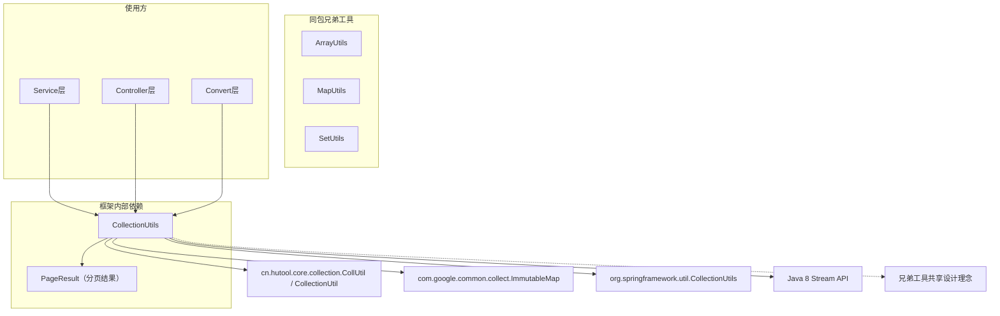
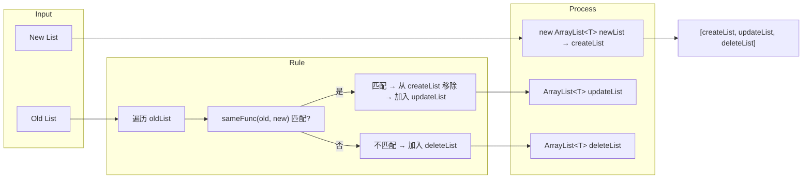
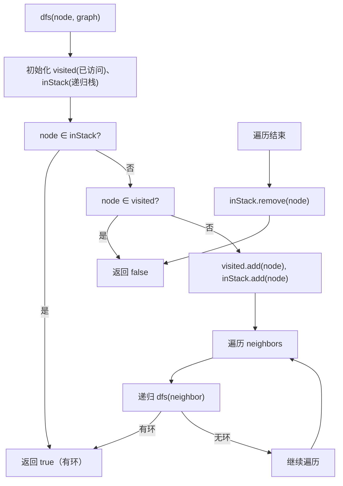

# CollectionUtils 集合工具类

## 概述

`CollectionUtils` 是框架核心的集合操作工具类，位于 `cn.iocoder.yudao.framework.common.util.collection` 包下。该类基于 Java 8 Stream API 和 Hutool、Guava 等工具库，提供了一套丰富、高效的集合操作工具方法，涵盖集合校验、过滤、转换（List/Set/Map）、去重、差量对比、聚合计算、图环检测等场景。

在整个 Yudao 框架中，`CollectionUtils` 被绝大部分 Service 层、Controller 层以及 Convert 转换层广泛使用，是项目中最高频使用的工具类之一。其主要设计目标为：

- **简化集合操作**：将常见的 Stream 操作封装为一行式调用，减少重复代码
- **空安全**：所有方法均对 `null` 或空集合做了防御性处理，避免 NPE
- **类型安全**：充分利用泛型，保证类型安全的同时提供灵活的函数式接口

---

## 架构与依赖

### 模块依赖关系



### 与同包其他工具类的关系

| 工具类 | 定位 | 与 CollectionUtils 的协作 |
|--------|------|---------------------------|
| `ArrayUtils` | 数组操作 | `convertList(T[], Function)` 内部委托数组转 List 后处理 |
| `MapUtils` | Map 操作 | `convertMap` / `convertMultiMap` 的输出可直接供 MapUtils 消费 |
| `SetUtils` | Set 操作 | `convertSet` / `convertLinkedSet` 等返回 Set 结果 |

> 参考文档：[ArrayUtils](array_utils.md)、[MapUtils](map_utils.md)、[SetUtils](set_utils.md)

---

## API 说明

### 1. 集合校验类

#### `containsAny(Object source, Object... targets)`
判断 source 是否存在于 targets 数组中。

- **参数**：`source` - 待查找元素；`targets` - 候选数组
- **返回**：包含返回 `true`
- **示例**：
```java
CollectionUtils.containsAny("a", "b", "c", "a"); // true
```

#### `containsAny(Collection<?> source, Collection<?> candidates)`
判断两个集合是否有交集（委托 Spring 实现）。

- **参数**：`source` - 源集合；`candidates` - 候选集合
- **返回**：有交集返回 `true`

#### `isAnyEmpty(Collection<?>... collections)`
判断给定的多个集合中是否**存在任意一个为空**。

- **参数**：可变参数，一个或多个集合
- **返回**：只要有一个为空（`null` 或空集合）返回 `true`

#### `anyMatch(Collection<T> from, Predicate<T> predicate)`
判断集合中是否存在满足条件的元素。

- **参数**：`from` - 源集合；`predicate` - 断言函数
- **返回**：存在匹配返回 `true`

---

### 2. 过滤与去重

#### `filterList(Collection<T> from, Predicate<T> predicate)`
根据条件过滤集合，返回新的 List。

- **参数**：`from` - 源集合；`predicate` - 过滤条件
- **返回**：过滤后的 List（空安全）
- **示例**：
```java
List<Integer> nums = Arrays.asList(1, 2, 3, 4, 5);
CollectionUtils.filterList(nums, n -> n > 3); // [4, 5]
```

#### `distinct(Collection<T> from, Function<T, R> keyMapper)`
根据 key 对集合去重，相同 key 保留第一个元素。

- **参数**：`from` - 源集合；`keyMapper` - key 提取函数
- **返回**：去重后的 List

#### `distinct(Collection<T> from, Function<T, R> keyMapper, BinaryOperator<T> cover)`
根据 key 去重，当出现冲突时由 `cover` 合并函数决定保留哪个元素。

- **参数**：`cover` - 合并函数 `(existing, replacement) -> result`
- **返回**：去重后的 List

---

### 3. 转换为 List

#### `convertList(T[] from, Function<T, U> func)`
将数组转换为 List，每个元素经过 `func` 映射。

- **参数**：`from` - 源数组；`func` - 映射函数
- **返回**：映射后的 List（自动过滤 `null`）

#### `convertList(Collection<T> from, Function<T, U> func)`
将集合转换为 List，每个元素经过 `func` 映射（最常用的转换方法）。

- **参数**：`from` - 源集合；`func` - 映射函数
- **返回**：映射后的 List
- **示例**：
```java
List<UserDO> users = userMapper.selectList();
List<Long> ids = CollectionUtils.convertList(users, UserDO::getId);
```

#### `convertList(Collection<T> from, Function<T, U> func, Predicate<T> filter)`
先过滤再转换。

- **参数**：`filter` - 前置过滤条件

#### `convertPage(PageResult<T> from, Function<T, U> func)`
将分页结果中的列表进行转换，保留分页信息。

- **参数**：`from` - 源分页结果；`func` - 转换函数
- **返回**：新类型的 `PageResult<U>`

#### `convertListByFlatMap(Collection<T> from, Function<T, ? extends Stream<? extends U>> func)`
通过 `flatMap` 将集合"展平"转换为 List。

- **参数**：`func` - 将每个元素映射为一个 Stream

#### `convertListByFlatMap(Collection<T> from, Function<? super T, ? extends U> mapper, Function<U, ? extends Stream<? extends R>> func)`
先映射再 flatMap 的复合操作。

---

### 4. 转换为 Set

#### `convertSet(Collection<T> from)`
集合转 Set（去重）。

#### `convertSet(Collection<T> from, Function<T, U> func)`
集合映射后转 Set。

#### `convertSet(Collection<T> from, Function<T, U> func, Predicate<T> filter)`
先过滤再映射转 Set。

#### `convertLinkedSet(Collection<T> from, Function<T, U> func)`
映射后转为 `LinkedHashSet`（保留顺序）。

#### `convertLinkedSet(Collection<T> from, Function<T, U> func, Predicate<T> filter)`
先过滤再映射转为 `LinkedHashSet`。

#### `convertSetByFlatMap(Collection<T> from, Function<T, ? extends Stream<? extends U>> func)`
flatMap 展平后转 Set。

#### `convertSetByFlatMap(Collection<T> from, Function<? super T, ? extends U> mapper, Function<U, ? extends Stream<? extends R>> func)`
先映射再 flatMap 后转 Set。

---

### 5. 转换为 Map

该类提供了丰富的 `convertMap` 重载方法，覆盖了各种场景：

#### `convertMap(Collection<T> from, Function<T, K> keyFunc)`
集合转 Map（Key 为 `keyFunc`，Value 为元素本身）。遇到重复 Key 时保留第一个。

#### `convertMap(Collection<T> from, Function<T, K> keyFunc, Supplier<? extends Map<K, T>> supplier)`
可指定 Map 实现类型。

#### `convertMap(Collection<T> from, Function<T, K> keyFunc, Function<T, V> valueFunc)`
Key 和 Value 均可自定义映射函数。重复 Key 时保留第一个。

#### `convertMap(Collection<T> from, Function<T, K> keyFunc, Function<T, V> valueFunc, BinaryOperator<V> mergeFunction)`
自定义 Key 冲突时的合并策略。

- **参数**：`mergeFunction` - 合并函数 `(existing, replacement) -> result`

#### `convertMap(Collection<T> from, Function<T, K> keyFunc, Function<T, V> valueFunc, Supplier<? extends Map<K, V>> supplier)`
自定义 Value 映射和 Map 实现。

#### 完整参数版本
```java
convertMap(from, keyFunc, valueFunc, mergeFunction, supplier)
```
支持自定义所有参数。

#### `convertMultiMap(Collection<T> from, Function<T, K> keyFunc)`
集合转 `Map<K, List<T>>`（分组为 List）。

#### `convertMultiMap(Collection<T> from, Function<T, K> keyFunc, Function<T, V> valueFunc)`
集合分组为 `Map<K, List<V>>`。

#### `convertMultiMap2(Collection<T> from, Function<T, K> keyFunc, Function<T, V> valueFunc)`
集合分组为 `Map<K, Set<V>>`。

#### `convertImmutableMap(Collection<T> from, Function<T, K> keyFunc)`
转为 Guava 不可变 Map。

---

### 6. 集合差量对比

#### `diffList(Collection<T> oldList, Collection<T> newList, BiFunction<T, T, Boolean> sameFunc)`
对比老列表和新列表，返回 `[新增列表, 修改列表, 删除列表]`。

- **sameFunc**：判断两个元素是否为"同一个数据"（通常通过 ID 判断）
- **返回**：三个 List 的列表
- **实现逻辑**：
  1. 默认所有新列表元素为"新增"
  2. 遍历老列表，若在新列表中找到"相同"元素 → 归为"修改"并从新列表移除
  3. 老列表中未找到匹配 → 归为"删除"
  4. 新列表剩余 → "新增"



---

### 7. 查找与聚合

#### `getFirst(List<T> from)`
取 List 第一个元素，空集合返回 `null`。

#### `findFirst(Collection<T> from, Predicate<T> predicate)`
查找第一个匹配条件的元素。

#### `findFirst(Collection<T> from, Predicate<T> predicate, Function<T, U> func)`
查找第一个匹配条件的元素并映射。

#### `getMaxValue(Collection<T> from, Function<T, V> valueFunc)`
取集合中指定字段的最大值。

- **参数**：`valueFunc` - 可比较字段提取函数

#### `getMinValue(List<T> from, Function<T, V> valueFunc)`
取集合中指定字段的最小值。

#### `getMinObject(List<T> from, Function<T, V> valueFunc)`
取集合中指定字段最小的**对象**。

#### `getSumValue(Collection<T> from, Function<T, V> valueFunc, BinaryOperator<V> accumulator)`
对集合中指定字段进行累加计算。

- **参数**：`accumulator` - 累加器，如 `Integer::sum`

#### `getSumValue(Collection<T> from, Function<T, V> valueFunc, BinaryOperator<V> accumulator, V defaultValue)`
支持指定空集合时的默认值。

---

### 8. 其他工具方法

#### `mergeValuesFromMap(Map<K, List<V>> map)`
将 `Map<K, List<V>>` 的所有 Value 列表合并为一个 List。

#### `addIfNotNull(Collection<T> coll, T item)`
当 item 不为 `null` 时添加到集合。

#### `singleton(T obj)`
创建一个单元素集合（若 obj 为 `null` 则返回空集合）。

#### `newArrayList(List<List<T>> list)`
将嵌套 List 展平为一层 List。

#### `toLinkedHashSet(Class<T> elementType, Object value)`
将任意值转换为 `LinkedHashSet`（委托 Hutool 实现）。

#### `of(T head, Collection<T> tail)`
将单个元素 head 与集合 tail 合并为新的 List（head 在前）。

- **示例**：`CollectionUtils.of(user, otherUsers)` → `[user, ...otherUsers]`

#### `dfs(Long node, Map<Long, Set<Long>> graph)`
在**有向图**中检测是否存在环（从指定节点出发的深度优先遍历）。

- **参数**：`node` - 起始节点；`graph` - 邻接表表示的图
- **返回**：存在环返回 `true`
- **实现**：使用 DFS + 递归栈标记（`inStack`）判断回边



---

## 典型使用场景

### 场景一：DTO 转换

Service 层查询 DO 列表后转换为 VO 是最常见的场景：

```java
public PageResult<UserVO> getUserPage(UserPageReqVO reqVO) {
    PageResult<UserDO> page = userMapper.selectPage(reqVO);
    // 使用 convertPage 一步完成分页转换
    return CollectionUtils.convertPage(page, UserConvert.INSTANCE::convert);
}
```

### 场景二：提取 ID 列表

```java
List<Long> ids = CollectionUtils.convertList(userList, UserDO::getId);
```

### 场景三：构建 Map 索引

```java
Map<Long, UserDO> userMap = CollectionUtils.convertMap(userList, UserDO::getId);
```

### 场景四：分组

```java
Map<Long, List<OrderDO>> userOrders = CollectionUtils.convertMultiMap(orders, OrderDO::getUserId);
```

### 场景五：批量更新时差量计算

```java
// 对比数据库原有角色和前端传入的新角色列表
List<List<Long>> diff = CollectionUtils.diffList(oldRoleIds, newRoleIds, Objects::equals);
List<Long> createList = diff.get(0); // 新增
List<Long> updateList = diff.get(1); // 修改（此处无修改）
List<Long> deleteList = diff.get(2); // 删除
```

### 场景六：有向图环检测

```java
// 检测部门层级关系中是否存在循环引用
Map<Long, Set<Long>> deptGraph = buildDeptGraph();
boolean hasCycle = CollectionUtils.dfs(rootDeptId, deptGraph);
```

---

## 常见问题

| 问题 | 说明 |
|------|------|
| **转换后集合为空而非 null** | 所有 `convert*` 方法在源集合为空时返回空集合而非 `null`，避免下游 NPE |
| **Map 重复 Key** | `convertMap` 默认保留第一个值（`(v1, v2) -> v1`），如需自定义请使用带 `mergeFunction` 的重载 |
| **diffList 的性能** | 时间复杂度为 O(n²)，适用于小规模集合差异对比；大数据量建议使用 Set 或数据库级对比 |
| **dfs 环检测** | 仅检测从指定节点出发可达路径中的环，如需检测全图环请在外层遍历所有节点 |

---

## 参考

- [ArrayUtils 文档](array_utils.md)
- [MapUtils 文档](map_utils.md)
- [SetUtils 文档](set_utils.md)
- Hutool 官方文档：`CollUtil` / `CollectionUtil`
- Guava 官方文档：`ImmutableMap`
