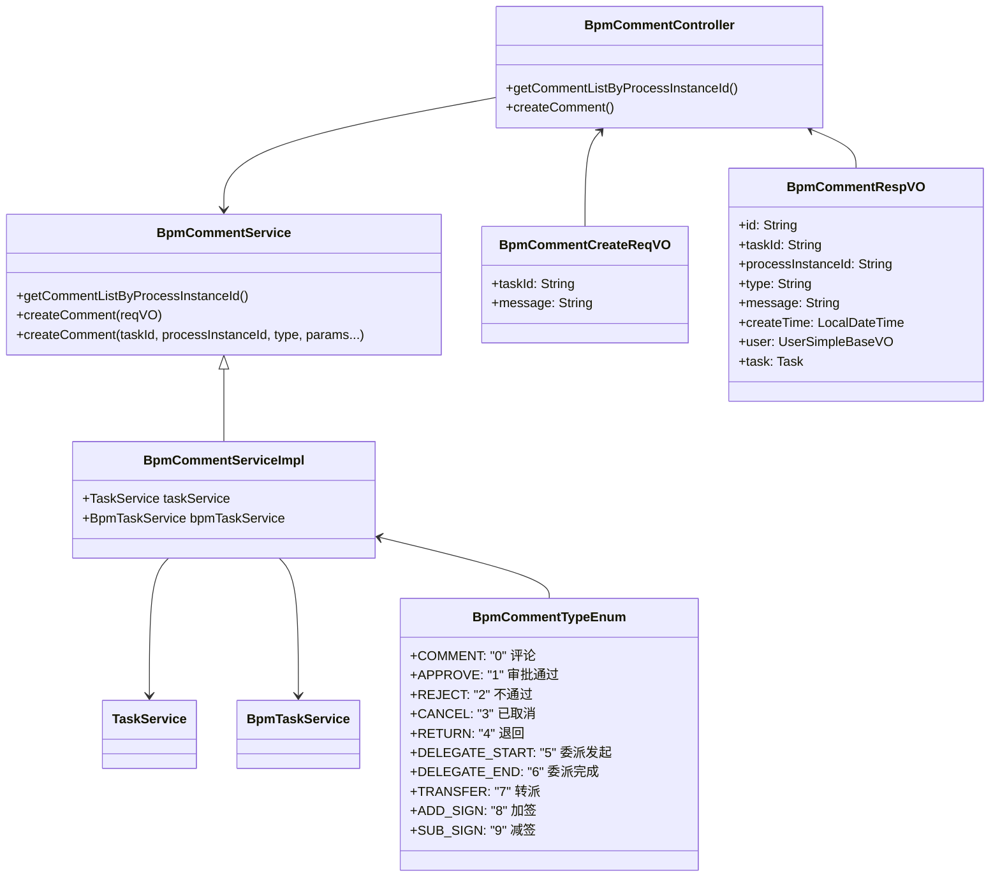
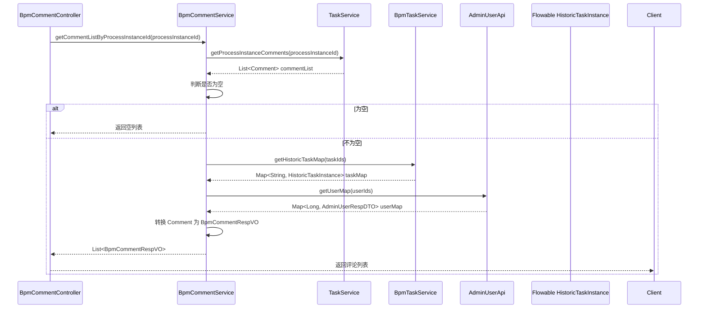
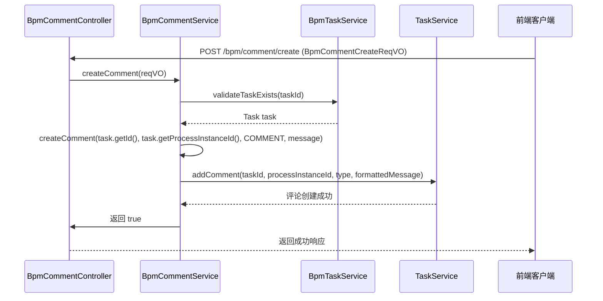
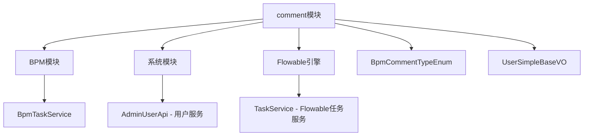

# 评论模块文档 (Comment Module)

## 1. 概述

评论模块是 BPM（业务流程管理）模块的核心子模块，负责管理流程任务中的评论功能。基于 Flowable 引擎，该模块实现了流程评论的创建、查询和展示，支持在任务流转过程中添加备注、审批意见、转派说明等不同类型的评论，为业务流程提供完整的沟通记录。

## 2. 模块架构



## 3. 核心组件说明

### 3.1 BpmCommentController - 控制器

**路径**: `yudao-module-bpm/src/main/java/cn/iocoder/yudao/module/bpm/controller/admin/comment/BpmCommentController.java`

提供 RESTful API 接口，处理评论相关的 HTTP 请求：

| 请求方法 | 路径 | 描述 | 权限 |
|---------|------|------|------|
| GET | `/bpm/comment/list-by-process-instance-id` | 获取指定流程实例的评论列表 | `bpm:task:query` |
| POST | `/bpm/comment/create` | 创建流程评论 | `bpm:task:update` |

**功能说明**:
- `getCommentListByProcessInstanceId`: 根据流程实例 ID 查询所有评论，并关联任务信息和用户信息，返回格式化后的 VO 列表
- `createComment`: 创建新的流程评论，验证任务是否存在后调用服务层创建

### 3.2 BpmCommentService - 服务接口

**路径**: `yudao-module-bpm/src/main/java/cn/iocoder/yudao/module/bpm/service/comment/BpmCommentService.java`

定义了评论业务操作的契约：

```java
public interface BpmCommentService {
    /**
     * 获得指定流程实例的评论列表
     */
    List<Comment> getCommentListByProcessInstanceId(String processInstanceId);

    /**
     * 创建流程评论（基于请求对象）
     */
    void createComment(@Valid BpmCommentCreateReqVO reqVO);

    /**
     * 创建流程评论（底层方法，支持指定评论类型和参数）
     */
    void createComment(String taskId, String processInstanceId, BpmCommentTypeEnum type, Object... params);
}
```

### 3.3 BpmCommentServiceImpl - 服务实现

**路径**: `yudao-module-bpm/src/main/java/cn/iocoder/yudao/module/bpm/service/comment/BpmCommentServiceImpl.java`

服务层的具体实现：

- **依赖注入**:
  - `TaskService`: Flowable 任务服务，直接调用 `getProcessInstanceComments` 和 `addComment` 方法
  - `BpmTaskService`: 业务任务服务，用于验证任务是否存在（`validateTaskExists`）

- **核心逻辑**:
  1. `getCommentListByProcessInstanceId`: 直接委托 `TaskService.getProcessInstanceComments()` 获取 Flowable 引擎中的评论列表
  2. `createComment(BpmCommentCreateReqVO)`: 验证任务存在性，调用带类型的创建方法，默认类型为 `COMMENT`
  3. `createComment(String, String, BpmCommentTypeEnum, Object...)`: 调用 `TaskService.addComment()` 实际创建评论，使用枚举的 `formatComment()` 方法格式化评论消息

### 3.4 BpmCommentCreateReqVO - 创建请求对象

**路径**: `yudao-module-bpm/src/main/java/cn/iocoder/yudao/module/bpm/controller/admin/comment/vo/BpmCommentCreateReqVO.java`

```java
@Data
public class BpmCommentCreateReqVO {
    @Schema(description = "任务编号", requiredMode = Schema.RequiredMode.REQUIRED)
    @NotEmpty(message = "任务编号不能为空")
    private String taskId;

    @Schema(description = "评论内容", requiredMode = Schema.RequiredMode.REQUIRED)
    @NotBlank(message = "评论内容不能为空")
    @Size(max = 500, message = "评论内容不能超过 500 个字符")
    private String message;
}
```

**校验规则**:
- `taskId`: 非空
- `message`: 非空，最大长度 500 字符

### 3.5 BpmCommentRespVO - 响应对象

**路径**: `yudao-module-bpm/src/main/java/cn/iocoder/yudao/module/bpm/controller/admin/comment/vo/BpmCommentRespVO.java`

包含评论的完整信息，内嵌任务信息和用户信息：

```java
@Data
public class BpmCommentRespVO {
    private String id;              // 评论编号
    private String taskId;          // 任务编号
    private Task task;              // 任务信息（嵌套类）
    private String processInstanceId; // 流程实例编号
    private String type;            // 评论类型
    private String message;         // 评论内容
    private LocalDateTime createTime; // 创建时间
    private UserSimpleBaseVO user;  // 创建人信息（精简用户信息）

    @Data
    public static class Task {
        private String id;          // 任务编号
        private String name;        // 任务名称
        private String taskDefinitionKey; // 任务定义标识
    }
}
```

### 3.6 BpmCommentTypeEnum - 评论类型枚举

**路径**: `yudao-module-bpm/src/main/java/cn/iocoder/yudao/module/bpm/enums/task/BpmCommentTypeEnum.java`

定义了流程中各种操作对应的评论类型，支持自动格式化评论消息：

| 类型码 | 类型名 | 描述 | 消息模板 |
|-------|--------|------|----------|
| 0 | COMMENT | 普通评论 | `{}` |
| 1 | APPROVE | 审批通过 | `审批通过，原因是：{}` |
| 2 | REJECT | 不通过 | `审批不通过：原因是：{}` |
| 3 | CANCEL | 已取消 | `系统自动取消，原因是：{}` |
| 4 | RETURN | 退回 | `任务被退回，原因是：{}` |
| 5 | DELEGATE_START | 委派发起 | `[{}]将任务委派给[{}]，委派理由为:{}` |
| 6 | DELEGATE_END | 委派完成 | `[{}]完成委派任务，任务重新回到[{}]手中，审批建议为:{}` |
| 7 | TRANSFER | 转派 | `[{}]将任务转派给[{}]，转派理由为:{}` |
| 8 | ADD_SIGN | 加签 | `[{}]{}给了[{}]，理由为：{}` |
| 9 | SUB_SIGN | 减签 | `[{}]操作了【减签】,审批人[{}]的任务被取消` |

**使用方法**: 通过 `formatComment(params)` 方法动态生成评论消息，例如 `APPROVE.formatComment("发票附件齐全")` 生成 `审批通过，原因是：发票附件齐全`。

## 4. 数据流分析

### 4.1 获取评论列表流程



### 4.2 创建评论流程



## 5. 模块依赖关系



**依赖说明**:
- **BPM 模块**: 依赖 `BpmTaskService` 进行任务验证和获取历史任务信息
- **系统模块**: 依赖 `AdminUserApi` 获取用户信息（跨模块 API 调用）
- **Flowable 引擎**: 直接通过 `TaskService` 与 Flowable 引擎交互，获取和创建评论
- **公共工具**: 使用 `DateUtils`, `NumberUtils`, `BeanUtils`, `CollUtil` 等通用工具类

## 6. 权限控制

评论模块的权限控制基于 Spring Security 的 `@PreAuthorize` 注解：

- **查询评论列表**: `@PreAuthorize("@ss.hasPermission('bpm:task:query')")`
  - 需要拥有 `bpm:task:query` 权限，即查看流程任务的权限
  
- **创建评论**: `@PreAuthorize("@ss.hasPermission('bpm:task:update')")`
  - 需要拥有 `bpm:task:update` 权限，即更新流程任务的权限（包含评论操作）

权限检查通过自定义的 `ss` 对象（SecurityService）进行，遵循 RBAC 权限模型。

## 7. 与其他模块的交互

### 7.1 与任务模块的交互

评论模块与任务模块紧密相关，通过 `BpmTaskService` 获取任务信息，验证任务有效性。评论本质上是附着在任务上的元数据，与任务的生命周期绑定。

### 7.2 与系统模块的交互

通过 `AdminUserApi` 远程调用系统模块的用户服务，获取评论创建者的用户信息（昵称、头像、部门等），在响应中返回精简的用户信息 `UserSimpleBaseVO`。

### 7.3 与 Flowable 引擎的交互

评论模块直接依赖 Flowable 引擎的 `TaskService`，使用 Flowable 原生的 `Comment` 和 `HistoricTaskInstance` 对象进行数据交互，实现了与 Flowable 评论功能的无缝集成。

## 8. 使用场景示例

### 8.1 普通评论

用户手动添加评论，例如在任务处理过程中添加备注：

```json
// 请求
POST /bpm/comment/create
{
  "taskId": "task_123",
  "message": "请关注报销发票附件"
}

// 响应
{
  "code": 200,
  "data": true
}
```

### 8.2 审批评论（系统自动创建）

当用户审批任务时，系统自动创建审批评论：

```java
// 服务层调用示例
commentService.createComment(taskId, processInstanceId, 
    BpmCommentTypeEnum.APPROVE, "发票附件齐全");
// 生成的评论消息：审批通过，原因是：发票附件齐全
```

### 8.3 转派评论

任务转派时自动创建转派评论：

```java
commentService.createComment(taskId, processInstanceId,
    BpmCommentTypeEnum.TRANSFER, "张三", "李四", "紧急需要处理");
// 生成的评论消息：[张三]将任务转派给[李四]，转派理由为：紧急需要处理
```

## 9. 扩展建议

1. **评论分页**: 当前获取评论列表未支持分页，当评论数量较多时建议增加分页参数
2. **评论搜索**: 增加按任务 ID、流程实例 ID、创建时间范围等条件搜索评论的功能
3. **评论删除**: 目前不支持评论删除，可根据业务需求增加软删除或硬删除功能
4. **评论@功能**: 支持在评论中@其他用户，实现通知提醒功能
5. **评论附件**: 支持在评论中附加文件，与附件模块集成
