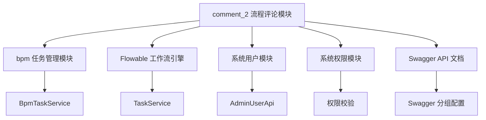
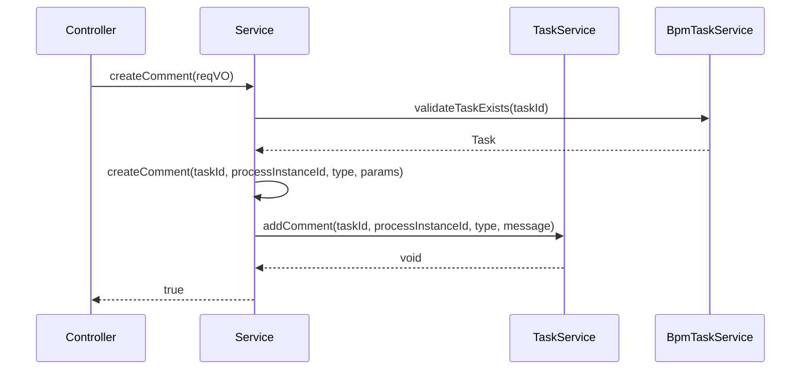
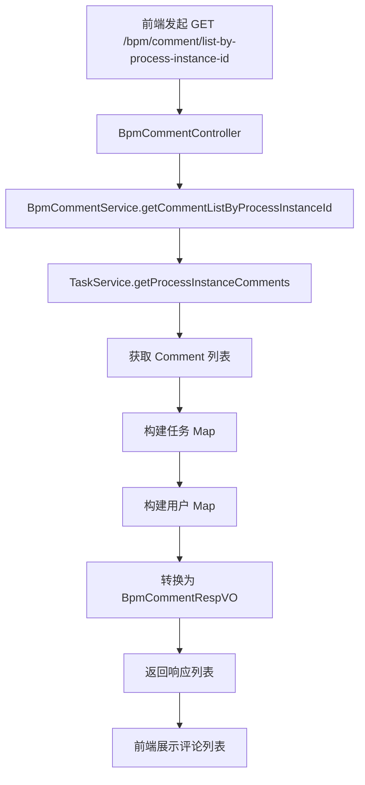

# 流程评论模块 (comment_2) 文档

## 1. 模块概述

**流程评论模块**是 BPM（业务流程管理）系统中的核心子模块，负责为工作流任务提供评论和沟通功能。该模块允许用户在审批流程中记录评论、审批意见、任务流转说明等操作，实现流程过程中的信息追溯和团队协作。

模块基于 Flowable 工作流引擎扩展，实现了评论的创建、查询、类型化管理等功能，并与任务管理、用户权限等模块紧密集成。

## 2. 架构设计

### 2.1 整体架构

```mermaid
classDiagram
    class BpmCommentController {
        +getCommentListByProcessInstanceId()
        +createComment()
    }
    class BpmCommentService {
        +getCommentListByProcessInstanceId()
        +createComment()
    }
    class BpmCommentServiceImpl {
        -taskService
        -bpmTaskService
        +createComment()
    }
    class TaskService {
        +getProcessInstanceComments()
        +addComment()
    }
    class BpmTaskService {
        +validateTaskExists()
    }
    class BpmCommentTypeEnum {
        +COMMENT
        +APPROVE
        +REJECT
        +CANCEL
        +RETURN
        +DELEGATE_START
        +DELEGATE_END
        +TRANSFER
        +ADD_SIGN
        +SUB_SIGN
    }

    BpmCommentController --> BpmCommentService
    BpmCommentService <|-- BpmCommentServiceImpl
    BpmCommentServiceImpl --> TaskService
    BpmCommentServiceImpl <.. BpmTaskService
    BpmCommentEnum --| BpmCommentTypeEnum
```

### 2.2 模块依赖关系



## 3. 核心组件

### 3.1 BpmCommentController - 控制器

**路径**: `yudao-module-bpm/src/main/java/cn/iocoder/yudao/module/bpm/controller/admin/comment/BpmCommentController.java`

负责处理 HTTP 请求，提供 RESTful API 接口：

| API 路径 | 方法 | 描述 | 权限 |
|---------|------|------|------|
| `/bpm/comment/list-by-process-instance-id` | GET | 获取指定流程实例的评论列表 | `bpm:task:query` |
| `/bpm/comment/create` | POST | 创建流程评论 | `bpm:task:update` |

**功能说明**:
- 查询评论时，同时关联获取任务信息和用户信息
- 创建评论时，验证任务是否存在并执行评论创建
- 使用 `@Validated` 进行参数校验
- 使用 `@PreAuthorize` 进行权限控制

### 3.2 BpmCommentService - 服务接口

**路径**: `yudao-module-bpm/src/main/java/cn/iocoder/yudao/module/bpm/service/comment/BpmCommentService.java`

定义了评论服务的核心方法：

```java
public interface BpmCommentService {
    // 获取指定流程实例的评论列表
    List<Comment> getCommentListByProcessInstanceId(String processInstanceId);
    
    // 创建评论（基于请求对象）
    void createComment(@Valid BpmCommentCreateReqVO reqVO);
    
    // 创建评论（底层方法，支持自定义类型和参数）
    void createComment(String taskId, String processInstanceId, BpmCommentTypeEnum type, Object... params);
}
```

### 3.3 BpmCommentServiceImpl - 服务实现

**路径**: `yudao-module-bpm/src/main/java/cn/iocoder/yudao/module/bpm/service/comment/BpmCommentServiceImpl.java`

服务的具体实现，依赖 Flowable 的 `TaskService` 和 BPM 的 `BpmTaskService`：



**关键特性**:
- 使用 `@Transactional` 保证评论创建的事务性
- 使用 `@Lazy` 避免 `BpmTaskService` 的循环依赖
- 评论类型通过 `BpmCommentTypeEnum` 枚举统一管理

### 3.4 BpmCommentTypeEnum - 评论类型枚举

**路径**: `yudao-module-bpm/src/main/java/cn/iocoder/yudao/module/bpm/enums/task/BpmCommentTypeEnum.java`

定义了流程中所有可能的评论类型，支持格式化参数：

| 类型 | 代码 | 名称 | 说明 |
|------|------|------|------|
| COMMENT | 0 | 评论 | 普通评论 |
| APPROVE | 1 | 审批通过 | 审批通过意见 |
| REJECT | 2 | 不通过 | 审批不通过意见 |
| CANCEL | 3 | 已取消 | 流程取消 |
| RETURN | 4 | 退回 | 任务退回 |
| DELEGATE_START | 5 | 委派发起 | 任务委派开始 |
| DELEGATE_END | 6 | 委派完成 | 任务委派结束 |
| TRANSFER | 7 | 转派 | 任务转派 |
| ADD_SIGN | 8 | 加签 | 任务加签 |
| SUB_SIGN | 9 | 减签 | 任务减签 |

**格式化示例**:
- `APPROVE`: `"审批通过，原因是：{}"` → 传入参数后：`"审批通过，原因是：发票附件齐全"`
- `DELEGATE_START`: `"将任务委派给[{}]，委派理由:{}"` → 传入参数后：`"张三将任务委派给李四，委派理由：出差"`

### 3.5 VO 层组件

#### BpmCommentCreateReqVO - 创建请求

**路径**: `yudao-module-bpm/src/main/java/cn/iocoder/yudao/module/bpm/controller/admin/comment/vo/BpmCommentCreateReqVO.java`

包含两个必填字段：
- `taskId`: 任务编号（非空）
- `message`: 评论内容（非空，最大 500 字符）

#### BpmCommentRespVO - 响应对象

**路径**: `yudao-module-bpm/src/main/java/cn/iocoder/yudao/module/bpm/controller/admin/comment/vo/BpmCommentRespVO.java`

包含评论的完整信息：
- `id`: 评论编号
- `taskId`: 任务编号
- `processInstanceId`: 流程实例编号
- `type`: 评论类型
- `message`: 评论内容
- `createTime`: 创建时间
- `user`: 创建人信息（`UserSimpleBaseVO`）
- `task`: 任务信息（嵌套类 `Task`，包含任务 ID、名称、任务定义键）

## 4. 数据流

### 4.1 创建评论流程

```mermaid
flowchart TD
    A[前端发起 POST /bpm/comment/create] --> B[BpmCommentController]
    B --> C{权限校验}
    C -- 通过 --> D[BpmCommentService.createComment]
    D --> E[BpmTaskService.validateTaskExists]
    E --> F{任务存在?}
    F -- 是 --> G[调用 createComment(taskId, processInstanceId, type, params)]
    F -- 否 --> H[抛出异常]
    G --> I[TaskService.addComment]
    I --> J[写入 Flowable 评论表]
    J --> K[返回 success(true)]
    K --> L[前端显示成功]
```

### 4.2 查询评论流程



## 5. 与 Flowable 引擎的集成

评论模块直接依赖 Flowable 的 `TaskService`，使用 Flowable 原生的评论表（`ACT_RU_COMMENT` 和 `ACT_HI_COMMENT`）存储评论数据：

```mermaid
classDiagram
    class Flowable {
        <<interface>> TaskService
        +addComment(taskId, processInstanceId, type, message)
        +getProcessInstanceComments(processInstanceId)
    }
    class FlowableComment {
        String id
        String taskId
        String processInstanceId
        String type
        String message
        Date time
        String userId
    }
    Flowable --| FlowableComment
```

Flowable 评论类型说明：
- `type` 字段存储评论类型（如 "comment", "approval", "rejection" 等）
- 通过 `BpmCommentTypeEnum` 的 `type` 字段与 Flowable 兼容

## 6. 权限控制

评论操作基于 Spring Security 的权限注解：

| 操作 | 权限要求 | 说明 |
|------|---------|------|
| 查询评论列表 | `bpm:task:query` | 查看流程实例的评论 |
| 创建评论 | `bpm:task:update` | 对任务进行评论操作 |

权限校验通过 `@PreAuthorize("@ss.hasPermission('xxx')")` 实现，其中 `ss` 是系统权限工具。

## 7. 模块配置

### 7.1 Web 配置

**路径**: `yudao-module-bpm/src/main/java/cn/iocoder/yudao/module/bpm/framework/web/config/BpmWebConfiguration.java`

```java
@Configuration(proxyBeanMethods = false)
public class BpmWebConfiguration {
    
    @Bean
    public GroupedOpenApi bpmGroupedOpenApi() {
        return YudaoSwaggerAutoConfiguration.buildGroupedOpenApi("bpm");
    }
    
    @Bean
    public FilterRegistrationBean<FlowableWebFilter> flowableWebFilter() {
        FilterRegistrationBean<FlowableWebFilter> registrationBean = new FilterRegistrationBean<>();
        registrationBean.setFilter(new FlowableWebFilter());
        registrationBean.setOrder(WebFilterOrderEnum.FLOWABLE_FILTER);
        return registrationBean;
    }
}
```

配置项说明：
- `bpmGroupedOpenApi`: 为 Swagger 生成 BPM 模块的 API 分组
- `flowableWebFilter`: 注册 Flowable 的 Web 过滤器，用于 Flowable 引擎的 Web 界面

### 7.2 Swagger 分组

评论模块的 API 自动归入 BPM 组的 Swagger 文档中，路径前缀为 `/bpm/comment`。

## 8. 使用场景示例

### 8.1 审批评论

当用户审批任务时，系统自动创建审批评论：

```java
// 审批通过时
bpmCommentService.createComment(
    taskId, 
    processInstanceId, 
    BpmCommentTypeEnum.APPROVE, 
    "发票附件齐全，同意报销"
);
// 生成的评论：审批通过，原因是：发票附件齐全，同意报销
```

### 8.2 任务委派评论

当用户委派任务时：

```java
// 委派发起
bpmCommentService.createComment(
    taskId, 
    processInstanceId, 
    BpmCommentTypeEnum.DELEGATE_START, 
    "张三", 
    "李四", 
    "张三出差，委托李四处理"
);
// 生成的评论：[张三]将任务委派给[李四]，委派理由：张三出差，委托李四处理
```

### 8.3 普通评论

用户手动添加评论：

```java
BpmCommentCreateReqVO reqVO = new BpmCommentCreateReqVO();
reqVO.setTaskId("task_123");
reqVO.setMessage("请关注报销发票附件");
bpmCommentService.createComment(reqVO);
```

## 9. 与其他模块的关系

| 模块 | 关系 | 说明 |
|------|------|------|
| **BPM 任务模块** | 强依赖 | 通过 `BpmTaskService` 验证任务存在性 |
| **系统用户模块** | 依赖 | 通过 `AdminUserApi` 获取评论人信息 |
| **Flowable 引擎** | 底层依赖 | 使用 `TaskService` 操作评论 |
| **权限模块** | 依赖 | 使用 Spring Security 权限校验 |
| **Swagger 模块** | 依赖 | 自动生成 API 文档 |
| **Web 模块** | 依赖 | 配置 Web 过滤器和 Swagger 分组 |

## 10. 扩展点

1. **评论类型扩展**: 可通过添加 `BpmCommentTypeEnum` 枚举值来扩展新的评论类型
2. **评论格式化**: 通过修改 `comment` 模板字符串来自定义评论格式
3. **评论查询**: 可基于 `processInstanceId` 或 `taskId` 进行扩展查询
4. **评论通知**: 可在评论创建后扩展消息通知功能

## 11. 参考文档

- [BPM 模块整体文档](bpm.md)
- [Flowable 引擎文档](flowable.md)
- [系统权限模块文档](system-security.md)
- [Swagger API 文档配置](swagger.md)
