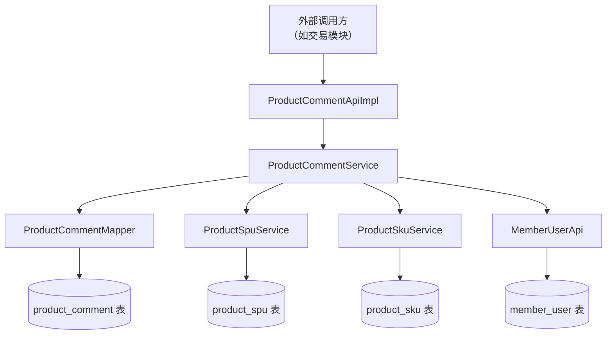
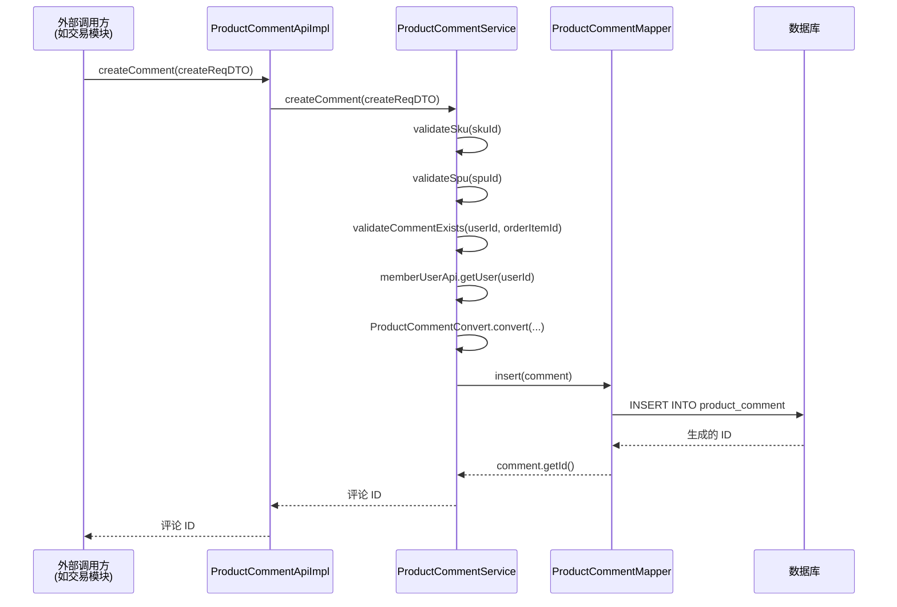

# ProductCommentApiImpl 模块文档

## 模块概述

ProductCommentApiImpl 是商品评论功能的 API 实现类，位于商品模块的 API 层。它提供了创建商品评论的接口，作为服务层的外部接口，供其他模块（如交易模块）调用来创建商品评价。

该模块实现了 ProductCommentApi 接口，主要负责接收外部请求（如交易完成后的评价请求），调用服务层的 ProductCommentService 来完成实际的业务逻辑处理。

## 架构说明

### 模块位置
```
yudao-module-mall/yudao-module-product/src/main/java/cn/iocoder/yudao/module/product/api/comment/ProductCommentApiImpl.java
```

### 模块定位
- **层次**: API 层（对外接口）
- **所属模块**: 商品模块 (product)
- **功能**: 提供商品评论创建的对外 API 接口
- **对应服务**: ProductCommentService

### 核心依赖关系


### 与其他模块的关系
- **交易模块 (trade)**: 交易完成后会调用此 API 创建商品评价
- **会员模块 (member)**: 通过 MemberUserApi 获取用户信息
- **商品服务**: 依赖 ProductSpuService 和 ProductSkuService 验证商品信息
- **数据访问层**: 通过 ProductCommentMapper 持久化评论数据

## 功能说明

### 核心职责
ProductCommentApiImpl 的主要职责是：
1. 接收外部请求创建商品评论
2. 参数校验（通过 @Validated 注解）
3. 调用服务层处理业务逻辑
4. 返回评论 ID

### 主要方法

#### createComment(ProductCommentCreateReqDTO createReqDTO)
**功能**: 创建商品评论  
**参数**: 
- `createReqDTO`: 包含评论信息的 DTO 对象
**返回值**: 评论 ID (Long)  
**调用流程**:
1. 参数校验（由 @Validated 自动进行）
2. 调用 ProductCommentService.createComment()
3. 服务层进行业务验证（SKU、SPU、是否已评价）
4. 服务层获取用户信息
5. 服务层转换 DTO 为 DO 并持久化
6. 返回生成的评论 ID

### 数据流转


## 接口规范

### 实现的接口
ProductCommentApiImpl 实现了 ProductCommentApi 接口，该接口定义了：
```java
public interface ProductCommentApi {
    Long createComment(ProductCommentCreateReqDTO createReqDTO);
}
```

### 请求参数 (ProductCommentCreateReqDTO)
| 字段名 | 类型 | 是否必填 | 说明 |
|--------|------|----------|------|
| skuId | Long | 是 | 商品 SKU 编号 |
| orderId | Long | 否 | 订单编号 |
| orderItemId | Long | 否 | 交易订单项编号 |
| descriptionScores | Integer | 是 | 描述星级 1-5 分 |
| benefitScores | Integer | 是 | 服务星级 1-5 分 |
| content | String | 是 | 评论内容 |
| picUrls | List<String> | 否 | 评论图片地址数组，最多 9 张 |
| anonymous | Boolean | 是 | 是否匿名 |
| userId | Long | 是 | 评价人用户编号 |

### 返回值
- **类型**: Long
- **说明**: 新创建的商品评论的主键 ID
- **异常情况**:
  - 参数校验失败: 抛出 MethodArgumentNotValidException
  - SKU 不存在: 抛出业务异常 (SKU_NOT_EXISTS)
  - SPU 不存在: 抛出业务异常 (SPU_NOT_EXISTS)
  - 已经评价过: 抛出业务异常 (COMMENT_ORDER_EXISTS)

## 业务规则

### 评论创建规则
1. **必填字段验证**: skuId、descriptionScores、benefitScores、content、anonymous、userId 必须提供
2. **商品验证**: 
   - 必须存在对应的 SKU 记录
   - 必须存在对应的 SPU 记录
3. **防重复评价**: 同一用户对同一订单项只能评价一次
4. **用户信息同步**: 自动获取用户的昵称和头像信息
5. **评分计算**: 综合评分 = (描述分 + 服务分) / 2（向下取整）
6. **默认状态**: 新评论默认可见 (visible=true)

### 数据一致性保证
- 通过事务确保数据一致性（由服务层管理）
- 级联验证确保关联数据的有效性
- 防重复机制避免同一订单项被多次评价

## 异常处理

### 参数验证异常
由 Spring 的 @Validated 自动处理，返回 400 Bad Request 和详细的字段验证错误信息

### 业务异常
在服务层抛出的业务异常会被全局异常处理器统一处理：
- SKU_NOT_EXISTS: SKU 不存在
- SPU_NOT_EXISTS: SPU 不存在  
- COMMENT_ORDER_EXISTS: 用户已经对该订单项评价过

## 使用示例

### 调用方式
```java
// 在交易完成后调用
ProductCommentCreateReqDTO dto = new ProductCommentCreateReqDTO();
dto.setSkuId(123L);
dto.setOrderId(456L);
dto.setOrderItemId(789L);
dto.setDescriptionScores(5);
dto.setBenefitScores(5);
dto.setContent("很好的商品，五星好评！");
dto.setAnonymous(false);
dto.setUserId(1001L);
dto.setPicUrls(Arrays.asList("http://example.com/img1.jpg", "http://example.com/img2.jpg"));

Long commentId = productCommentApi.createComment(dto);
```

### 返回值示例
- 成功: 返回新创建评论的 ID，例如 `987654321`
- 失败: 抛出相应的业务异常或参数验证异常

## 配置说明

### Spring 配置
- 使用 `@Service` 注解将类注册为 Spring Bean
- 使用 `@Validated` 启用参数校验功能
- 使用 `@Resource` 自动注入 ProductCommentService 依赖

### 依赖注入
| 依赖 | 类型 | 作用 |
|------|------|------|
| productCommentService | ProductCommentService | 业务服务依赖，处理评论创建的核心逻辑 |

## 性能考虑

### 数据库操作
- 单次插入操作，性能开销较低
- 依赖服务层的查询操作（SKU、SPU 验证、重复检查）使用了适当的索引

### 缓存策略
- 目前没有显式的缓存策略
- 依赖底层服务（如 ProductSkuService、ProductSpuService）可能实现的缓存机制

### 并发安全
- 依赖数据库的唯一约束和事务机制保证并发安全
- 重复评价检查在事务内完成，防止竞态条件

## 安全考虑

### 输入验证
- 所有关键字段都有非空验证
- 评分字段在服务层有隐式范围验证（1-5 分）
- 图片数量在服务层有数量限制（最多 9 张）

### 权限控制
- 此 API 层不进行权限检查，权限控制由调用方负责
- 通常由交易模块在调用前验证用户有权限对该订单项进行评价

### 数据安全
- 用户信息通过内部 API 获取，避免直接暴露敏感用户数据
- 评论内容虽然存储原始内容，但在展示层会进行适当的转义处理

## 开发指南

### 添加新功能
1. 如果需要新增评论字段：
   - 先更新 ProductCommentDO 实体类
  
   - 更新 ProductCommentConvert 转换方法
   - 更新
   ProductCommentCreateReqDTO
   - 更新
   ProductCommentDO: 添加新字段
   - ProductCommentCreateReqDTO: 添加对应字段及验证注解
   - ProductCommentConvert: 在转换方法中处理新字段
   - ProductCommentMapper: MyBatis 自动映射（如果字段名匹配）

2. 如果需要修改业务规则：
   - 修改 ProductCommentServiceImpl 中的验证逻辑
   - 更新相应的错误码和错误消息

### 测试建议
1. 单元测试:
   - 测试参数验证各种边界情况
   - 测试正常流程下的评论创建
   - 测试各种业务异常情况（SKU 不存在、重复评价等）

2. 集成测试:
   - 测试 API 层与服务层的正确集成
   - 测试与外部系统（如交易模块）的接口对接

## 与其他组件的关系说明

### 与 ProductCommentService 的关系
ProductCommentApiImpl 是 ProductCommentService 的薄包装层，主要职责是：
- 接受外部请求
- 进行基本的参数验证
- 委托给服务层处理业务逻辑
这种分离使得业务逻辑可以被多种调用方式复用（如其他内部服务直接调用服务层）

### 与数据访问层的关系
通过 ProductCommentMapper 进行数据持久化操作，遵循 MyBatis-Plus 的约定：
- 自动映射实体类到数据表
- 支持条件查询和分页
- 提供基本的 CRUD 操作

### 与前端/调用方的关系
为外部系统（特别是交易模块）提供标准化的评论创建接口：
- 使用标准的 DTO 模式进行数据传输
- 返回标准的结果格式（仅 ID）
- 异常统一由全局异常处理器处理

## 版本历史
- v1.0: 初始版本，提供基本的评论创建功能
- 后续版本: 根据业务需求可能添加新的字段或修改验证规则

## 最佳实践
1. **保持薄层原则**: API 层应尽量薄，主要职责是请求转发和参数验证
2. **异常透明**: 让服务层抛出的业务异常向上传播，由统一异常处理器处理
3. **依赖注入**: 通过构造函数或字段注入获取依赖，便于测试和解耦
4. **参数验证**: 使用 Bean Validation 进行输入验证，保证数据质量
5. **日志记录**: 建议在服务层添加适当的日志，API 层一般不需要详细日志