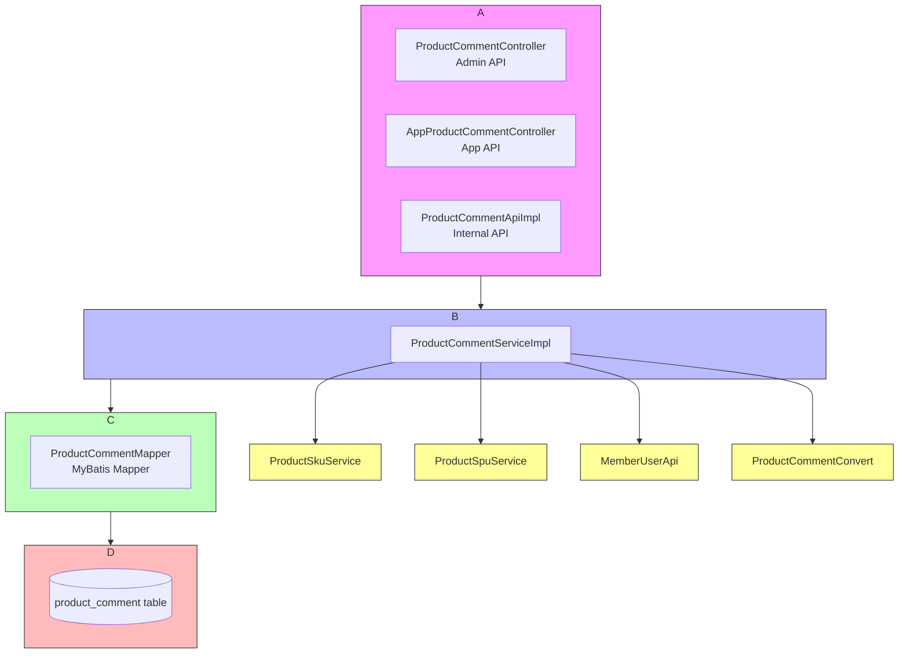
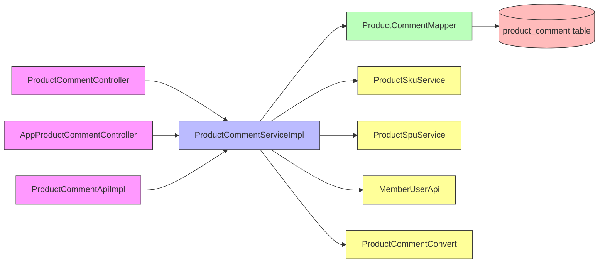
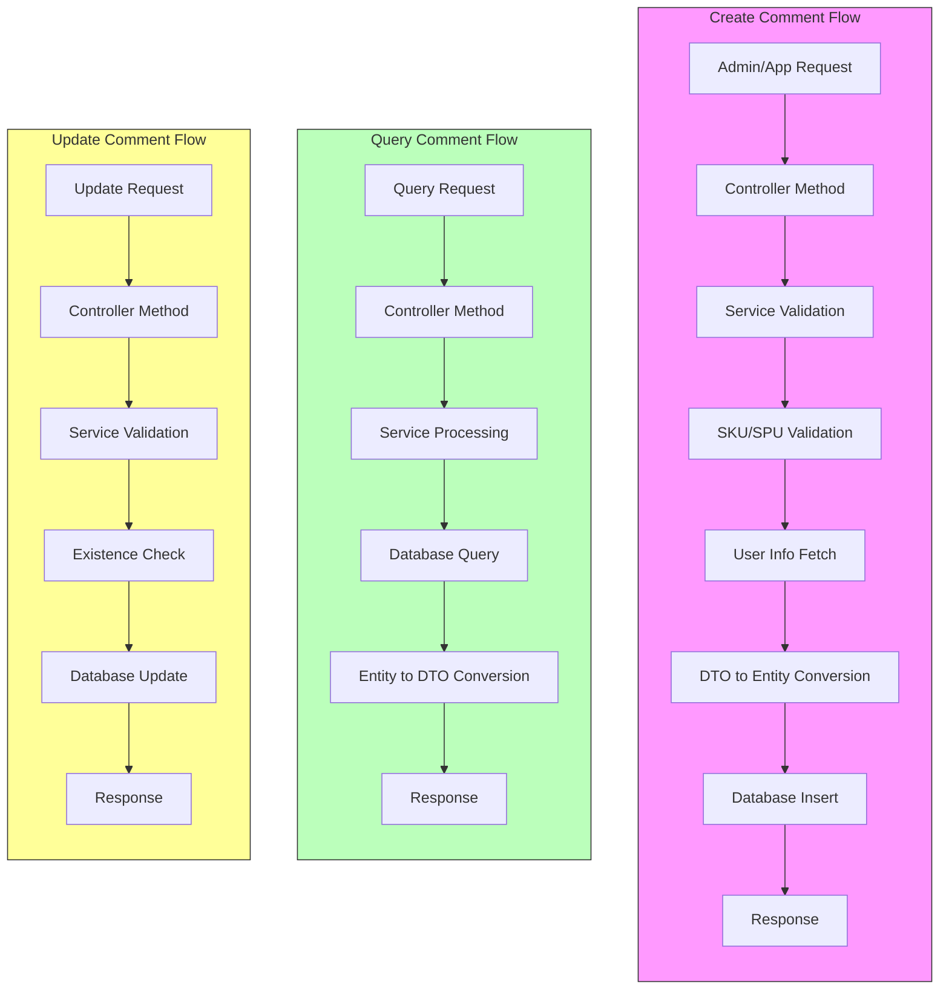
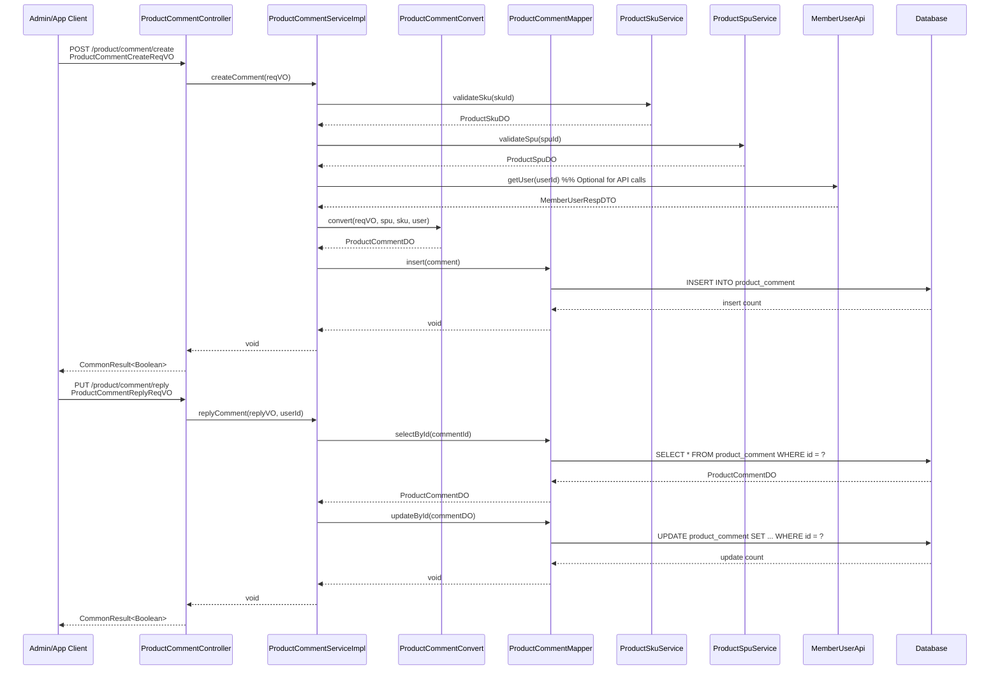
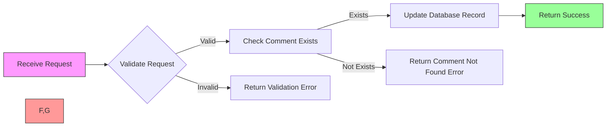
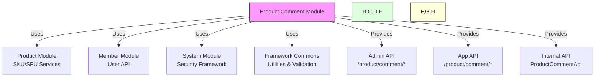

# Product Comment Management Module Documentation

## Module Overview

The Product Comment Management Module handles product review and rating functionality in the Yudao Mall system. It provides both administrative interfaces for managing product comments and API endpoints for frontend applications to submit and retrieve product reviews.

This module enables customers to leave feedback on purchased products, including ratings (1-5 stars), textual comments, and optional images. Administrators can manage comment visibility, reply to customer feedback, and moderate content.

## Architecture Diagram



## Component Dependencies



## Data Flow Diagram



## Component Interaction Diagram



## Process Flow: Comment Creation

```mermaid
flowchart LR
    A[Receive Request] --> B{Validate Request}
    B -->|Valid| C[Validate SKU Exists]
    C -->|Valid| D[Validate SPU Exists]
    D -->|Valid| E{Check Duplicate Comment}
    E -->|No Duplicate| F[Fetch User Info<br/>(API only)]
    F --> G[Calculate Composite Score]
    G --> H[Convert to Entity]
    H --> I[Persist to Database]
    I --> J[Return Success]
    
    B -->|Invalid| K[Return Validation Error]
    C -->|Invalid| L[Return SKU Not Found Error]
    D -->|Invalid| M[Return SPU Not Found Error]
    E -->|Duplicate| N[Return Comment Exists Error]
    
    style A fill:#f9f,stroke:#333
    style J fill:#9f9,stroke:#333
    style K,L,M,N fill:#f99,stroke:#333
```

## Process Flow: Comment Moderation



## Module Integration Points



## Core Components

### 1. ProductCommentController (Administrative Interface)
RESTful API controller for managing product comments in the admin panel. Provides endpoints for:
- Paginated querying of product comments
- Retrieving individual comment details
- Updating comment visibility (show/hide)
- Replying to comments as merchant/admin
- Creating self-evaluations (admin-created comments)

### 2. ProductCommentServiceImpl
Service layer implementation that handles business logic for comment operations:
- Validating comment creation (SKU/SPU existence, duplicate prevention)
- Converting between DTOs and domain objects
- Managing comment lifecycle (creation, visibility updates, replies)
- Interacting with related services (product SKU/SPU, member user)

### 3. ProductCommentConvert
Mapper interface for converting between different representation layers:
- Converting API request DTOs to domain objects
- Handling score calculations (combining description and service scores)
- Mapping user/product information to comment entities

### 4. Value Objects (VO/Data Transfer Objects)
- **ProductCommentRespVO**: Response object for returning comment details
- **ProductCommentPageReqVO**: Request object for paginated comment queries
- **ProductCommentCreateReqVO**: Request for creating admin self-evaluations
- **ProductCommentUpdateVisibleReqVO**: Request for toggling comment visibility
- **ProductCommentReplyReqVO**: Request for merchant replies to comments

## Architecture Overview

The module follows a layered architecture typical of Spring Boot applications:

```
┌─────────────────────────────────────┐
│         Presentation Layer          │
│  ProductCommentController (Admin)   │
│  AppProductCommentController (App)  │
└─────────────────────────────────────┘
          ▲                   ▲
          │                   │
┌─────────────────────────────────────┐
│         Service Layer               │
│   ProductCommentServiceImpl         │
└─────────────────────────────────────┘
          ▲                   ▲
          │                   │
┌─────────────────────────────────────┐
│     Data Access Layer               │
│   ProductCommentMapper (MyBatis)    │
└─────────────────────────────────────┘
          ▲
          │
┌─────────────────────────────────────┐
│     Database Layer                  │
│  product_comment table              │
└─────────────────────────────────────┘
```

## Component Relationships

The Product Comment Module interacts with several other modules in the system:

1. **Product Module**: Depends on ProductSkuService and ProductSpuService for validating product information
2. **Member Module**: Uses MemberUserApi to retrieve user information for comments
3. **System Module**: Leverages security utilities for permission checking and user context
4. **Framework Module**: Utilizes common utilities for bean conversion, validation, and response handling

## Detailed Component Documentation

### ProductCommentController

The administrative controller exposes the following endpoints:

| Method | Endpoint | Description | Permission Required |
|--------|----------|-------------|---------------------|
| GET | `/product/comment/page` | Paginated query of product comments | `product:comment:query` |
| GET | `/product/comment/get` | Retrieve specific comment by ID | `product:comment:query` |
| PUT | `/product/comment/update-visible` | Show/hide comment visibility | `product:comment:update` |
| PUT | `/product/comment/reply` | Merchant reply to comment | `product:comment:update` |
| POST | `/product/comment/create` | Create admin self-evaluation | `product:comment:update` |

Key features:
- Uses Spring Security annotations for access control (`@PreAuthorize`)
- Implements pagination through `PageParam` extension
- Utilizes Swagger/OpenAPI annotations for API documentation
- Leverages common result wrappers for consistent API responses
- Applies BeanUtils for DTO-to-entity conversion

### ProductCommentServiceImpl

Service implementation handles core business logic:

#### Comment Creation Process
1. **Validation Phase**:
   - Validates SKU existence through ProductSkuService
   - Validates SPU existence through ProductSpuService
   - Checks for duplicate comments (user + order item combination)

2. **Data Preparation**:
   - Retrieves user information via MemberUserApi
   - Calculates composite score from description and service ratings
   - Converts request DTO to ProductCommentDO using ProductCommentConvert

3. **Persistence**:
   - Saves comment via ProductCommentMapper

#### Comment Moderation
- Visibility toggling through direct database update
- Reply functionality with automatic timestamping and user attribution
- Existence validation before modification operations

### Data Model

The ProductCommentDO (Data Object) represents the persistent entity with fields including:

- **Identification**: id (primary key)
- **User Information**: userId, userNickname, userAvatar, anonymous flag
- **Order References**: orderId, orderItemId
- **Product References**: spuId, skuId, spuName, skuPicUrl, skuProperties
- **Rating System**: scores (composite), descriptionScores, benefitScores
- **Content**: comment text, picUrls (image URLs)
- **Moderation**: visible flag, replyStatus, replyUserId, replyContent, replyTime
- **Audit**: createTime

## Integration Points

### API Layer
The module provides dual API interfaces:
1. **Admin API** (`/product/comment/*`): Secure endpoints for backend management
2. **App API** (`/product/comment/*` in AppProductCommentController): Public endpoints for mobile applications

### Related Modules
Instead of duplicating information, this module references:
- [Product Module Documentation](product.md) for product SKU/SPU details
- [Member Module Documentation](member.md) for user information handling
- [System Module Documentation](system.md) for security and permission frameworks

## Configuration and Dependencies

### Dependencies
- Spring Web MVC for REST endpoints
- MyBatis-Plus for ORM mapping
- MapStruct for object conversion (ProductCommentConvert)
- Spring Validation for request validation
- Spring Security for access control

### Configuration
The module relies on auto-configuration from:
- Product service configurations (ProductSpuService, ProductSkuService)
- Member service configurations (MemberUserApi)
- Framework security configurations

## Usage Examples

### Creating a Comment (Admin Self-Evaluation)
```java
ProductCommentCreateReqVO reqVO = new ProductCommentCreateReqVO();
reqVO.setUserId(123L);
reqVO.setOrderItemId(456L);
reqVO.setUserNickname("测试用户");
reqVO.setUserAvatar("https://example.com/avatar.jpg");
reqVO.setSkuId(789L);
reqVO.setDescriptionScores(5);
reqVO.setBenefitScores(4);
reqVO.setContent("产品质量很好，很满意！");
reqVO.setPicUrls(Arrays.asList("https://example.com/img1.jpg", "https://example.com/img2.jpg"));

productCommentService.createComment(reqVO);
```

### Replying to a Comment
```java
ProductCommentReplyReqVO replyVO = new ProductCommentReplyReqVO();
replyVO.setId(1L);
replyVO.setReplyContent("感谢您的好评！有任何问题随时联系我们。");

productCommentService.replyComment(replyVO, getLoginUserId());
```

### Querying Comments
```java
ProductCommentPageReqVO pageVO = new ProductCommentPageReqVO();
pageVO.setPageNo(1);
pageVO.setPageSize(10);
pageVO.setUserNickname("张三");
pageVO.setScores(5); // 5-star reviews only
pageVO.setReplyStatus(true); // Only replied comments

PageResult<ProductCommentRespVO> result = productCommentService.getCommentPage(pageVO);
```

## Security Considerations

1. **Access Control**: All administrative endpoints require specific permissions:
   - `product:comment:query` for read operations
   - `product:comment:update` for modification operations

2. **Data Validation**: All incoming requests are validated using Hibernate Validator annotations

3. **Input Sanitization**: Text content is processed through the service layer before persistence

4. **User Context**: Merchant replies automatically use the currently authenticated user's ID

## Performance Considerations

1. **Pagination**: All list queries use pagination to prevent excessive memory usage
2. **Selective Loading**: Only necessary fields are loaded in query operations
3. **Caching Opportunities**: Frequently accessed product information could benefit from caching
4. **Database Indexes**: Recommended indexes on:
   - `(userId, orderItemId)` for duplicate prevention
   - `(skuId)` for product-based queries
   - `(createTime)` for time-based queries
   - `(visible)` for moderation workflows

## Error Handling

The module uses standardized error handling through:
- Service exceptions for business rule violations (duplicate comments, invalid SKU/SPU)
- Validation exceptions for invalid request data
- Standard HTTP error responses through CommonResult wrapper

## Future Enhancements

1. **Comment Analytics**: Add endpoints for comment statistics and sentiment analysis
2. **Image Processing**: Implement automatic thumbnail generation for comment images
3. **AI Moderation**: Integrate content moderation for inappropriate comments
4. **Export Functionality**: Add CSV/Excel export for comment data
5. **Advanced Filtering**: Support for more complex filtering options (date ranges, keyword search)

## References

Instead of duplicating information, please refer to:
- [Product Module Documentation](product.md) for product SKU/SPU service details
- [Member Module Documentation](member.md) for member user API details
- [System Module Documentation](system.md) for security framework details
- [Framework Common Documentation](framework-common.md) for common utilities and annotations