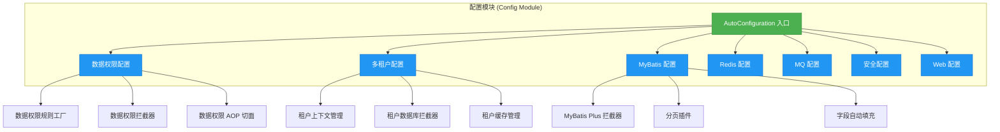
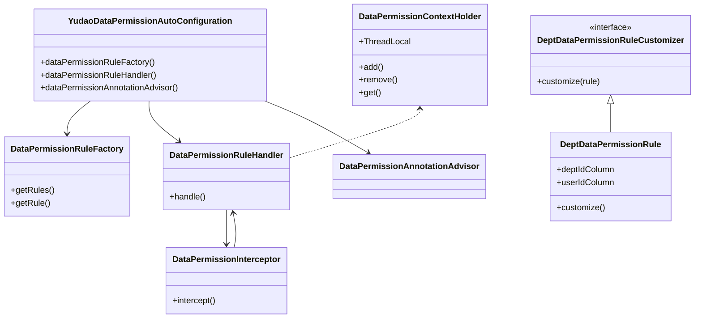
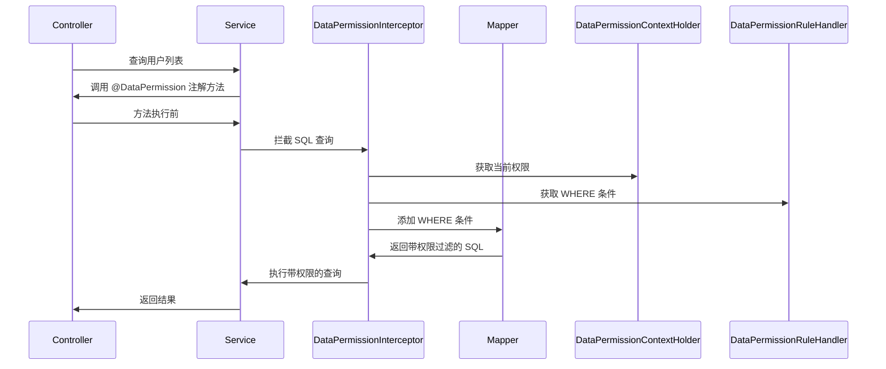

# 配置模块 (Config Module) 文档

## 1. 概述

配置模块是 Yudao 框架的核心基础设施之一，负责通过 Spring Boot 的自动配置机制（AutoConfiguration）来简化框架各组件的初始化与集成。该模块采用**约定优于配置**的原则，根据类路径、属性配置和 Bean 的存在与否，自动完成相关组件的注册与组装。

本模块主要包含以下核心功能：

- **数据权限自动配置**：实现基于部门的数据权限过滤，支持通过注解灵活控制数据访问范围
- **多租户自动配置**：支持多租户环境下的数据隔离与上下文管理
- **MyBatis 自动配置**：集成 MyBatis Plus，提供分页、字段自动填充等能力
- **各业务模块自动配置**：如 Redis、MQ、Excel、安全、Web 等模块的自动化集成

## 2. 架构设计

### 2.1 整体架构



### 2.2 核心组件关系



## 3. 核心组件详解

### 3.1 数据权限自动配置

#### 3.1.1 YudaoDataPermissionAutoConfiguration

数据权限自动配置类，负责初始化数据权限相关的核心 Bean。

**主要功能：**

| Bean | 描述 |
|------|------|
| `dataPermissionRuleFactory` | 数据权限规则工厂，管理所有注册的数据权限规则 |
| `dataPermissionRuleHandler` | 数据权限规则处理器，将规则转换为 MyBatis Plus 的拦截器 |
| `dataPermissionAnnotationAdvisor` | 数据权限 AOP 切面，支持通过 `@DataPermission` 注解控制权限 |

**配置流程：**

1. 注入所有 `DataPermissionRule` 实现类
2. 创建 `DataPermissionRuleFactoryImpl` 工厂
3. 创建 `DataPermissionRuleHandler` 处理器
4. 将 `DataPermissionInterceptor` 添加到 MyBatis Plus 拦截器链（优先级最高）
5. 创建 `DataPermissionAnnotationAdvisor` 支持注解式权限控制

#### 3.1.2 YudaoDeptDataPermissionAutoConfiguration

基于部门的数据权限自动配置类，仅在存在 `DeptDataPermissionRuleCustomizer` Bean 时生效。

**主要功能：**

- 创建 `DeptDataPermissionRule` 部门权限规则
- 通过 `DeptDataPermissionRuleCustomizer` 接口自定义权限规则配置
- 依赖 `PermissionCommonApi` 获取权限相关数据

**自定义权限规则示例：**

```java
@Component
public class CustomDeptRuleCustomizer implements DeptDataPermissionRuleCustomizer {
    @Override
    public void customize(DeptDataPermissionRule rule) {
        // 配置 dept_id 列过滤
        rule.addDeptColumn(UserDO.class, "dept_id");
        // 配置 user_id 列过滤
        rule.addUserColumn(UserDO.class, "create_user");
    }
}
```

### 3.2 数据权限上下文管理

#### 3.2.1 DataPermissionContextHolder

使用 `TransmittableThreadLocal` 维护当前线程的数据权限上下文，支持嵌套调用场景。

**核心方法：**

| 方法 | 描述 |
|------|------|
| `get()` | 获取当前栈顶的 DataPermission 注解 |
| `add(dataPermission)` | 入栈数据权限注解 |
| `remove()` | 出栈数据权限注解 |
| `getAll()` | 获取所有数据权限注解列表 |
| `clear()` | 清空上下文（仅用于测试） |

**使用场景：**

- 方法调用链中传递数据权限上下文
- 支持嵌套调用时的权限叠加
- 与 AOP 切面配合实现动态权限过滤

#### 3.2.2 DataPermissionUtils

工具类，提供忽略数据权限的执行方法。

**核心方法：**

| 方法 | 描述 |
|------|------|
| `executeIgnore(Runnable)` | 忽略数据权限执行任务 |
| `executeIgnore(Callable)` | 忽略数据权限执行任务并返回结果 |
| `addDisableDataPermission()` | 添加禁用权限标记 |
| `removeDataPermission()` | 移除权限标记 |

**使用示例：**

```java
// 忽略数据权限执行敏感操作
DataPermissionUtils.executeIgnore(() -> {
    // 此处执行的数据查询不受权限过滤影响
    userMapper.selectAll();
});
```

### 3.3 多租户自动配置

参考 `YudaoTenantAutoConfiguration`，配置模块还包括多租户相关的自动配置：

- **租户上下文管理**：通过 `TenantContextHolder` 维护租户 ID
- **数据库拦截器**：`TenantLineInnerInterceptor` 自动添加租户条件
- **Web 过滤器**：`TenantContextWebFilter` 从请求中解析租户信息
- **缓存隔离**：`TenantRedisCacheManager` 实现租户级缓存隔离
- **MQ 支持**：Redis/RabbitMQ/RocketMQ 的消息头携带租户信息
- **定时任务**：`TenantJobAspect` 确保定时任务在租户上下文中执行

### 3.4 MyBatis 自动配置

参考 `YudaoMybatisAutoConfiguration`，配置模块还包括 MyBatis 相关的自动配置：

- **Mapper 扫描**：自动扫描指定包下的 Mapper 接口
- **MyBatis Plus 拦截器**：集成分页插件
- **字段自动填充**：`DefaultMetaObjectHandler` 自动填充创建/修改时间
- **ID 生成策略**：根据数据库类型自动选择 ID 生成器
- **懒加载支持**：支持 Mapper 接口的懒加载初始化

## 4. 数据权限工作流程

### 4.1 查询流程



### 4.2 权限注解使用

```java
// 类级别 - 所有方法都应用该权限
@DataPermission(deptColumn = "dept_id", userColumn = "create_user")
@Service
public class UserService {
    
    // 方法级别 - 覆盖类级别权限
    @DataPermission(enable = false) // 忽略权限
    public List<UserDO> getAllUsers() {
        return userMapper.selectAll();
    }
    
    // 自定义权限条件
    @DataPermission(deptColumn = "dept_id", userColumn = "user_id")
    public List<UserDO> selectByDept(Long deptId) {
        return userMapper.selectByDept(deptId);
    }
}
```

## 5. 配置属性

### 5.1 数据权限配置

```yaml
yudao:
  data-permission:
    enabled: true  # 是否启用数据权限
```

### 5.2 多租户配置

```yaml
yudao:
  tenant:
    enable: true   # 是否启用多租户
    ignore-urls:    # 忽略租户的 URL 模式
      - /api/health
      - /static/**
    ignore-caches:  # 忽略租户缓存的 key 模式
      - dict:*
```

### 5.3 MyBatis 配置

```yaml
mybatis-plus:
  global-config:
    db-config:
      id-type: INPUT  # ID 生成策略
      logic-delete-value: 1
      logic-not-delete-value: 0
```

## 6. 扩展点

### 6.1 自定义数据权限规则

通过实现 `DataPermissionRule` 接口，可以自定义数据权限过滤逻辑：

```java
@Component
public class CustomDataPermissionRule implements DataPermissionRule {
    
    @Override
    public String getRuleId() {
        return "custom";
    }
    
    @Override
    public boolean supports(Class<?> clazz) {
        return UserDO.class.equals(clazz);
    }
    
    @Override
    public String getWhereClause(Class<?> clazz) {
        return "dept_id = #{deptId} AND status = #{status}";
    }
}
```

### 6.2 自定义权限规则定制器

通过实现 `DeptDataPermissionRuleCustomizer` 接口，可以自定义部门权限规则的列配置：

```java
@Component
public class CustomDeptRuleCustomizer implements DeptDataPermissionRuleCustomizer {
    @Override
    public void customize(DeptDataPermissionRule rule) {
        rule.addDeptColumn(UserDO.class, "dept_id");
        rule.addUserColumn(UserDO.class, "operator");
    }
}
```

## 7. 与其他模块的依赖关系

| 依赖模块 | 依赖组件 | 说明 |
|----------|----------|------|
| **system** | `PermissionCommonApi` | 获取权限相关数据 |
| **security** | `LoginUser` | 获取当前登录用户信息 |
| **mybatis** | `MybatisPlusInterceptor` | 集成 MyBatis Plus 拦截器 |
| **redis** | `RedisTemplate` | 租户缓存管理 |
| **mq** | `RedisTemplate`, `RabbitTemplate` | MQ 消息租户上下文 |
| **job** | `Scheduler` | 定时任务租户上下文 |

## 8. 常见问题

### 8.1 如何禁用某个方法的数据权限？

在方法上添加 `@DataPermission(enable = false)` 注解：

```java
@DataPermission(enable = false)
public List<UserDO> getAllUsers() {
    // 此方法不受数据权限过滤
    return userMapper.selectAll();
}
```

### 8.2 如何在代码中临时忽略数据权限？

使用 `DataPermissionUtils.executeIgnore()` 方法：

```java
DataPermissionUtils.executeIgnore(() -> {
    // 此处代码忽略数据权限
    userMapper.selectAll();
});
```

### 8.3 如何配置自定义的权限规则？

实现 `DeptDataPermissionRuleCustomizer` 接口并注册为 Bean：

```java
@Component
public class MyCustomizer implements DeptDataPermissionRuleCustomizer {
    @Override
    public void customize(DeptDataPermissionRule rule) {
        rule.addDeptColumn(UserDO.class, "dept_id");
        rule.addUserColumn(UserDO.class, "create_user");
    }
}
```

### 8.4 数据权限是否支持嵌套调用？

支持。`DataPermissionContextHolder` 使用 `LinkedList` 存储权限上下文，支持嵌套调用时的权限叠加。

## 9. 参考文档

- [多租户模块文档](tenant.md)
- [MyBatis 模块文档](mybatis.md)
- [安全模块文档](security.md)
- [数据权限注解参考](data-permission-annotation.md)
