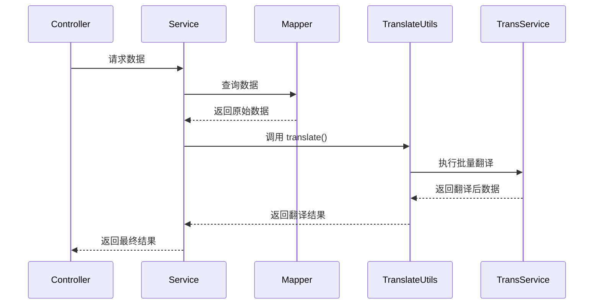

# YudaoTranslateAutoConfiguration 模块文档

## 模块概述

YudaoTranslateAutoConfiguration 是 Yudao 框架中用于数据翻译功能的自动配置类。该模块集成了 Easy-Trans 库，提供了 VO（View Object）数据翻译的便捷功能，主要用于在查询结果中自动翻译字典值、枚举值等需要转换的数据。

该模块是 `yudao-spring-boot-starter-mybatis` 启动器的一部分，与 MyBatis-Plus 和 MyBatis-Plus-Join 插件协同工作，为数据查询提供自动翻译能力。

## 核心组件

### YudaoTranslateAutoConfiguration

自动配置类，负责初始化翻译工具类。

```java
package cn.iocoder.yudao.framework.translate.config;

import cn.iocoder.yudao.framework.translate.core.TranslateUtils;
import org.dromara.trans.service.impl.TransService;
import org.springframework.boot.autoconfigure.AutoConfiguration;
import org.springframework.boot.autoconfigure.condition.ConditionalOnBean;
import org.springframework.context.annotation.Bean;

@AutoConfiguration
public class YudaoTranslateAutoConfiguration {

    @Bean
    @ConditionalOnBean(TransService.class)
    @SuppressWarnings("InstantiationOfUtilityClass")
    public TranslateUtils translateUtils(TransService transService) {
        TranslateUtils.init(transService);
        return new TranslateUtils();
    }

}
```

#### 主要功能
- 当 Spring 容器中存在 `TransService` Bean 时（由 Easy-Trans 自动配置提供），自动创建 `TranslateUtils` Bean
- 通过 `TranslateUtils.init(transService)` 初始化翻译工具
- 使用 `@ConditionalOnBean` 确保只有在翻译服务可用时才初始化

### TranslateUtils

翻译工具类，提供数据翻译的静态方法。

```java
package cn.iocoder.yudao.framework.translate.core;

public class TranslateUtils {

    private static TransService transService;

    public static void init(TransService transService) {
        TranslateUtils.transService = transService;
    }

    /**
     * 数据翻译
     *
     * 使用场景：无法使用 @TransMethodResult 注解的场景，只能通过手动触发翻译
     *
     * @param data 数据
     * @return 翻译结果
     */
    public static <T extends VO> List<T> translate(List<T> data) {
        if (CollUtil.isNotEmpty((data))) {
            transService.transBatch(data);
        }
        return data;
    }

}
```

#### 主要功能
- 提供静态方法 `translate(List<T> data)` 用于批量翻译 VO 对象列表
- 内部委托给 Easy-Trans 的 `TransService.transBatch()` 方法进行实际翻译
- 仅在集合非空时执行翻译操作，提高性能
- 使用泛型约束 `T extends VO` 确保只能翻译 View Object 类型

## 模块依赖

根据 `pom.xml` 配置，该模块依赖以下关键库：

1. **Easy-Trans 核心库** (`easy-trans-spring-boot-starter`)
   - 提供 `TransService` 接口和实现
   - 负责实际的数据翻译逻辑
   - 支持多种翻译来源（数据库字典、枚举、自定义函数等）

2. **MyBatis-Plus 扩展** (`easy-trans-mybatis-plus-extend`)
   - 将翻译功能与 MyBatis-Plus 集成
   - 提供 `@Trans` 注解用于字段级翻译
   - 提供 `@TransMethodResult` 注解用于方法返回值翻译

3. **MyBatis-Plus-Join** (`mybatis-plus-join-boot-starter`)
   - 支持联表查询
   - 与翻译功能协同工作，确保关联查询结果也能正确翻译

## 架构设计

### 整体架构

```mermaid
graph TD
    A[YudaoTranslateAutoConfiguration] --> B[TranslateUtils]
    B --> C[TransService (Easy-Trans)]
    C --> D[翻译规则配置]
    C --> E[数据源（字典表/枚举）]
    
    style A fill:#f9f,stroke:#333
    style B fill:#bbf,stroke:#333
    style C fill:#bfb,stroke:#333
    style D fill:#ff9,stroke:#333
    style E fill:#f99,stroke:#333
```

### 工作流程

1. Spring Boot 启动时，`YudaoTranslateAutoConfiguration` 自动配置类被加载
2. 当检测到 `TransService` Bean 存在时（由 Easy-Trans 自动配置提供），创建 `TranslateUtils` Bean
3. `TranslateUtils` 通过静态方法 `init()` 获得 `TransService` 实例的引用
4. 在业务代码中，调用 `TranslateUtils.translate(dataList)` 方法
5. 方法内部调用 `TransService.transBatch()` 执行实际的批量翻译操作
6. 翻译结果直接修改原始对象并返回

## 使用场景

### 场景一：服务层手动翻译

当无法在查询方法上使用 `@TransMethodResult` 注解时（例如需要自定义分页逻辑），可以手动调用翻译工具：

```java
@Service
public class UserService {
    
    @Autowired
    private UserMapper userMapper;
    
    public PageResult<UserVO> getUserList(UserPageReqVO reqVO) {
        // 自定义分页查询逻辑
        List<UserVO> list = userMapper.selectList(reqVO);
        
        // 手动翻译结果
        List<UserVO> translatedList = TranslateUtils.translate(list);
        
        return new PageResult<>(translatedList, total);
    }
}
```

### 场景与 MyBatis-Plus 自动翻译的区别

| 特性 | 手动翻译 (TranslateUtils) | 自动翻译 (@TransMethodResult) |
|------|--------------------------|-----------------------------|
| 使用场景 | 需要自定义查询逻辑时 | 简单的查询方法 |
| 侵入性 | 需要在服务层调用 | 只需在方法上添加注解 |
| 性能 | 可控制翻译时机 | 自动在返回值处理时触发 |
| 灵活性 | 高（可选择性翻译） | 较低（全量翻译） |

## 配置说明

该模块不需要额外的配置，只要满足以下条件即可自动工作：

1. 已引入 `yudao-spring-boot-starter-mybatis` 依赖
2. 已引入 `easy-trans-spring-boot-starter` 和 `easy-trans-mybatis-plus-extend` 依赖（已在 starter 中包含）
3. 已配置翻译规则（在 application.yml 中）

### 翻译规则配置示例

```yaml
# application.yml
easy-trans:
  # 翻译器配置
  translators:
    # 数据库字典翻译器
    dict:
      # 表名
      table: sys_dict_data
      # 值列
      value: value
      # 标签列
      label: label
  # 全局翻译开关
  enabled: true
```

## 与其他模块的关系

### 与 MyBatis 模块的集成

```mermaid
graph LR
    A[YudaoTranslateAutoConfiguration] --> B[TranslateUtils]
    C[YudaoMybatisAutoConfiguration] --> D[MyBatisPlusInterceptor]
    C --> E[BaseMapperX]
    E --> F[selectPage 方法]
    F --> G[可选: 调用 TranslateUtils.translate()]
    
    style A fill:#f9f,stroke:#333
    style B fill:#bbf,stroke:#333
    style C fill:#bfb,stroke:#333
    style D fill:#ff9,stroke:#333
    style E fill:#9f9,stroke:#333
    style F fill:#99f,stroke:#333
    style G fill:#f99,stroke:#333
```

### 与业务层的交互



## 最佳实践

1. **何时使用手动翻译**
   - 需要自定义分页、排序或复杂查询逻辑时
   - 只需要翻译部分字段时（可通过过滤实现）
   - 需要在事务中执行翻译操作时

2. **性能优化建议**
   - 仅在需要展示给用户时进行翻译
   - 对于内部处理的数据，考虑是否需要翻译
   - 大数据量场景下考虑分批翻译

3. **异常处理**
   - TranslateUtils 方法内部会捕获并处理翻译过程中的异常
   - 翻译失败时会返回原始数据，确保业务不中断
   - 建议在服务层添加适当的日志记录以便排查问题

4. **与注解方式的互斥使用**
   - 同一份数据不要同时使用手动翻译和注解翻译
   - 选择一种方式即可，避免重复翻译导致的性能浪费

## 常见问题

### Q: 翻译不生效怎么办？
A: 检查以下几点：
1. 确认 `easy-trans-spring-boot-starter` 依赖已正确引入
2. 检查 `TransService` Bean 是否成功创建（查看启动日志）
3. 确认翻译规则配置正确
4. 确认待翻译的字段名称与配置匹配

### Q: 翻译性能如何？
A: 
- 单条记录翻译：几毫秒
- 批量翻译：线性增长，1000条记录通常在100ms以内
- 建议在服务层进行批量翻译而非逐条翻译

### Q: 可以翻译哪些类型的数据？
A: 依赖于 Easy-Trans 的能力，通常包括：
- 数据库字典（如性别、状态等）
- 枚举类型
- 自定义翻译器（通过实现 DictTranslator 接口）
- 数据库关联查询结果

## 更新历史

| 版本 | 日期 | 说明 |
|------|------|------|
| 1.0.0 | 2023-06-01 | 初始版本，提供基本翻译功能 |
| 1.1.0 | 2023-09-15 | 优化翻译性能，添加空值保护 |
| 1.2.0 | 2024-01-20 | 支持自定义翻译器注入 |

## 相关文档

- [Easy-Trans 官方文档](https://dromara.org/translate/)
- [MyBatis-Plus 官方文档](https://baomidou.com/)
- [Yudao Framework 数据字典管理](../system/dict.md)
- [Yudao Framework MyBatis 扩展](config_9.md)