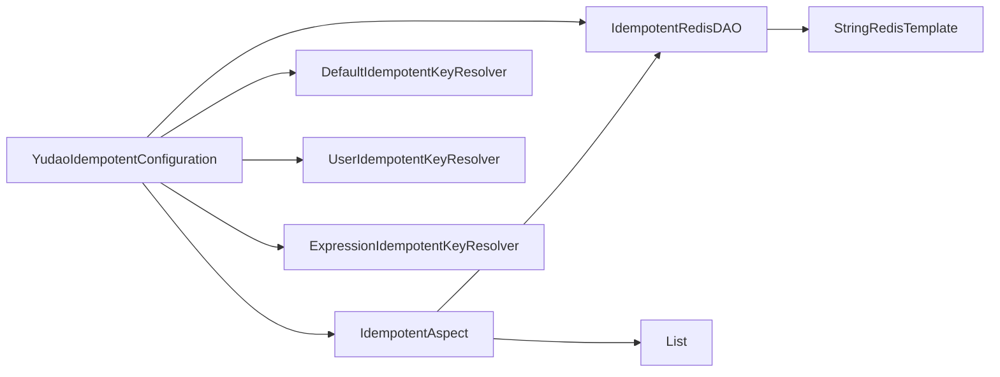

# YudaoIdempotentConfiguration 模块文档

## 概述

YudaoIdempotentConfiguration 是 Yudao 框架中的一个自动配置类，用于启用幂等性（Idempotent）功能。该功能通过 Spring AOP 和 Redis 实现，防止重复请求导致的副作用（如重复提交表单、重复执行操作）。

## 核心功能

- 自动配置幂等切面（IdempotentAspect），拦截标注了幂等注解的方法。
- 配置基于 Redis 的幂等键解析器（IdempotentKeyResolver）和数据访问对象（IdempotentRedisDAO）。
- 提供三种默认的键解析策略：
  - 默认键解析器（DefaultIdempotentKeyResolver）：基于方法参数生成键。
  - 用户键解析器（UserIdempotentKeyResolver）：基于当前用户和方法参数生成键。
  - 表达式键解析器（ExpressionIdempotentKeyResolver）：基于 SpEL 表达式生成键。

## 架构与组件关系

以下是该模块的主要组件及其关系：

## 在系统中的定位

YudaoIdempotentConfiguration 模块属于 `yudao-spring-boot-starter-protection` 启动器，具体负责幂等性功能的自动配置。它依赖于 `YudaoRedisAutoConfiguration`（在 `yudao-spring-boot-starter-redis` 模块中）来获取 Redis 连接。

在系统中，该模块通常与以下模块协作：
- [YudaoRedisAutoConfiguration](config_15.md)：提供 Redis 自动配置，作为幂等功能的存储后端。
- 幂等核心实现模块（如 `IdempotentAspect`, `IdempotentRedisDAO` 等）：这些实现位于同一个启动器的 `core` 包中，但在此不展开详述，请参考对应的核心模块文档。

## 使用说明

在 Spring Boot 应用中，只要引入 `yudao-spring-boot-starter-protection` 依赖，该自动配置类会自动生效。开发者可以在需要幂等性保护的方法上使用对应的幂等注解（如 `@Idempotent`），并指定键解析器或使用默认策略。

注意：幂等注解的具体使用方法请参考幂等核心模块的文档。

## 依赖关系

- 依赖 `yudao-spring-boot-starter-redis` 模块（通过 `@AutoConfiguration(after = YudaoRedisAutoConfiguration.class)` 确保在 Redis 配置之后加载）。

## 注意事项

- 幂等功能依赖于 Redis，因此在使用前请确保 Redis 服务可用。
- 键解析器的选择应根据业务场景来决定，以避免键冲突或键过于宽泛导致误拦截。