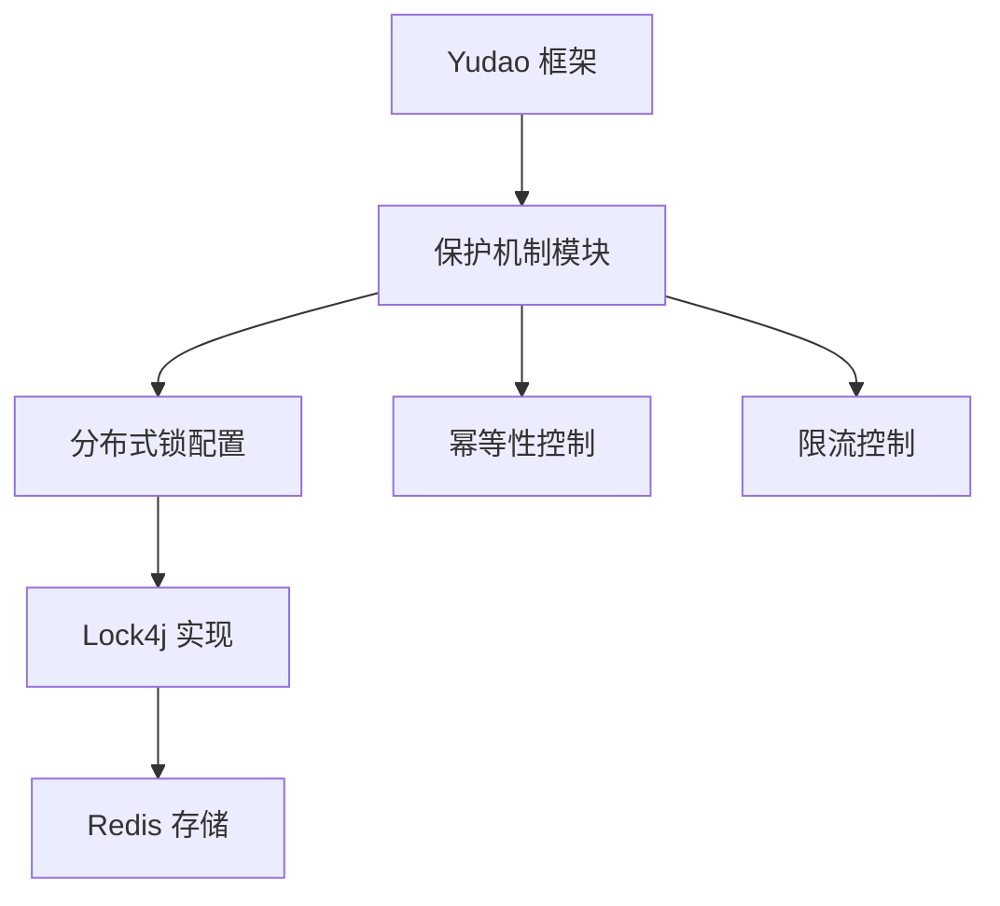
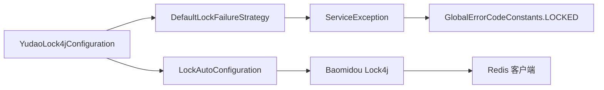
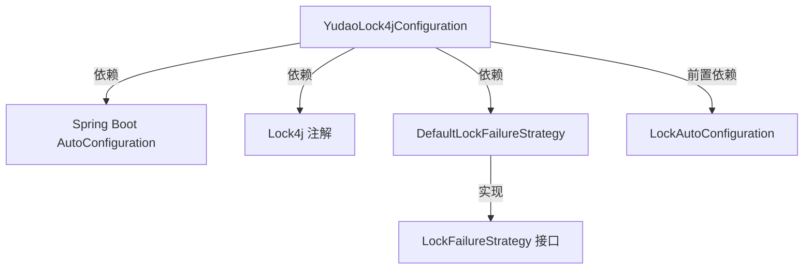
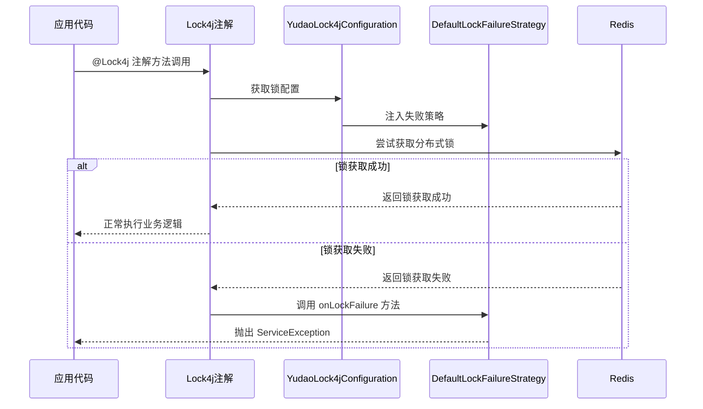
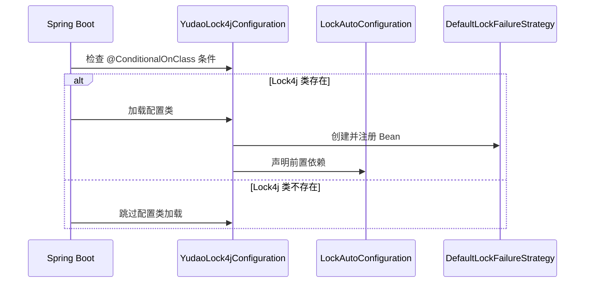
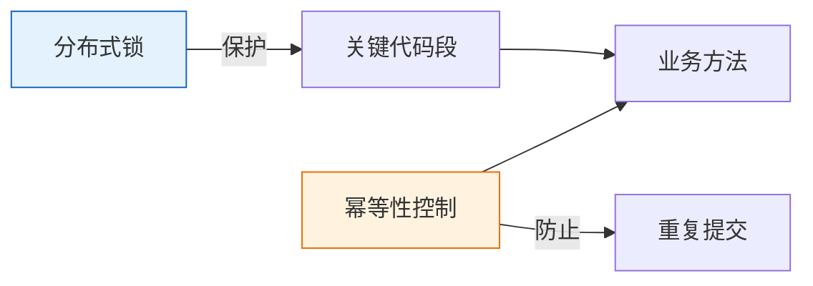
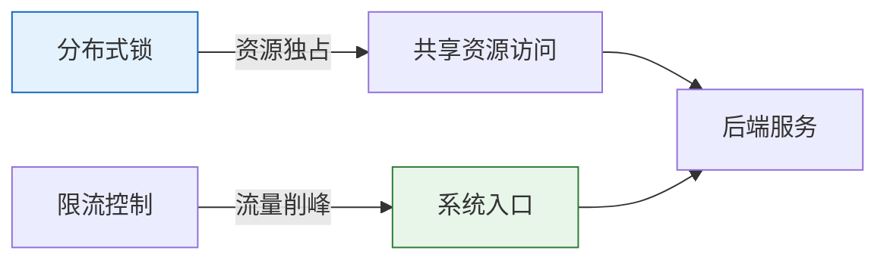

# Yudao Lock4j 配置模块

## 概述

Yudao Lock4j 配置模块 (`YudaoLock4jConfiguration`) 是 Yudao 框架的分布式锁自动配置类，基于 Baomidou Lock4j 实现。该模块提供了分布式锁的核心配置，确保在多实例部署环境中对共享资源的安全访问。

该配置类位于 `yudao-spring-boot-starter-protection` 模块中，是框架保护机制的一部分，与幂等性控制和限流配置协同工作，为系统提供完整的并发控制能力。

## 核心功能

1. **自动配置分布式锁**：通过 Spring Boot 自动配置机制，在检测到 Lock4j 依赖时自动初始化
2. **失败策略配置**：提供默认的锁获取失败处理策略
3. **与其他保护机制协作**：与幂等性控制和限流配置形成完整的并发控制解决方案
4. **Redis 集成**：基于 Redis 实现分布式锁的存储和协调

## 架构设计

### 模块定位



### 组件关系



### 依赖关系



## 技术实现

### 主要类

#### YudaoLock4jConfiguration

分布式锁的自动配置类，负责初始化 Lock4j 相关组件。

```java
@AutoConfiguration(before = LockAutoConfiguration.class)
@ConditionalOnClass(name = "com.baomidou.lock.annotation.Lock4j")
public class YudaoLock4jConfiguration {

    @Bean
    public DefaultLockFailureStrategy lockFailureStrategy() {
        return new DefaultLockFailureStrategy();
    }

}
```

关键注解说明：
- `@AutoConfiguration(before = LockAutoConfiguration.class)`：确保在 Baomidou 的 LockAutoConfiguration 之前加载
- `@ConditionalOnClass(name = "com.baomidou.lock.annotation.Lock4j")`：仅当 Lock4j 注解类存在时才激活此配置
- `@Bean`：将 DefaultLockFailureStrategy 注册为 Spring Bean

#### DefaultLockFailureStrategy

锁获取失败时的默认处理策略。

```java
@Slf4j
public class DefaultLockFailureStrategy implements LockFailureStrategy {

    @Override
    public void onLockFailure(String key, Method method, Object[] arguments) {
        log.debug("[onLockFailure][线程:{} 获取锁失败，key:{} 获取失败:{} ]", 
                  Thread.currentThread().getName(), key, arguments);
        throw new ServiceException(GlobalErrorCodeConstants.LOCKED);
    }
}
```

实现细节：
- 记录调试日志，包含线程名称、锁 key 和方法参数
- 抛出业务异常 `ServiceException`，错误码为 `GlobalErrorCodeConstants.LOCKED`
- 使用 SLF4J 日志框架进行日志记录

### Redis 键设计

分布式锁在 Redis 中的存储格式由 `Lock4jRedisKeyConstants` 定义：

```java
public interface Lock4jRedisKeyConstants {
    /**
     * 分布式锁
     *
     * KEY 格式：lock4j:%s // 参数来自 DefaultLockKeyBuilder 类
     * VALUE 数据格式：HASH // RLock.class：Redisson 的 Lock 锁，使用 Hash 数据结构
     * 过期时间：不固定
     */
    String LOCK4J = "lock4j:%s";
}
```

键设计说明：
- 使用 `lock4j:%s` 格式，其中 `%s` 由 Lock4j 的 `DefaultLockKeyBuilder` 动态生成
- 值存储为 Hash 类型，这是 Redisson 实现分布式锁的内部机制
- 锁的过期时间由 Lock4j 动态管理，不是固定值

## 工作流程

### 锁获取流程



### 配置初始化流程



## 与其他模块的关系

### 与幂等性控制的协作



### 与限流控制的协作



## 配置属性

该模块不直接暴露配置属性，而是依赖于底层 Lock4j 和 Redis 的配置。相关配置可以通过以下方式进行自定义：

1. **Redis 配置**：通过 Spring Boot 的 Redis 配置属性（`spring.redis.*`）
2. **Lock4j 配置**：通过 Baomidou Lock4j 的自动配置机制
3. **锁超时时间**：可以通过 `@Lock4j` 注解的 `timeout` 参数进行方法级别配置

## 使用示例

### 基础用法

```java
@Service
public class OrderService {

    @Lock4jConfiguration.java::YudaoLock4jConfiguration

    @Lock4j(name = "order_create_", keys = "#orderId", timeout = 30)
    public void createOrder(Order order) {
        // 此方法在分布式环境中会被锁保护
        // 同一 orderId 在 30 秒内只能有一个线程执行此方法
        orderRepository.save(order);
    }
}
```

### 自定义失败处理

如果需要自定义锁获取失败的处理逻辑，可以实现 `LockFailureStrategy` 接口并替换默认的 Bean：

```java
@Configuration
public class CustomLockConfig {

    @Bean
    @Primary
    public LockFailureStrategy customLockFailureStrategy() {
        return (key, method, arguments) -> {
            // 自定义失败处理逻辑
            log.warn("自定义锁失败处理: key={}, method={}", key, method.getName());
            // 可以选择不抛异常，而是等待重试或返回特定值
            throw new ServiceException(CustomErrorCode.LOCK_RETRY_LATER);
        };
    }
}
```

## 性能考量

1. **锁粒度**：建议使用业务有意义的锁 key，避免过粗或过细的锁粒度
2. **超时设置**：合理设置锁超时时间，防止死锁同时不过度影响业务响应
3. **监控告警**：建议监控锁获取失败率，异常情况可能表明系统负载过高或存在死锁风险
4. **Redis 性能**：确保 Redis 集群具备足够的性能和可用性，因为所有锁操作都依赖于它

## 最佳实践

1. **明确锁的业务含义**：锁的 name 和 keys 应该清晰表达其保护的业务资源
2. **合理设置超时时间**：根据业务操作的预期执行时间设置合理的超时值
3. **处理锁获取失败**：在业务层面考虑锁获取失败的补偿机制，而不仅仅依赖默认异常
4. **避免嵌套锁**：尽量避免在已经持有锁的方法中再次获取其他锁，以防止死锁
5. **监控和告警**：监控锁等待时间和失败率，及时发现性能瓶颈

## 错误处理

当锁获取失败时，默认策略会抛出 `ServiceException`，错误码为 `GlobalErrorCodeConstants.LOCKED`。这通常表现为：

- HTTP 状态码：423 (Locked) 或根据全局异常处理配置的其他状态码
- 错误消息：根据 `GlobalErrorCodeConstants.LOCKED` 配置的提示信息
- 建议的客户端处理：稍后重试或提示用户请勿频繁操作

## 与相关模块的对比

| 特性 | 分布式锁 (Lock4j) | 幂等性控制 | 限流控制 |
|------|------------------|------------|----------|
| 目的 | 防止并发修改共享资源 | 防止重复提交同一请求 | 控制系统流量峰值 |
| 作用域 | 方法或代码块级别 | 请求级别 | 接口或服务级别 |
| 实现方式 | 基于 Redis 的分布式锁 | 基于 Redis 的状态标记 | 基于 Redis 的计数器 |
| 典型场景 | 订单创建、库存扣减 | 表单重复提交、支付回调 | API 接口、秒杀活动 |
| 错误处理 | 锁获取失败异常 | 重复请求拒绝 | 流量超限拒绝或排队 |

## 版本变更说明

当前版本基于 Baomidou Lock4j 实现，具有以下特点：

1. **自动配置**：无需手动配置锁管理器，随 Spring Boot 自动装配
2. **注解驱动**：通过 `@Lock4j` 注解简单使用分布式锁
3. **灵活配置**：支持自定义锁 key 生成策略、超时时间等
4. **失败策略可插拔**：通过实现 `LockFailureStrategy` 接口自定义失败处理
5. **与 Spring 生态良好集成**：完美兼容 Spring Boot 自动配置体系

## 参考链接

1. [Baomidou Lock4j 官方文档](https://gitee.com/baomidou/lock4j)
2. [Redis 分布式锁实现原理](https://redis.io/docs/manual/distlock/)
3. [Yudao 框架保护机制设计文档]([ref_yudao_protection.md])
4. [幂等性控制模块说明]([ref_config_11.md])
5. [限流控制模块说明]([ref_config_13.md])