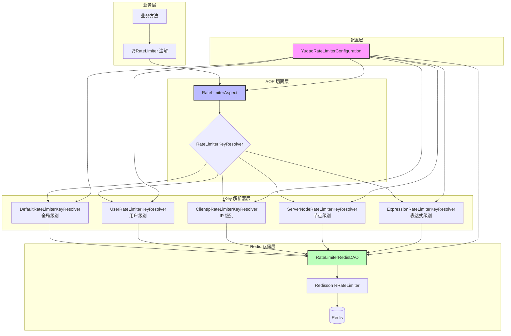
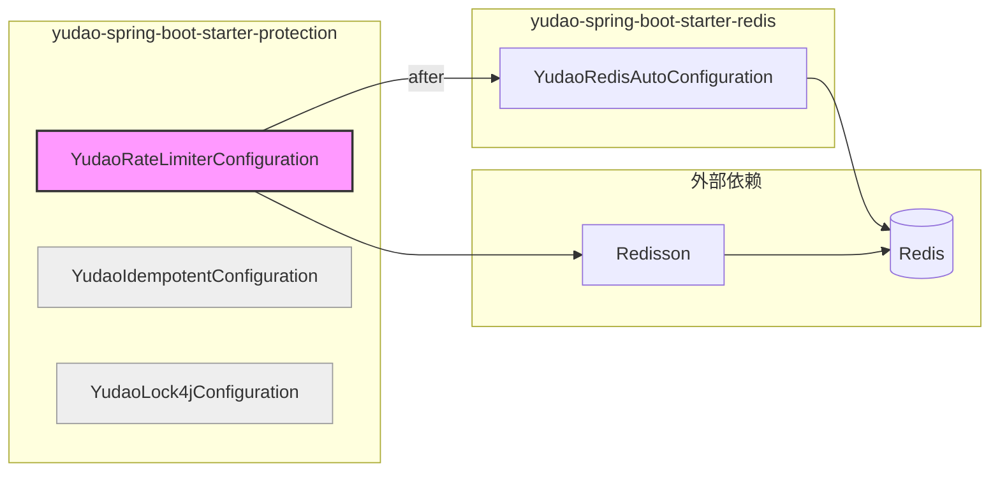
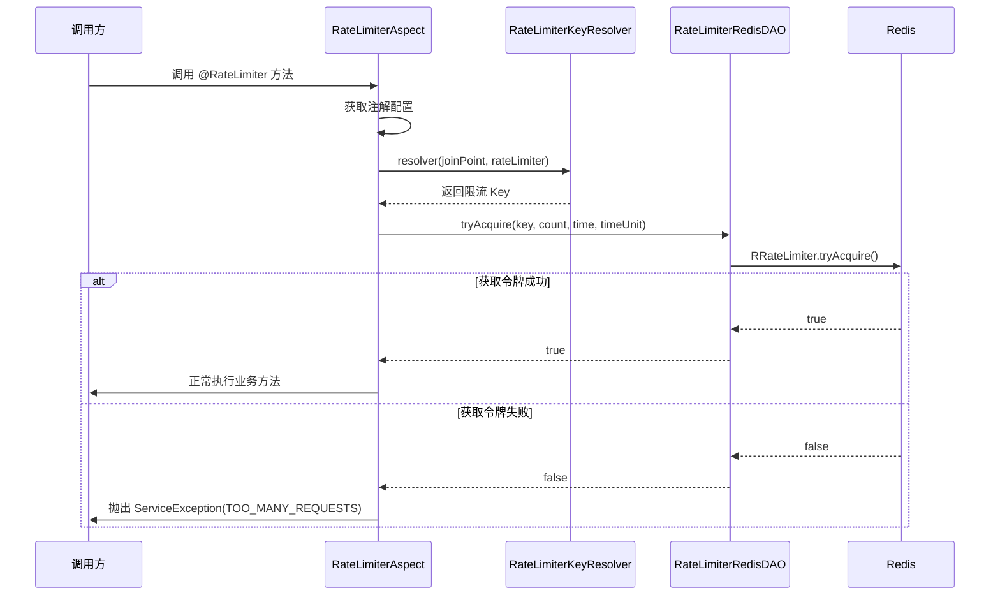
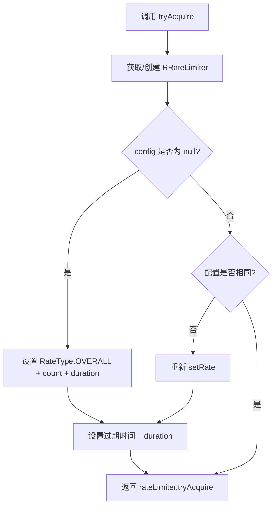
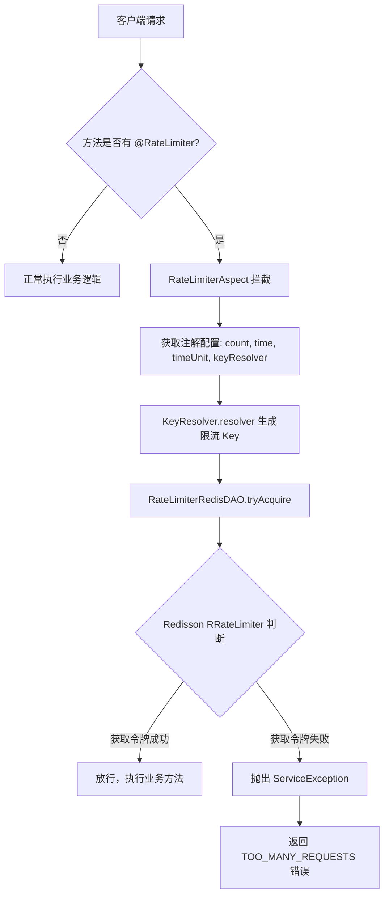
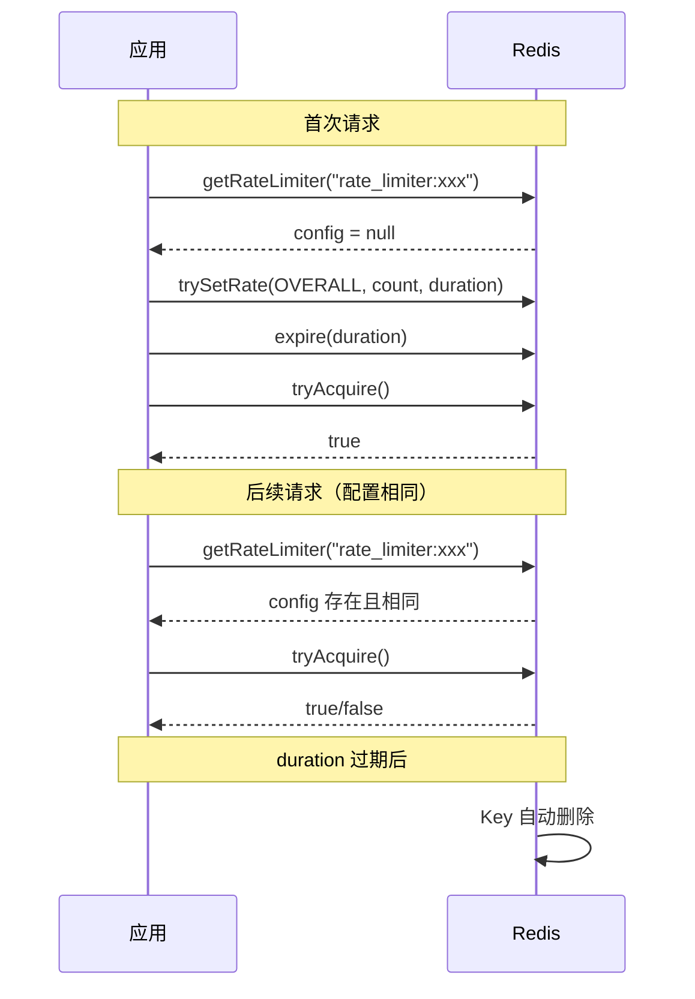

# config_13 — YudaoRateLimiterConfiguration 模块文档

## 1. 概述

`YudaoRateLimiterConfiguration` 是 yudao 框架中 **服务保护（protection）** 模块的核心配置类之一，负责实现 **基于 Redis + Redisson 的分布式限流** 功能。该模块通过 AOP 切面拦截 `@RateLimiter` 注解，结合 Redisson 的 `RRateLimiter` 实现令牌桶限流算法，为系统提供方法级别的流量控制能力。

### 核心能力

- **声明式限流**：通过 `@RateLimiter` 注解即可为任意 Spring Bean 方法添加限流保护
- **多维度限流 Key**：支持全局、用户、客户端 IP、服务器节点、SpEL 表达式五种限流维度
- **分布式限流**：基于 Redisson 的 `RRateLimiter` 实现，支持多节点集群环境
- **灵活配置**：支持自定义限流次数、时间窗口、时间单位及提示信息

---

## 2. 架构设计

### 2.1 整体架构



### 2.2 模块依赖关系



> **说明**：`YudaoRateLimiterConfiguration` 通过 `@AutoConfiguration(after = YudaoRedisAutoConfiguration.class)` 确保在 Redis 自动配置完成后再初始化，因为其核心组件 `RateLimiterRedisDAO` 依赖 `RedissonClient`。

---

## 3. 核心组件详解

### 3.1 YudaoRateLimiterConfiguration（配置类）

**职责**：Spring Boot 自动配置类，负责注册限流模块的所有 Bean。

**Bean 注册清单**：

| Bean 名称 | 类型 | 说明 |
|---|---|---|
| `rateLimiterAspect` | `RateLimiterAspect` | AOP 切面，拦截 `@RateLimiter` 注解 |
| `rateLimiterRedisDAO` | `RateLimiterRedisDAO` | Redis 限流 DAO，封装 Redisson 限流操作 |
| `defaultRateLimiterKeyResolver` | `DefaultRateLimiterKeyResolver` | 默认 Key 解析器（全局级别） |
| `userRateLimiterKeyResolver` | `UserRateLimiterKeyResolver` | 用户级别 Key 解析器 |
| `clientIpRateLimiterKeyResolver` | `ClientIpRateLimiterKeyResolver` | 客户端 IP 级别 Key 解析器 |
| `serverNodeRateLimiterKeyResolver` | `ServerNodeRateLimiterKeyResolver` | 服务器节点级别 Key 解析器 |
| `expressionRateLimiterKeyResolver` | `ExpressionRateLimiterKeyResolver` | SpEL 表达式 Key 解析器 |

**启动顺序**：`@AutoConfiguration(after = YudaoRedisAutoConfiguration.class)` 确保在 Redis 配置之后加载。

---

### 3.2 RateLimiterAspect（AOP 切面）

**职责**：拦截所有标注 `@RateLimiter` 的方法，执行限流逻辑。

**工作流程**：



**关键逻辑**：

1. 从 `@RateLimiter` 注解中获取 `keyResolver` 类型
2. 从 `keyResolvers` Map 中查找对应的 Key 解析器
3. 调用解析器生成限流 Key
4. 调用 `RateLimiterRedisDAO.tryAcquire()` 尝试获取令牌
5. 若获取失败，抛出 `ServiceException`，错误码为 `TOO_MANY_REQUESTS`

---

### 3.3 RateLimiterKeyResolver（Key 解析器接口）

**职责**：定义限流 Key 的解析策略。不同实现对应不同的限流维度。

```java
public interface RateLimiterKeyResolver {
    String resolver(JoinPoint joinPoint, RateLimiter rateLimiter);
}
```

#### 3.3.1 DefaultRateLimiterKeyResolver — 全局级别

- **Key 生成规则**：`MD5(方法签名 + 方法参数)`
- **适用场景**：全局接口限流，不区分调用者
- **示例**：限制某个接口的总 QPS

#### 3.3.2 UserRateLimiterKeyResolver — 用户级别

- **Key 生成规则**：`MD5(方法签名 + 方法参数 + 用户ID + 用户类型)`
- **适用场景**：按登录用户限流，防止单个用户刷接口
- **依赖**：`WebFrameworkUtils.getLoginUserId()` / `getLoginUserType()`

#### 3.3.3 ClientIpRateLimiterKeyResolver — IP 级别

- **Key 生成规则**：`MD5(方法签名 + 方法参数 + 客户端IP)`
- **适用场景**：按客户端 IP 限流，防止单 IP 高频请求
- **依赖**：`ServletUtils.getClientIP()`

#### 3.3.4 ServerNodeRateLimiterKeyResolver — 节点级别

- **Key 生成规则**：`MD5(方法签名 + 方法参数 + 主机地址@进程PID)`
- **适用场景**：按服务器节点限流，控制单节点处理速率
- **依赖**：`SystemUtil.getHostInfo().getAddress()` + `SystemUtil.getCurrentPID()`

#### 3.3.5 ExpressionRateLimiterKeyResolver — 表达式级别

- **Key 生成规则**：通过 SpEL 表达式解析 `@RateLimiter.keyArg()` 指定的参数
- **适用场景**：自定义限流维度，如按业务 ID、订单号等
- **依赖**：Spring EL 表达式引擎

---

### 3.4 RateLimiterRedisDAO（Redis 限流 DAO）

**职责**：封装 Redisson `RRateLimiter` 的限流操作。

**Redis Key 格式**：`rate_limiter:{key}`

**核心方法 `tryAcquire`**：



**关键设计点**：

- 使用 Redisson 的 `RateType.OVERALL`（全局限流，非单节点限流）
- 每次设置 rate 后调用 `expire(duration)` 确保 Key 自动过期（参见 [Redisson issue](https://t.zsxq.com/lcR0W)）
- 当配置变更时（count 或 time 不同），重新设置 rate

---

### 3.5 @RateLimiter（限流注解）

**注解属性**：

| 属性 | 类型 | 默认值 | 说明 |
|---|---|---|---|
| `time` | `int` | `1` | 限流时间窗口 |
| `timeUnit` | `TimeUnit` | `TimeUnit.SECONDS` | 时间单位 |
| `count` | `int` | `100` | 时间窗口内允许的请求次数 |
| `message` | `String` | `""` | 限流提示信息（为空时使用默认提示） |
| `keyResolver` | `Class<? extends RateLimiterKeyResolver>` | `DefaultRateLimiterKeyResolver.class` | Key 解析器类型 |
| `keyArg` | `String` | `""` | SpEL 表达式参数（配合 ExpressionRateLimiterKeyResolver 使用） |

**使用示例**：

```java
// 示例 1：全局限流 — 每秒最多 100 次
@RateLimiter
public Result<String> query() { ... }

// 示例 2：用户级别限流 — 每用户每分钟最多 10 次
@RateLimiter(count = 10, time = 60, keyResolver = UserRateLimiterKeyResolver.class)
public Result<String> submit() { ... }

// 示例 3：IP 级别限流 — 每 IP 每秒最多 5 次
@RateLimiter(count = 5, keyResolver = ClientIpRateLimiterKeyResolver.class)
public Result<String> sendSms() { ... }

// 示例 4：表达式限流 — 按订单号限流
@RateLimiter(count = 1, time = 10,
    keyResolver = ExpressionRateLimiterKeyResolver.class, keyArg = "#orderId")
public Result<String> pay(@Param("orderId") String orderId) { ... }
```

---

## 4. 数据流与处理流程

### 4.1 请求限流完整流程



### 4.2 Redis Key 生命周期



---

## 5. 与其他模块的关系

### 5.1 同模块内关系

`YudaoRateLimiterConfiguration` 与以下配置类同属于 `yudao-spring-boot-starter-protection` 模块：

| 配置类 | 功能 | 关系 |
|---|---|---|
| [YudaoIdempotentConfiguration](config_11.md) | 幂等性控制 | 并列关系，均依赖 Redis |
| [YudaoLock4jConfiguration](config_12.md) | 分布式锁 | 并列关系，均依赖 Redis |

三者共同构成框架的 **服务保护（protection）** 能力：幂等性防止重复提交，分布式锁防止并发冲突，限流防止过载。

### 5.2 上游依赖

| 模块 | 说明 |
|---|---|
| [YudaoRedisAutoConfiguration](config_15.md) | 提供 `RedissonClient`，限流模块的核心存储依赖 |

### 5.3 下游使用

该模块提供的 `@RateLimiter` 注解可被任何业务模块使用，常见场景：

- **短信发送接口**：防止短信轰炸
- **登录接口**：防止暴力破解
- **文件上传接口**：防止资源耗尽
- **秒杀接口**：控制并发流量

---

## 6. 配置与扩展

### 6.1 自定义 KeyResolver

实现 `RateLimiterKeyResolver` 接口并注册为 Spring Bean 即可：

```java
@Component
public class CustomRateLimiterKeyResolver implements RateLimiterKeyResolver {
    @Override
    public String resolver(JoinPoint joinPoint, RateLimiter rateLimiter) {
        // 自定义 Key 生成逻辑
        return "custom:" + someBusinessKey;
    }
}
```

### 6.2 自定义限流提示信息

通过 `@RateLimiter` 的 `message` 属性自定义：

```java
@RateLimiter(count = 1, time = 60, message = "操作过于频繁，请稍后再试")
```

---

## 7. 注意事项

1. **Redisson 依赖**：限流功能强依赖 Redisson，确保 `YudaoRedisAutoConfiguration` 已正确配置
2. **Key 过期**：限流 Key 会在 `duration` 后自动过期，不会永久占用 Redis 内存
3. **配置变更**：当 `count` 或 `time` 变更时，`RateLimiterRedisDAO` 会自动重建限流器
4. **限流类型**：使用 `RateType.OVERALL`（全局限流），而非单节点限流，确保分布式环境下的一致性
5. **异常处理**：限流失败抛出 `ServiceException`，错误码为 `GlobalErrorCodeConstants.TOO_MANY_REQUESTS`