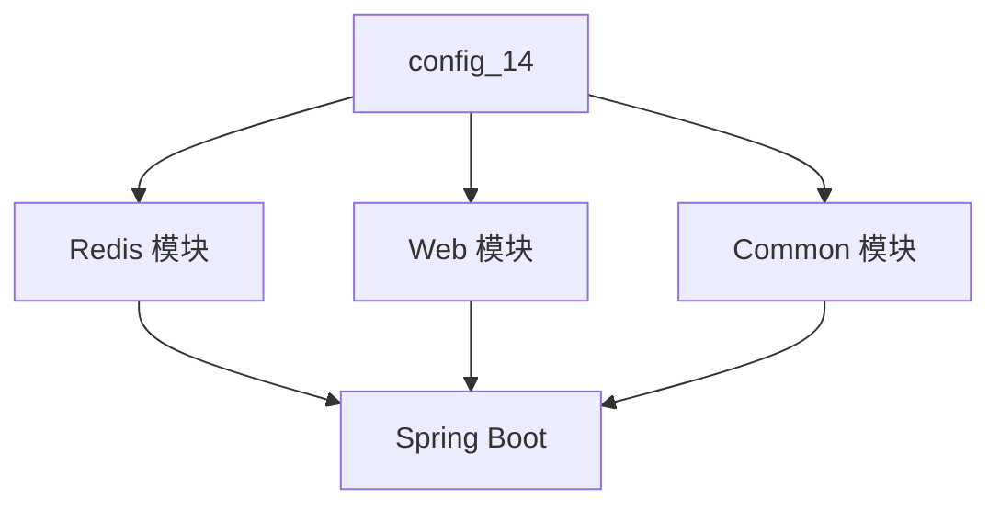
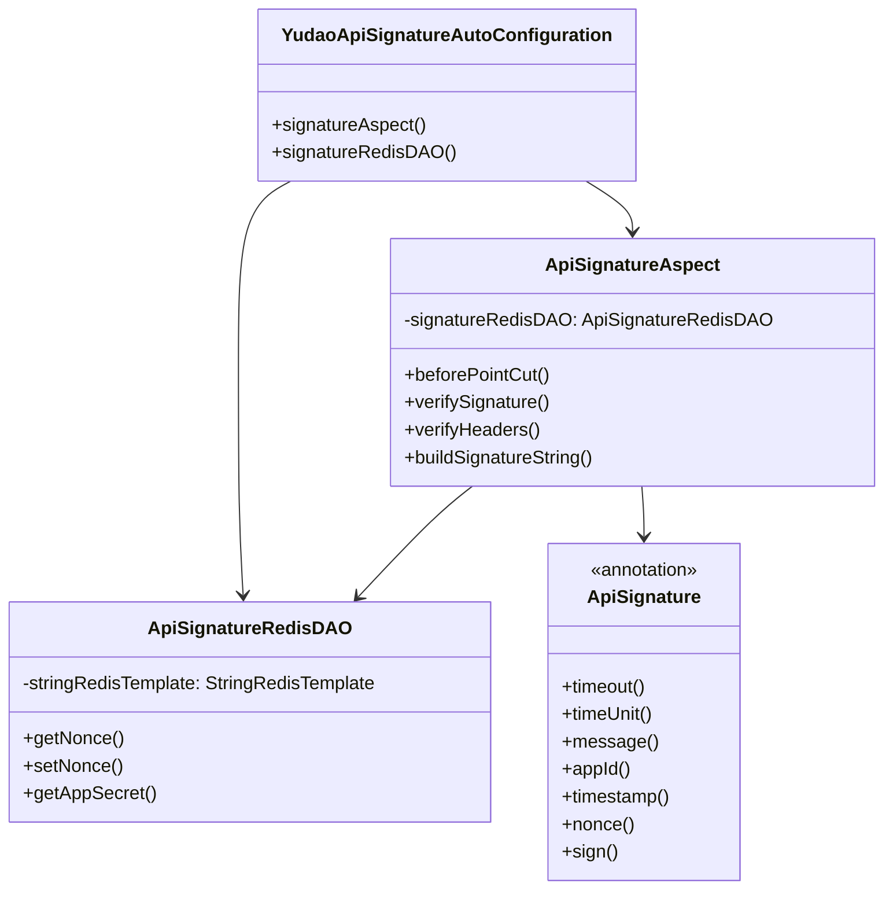
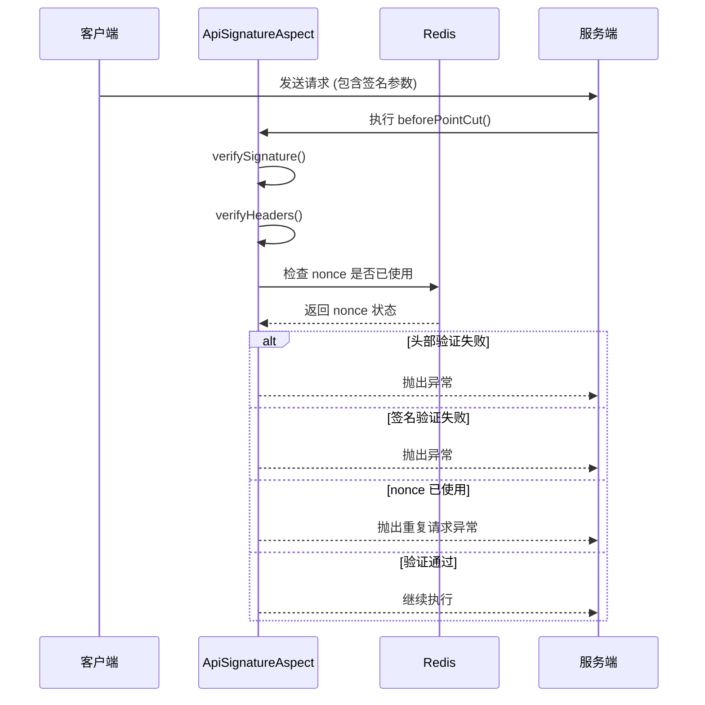

# config_14 模块 - API 签名验证模块

## 1. 模块概述

`config_14` 模块是 Yudao Framework 中的一个安全防护模块，专门用于实现 HTTP API 的签名验证机制。该模块通过 AOP（面向切面编程）的方式，在请求处理前对 API 请求进行签名验证，确保请求的合法性和安全性。

### 1.1 主要功能

- **API 签名验证**：验证请求的签名是否正确，防止请求被篡改
- **重放攻击防护**：通过 nonce 随机数机制防止重复请求
- **时间戳验证**：确保请求在有效时间窗口内
- **灵活配置**：支持自定义签名参数名称、超时时间等

### 1.2 核心组件

| 组件名称 | 类型 | 功能描述 |
|---------|------|----------|
| `YudaoApiSignatureAutoConfiguration` | 自动配置类 | 模块的自动配置入口，负责创建所需的 Bean |
| `ApiSignatureAspect` | AOP 切面 | 实现签名验证的切面逻辑 |
| `ApiSignatureRedisDAO` | Redis 数据访问对象 | 处理签名相关的 Redis 操作 |
| `ApiSignature` | 注解 | 标记需要签名验证的 API 接口 |

## 2. 架构设计

### 2.1 模块依赖关系



### 2.2 核心类关系图



## 3. 核心组件详解

### 3.1 YudaoApiSignatureAutoConfiguration

模块的自动配置类，负责创建签名验证所需的 Bean。

**主要功能：**
- 创建 `ApiSignatureAspect` 切面 Bean
- 创建 `ApiSignatureRedisDAO` Redis 数据访问对象 Bean

**代码位置：**
```
yudao-framework/yudao-spring-boot-starter-protection/src/main/java/cn/iocoder/yudao/framework/signature/config/YudaoApiSignatureAutoConfiguration.java
```

**关键代码：**
```java
@AutoConfiguration(after = YudaoRedisAutoConfiguration.class)
public class YudaoApiSignatureAutoConfiguration {

    @Bean
    public ApiSignatureAspect signatureAspect(ApiSignatureRedisDAO signatureRedisDAO) {
        return new ApiSignatureAspect(signatureRedisDAO);
    }

    @Bean
    public ApiSignatureRedisDAO signatureRedisDAO(StringRedisTemplate stringRedisTemplate) {
        return new ApiSignatureRedisDAO(stringRedisTemplate);
    }
}
```

### 3.2 ApiSignature 注解

用于标记需要签名验证的 API 接口或方法。

**主要属性：**

| 属性名 | 类型 | 默认值 | 描述 |
|--------|------|--------|------|
| `timeout` | int | 60 | 请求有效时间，单位取决于 `timeUnit` |
| `timeUnit` | TimeUnit | TimeUnit.SECONDS | 时间单位，支持秒、分钟等 |
| `message` | String | "签名不正确" | 签名失败时的提示信息 |
| `appId` | String | "appId" | 请求头中 appId 字段的名称 |
| `timestamp` | String | "timestamp" | 请求头中时间戳字段的名称 |
| `nonce` | String | "nonce" | 请求头中随机数字段的名称 |
| `sign` | String | "sign" | 请求头中签名字段的名称 |

**使用示例：**
```java
@RestController
@RequestMapping("/api")
public class DemoController {

    @GetMapping("/protected")
    @ApiSignature(
        timeout = 30,
        timeUnit = TimeUnit.SECONDS,
        message = "请求签名验证失败"
    )
    public ResponseEntity<String> protectedEndpoint() {
        return ResponseEntity.ok("This is a protected endpoint");
    }
}
```

### 3.3 ApiSignatureAspect

AOP 切面类，负责在请求处理前执行签名验证逻辑。

**主要方法：**

| 方法名 | 参数 | 返回值 | 描述 |
|--------|------|--------|------|
| `beforePointCut` | JoinPoint, ApiSignature | void | 切面入口方法，在目标方法执行前调用 |
| `verifySignature` | ApiSignature, HttpServletRequest | boolean | 完整的签名验证逻辑 |
| `verifyHeaders` | ApiSignature, HttpServletRequest | boolean | 请求头参数验证 |
| `buildSignatureString` | ApiSignature, HttpServletRequest, String | String | 构建服务端签名字符串 |

**验证流程：**



**核心验证逻辑：**

1. **请求头参数验证** (`verifyHeaders`):
   - 检查 `appId` 是否存在
   - 检查 `timestamp` 是否存在且在有效时间窗口内
   - 检查 `nonce` 是否至少 10 位
   - 检查 `sign` 是否存在
   - 检查 `nonce` 是否已被使用过

2. **签名验证** (`verifySignature`):
   - 从 Redis 获取 `appId` 对应的 `appSecret`
   - 构建服务端签名字符串（包含请求参数、请求体、请求头、密钥）
   - 计算服务端签名（SHA-256）
   - 比较客户端签名和服务端签名是否一致

3. **重放攻击防护** (`setNonce`):
   - 将 nonce 存入 Redis，设置过期时间为 `timeout * 2`
   - 防止相同请求在短时间内被重复使用

### 3.4 ApiSignatureRedisDAO

Redis 数据访问对象，负责与 Redis 交互，处理签名相关的数据操作。

**Redis 键设计：**

| 键名 | 类型 | 格式 | 描述 |
|------|------|------|------|
| `SIGNATURE_NONCE` | String | `api_signature_nonce:{appId}:{nonce}` | 存储 nonce，防止重放攻击 |
| `SIGNATURE_APPID` | Hash | `api_signature_app` | 存储 appId 和 appSecret 的映射关系 |

**主要方法：**

| 方法名 | 参数 | 返回值 | 描述 |
|--------|------|--------|------|
| `getNonce` | appId, nonce | String | 获取 nonce 的值 |
| `setNonce` | appId, nonce, time, timeUnit | Boolean | 设置 nonce，返回是否设置成功 |
| `getAppSecret` | appId | String | 获取 appId 对应的 appSecret |

## 4. 签名算法详解

### 4.1 签名字符串构建

签名字符串由四部分组成，按顺序拼接：

```
请求参数 + 请求体 + 请求头 + appSecret
```

**各部分详解：**

1. **请求参数（Query Parameters）**:
   - 所有请求参数按键名升序排序
   - 格式：`key1=value1&key2=value2`
   - 示例：`param1=value1&param2=value2`

2. **请求体（Request Body）**:
   - 请求体的原始内容
   - 如果为空，使用空字符串 `""`

3. **请求头（Headers）**:
   - 仅包含签名相关的头部参数：`appId`、`timestamp`、`nonce`
   - 按键名升序排序
   - 格式：`appId=xxx&timestamp=xxx&nonce=xxx`

4. **密钥（appSecret）**:
   - 从 Redis 获取的 appId 对应的密钥

**示例：**

假设请求如下：
```
GET /api/protected?param1=value1&param2=value2
Headers:
  appId: app123
  timestamp: 1678901234567
  nonce: abcdefghij1234567890
  sign: client_signature_here
Body: {"key":"value"}

AppSecret: my_secret_key
```

签名字符串将构建为：
```
param1=value1&param2=value2{"key":"value"}appId=app123&nonce=abcdefghij1234567890&timestamp=1678901234567my_secret_key
```

### 4.2 签名计算

1. 将签名字符串进行 SHA-256 哈希计算
2. 将哈希结果转换为十六进制字符串
3. 与客户端提供的 `sign` 头部进行比较

**客户端签名计算示例（伪代码）:**
```javascript
const signatureString = buildSignatureString(params, body, headers, appSecret);
const clientSignature = sha256Hex(signatureString);
```

## 5. 配置与使用

### 5.1 依赖配置

在项目的 `pom.xml` 中添加依赖：

```xml
<dependency>
    <groupId>cn.iocoder</groupId>
    <artifactId>yudao-spring-boot-starter-protection</artifactId>
    <version>${project.version}</version>
</dependency>
```

### 5.2 Redis 配置

确保 Redis 服务正常运行，并预先加载 appId 和 appSecret 的映射关系：

```bash
# 使用 Redis CLI 添加 appId 和 appSecret
HSET api_signature_app app123 my_secret_key
HSET api_signature_app app456 another_secret_key
```

### 5.3 API 使用示例

**客户端请求示例：**

```bash
# 1. 准备请求参数
PARAMS="param1=value1&param2=value2"

# 2. 构建签名字符串（客户端实现）
SIGNATURE_STRING="${PARAMS}{\"key\":\"value\"}appId=app123&nonce=abcdefghij&timestamp=$(date +%s%3N)my_secret_key"
CLIENT_SIGNATURE=$(echo -n "$SIGNATURE_STRING" | sha256sum | awk '{print $1}')

# 3. 发送请求
curl -X GET "http://localhost:8080/api/protected?${PARAMS}" \
  -H "appId: app123" \
  -H "timestamp: $(date +%s%3N)" \
  -H "nonce: abcdefghij" \
  -H "sign: ${CLIENT_SIGNATURE}"
```

**服务端响应示例：**

```json
{
  "code": 0,
  "message": "操作成功",
  "data": "This is a protected endpoint"
}
```

### 5.4 错误处理

**常见错误码：**

| 错误码 | 错误信息 | 说明 |
|--------|----------|------|
| 400 | 签名不正确 | 签名验证失败 |
| 400 | 请求签名验证失败 | 自定义错误信息 |
| 429 | 存在重复请求 | nonce 已被使用 |
| 408 | 请求超时 | timestamp 超出有效时间窗口 |

## 6. 安全最佳实践

### 6.1 密钥管理

1. **密钥生成**：
   - 使用足够长度的随机字符串（建议 32 位以上）
   - 使用密码学安全的随机数生成器

2. **密钥存储**：
   - 使用 Redis 存储 appId 和 appSecret 的映射
   - 设置合适的过期时间（或永不过期）
   - 定期轮换密钥

3. **密钥分发**：
   - 通过安全渠道分发给客户端
   - 使用 HTTPS 传输密钥

### 6.2 签名参数

1. **nonce 生成**：
   - 使用 UUID 或足够长的随机字符串
   - 确保每次请求的 nonce 不同
   - 建议长度至少 16 位

2. **timestamp 生成**：
   - 使用当前时间戳（毫秒或秒）
   - 确保客户端和服务端时间同步
   - 建议时间窗口为 30-60 秒

3. **签名参数名称**：
   - 使用不易猜测的参数名称
   - 避免使用常见名称如 `signature`、`token` 等

### 6.3 性能优化

1. **Redis 优化**：
   - 为 Redis 设置合适的内存限制
   - 监控 Redis 的内存使用和性能指标
   - 考虑使用 Redis 集群提高可用性

2. **缓存策略**：
   - 为 appSecret 设置合适的过期时间
   - 考虑使用本地缓存减少 Redis 访问

## 7. 与其他模块的集成

### 7.1 与 Redis 模块集成

`config_14` 模块依赖于 `config_15`（Redis 模块）来存储和管理签名相关的数据。

**依赖关系：**
- `YudaoApiSignatureAutoConfiguration` 使用 `@AutoConfiguration(after = YudaoRedisAutoConfiguration.class)` 确保 Redis 配置先加载
- `ApiSignatureRedisDAO` 使用 `StringRedisTemplate` 与 Redis 交互

### 7.2 与 Web 模块集成

`config_14` 模块通过 AOP 与 Web 模块集成，在 HTTP 请求处理前执行签名验证。

**集成点：**
- 使用 `@Before` 注解在目标方法执行前调用验证逻辑
- 通过 `ServletUtils` 获取 HTTP 请求对象

## 8. 扩展与自定义

### 8.1 自定义签名算法

可以通过扩展 `ApiSignatureAspect` 类来实现自定义的签名算法：

```java
public class CustomSignatureAspect extends ApiSignatureAspect {
    
    public CustomSignatureAspect(ApiSignatureRedisDAO signatureRedisDAO) {
        super(signatureRedisDAO);
    }
    
    @Override
    protected String buildSignatureString(ApiSignature signature, HttpServletRequest request, String appSecret) {
        // 自定义签名字符串构建逻辑
        return customBuildSignatureString(signature, request, appSecret);
    }
}
```

### 8.2 自定义 Redis 键前缀

可以通过扩展 `ApiSignatureRedisDAO` 类来自定义 Redis 键的前缀：

```java
public class CustomSignatureRedisDAO extends ApiSignatureRedisDAO {
    
    public CustomSignatureRedisDAO(StringRedisTemplate stringRedisTemplate) {
        super(stringRedisTemplate);
    }
    
    @Override
    protected String formatNonceKey(String appId, String nonce) {
        return String.format("custom_prefix:%s:%s", appId, nonce);
    }
}
```

## 9. 常见问题与解决方案

### 9.1 签名验证失败

**问题现象：** 客户端请求返回 400 错误，提示 "签名不正确"

**可能原因：**
1. 签名字符串构建不一致
2. 请求参数顺序不一致
3. 密钥不正确
4. 时间戳超出有效范围
5. nonce 已被使用

**解决方案：**
1. 检查客户端和服务端的签名字符串构建逻辑是否一致
2. 确保请求参数按键名升序排序
3. 验证 appId 对应的 appSecret 是否正确
4. 检查客户端和服务端的时间是否同步
5. 确保每次请求使用不同的 nonce

### 9.2 重放攻击仍然发生

**问题现象：** 相同的请求在短时间内被重复发送，但服务端未能正确拦截

**可能原因：**
1. Redis 中 nonce 的过期时间设置不当
2. Redis 连接问题导致 nonce 无法正确存储
3. 客户端重复使用相同的 nonce

**解决方案：**
1. 检查 `timeout * 2` 的过期时间设置是否合理
2. 验证 Redis 服务是否正常运行
3. 确保客户端生成足够随机的 nonce

### 9.3 性能问题

**问题现象：** 签名验证导致 API 响应时间变长

**可能原因：**
1. Redis 访问延迟
2. 签名字符串构建复杂
3. 并发请求量大

**解决方案：**
1. 优化 Redis 配置和性能
2. 考虑使用本地缓存减少 Redis 访问
3. 简化签名字符串构建逻辑
4. 使用 Redis 集群提高并发能力

## 10. 总结

`config_14` 模块提供了一套完整的 API 签名验证解决方案，通过 AOP 和 Redis 的结合，实现了请求的安全验证。该模块具有以下特点：

- **安全性高**：通过多重验证机制确保请求的合法性
- **灵活性强**：支持自定义签名参数、超时时间等配置
- **性能良好**：通过 Redis 缓存和本地缓存优化性能
- **易于集成**：与 Spring Boot 和 Yudao Framework 无缝集成
- **可扩展性强**：支持自定义签名算法和 Redis 键策略

通过合理使用 `config_14` 模块，可以有效防止 API 滥用、重放攻击等安全问题，保护系统的安全性和稳定性。

## 11. 参考文档

- [Yudao Framework 官方文档](https://doc.iocoder.cn/)
- [Spring AOP 官方文档](https://docs.spring.io/spring-framework/docs/current/reference/html/core.html#aop)
- [Redis 官方文档](https://redis.io/docs/)
- [SHA-256 算法详解](https://en.wikipedia.org/wiki/SHA-2)