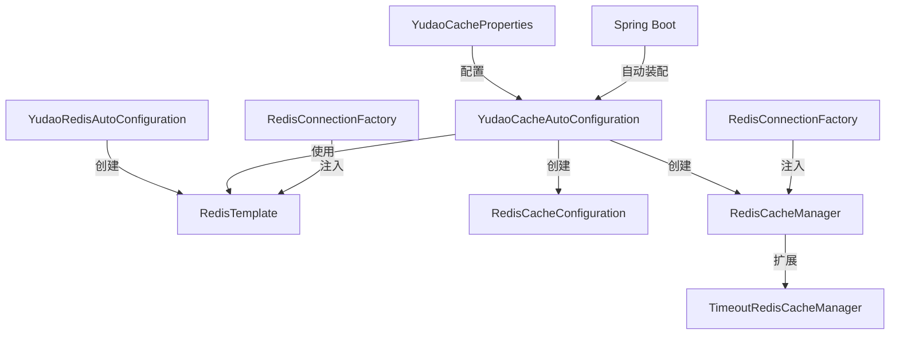

# config_15 模块文档

## 模块概述

`config_15` 模块是 Yudao Framework 中专门用于 Redis 缓存管理的核心模块。该模块提供了基于 Redis 的缓存自动配置、Redis 连接管理和自定义缓存管理器等功能，为整个系统提供高效的缓存解决方案。

主要特性包括：
- Redis 连接配置和自动化配置
- 支持 JSON 序列化的 RedisTemplate
- 自定义缓存管理器，支持自定义过期时间
- 缓存键前缀策略优化
- 批量缓存操作支持

## 架构设计

### 模块结构

```
config_15 (yudao-spring-boot-starter-redis)
├── config
│   ├── YudaoCacheAutoConfiguration.java      # 缓存自动配置类
│   ├── YudaoCacheProperties.java            # 缓存配置属性
│   └── YudaoRedisAutoConfiguration.java     # Redis 自动配置类
└── core
    └── TimeoutRedisCacheManager.java        # 自定义缓存管理器
```

### 核心组件关系



## 核心组件详解

### 1. YudaoRedisAutoConfiguration

Redis 自动配置类，负责创建和配置 RedisTemplate。

```java
@AutoConfiguration(before = RedissonAutoConfigurationV4.class)
public class YudaoRedisAutoConfiguration {
    @Bean
    public RedisTemplate<String, Object> redisTemplate(RedisConnectionFactory factory) {
        // 创建 RedisTemplate 对象
        RedisTemplate<String, Object> template = new RedisTemplate<>();
        template.setConnectionFactory(factory);
        // 设置序列化器
        template.setKeySerializer(RedisSerializer.string());
        template.setHashKeySerializer(RedisSerializer.string());
        RedisSerializer<?> redisSerializer = buildRedisSerializer();
        template.setValueSerializer(redisSerializer);
        template.setHashValueSerializer(redisSerializer);
        return template;
    }
    
    public static RedisSerializer<?> buildRedisSerializer() {
        return RedisSerializer.json();
    }
}
```

**主要功能：**
- 创建 RedisTemplate Bean
- 配置 Redis 连接工厂
- 设置键和值的序列化方式（使用 JSON 序列化）
- 在 Spring Boot 启动时自动装配

### 2. YudaoCacheAutoConfiguration

缓存自动配置类，负责创建缓存管理器和缓存配置。

```java
@AutoConfiguration
@EnableConfigurationProperties({CacheProperties.class, YudaoCacheProperties.class})
@EnableCaching
public class YudaoCacheAutoConfiguration {
    @Bean
    @Primary
    public RedisCacheConfiguration redisCacheConfiguration(CacheProperties cacheProperties) {
        // 配置缓存前缀策略
        // 配置序列化方式
        // 配置缓存属性（过期时间、空值处理等）
    }
    
    @Bean
    public RedisCacheManager redisCacheManager(RedisTemplate<String, Object> redisTemplate,
                                               RedisCacheConfiguration redisCacheConfiguration,
                                               YudaoCacheProperties yudaoCacheProperties) {
        // 创建 RedisCacheWriter
        // 创建 TimeoutRedisCacheManager
        // 开启事务感知
    }
}
```

**主要功能：**
- 创建 RedisCacheConfiguration Bean
- 配置缓存键前缀策略（使用单冒号避免 Redis Desktop Manager 显示问题）
- 创建 RedisCacheManager Bean
- 支持缓存属性配置（过期时间、空值处理、键前缀等）

### 3. TimeoutRedisCacheManager

自定义缓存管理器，支持自定义过期时间。

```java
public class TimeoutRedisCacheManager extends RedisCacheManager {
    @Override
    protected RedisCache createRedisCache(String name, RedisCacheConfiguration cacheConfig) {
        // 支持 cacheNames 格式为 "key#ttl" 的自定义过期时间
        // 解析过期时间并修改 cacheConfig
        // 创建 RedisCache 对象
    }
    
    private Duration parseDuration(String ttlStr) {
        // 解析过期时间字符串（支持 d 天、h 小时、m 分钟、s 秒）
    }
}
```

**主要功能：**
- 支持在 `@Cacheable` 注解中使用 `cacheNames = "key#ttl"` 格式指定过期时间
- 支持多种时间单位（天、小时、分钟、秒）
- 事务感知：在事务提交后自动清除缓存，避免并发问题

### 4. YudaoCacheProperties

缓存配置属性类，用于外部化配置。

```java
@ConfigurationProperties("yudao.cache")
@Data
@Validated
public class YudaoCacheProperties {
    private Integer redisScanBatchSize = 30;
}
```

**主要配置项：**
- `yudao.cache.redis-scan-batch-size`: Redis scan 操作的批量大小，默认值为 30

## 数据流图

```mermaid
flowchart TD
    A[应用程序] -->|@Cacheable| B[TimeoutRedisCacheManager]
    B -->|创建缓存| C[RedisCache]
    C -->|存储数据| D[Redis Server]
    
    E[应用程序] -->|@CacheEvict| B
    B -->|删除缓存| C
    
    F[配置中心] -->|配置属性| G[YudaoCacheProperties]
    G -->|影响| C
    
    H[Redis连接] -->|提供连接| I[RedisTemplate]
    I -->|序列化数据| C
```

## 使用示例

### 1. 基本缓存使用

```java
@Service
public class UserService {
    
    @Cacheable(value = "user", key = "#userId")
    public User getUserById(Long userId) {
        // 查询数据库
        return userMapper.selectById(userId);
    }
    
    @CacheEvict(value = "user", key = "#userId")
    public void updateUser(User user) {
        // 更新数据库
        userMapper.updateById(user);
    }
}
```

### 2. 自定义过期时间

```java
@Service
public class ProductService {
    
    @Cacheable(value = "product#1h", key = "#productId")
    public Product getProductById(Long productId) {
        // 查询数据库
        return productMapper.selectById(productId);
    }
    
    @Cacheable(value = "product#1d", key = "#productId")
    public Product getProductByIdWithLongCache(Long productId) {
        // 查询数据库，缓存1天
        return productMapper.selectById(productId);
    }
}
```

### 3. 配置示例

```yaml
# application.yml
spring:
  redis:
    host: 127.0.0.1
    port: 6379
    password: 123456
    
# 自定义缓存配置
yudao:
  cache:
    redis-scan-batch-size: 50
```

## 与其他模块的集成

### 1. Spring Boot 集成

- 自动装配 Redis 连接和缓存管理器
- 与 Spring Cache 抽象层无缝集成
- 支持 Spring Boot 的自动配置机制

### 2. 与数据访问层集成

- 通过 RedisTemplate 与 Redis Server 交互
- 支持 Redis 的各种数据结构操作
- 与 Spring Data Redis 无缝集成

### 3. 与监控模块集成

- 通过 Redis 连接监控 Redis Server 状态
- 支持缓存命中率、响应时间等监控指标

## 性能优化

### 1. 序列化优化

- 使用 JSON 序列化，支持复杂对象缓存
- 支持 Java 8+ 的时间类型序列化

### 2. 缓存键策略

- 使用单冒号作为分隔符，避免 Redis Desktop Manager 显示问题
- 支持自定义键前缀

### 3. 批量操作

- 支持 Redis scan 批量操作
- 可配置批量大小，优化性能

## 配置说明

### application.yml 配置示例

```yaml
spring:
  redis:
    # Redis 连接配置
    host: 127.0.0.1
    port: 6379
    password: yourpassword
    database: 0
    
    # 连接池配置
    lettuce:
      pool:
        max-active: 8
        max-idle: 8
        min-idle: 0
        max-wait: -1ms
    
# 自定义缓存配置
yudao:
  cache:
    # Redis scan 批量大小，默认30
    redis-scan-batch-size: 50
```

### 缓存注解使用说明

| 注解 | 说明 | 示例 |
|------|------|------|
| `@Cacheable` | 缓存数据 | `@Cacheable(value = "user", key = "#userId")` |
| `@CachePut` | 更新缓存 | `@CachePut(value = "user", key = "#user.id")` |
| `@CacheEvict` | 删除缓存 | `@CacheEvict(value = "user", key = "#userId")` |
| `@Caching` | 组合多个缓存操作 | `@Caching(evict = {@CacheEvict(...)})` |

## 最佳实践

### 1. 合理设置过期时间

根据数据的更新频率和重要性设置合适的过期时间：
- 热点数据：1-5 分钟
- 一般数据：1 小时 - 1 天
- 不常变化的数据：1 天 - 7 天

### 2. 使用合适的缓存键

- 使用有意义的键名，便于管理和监控
- 对于复杂查询，可以使用查询参数作为键的一部分

### 3. 处理缓存穿透

- 对于可能的空值，使用 `@Cacheable(cacheNames = "key#ttl", unless = "#result == null")`
- 考虑使用布隆过滤器预先过滤不存在的键

### 4. 缓存更新策略

- 对于数据一致性要求高的场景，考虑使用 `@CacheEvict` 手动清除缓存
- 对于数据一致性要求不高的场景，可以使用自动过期策略

## 常见问题

### 1. 缓存雪崩

**问题：** 大量缓存同时过期，导致数据库压力骤增。

**解决方案：**
- 设置不同的过期时间，避免同时过期
- 使用 `@Cacheable(cacheNames = "key#ttl", key = "#root.methodName")` 为每个方法设置不同的缓存键

### 2. 缓存穿透

**问题：** 查询不存在的数据，导致缓存和数据库都被穿透访问。

**解决方案：**
- 对于可能的空值，使用 `unless = "#result == null"` 排除空值缓存
- 考虑使用布隆过滤器预先过滤不存在的键

### 3. 缓存与数据库一致性

**问题：** 缓存和数据库数据不一致。

**解决方案：**
- 对于强一致性要求，使用 `@CacheEvict` 手动清除缓存
- 对于最终一致性，可以使用自动过期策略
- 考虑使用消息队列异步更新缓存

## 监控与维护

### 1. 监控指标

- 缓存命中率：`cacheHitRatio = cacheHits / (cacheHits + cacheMisses)`
- 缓存响应时间
- 缓存使用量（内存占用）
- 缓存过期统计

### 2. 常用命令

```bash
# 查看所有缓存键
redis-cli KEYS "*"

# 查看特定缓存的过期时间
redis-cli TTL "cache:key"

# 清除特定缓存
redis-cli DEL "cache:key"

# 查看内存使用情况
redis-cli INFO memory
```

## 扩展性

### 1. 支持多种 Redis 客户端

- 支持 Lettuce 和 Jedis 等 Redis 客户端
- 通过 Spring Data Redis 抽象层实现

### 2. 自定义序列化器

可以通过扩展 `RedisSerializer` 接口实现自定义序列化器：

```java
@Bean
public RedisSerializer<?> customRedisSerializer() {
    return new CustomRedisSerializer();
}
```

### 3. 支持分布式缓存

可以通过配置多个 Redis 实例实现分布式缓存：

```yaml
spring:
  redis:
    primary:
      host: 127.0.0.1
      port: 6379
    secondary:
      host: 192.168.1.2
      port: 6379
```

## 安全性

### 1. 连接安全

- 支持 Redis 密码认证
- 支持 SSL/TLS 加密连接

### 2. 数据安全

- 支持 Redis 数据加密（需要配置合适的序列化器）
- 建议在生产环境中使用 Redis 6.0+ 并启用 ACL

## 总结

`config_15` 模块为 Yudao Framework 提供了完整的 Redis 缓存解决方案，包括：

1. **自动配置**：基于 Spring Boot 的自动配置机制，简化 Redis 集成
2. **高性能**：使用 JSON 序列化，支持复杂对象缓存
3. **灵活性**：支持自定义过期时间，满足不同场景需求
4. **可靠性**：事务感知，避免并发问题
5. **可扩展性**：支持多种 Redis 客户端和序列化方式

该模块广泛应用于 Yudao Framework 的各个子系统中，为系统提供高效的缓存支持，提升系统性能和响应速度。

## 参考文档

- [Spring Boot Cache 官方文档](https://docs.spring.io/spring-boot/docs/current/reference/html/features.html#features.caching)
- [Spring Data Redis 官方文档](https://docs.spring.io/spring-data/redis/docs/current/reference/html/)
- [Redis 官方文档](https://redis.io/docs/)
- [芋道 Spring Boot Cache 入门](yudao-framework/yudao-spring-boot-starter-redis/《芋道 Spring Boot Cache 入门》.md)
- [芋道 Spring Boot Redis 入门](yudao-framework/yudao-spring-boot-starter-redis/《芋道 Spring Boot Redis 入门》.md)