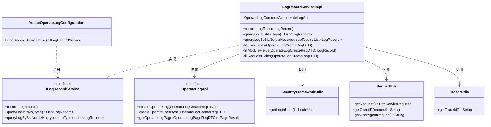
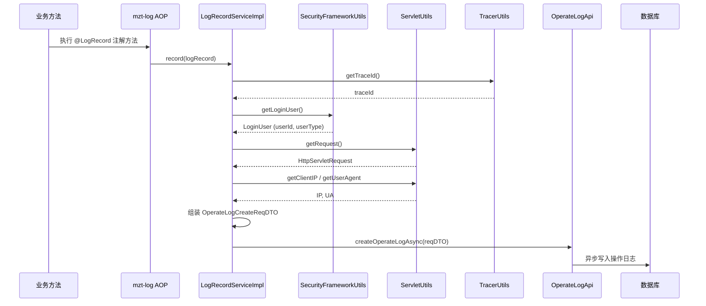

# config_16 — 操作日志自动配置模块

## 概述

`config_16` 模块是 yudao 框架中 **操作日志（OperateLog）** 功能的自动配置入口，位于 `yudao-spring-boot-starter-security` 启动器中。该模块基于 [mzt-log](https://github.com/mouzt/mzt-biz-log)（`@EnableLogRecord`）开源组件，通过 Spring Boot 自动装配机制，将操作日志的记录能力无缝集成到整个系统中。

核心职责：
- **启用操作日志注解能力**：通过 `@EnableLogRecord` 激活 `@LogRecord` 注解的 AOP 拦截功能
- **注册日志记录服务**：提供 `ILogRecordService` 的默认实现 `LogRecordServiceImpl`，将日志数据异步写入数据库
- **桥接框架与业务**：连接 mzt-log 的日志记录接口与 yudao 的 `OperateLogApi`，实现日志的持久化

## 架构设计

### 模块定位

`config_16` 是操作日志功能的"配置中枢"，它本身代码量极少，但承担了关键的 **装配与桥接** 职责：

```mermaid
graph TB
    subgraph 业务层
        A[业务 Service] -->|@LogRecord 注解| B[mzt-log AOP 拦截器]
    end
    
    subgraph config_16 模块
        C[YudaoOperateLogConfiguration]
        D[LogRecordServiceImpl]
    end
    
    subgraph 框架基础设施
        E[SecurityFrameworkUtils]
        F[ServletUtils]
        G[TracerUtils]
    end
    
    subgraph 系统模块
        H[OperateLogApi]
        I[OperateLogService]
        J[(操作日志数据库)]
    end
    
    C -->|@EnableLogRecord| B
    C -->|注册 Bean| D
    B -->|回调 record| D
    D -->|获取用户信息| E
    D -->|获取请求信息| F
    D -->|获取 TraceId| G
    D -->|异步写入| H
    H --> I
    I --> J
```

### 核心组件关系



---

## 核心组件详解

### 1. YudaoOperateLogConfiguration（自动配置类）

**文件路径**：`yudao-framework/yudao-spring-boot-starter-security/src/main/java/cn/iocoder/yudao/framework/operatelog/config/YudaoOperateLogConfiguration.java`

**职责**：操作日志功能的自动配置入口。

**关键注解**：

| 注解 | 说明 |
|------|------|
| `@EnableLogRecord(tenant = "")` | 启用 mzt-log 的 `@LogRecord` 注解能力。`tenant` 参数置空，因为 yudao 使用自己的多租户方案 |
| `@AutoConfiguration` | Spring Boot 3.x 自动配置声明，替代旧版 `@Configuration` + `spring.factories` |
| `@Slf4j` | Lombok 日志门面 |

**注册的 Bean**：

| Bean | 类型 | 说明 |
|------|------|------|
| `iLogRecordServiceImpl` | `ILogRecordService` | 标记 `@Primary`，覆盖 mzt-log 默认实现，将日志写入 yudao 的 `OperateLogApi` |

---

### 2. LogRecordServiceImpl（日志记录服务实现）

**文件路径**：`yudao-framework/yudao-spring-boot-starter-security/src/main/java/cn/iocoder/yudao/framework/operatelog/core/service/LogRecordServiceImpl.java`

**职责**：实现 `ILogRecordService` 接口，将 mzt-log 拦截到的操作日志转换为 yudao 系统的 `OperateLogCreateReqDTO`，并通过 `OperateLogApi` 异步持久化。

#### 核心方法：`record(LogRecord logRecord)`

**数据流**：



#### 字段填充逻辑

`record()` 方法通过三个私有方法完成 DTO 字段填充：

| 方法 | 填充字段 | 数据来源 |
|------|---------|---------|
| `fillUserFields` | `userId`, `userType` | `SecurityFrameworkUtils.getLoginUser()` — 从 Spring Security 上下文获取当前登录用户 |
| `fillModuleFields` | `type`, `subType`, `bizId`, `action`, `extra` | `LogRecord` 对象 — 来自 `@LogRecord` 注解的配置 |
| `fillRequestFields` | `requestMethod`, `requestUrl`, `userIp`, `userAgent` | `ServletUtils.getRequest()` — 从当前 HTTP 请求中提取 |

#### 异常处理

`record()` 方法使用 `try-catch(Throwable)` 包裹整个逻辑，确保操作日志记录失败不会影响主业务流程。异常仅通过 `log.error` 输出，便于排查。

#### 查询方法

`queryLog()` 和 `queryLogByBizNo()` 方法直接抛出 `UnsupportedOperationException`，引导调用方使用 `OperateLogApi` 进行日志查询，保持职责单一。

---

## 与外部模块的依赖关系

```mermaid
graph LR
    subgraph config_16
        CFG[YudaoOperateLogConfiguration]
        SVC[LogRecordServiceImpl]
    end
    
    subgraph 框架层
        SEC[SecurityFrameworkUtils<br/>config_17]
        SVT[ServletUtils<br/>servlet]
        TRC[TracerUtils<br/>monitor]
    end
    
    subgraph 系统模块
        API[OperateLogApi<br/>system]
        SYS_SVC[OperateLogService<br/>system]
    end
    
    subgraph 业务模块
        CRM[CrmOperateLog<br/>crm]
        SYS_LOG[SysOperateLog<br/>system]
    end
    
    SVC --> SEC
    SVC --> SVT
    SVC --> TRC
    SVC --> API
    API --> SYS_SVC
    CRM -->|@LogRecord| SVC
    SYS_LOG -->|@LogRecord| SVC
```

### 依赖说明

| 依赖模块 | 文档引用 | 使用方式 |
|---------|---------|---------|
| `SecurityFrameworkUtils` | [config_17](config_17.md) | 获取当前登录用户信息（userId, userType） |
| `ServletUtils` | [servlet](servlet.md) | 获取 HTTP 请求信息（URL, IP, UA, Method） |
| `TracerUtils` | [monitor](monitor.md) | 获取 OpenTelemetry 链路追踪 ID |
| `OperateLogApi` | system 模块 | 异步写入操作日志到数据库 |

### 业务模块集成

各业务模块通过 `@LogRecord` 注解声明操作日志，例如：

- **CRM 模块**：`CrmCustomerParseFunction`、`CrmBusinessParseFunction` 等（参见 [core_5](core_5.md)）
- **System 模块**：`DeptParseFunction`、`AdminUserParseFunction` 等（参见 [core_8](core_8.md)）

这些 `ParseFunction` 用于将 `@LogRecord` 中的模板变量（如 `{{#customerName}}`）解析为实际值。

---

## 配置与使用

### 启用操作日志

`YudaoOperateLogConfiguration` 通过 `@AutoConfiguration` 自动生效，无需手动配置。其生效条件由 Spring Boot 的 `spring.factories` 或 `AutoConfiguration.imports` 文件控制。

### 在业务代码中使用

```java
@LogRecord(
    type = "CRM_CLUE",           // 大模块类型
    subType = "TRANSFER",        // 操作名称
    bizNo = "{{#clueId}}",       // 业务编号
    action = "将线索从 {{#oldOwner}} 转移给 {{#newOwner}}",
    extra = "{\"clueId\": {{#clueId}}}"
)
public void transferClue(Long clueId, String oldOwner, String newOwner) {
    // 业务逻辑
}
```

### 日志记录流程

1. mzt-log AOP 拦截 `@LogRecord` 注解方法
2. 解析 SpEL 表达式，生成 `LogRecord` 对象
3. 调用 `LogRecordServiceImpl.record()` 
4. 填充用户、请求、模块信息
5. 通过 `OperateLogApi.createOperateLogAsync()` 异步写入数据库

---

## 关键设计决策

1. **异步写入**：日志记录通过 `@Async` 异步执行，不阻塞主业务流程
2. **异常隔离**：日志记录失败不影响业务，仅打印 error 日志
3. **职责分离**：`LogRecordServiceImpl` 只负责日志写入，查询功能由 `OperateLogApi` 提供
4. **@Primary 覆盖**：通过 `@Primary` 注解覆盖 mzt-log 默认的 `ILogRecordService` 实现，无缝集成
5. **多租户兼容**：`@EnableLogRecord(tenant = "")` 传入空字符串，因为 yudao 使用自己的多租户方案（参见 [config_2](config_2.md)）