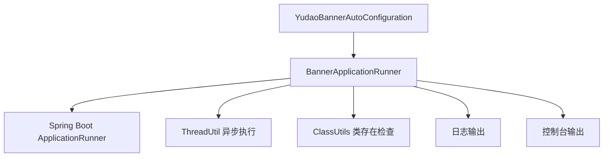
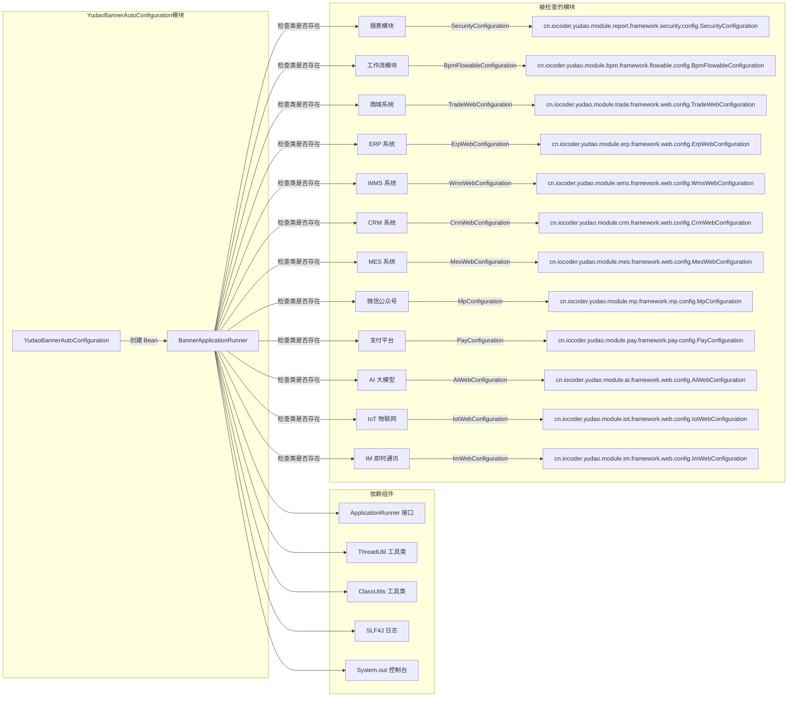
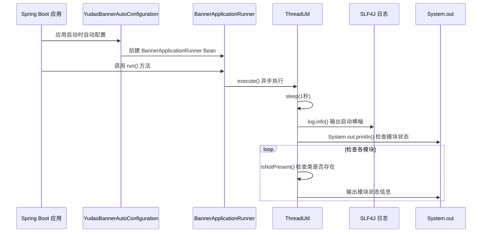

# YudaoBannerAutoConfiguration 模块文档

## 概述

YudaoBannerAutoConfiguration 是 Yudao 框架中的一个 Spring Boot 自动配置模块，负责在应用启动时显示横幅信息和检查各个功能模块的启用状态。该模块通过创建 BannerApplicationRunner Bean 来实现应用启动时的信息展示功能。

## 核心功能

1. **应用启动横幅显示**：在 Spring Boot 应用启动完成后，显示项目启动成功的信息，包括接口文档、开发文档和视频教程链接
2. **模块状态检查**：检查 Yudao 框架中各个功能模块的启用状态，并输出相应的提示信息
3. **异步执行**：使用线程池异步执行横幅显示和模块检查，避免阻塞应用启动过程

## 架构设计

### 模块结构



### 组件关系



## 详细设计

### YudaoBannerAutoConfiguration

```java
@AutoConfiguration
public class YudaoBannerAutoConfiguration {

    @Bean
    public BannerApplicationRunner bannerApplicationRunner() {
        return new BannerApplicationRunner();
    }

}
```

**职责**：
- 通过 `@AutoConfiguration` 注解声明为 Spring Boot 自动配置类
- 通过 `@Bean` 方法创建并注册 `BannerApplicationRunner` 实例到 Spring 容器

**设计要点**：
- 最小化配置：仅包含必要的 Bean 定义
- 遵循 Spring Boot 自动配置约定：类名以 `AutoConfiguration` 结尾
- 无需额外条件：始终创建 BannerApplicationRunner Bean

### BannerApplicationRunner

```java
@Slf4j
public class BannerApplicationRunner implements ApplicationRunner {

    @Override
    public void run(ApplicationArguments args) {
        ThreadUtil.execute(() -> {
            ThreadUtil.sleep(1, TimeUnit.SECONDS); // 延迟 1 秒，保证输出到结尾
            log.info("\n----------------------------------------------------------\n\t" +
                            "项目启动成功！\n\t" +
                            "接口文档: \t{} \n\t" +
                            "开发文档: \t{} \n\t" +
                            "视频教程: \t{} \n" +
                            "----------------------------------------------------------",
                    "https://doc.iocoder.cn/api-doc/",
                    "https://doc.iocoder.cn",
                    "https://t.zsxq.com/02Yf6M7Qn");

            // 数据报表
            if (isNotPresent("cn.iocoder.yudao.module.report.framework.security.config.SecurityConfiguration")) {
                System.out.println("[报表模块 yudao-module-report - 已禁用][参考 https://doc.iocoder.cn/report/ 开启]");
            }
            // 工作流
            if (isNotPresent("cn.iocoder.yudao.module.bpm.framework.flowable.config.BpmFlowableConfiguration")) {
                System.out.println("[工作流模块 yudao-module-bpm - 已禁用][参考 https://doc.iocoder.cn/bpm/ 开启]");
            }
            // 商城系统
            if (isNotPresent("cn.iocoder.yudao.module.trade.framework.web.config.TradeWebConfiguration")) {
                System.out.println("[商城系统 yudao-module-mall - 已禁用][参考 https://doc.iocoder.cn/mall/build/ 开启]");
            }
            // ERP 系统
            if (isNotPresent("cn.iocoder.yudao.module.erp.framework.web.config.ErpWebConfiguration")) {
                System.out.println("[ERP 系统 yudao-module-erp - 已禁用][参考 https://doc.iocoder.cn/erp/build/ 开启]");
            }
            // WMS 仓库管理系统
            if (isNotPresent("cn.iocoder.yudao.module.wms.framework.web.config.WmsWebConfiguration")) {
                System.out.println("[WMS 仓库管理系统 yudao-module-wms - 已禁用][参考 https://doc.iocoder.cn/wms/build/ 开启]");
            }
            // CRM 系统
            if (isNotPresent("cn.iocoder.yudao.module.crm.framework.web.config.CrmWebConfiguration")) {
                System.out.println("[CRM 系统 yudao-module-crm - 已禁用][参考 https://doc.iocoder.cn/crm/build/ 开启]");
            }
            // MES 系统
            if (isNotPresent("cn.iocoder.yudao.module.mes.framework.web.config.MesWebConfiguration")) {
                System.out.println("[MES 系统 yudao-module-mes - 已禁用][参考 https://doc.iocoder.cn/mes/build/ 开启]");
            }
            // 微信公众号
            if (isNotPresent("cn.iocoder.yudao.module.mp.framework.mp.config.MpConfiguration")) {
                System.out.println("[微信公众号 yudao-module-mp - 已禁用][参考 https://doc.iocoder.cn/mp/build/ 开启]");
            }
            // 支付平台
            if (isNotPresent("cn.iocoder.yudao.module.pay.framework.pay.config.PayConfiguration")) {
                System.out.println("[支付系统 yudao-module-pay - 已禁用][参考 https://doc.iocoder.cn/pay/build/ 开启]");
            }
            // AI 大模型
            if (isNotPresent("cn.iocoder.yudao.module.ai.framework.web.config.AiWebConfiguration")) {
                System.out.println("[AI 大模型 yudao-module-ai - 已禁用][参考 https://doc.iocoder.cn/ai/build/ 开启]");
            }
            // IoT 物联网
            if (isNotPresent("cn.iocoder.yudao.module.iot.framework.web.config.IotWebConfiguration")) {
                System.out.println("[IoT 物联网 yudao-module-iot - 已禁用][参考 https://doc.iocoder.cn/iot/build/ 开启]");
            }
            // IM 即时通讯
            if (isNotPresent("cn.iocoder.yudao.module.im.framework.web.config.ImWebConfiguration")) {
                System.out.println("[IM 即时通讯 yudao-module-im - 已禁用][参考 https://doc.iocoder.cn/im/build/ 开启]");
            }
        });
    }

    private static boolean isNotPresent(String className) {
        return !ClassUtils.isPresent(className, ClassUtils.getDefaultClassLoader());
    }

}
```

**职责**：
- 实现 `ApplicationRunner` 接口，在 Spring Boot 应用启动完成后执行
- 使用线程池异步执行启动信息显示和模块状态检查
- 输出项目启动成功的横幅信息
- 检查各功能模块的配置类是否存在，输出相应的启用/禁用状态

**关键实现细节**：
1. **异步执行**：使用 `ThreadUtil.execute()` 确保启动过程不被阻塞
2. **延迟处理**：`ThreadUtil.sleep(1, TimeUnit.SECONDS)` 确保日志输出完整
3. **日志输出**：使用 SLF4J 输出格式化的启动横幅信息
4. **控制台输出**：使用 `System.out.println()` 输出模块状态检查结果
5. **类存在检查**：通过 `ClassUtils.isPresent()` 检查各模块的关键配置类是否存在于 classpath

## 依赖关系

### 内部依赖
- `BannerApplicationRunner`：核心实现类，负责实际的启动信息显示和模块检查

### 外部依赖
- Spring Boot 框架：`@AutoConfiguration`, `ApplicationRunner`, `ApplicationArguments`
- 日志框架：SLF4J (`@Slf4j` 注解)
- 工具类：`ThreadUtil` (线程操作), `ClassUtils` (类存在检查)
- Yudao 框架各模块的配置类：用于检查模块是否启用

### 被动依赖（被其他模块依赖）
此模块通常不会被其他业务模块直接依赖，而是作为框架基础设施的一部分自动加载。

## 接口说明

### YudaoBannerAutoConfiguration

#### 方法：bannerApplicationRunner()
```java
@Bean
public BannerApplicationRunner bannerApplicationRunner()
```
- **说明**：创建并返回 BannerApplicationRunner 实例
- **返回值**：BannerApplicationRunner 对象
- **Spring 角色**：Bean 定义方法，由 Spring 容器管理

### BannerApplicationRunner

#### 方法：run(ApplicationArguments args)
```java
@Override
public void run(ApplicationArguments args)
```
- **说明**：Spring Boot 应用启动完成后的回调方法
- **参数**：
  - `args`: 应用启动参数
- **实现细节**：
  1. 异步执行启动信息显示和模块检查
  2. 延迟 1 秒确保日志完整输出
  3. 输出项目启动成功横幅（包含文档链接）
  4. 检查 12 个功能模块的状态并输出相应提示

#### 方法：isNotPresent(String className)
```java
private static boolean isNotPresent(String className)
```
- **说明**：检查指定类是否不存在于 classpath
- **参数**：
  - `className`: 要检查的全限定类名
- **返回值**：
  - `true`: 类不存在
  - `false`: 类存在
- **实现**：使用 Spring 的 `ClassUtils.isPresent()` 方法

## 工作流程



## 配置说明

### 自动生效条件
- 此配置类由 `@AutoConfiguration` 注解标记
- 在 Spring Boot 应用启动时，只要该类在 classpath 中且没有被排除，就会自动生效
- 无需额外的配置属性或条件

### 无需手动配置
- 模块完全通过自动配置机制工作
- 用户无需在 application.yml 或 application.properties 中进行任何配置
- 模块的行为完全由代码逻辑决定

## 使用场景

1. **项目启动提示**：在开发和生产环境中，提供清晰的项目启动成功信息
2. **模块状态监控**：帮助开发者快速了解哪些功能模块已启用，哪些被禁用
3. **文档引导**：提供官方文档链接，方便开发者快速获取帮助信息
4. **故障排查**：当某些功能不可用时，可以快速定位是否是由于对应模块未启用

## 与其他模块的关系

### 被动检查的模块
YudaoBannerAutoConfiguration 会检查以下模块的关键配置类是否存在：

| 模块名称 | 检查的配置类 | 对应文档链接 |
|---------|-------------|-------------|
| 报表模块 | SecurityConfiguration | https://doc.iocoder.cn/report/ |
| 工作流模块 | BpmFlowableConfiguration | https://doc.iocoder.cn/bpm/ |
| 商城系统 | TradeWebConfiguration | https://doc.iocoder.cn/mall/build/ |
| ERP 系统 | ErpWebConfiguration | https://doc.iocoder.cn/erp/build/ |
| WMS 仓库管理系统 | WmsWebConfiguration | https://doc.iocoder.cn/wms/build/ |
| CRM 系统 | CrmWebConfiguration | https://doc.iocoder.cn/crm/build/ |
| MES 系统 | MesWebConfiguration | https://doc.iocoder.cn/mes/build/ |
| 微信公众号 | MpConfiguration | https://doc.iocoder.cn/mp/build/ |
| 支付平台 | PayConfiguration | https://doc.iocoder.cn/pay/build/ |
| AI 大模型 | AiWebConfiguration | https://doc.iocoder.cn/ai/build/ |
| IoT 物联网 | IotWebConfiguration | https://doc.iocoder.cn/iot/build/ |
| IM 即时通讯 | ImWebConfiguration | https://doc.iocoder.cn/im/build/ |

注意：此模块仅检查这些模块的存在状态，不与它们建立直接依赖关系。

## 性能考虑

1. **异步执行**：启动信息显示和模块检查在单独线程中执行，不会延长应用启动时间
2. **最小延迟**：仅延迟 1 秒以确保日志输出完整，对启动时间影响可忽略不计
3. **轻量级检查**：类存在检查是轻量级操作，对性能影响 minimal
4. **单次执行**：仅在应用启动时执行一次，运行时无额外开销

## 异常处理

- 类存在检查使用 Spring 的 `ClassUtils.isPresent()` 方法，内部已处理异常情况
- 异步执行使用 `ThreadUtil.execute()`，内部包含异常处理机制
- 日志和控制台输出失败不会影响应用正常启动

## 最佳实践

1. **保持简洁**：配置类仅包含必要的 Bean 定义，业务逻辑委托给 BannerApplicationRunner
2. **异步执行**：启动时的耗时操作应异步执行，避免阻塞应用启动
3. **清晰输出**：启动信息应格式清晰、易于阅读，包含有用的文档链接
4. **模块化检查**：将模块状态检查封装为独立方法，便于维护和扩展
5. **国际化考虑**：当前输出为中文，如需国际化应考虑使用消息源

## 版本历史

- **初始版本**：提供基本的启动横幅显示功能
- **当前版本**：增强为包含多个功能模块的状态检查和文档链接引用

## 相关文档

- [Yudao 框架官方文档](https://doc.iocoder.cn)
- [Spring Boot 自动配置指南](https://docs.spring.io/spring-boot/docs/current/reference/htmlsingle/#using.auto-configuration)
- [Spring ApplicationRunner 接口](https://docs.spring.io/spring-framework/docs/current/javadoc-api/org/springframework/boot/ApplicationRunner.html)

## 结论

YudaoBannerAutoConfiguration 模块是 Yudao 框架中一个简单但实用的自动配置模块。它通过在应用启动时显示横幅信息和检查各功能模块状态，为开发者提供了直观的启动反馈和模块状态监控。该模块设计简洁、性能开销小、使用便捷，是 Yudao 框架启动过程中的重要组成部分。