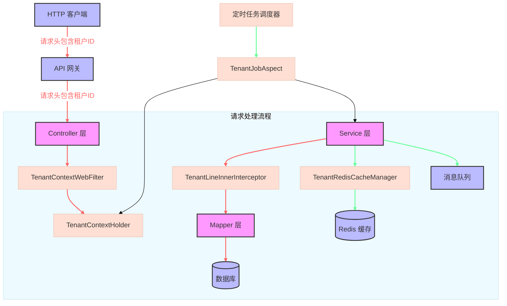

# config_2 模块文档

## 模块概述

`config_2` 模块是 Yudao 框架中的多租户功能模块，提供了完整的租户管理和数据隔离机制。该模块基于 Spring Boot 自动配置，通过 AOP、拦截器、过滤器等技术手段，实现了租户上下文的传播、数据权限控制、缓存隔离等核心功能。

### 主要功能

1. **租户上下文管理**：
   - 通过 `TenantContextHolder` 管理当前线程的租户编号和忽略租户标识
   - 提供 `TenantUtils` 工具类，简化租户上下文的操作

2. **数据权限隔离**：
   - 通过 MyBatis Plus 的 `TenantLineInnerInterceptor` 实现数据库层面的租户隔离
   - 支持自定义租户字段和忽略特定表的租户过滤

3. **Web 层面的租户传播**：
   - 通过 `TenantContextWebFilter` 从 HTTP 请求头中提取租户编号并设置到上下文
   - 通过 `TenantSecurityWebFilter` 实现安全框架层面的租户传播
   - 支持通过 `@TenantIgnore` 注解忽略特定接口的租户检查

4. **消息队列的租户传播**：
   - 支持 Redis、RabbitMQ、RocketMQ 等消息中间件的租户上下文传播
   - 通过拦截器机制，确保消息处理时能正确识别租户

5. **缓存隔离**：
   - 提供 `TenantRedisCacheManager` 实现 Redis 缓存的租户隔离
   - 支持事务感知的缓存操作

6. **定时任务的租户传播**：
   - 通过 `TenantJobAspect` 实现 Quartz 定时任务的租户上下文传播

## 架构设计

### 核心组件关系图

```mermaid
%%{init: {'theme': 'base', 'themeVariables': { 'primaryColor': '#ffdfd3', 'edgeLabelBackground':'#fff'}}}%%
flowchart TD
    %% 定义组件类型样式
    classDef config fill:#f9f,stroke:#333,stroke-width:2px;
    classDef service fill:#bbf,stroke:#333,stroke-width:2px;
    classDef filter fill:#f96,stroke:#333,stroke-width:2px;
    classDef interceptor fill:#6f9,stroke:#333,stroke-width:2px;
    classDef aop fill:#f9c,stroke:#333,stroke-width:2px;
    classDef mq fill:#9cf,stroke:#333,stroke-width:2px;
    classDef cache fill:#f9c,stroke:#333,stroke-width:2px;
    
    %% 核心配置类
    YudaoTenantAutoConfiguration[YudaoTenantAutoConfiguration
    config_2]:::config
    
    %% 上下文管理
    TenantContextHolder[TenantContextHolder
    租户上下文管理]:::service
    TenantUtils[TenantUtils
    租户工具类]:::service
    
    %% Web 层组件
    TenantContextWebFilter[TenantContextWebFilter
    HTTP 请求租户过滤器]:::filter
    TenantSecurityWebFilter[TenantSecurityWebFilter
    安全框架租户过滤器]:::filter
    TenantVisitContextInterceptor[TenantVisitContextInterceptor
    访问上下文拦截器]:::interceptor
    
    %% 数据库层组件
    TenantLineInnerInterceptor[TenantLineInnerInterceptor
    MyBatis Plus 租户拦截器]:::interceptor
    TenantDatabaseInterceptor[TenantDatabaseInterceptor
    数据库租户拦截器]:::interceptor
    
    %% AOP 组件
    TenantIgnoreAspect[TenantIgnoreAspect
    @TenantIgnore 注解切面]:::aop
    TenantJobAspect[TenantJobAspect
    定时任务租户切面]:::aop
    
    %% 消息队列组件
    TenantRedisMessageInterceptor[TenantRedisMessageInterceptor
    Redis 消息拦截器]:::mq
    TenantRabbitMQInitializer[TenantRabbitMQInitializer
    RabbitMQ 初始化器]:::mq
    TenantRocketMQInitializer[TenantRocketMQInitializer
    RocketMQ 初始化器]:::mq
    
    %% 缓存组件
    TenantRedisCacheManager[TenantRedisCacheManager
    Redis 缓存管理器]:::cache
    
    %% 服务类
    TenantFrameworkService[TenantFrameworkService
    租户框架服务]:::service
    TenantFrameworkServiceImpl[TenantFrameworkServiceImpl
    租户框架服务实现]:::service
    
    %% 配置属性
    TenantProperties[TenantProperties
    租户配置属性]:::config
    
    %% 关系连线
    YudaoTenantAutoConfiguration --> TenantContextHolder
    YudaoTenantAutoConfiguration --> TenantUtils
    YudaoTenantAutoConfiguration --> TenantContextWebFilter
    YudaoTenantAutoConfiguration --> TenantSecurityWebFilter
    YudaoTenantAutoConfiguration --> TenantVisitContextInterceptor
    YudaoTenantAutoConfiguration --> TenantLineInnerInterceptor
    YudaoTenantAutoConfiguration --> TenantIgnoreAspect
    YudaoTenantAutoConfiguration --> TenantRedisMessageInterceptor
    YudaoTenantAutoConfiguration --> TenantRabbitMQInitializer
    YudaoTenantAutoConfiguration --> TenantRocketMQInitializer
    YudaoTenantAutoConfiguration --> TenantRedisCacheManager
    YudaoTenantAutoConfiguration --> TenantJobAspect
    YudaoTenantAutoConfiguration --> TenantFrameworkService
    YudaoTenantAutoConfiguration --> TenantProperties
    
    TenantContextHolder --> TenantUtils
    TenantFrameworkService --> TenantContextHolder
    
    style YudaoTenantAutoConfiguration fill:#f9f,stroke:#333,stroke-width:4px
```



## 数据流图



## 核心类说明

### 1. TenantContextHolder

**类路径**: `yudao-framework/yudao-spring-boot-starter-biz-tenant/src/main/java/cn/iocoder/yudao/framework/tenant/core/context/TenantContextHolder.java`

**功能**: 租户上下文持有者，负责存储和管理当前线程的租户信息。

**核心方法**:

- `getTenantId()`: 获取当前租户编号
- `getRequiredTenantId()`: 获取当前租户编号（如果不存在则抛出异常）
- `setTenantId(Long tenantId)`: 设置当前租户编号
- `isIgnore()`: 判断是否忽略租户
- `setIgnore(Boolean ignore)`: 设置是否忽略租户
- `clear()`: 清除租户上下文

**使用场景**:
- 在 Web 请求处理时，从请求头中提取租户编号并设置到上下文
- 在 Service 层方法中，通过上下文获取当前租户编号
- 在 AOP 切面中，判断是否需要进行租户隔离

### 2. TenantUtils

**类路径**: `yudao-framework/yudao-spring-boot-starter-biz-tenant/src/main/java/cn/iocoder/yudao/framework/tenant/core/util/TenantUtils.java`

**功能**: 租户工具类，提供便捷的租户上下文操作方法。

**核心方法**:

- `execute(Long tenantId, Runnable runnable)`: 在指定租户中执行逻辑
- `execute(Long tenantId, Callable<V> callable)`: 在指定租户中执行逻辑并返回结果
- `executeIgnore(Runnable runnable)`: 忽略租户，执行逻辑
- `executeIgnore(Callable<V> callable)`: 忽略租户，执行逻辑并返回结果
- `addTenantHeader(Map<String, String> headers, Long tenantId)`: 将租户编号添加到请求头中

**使用场景**:
- 在需要临时切换租户的场景中使用
- 在异步任务中传播租户上下文
- 在跨服务调用时传递租户信息

### 3. YudaoTenantAutoConfiguration

**类路径**: `yudao-framework/yudao-spring-boot-starter-biz-tenant/src/main/java/cn/iocoder/yudao/framework/tenant/config/YudaoTenantAutoConfiguration.java`

**功能**: 租户模块的自动配置类，负责注册各种租户相关的 Bean 和配置。

**核心配置**:

- `@ConditionalOnProperty(prefix = "yudao.tenant", value = "enable", matchIfMissing = true)`: 允许通过配置 `yudao.tenant.enable=false` 禁用多租户功能
- `@EnableConfigurationProperties(TenantProperties.class)`: 启用租户配置属性

**核心 Bean 注册**:

1. **租户框架服务**:
   ```java
   @Bean
   public TenantFrameworkService tenantFrameworkService(TenantCommonApi tenantApi) {
       return new TenantFrameworkServiceImpl(tenantApi);
   }
   ```

2. **AOP 切面**:
   ```java
   @Bean
   public TenantIgnoreAspect tenantIgnoreAspect() {
       return new TenantIgnoreAspect();
   }
   ```

3. **数据库租户拦截器**:
   ```java
   @Bean
   public TenantLineInnerInterceptor tenantLineInnerInterceptor(TenantProperties properties,
                                                                MybatisPlusInterceptor interceptor) {
       TenantLineInnerInterceptor inner = new TenantLineInnerInterceptor(new TenantDatabaseInterceptor(properties));
       MyBatisUtils.addInterceptor(interceptor, inner, 0);
       return inner;
   }
   ```

4. **Web 过滤器和拦截器**:
   ```java
   @Bean
   public FilterRegistrationBean<TenantContextWebFilter> tenantContextWebFilter() {
       FilterRegistrationBean<TenantContextWebFilter> registrationBean = new FilterRegistrationBean<>();
       registrationBean.setFilter(new TenantContextWebFilter());
       registrationBean.setOrder(WebFilterOrderEnum.TENANT_CONTEXT_FILTER);
       return registrationBean;
   }
   
   @Bean
   public TenantVisitContextInterceptor tenantVisitContextInterceptor(TenantProperties tenantProperties,
                                                                      SecurityFrameworkService securityFrameworkService) {
       return new TenantVisitContextInterceptor(tenantProperties, securityFrameworkService);
   }
   ```

5. **安全过滤器**:
   ```java
   @Bean
   public FilterRegistrationBean<TenantSecurityWebFilter> tenantSecurityWebFilter(TenantProperties tenantProperties,
                                                                                WebProperties webProperties,
                                                                                GlobalExceptionHandler globalExceptionHandler,
                                                                                TenantFrameworkService tenantFrameworkService) {
       FilterRegistrationBean<TenantSecurityWebFilter> registrationBean = new FilterRegistrationBean<>();
       registrationBean.setFilter(new TenantSecurityWebFilter(webProperties, tenantProperties, getTenantIgnoreUrls(),
               globalExceptionHandler, tenantFrameworkService));
       registrationBean.setOrder(WebFilterOrderEnum.TENANT_SECURITY_FILTER);
       return registrationBean;
   }
   ```

6. **消息队列拦截器和初始化器**:
   ```java
   @Configuration(proxyBeanMethods = false)
   @ConditionalOnClass(name = "cn.iocoder.yudao.framework.mq.redis.core.interceptor.RedisMessageInterceptor")
   public static class TenantRedisMQConfiguration {
       @Bean
       public TenantRedisMessageInterceptor tenantRedisMessageInterceptor() {
           return new TenantRedisMessageInterceptor();
       }
   }
   
   @Configuration(proxyBeanMethods = false)
   @ConditionalOnClass(name = "org.springframework.amqp.rabbit.core.RabbitTemplate")
   public static class TenantRabbitMQConfiguration {
       @Bean
       public TenantRabbitMQInitializer tenantRabbitMQInitializer() {
           return new TenantRabbitMQInitializer();
       }
   }
   
   @Configuration(proxyBeanMethods = false)
   @ConditionalOnClass(name = "org.apache.rocketmq.spring.core.RocketMQTemplate")
   public static class TenantRocketMQConfiguration {
       @Bean
       public TenantRocketMQInitializer tenantRocketMQInitializer() {
           return new TenantRocketMQInitializer();
       }
   }
   ```

7. **Redis 缓存管理器**:
   ```java
   @Bean
   @Primary
   public RedisCacheManager tenantRedisCacheManager(RedisTemplate<String, Object> redisTemplate,
                                                    RedisCacheConfiguration redisCacheConfiguration,
                                                    YudaoCacheProperties yudaoCacheProperties,
                                                    TenantProperties tenantProperties) {
       RedisConnectionFactory connectionFactory = Objects.requireNonNull(redisTemplate.getConnectionFactory());
       RedisCacheWriter cacheWriter = RedisCacheWriter.nonLockingRedisCacheWriter(connectionFactory,
               BatchStrategies.scan(yudaoCacheProperties.getRedisScanBatchSize()));
       TenantRedisCacheManager cacheManager = new TenantRedisCacheManager(cacheWriter, redisCacheConfiguration,
               tenantProperties.getIgnoreCaches());
       cacheManager.setTransactionAware(true);
       return cacheManager;
   }
   ```

8. **定时任务切面**:
   ```java
   @Configuration(proxyBeanMethods = false)
   @ConditionalOnClass(name = "cn.iocoder.yudao.framework.quartz.core.handler.JobHandler")
   public static class TenantJobConfiguration {
       @Bean
       public TenantJobAspect tenantJobAspect(TenantFrameworkService tenantFrameworkService) {
           return new TenantJobAspect(tenantFrameworkService);
       }
   }
   ```

## 配置说明

### TenantProperties

租户模块的配置属性类，定义了租户相关的配置项。

**主要配置项**:

- `enable`: 是否启用多租户功能（默认：true）
- `column`: 数据库中表示租户的字段名（默认：tenant_id）
- `ignoreTables`: 需要忽略租户过滤的表名列表
- `ignoreCaches`: 需要忽略租户缓存的缓存名称列表
- `ignoreVisitUrls`: 需要忽略租户访问控制的 URL 列表

**配置示例**:
```yaml
# application.yml

# 多租户配置
# 如果 yudao.tenant.enable=false，则完全禁用多租户功能
# 如果 yudao.tenant.enable=true，则启用多租户功能
# 如果不配置，默认启用多租户功能

yudao:
  tenant:
    enable: true
    column: tenant_id
    ignore-tables:
      - system_tenant
      - system_user
    ignore-caches:
      - system_config
    ignore-visit-urls:
      - /admin/auth/**
      - /admin/captcha/**
```

## 使用指南

### 1. 启用多租户

在 `application.yml` 中配置多租户功能：

```yaml
yudao:
  tenant:
    enable: true
```

### 2. 数据库表设计

在需要进行租户隔离的表中添加租户字段：

```sql
ALTER TABLE your_table ADD COLUMN tenant_id BIGINT NOT NULL DEFAULT 0 COMMENT '租户编号';
```

### 3. 忽略特定接口的租户检查

在 Controller 方法或类上添加 `@TenantIgnore` 注解：

```java
@RestController
@RequestMapping("/admin/system/tenant")
@TenantIgnore  // 忽略整个类的租户检查
public class TenantController {

    @GetMapping("/list")
    @TenantIgnore  // 忽略单个方法的租户检查
    public CommonResult<List<TenantRespVO>> getTenantList() {
        // 此方法不进行租户隔离
        return success(tenantService.getTenantList());
    }
}
```

### 4. 在 Service 中获取当前租户

```java
@Service
public class YourService {

    public void yourMethod() {
        // 获取当前租户编号
        Long tenantId = TenantContextHolder.getTenantId();
        
        // 如果需要确保租户编号存在，可以使用 getRequiredTenantId()
        Long requiredTenantId = TenantContextHolder.getRequiredTenantId();
        
        // 业务逻辑处理...
    }
}
```

### 5. 在特定租户中执行逻辑

```java
@Service
public class YourService {

    @Autowired
    private TenantFrameworkService tenantFrameworkService;

    public void processForTenant(Long tenantId, Runnable task) {
        // 在指定租户中执行逻辑
        tenantFrameworkService.execute(tenantId, task);
        
        // 或者使用 TenantUtils
        TenantUtils.execute(tenantId, task);
    }
}
```

### 6. 忽略租户执行逻辑

```java
@Service
public class YourService {

    public void processWithoutTenant(Runnable task) {
        // 忽略租户，执行逻辑
        TenantUtils.executeIgnore(task);
    }
}
```

### 7. 跨服务调用传递租户信息

```java
@Service
public class YourService {

    public void callRemoteService(Long tenantId, String url, Object requestBody) {
        // 将租户编号添加到请求头
        HttpHeaders headers = new HttpHeaders();
        TenantUtils.addTenantHeader(headers, tenantId);
        
        // 发起 HTTP 请求
        HttpEntity<Object> requestEntity = new HttpEntity<>(requestBody, headers);
        ResponseEntity<YourResponse> response = restTemplate.exchange(
            url, HttpMethod.POST, requestEntity, YourResponse.class);
        
        // 处理响应...
    }
}
```

## 集成其他组件

### 与 MyBatis Plus 集成

通过 `TenantLineInnerInterceptor` 实现数据库层面的租户隔离。该拦截器会自动为所有查询添加租户条件：

```java
@Bean
public MybatisPlusInterceptor mybatisPlusInterceptor(TenantProperties properties) {
    MybatisPlusInterceptor interceptor = new MybatisPlusInterceptor();
    interceptor.addInnerInterceptor(new TenantLineInnerInterceptor(new TenantDatabaseInterceptor(properties)));
    return interceptor;
}
```

### 与 Spring Security 集成

通过 `TenantSecurityWebFilter` 实现安全框架层面的租户传播。该过滤器会从安全上下文中提取租户信息并设置到租户上下文中。

### 与 Redis 集成

通过 `TenantRedisCacheManager` 实现 Redis 缓存的租户隔离。该缓存管理器会在缓存键中自动添加租户前缀。

### 与消息队列集成

支持 Redis、RabbitMQ、RocketMQ 等消息中间件的租户上下文传播。通过拦截器机制，确保消息处理时能正确识别租户。

## 最佳实践

### 1. 租户信息传播

确保租户信息在整个请求链路中正确传播：
- HTTP 请求头中包含 `tenant-id` 字段
- API 网关透传租户信息
- 微服务之间通过 HTTP 头或消息头传递租户信息

### 2. 租户数据隔离

- 为所有业务表添加租户字段
- 在查询时确保添加租户条件
- 避免使用全表查询操作

### 3. 缓存隔离

- 为缓存键添加租户前缀
- 避免在不同租户之间共享缓存
- 使用 `TenantRedisCacheManager` 管理租户缓存

### 4. 定时任务处理

- 为定时任务添加租户上下文传播
- 避免跨租户的定时任务操作
- 使用 `TenantJobAspect` 确保租户上下文正确传播

### 5. 异常处理

- 在租户上下文为空时提供友好的错误提示
- 避免因租户信息缺失导致的系统错误
- 记录租户相关的操作日志

## 常见问题

### 1. 如何禁用多租户功能？

在 `application.yml` 中配置：

```yaml
yudao:
  tenant:
    enable: false
```

### 2. 如何自定义租户字段？

在 `TenantProperties` 中配置：

```yaml
yudao:
  tenant:
    column: custom_tenant_id
```

### 3. 如何忽略特定表的租户过滤？

在 `TenantProperties` 中配置：

```yaml
yudao:
  tenant:
    ignore-tables:
      - system_config
      - system_menu
```

### 4. 如何在异步任务中传播租户上下文？

使用 `TenantUtils.execute()` 方法：

```java
public void asyncTask() {
    Long tenantId = TenantContextHolder.getTenantId();
    
    CompletableFuture.runAsync(() -> {
        TenantUtils.execute(tenantId, () -> {
            // 异步任务逻辑
        });
    });
}
```

### 5. 如何在测试中模拟租户？

使用 `TenantUtils.execute()` 方法：

```java
@Test
public void testWithTenant() {
    TenantUtils.execute(1L, () -> {
        // 在租户 1 的上下文中执行测试逻辑
        yourService.doSomething();
    });
}
```

## 参考文档

- [多租户架构设计](https://doc.iocoder.cn/tenant/)
- [MyBatis Plus 租户插件](https://baomidou.com/pages/0daca5/)
- [Spring Cache 文档](https://docs.spring.io/spring-boot/docs/current/reference/html/io.html#io.caching)
- [Spring Security 文档](https://docs.spring.io/spring-security/site/docs/current/reference/html5/)

## 总结

`config_2` 模块提供了完整的多租户解决方案，通过租户上下文传播、数据权限隔离、缓存隔离等机制，确保不同租户之间的数据完全隔离。该模块与框架中的其他组件（如 MyBatis Plus、Spring Security、Redis 等）深度集成，提供了开箱即用的多租户功能。

通过合理配置和使用该模块，可以轻松构建支持多租户的企业级应用系统。