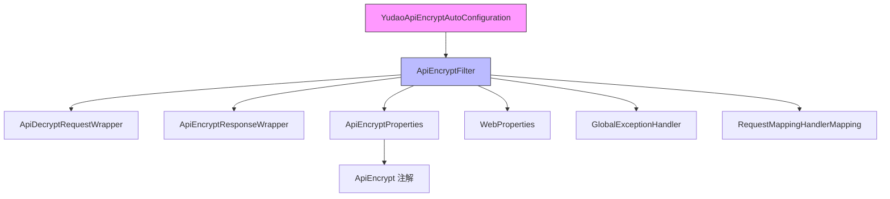
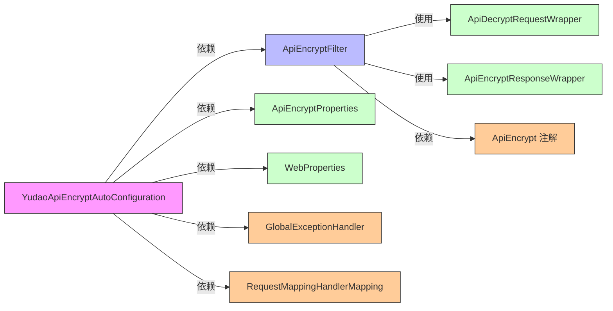
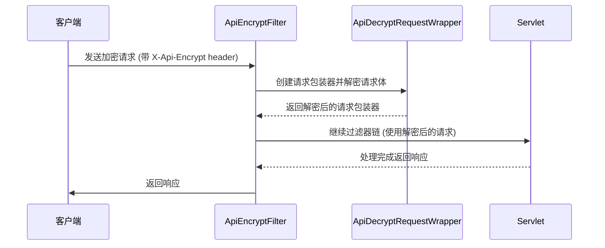
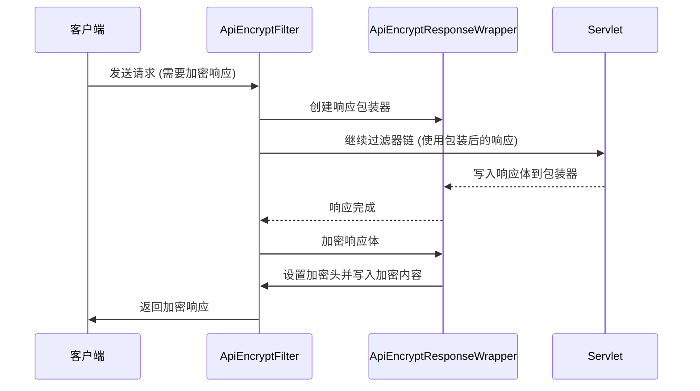

# YudaoApiEncryptAutoConfiguration 模块文档

## 模块概述

YudaoApiEncryptAutoConfiguration 是 Yudao 框架中的一个 Spring Boot 自动配置类，用于实现 API 请求和响应的加密解密功能。该模块通过 Spring Boot 的自动配置机制，在启用时自动注册一个过滤器来处理带有 `@ApiEncrypt` 注解的接口的请求解密和响应加密。

## 核心功能

1. **自动配置**：通过 `@AutoConfiguration` 注解实现 Spring Boot 自动装配
2. **条件激活**：通过 `@ConditionalOnProperty(prefix = "yudao.api-encrypt", name = "enable", havingValue = "true")` 仅在配置启用时生效
3. **属性绑定**：使用 `@EnableConfigurationProperties(ApiEncryptProperties.class)` 绑定配置属性
4. **过滤器注册**：注册 `ApiEncryptFilter` 来处理请求解密和响应加密
5. **过滤器顺序**：通过 `WebFilterOrderEnum.API_ENCRYPT_FILTER` 设置过滤器执行顺序

## 架构设计

### 模块结构
```
YudaoApiEncryptAutoConfiguration
├── ApiEncryptFilter (核心过滤器)
├── ApiEncryptProperties (配置属性)
├── ApiEncrypt 注解 (控制加密行为)
├── ApiDecryptRequestWrapper (请求包装器)
└── ApiEncryptResponseWrapper (响应包装器)
```

### 组件关系图


### 依赖关系


## 详细组件说明

### YudaoApiEncryptAutoConfiguration
Spring Boot 自动配置类，负责初始化 API 加密功能。

**关注点：**
- `@AutoConfiguration`: 标识这是一个 Spring Boot 自动配置类
- `@Slf4j`: 使用 Lombok 自动生成日志对象
- `@EnableConfigurationProperties(ApiEncryptProperties.class)`: 启用属性绑定
- `@ConditionalOnProperty(prefix = "yudao.api-encrypt", name = "enable", havingValue = "true")`: 仅当配置 `yudao.api-encrypt.enable=true` 时激活

**核心方法：**
- `apiEncryptFilter()`: 创建并注册 `ApiEncryptFilter` Bean

### ApiEncryptFilter
核心过滤器，负责请求的解密和响应的加密。

**继承关系：** 继承自 `ApiRequestFilter`（Web 框架基础过滤器）

**主要功能：**
1. **请求解密**：对于 POST、PUT、DELETE 请求，检查是否需要解密
2. **响应加密**：对于需要加密的响应，在过滤器链执行后进行加密
3. **异常处理**：统一使用 `GlobalExceptionHandler` 处理解密过程中的异常

**关键依赖：**
- `WebProperties`: 获取 Web 配置信息
- `ApiEncryptProperties`: 获取加密配置
- `RequestMappingHandlerMapping`: 获取请求映射信息以检测 `@ApiEncrypt` 注解
- `GlobalExceptionHandler`: 处理解密过程中的异常

### ApiEncryptProperties
加密功能的配置属性类。

**配置属性：**
- `enable`: 是否启用 API 加密功能（必填）
- `header`: 请求/响应头名称，用于标识加密内容（默认：`X-Api-Encrypt`）
- `algorithm`: 加密算法，支持 AES（对称）和 RSA（非对称）（必填）
- `requestKey`: 请求解密密钥（必填）
- `responseKey`: 响应加密密钥（必填）

**算法说明：**
- **AES**: 对称加密，请求和响应使用相同的密钥
- **RSA**: 非对称加密，请求使用私钥解密，响应使用公钥加密

### ApiEncrypt 注解
用于控制特定接口的加密行为。

**作用位置：** 类级别和方法级别

**属性：**
- `request`: 是否对请求参数进行解密（默认：true）
- `response`: 是否对响应结果进行加密（默认：true）

### 包装器类

#### ApiDecryptRequestWrapper
用于包装 HttpServletRequest，实现请求体的解密。

**工作原理：**
1. 读取原始请求体
2. 使用配置的解密器（AES 或 RSA）对请求体进行解密
3. 提供解密后的字节流供后续处理

#### ApiEncryptResponseWrapper
用于包装 HttpServletResponse，实现响应体的加密。

**工作原理：**
1. 拦截响应输出流
2. 在响应提交前对响应体进行加密
3. 添加加密标识头和 CORS 暴露头

## 工作流程

### 请求处理流程


### 响应处理流程


## 配置说明

### application.yml 配置示例
```yaml
yudao:
  api-encrypt:
    enable: true  # 是否启用加密功能
    header: X-Api-Encrypt  # 加密标识头
    algorithm: AES  # 加密算法 (AES/RSA)
    requestKey: 1234567890123456  # 请求解密密钥 (AES: 16位密钥)
    responseKey: 1234567890123456  # 响应加密密钥 (AES: 16位密钥)
```

### 使用示例

#### 全局配置（application.yml）
```yaml
yudao:
  api-encrypt:
    enable: true
    header: X-Api-Encrypt
    algorithm: AES
    requestKey: 1234567890123456
    responseKey: 1234567890123456
```

#### 控制器使用示例
```java
@RestController
@RequestMapping("/api")
@ApiEncrypt  // 类级别：所有方法都进行加解密
public class UserController {
    
    @PostMapping("/login")
    @ApiEncrypt(request = true, response = false)  // 仅解密请求，不加密响应
    public Result login(@RequestBody LoginReq req) {
        // req 已经是解密后的对象
        return Result.success(userService.login(req));
    }
    
    @GetMapping("/info")
    // 使用类级别的配置：既解密请求又加密响应
    public Result<UserInfo> info() {
        return Result.success(userService.getInfo());
    }
}
```

## 与其他模块的关系

### 与 WebFilterOrderEnum 的关系
ApiEncryptFilter 按照 `WebFilterOrderEnum.API_ENCRYPT_FILTER` 的顺序执行，位置如下：
1. CORS_FILTER (Integer.MIN_VALUE)
2. TRACE_FILTER (CORS_FILTER + 1)
3. REQUEST_BODY_CACHE_FILTER (Integer.MIN_VALUE + 500)
4. API_ENCRYPT_FILTER (REQUEST_BODY_CACHE_FILTER + 1) ← 当前过滤器
5. TENANT_CONTEXT_FILTER (-104)
6. API_ACCESS_LOG_FILTER (-103)
7. XSS_FILTER (-102)
8. Spring Security Filter (默认 -100)

这确保了：
- 在请求体缓存之后执行（可以重复读取请求体）
- 在租户上下文之前执行
- 在访问日志之前执行
- 在 XSS 过滤之前执行

### 与全局异常处理器的关系
ApiEncryptFilter 使用 `GlobalExceptionHandler` 来处理解密过程中的异常，确保：
1. 解密失败时返回统一的错误格式
2. 异常信息不会泄露敏感信息
3. 错误日志得到适当记录

## 设计优势

1. **透明化**：对业务代码完全透明，无需修改控制器逻辑
2. **灵活配置**：支持全局开关和按接口精细控制
3. **多算法支持**: 支持对称加密（AES）和非对称加密（RSA）
4. **异常安全**: 解密失败时友好返回错误信息而不暴露堆栈
5. **性能优化**: 仅在需要时进行加解密操作
6. **顺序可控**: 通过 WebFilterOrderEnum 精确控制过滤器执行顺序

## 使用注意事项

1. **密钥管理**：
   - 对于 AES：requestKey 和 responseKey 应该是相同的 16 位密钥
   - 对于 RSA：requestKey 是服务器的私钥，responseKey 是服务器的公钥

2. **性能影响**：
   - 加解密操作会增加 CPU 开销
   - 建议仅对敏感接口启用加密
   - 大文件传输时考虑使用 HTTPS 而非应用层加密

3. **兼容性**：
   - 仅处理 application/json 内容类型的请求
   - 表单提交和文件上传可能需要特殊处理
   - 与其他自定义过滤器需要注意顺序问题

4. **调试建议**：
   - 开发阶段可以先不启用加密功能
   - 通过日志观察加解密过程
   - 确保前端和后端使用相同的加密算法和密钥

## 与主文档的关联

此模块是 Yudao 框架 Web 安全体系的一部分，与以下模块协同工作：

- [YudaoWebAutoConfiguration](config_23.md)：提供基础 Web 配置
- [YudaoSecurityAutoConfiguration](config_17.md)：提供安全认证和授权
- [YudaoXssAutoConfiguration](config_24.md)：提供 XSS 防御
- [YudaoApiLogAutoConfiguration](config_18.md)：提供 API 日志记录

在完整的安全链中，请求处理顺序为：
1. CORS 处理
2. 追踪信息
3. 请求体缓存
4. **API 加密解密** ← 本模块
5. 租户上下文
6. API 访问日志
7. XSS 过滤
8. Spring Security 认证授权